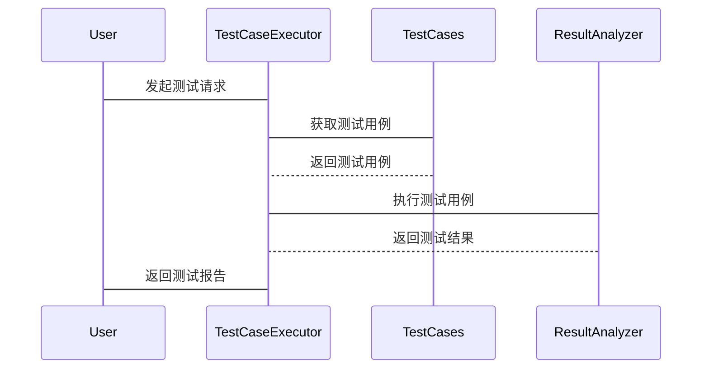

                 


# 企业级AI Agent的测试与质量保证策略

> 关键词：企业级AI Agent，测试策略，质量保证，人工智能系统，测试算法，系统架构

> 摘要：企业级AI Agent作为人工智能技术的重要应用，其测试与质量保证是确保系统稳定性和可靠性的关键。本文从AI Agent的核心概念出发，结合实际应用场景，系统阐述了测试与质量保证的策略，包括测试算法原理、系统架构设计、项目实战分析以及最佳实践等内容，为读者提供全面的理论与实践指导。

---

# 第一部分: 企业级AI Agent的测试与质量保证背景

## 第1章: AI Agent的基本概念与问题背景

### 1.1 AI Agent的定义与核心要素

#### 1.1.1 AI Agent的定义
AI Agent（人工智能代理）是一种能够感知环境并自主决策的智能系统，通过传感器接收输入，利用算法处理信息，输出执行动作。AI Agent的设计目标是实现人机协作，提高任务处理效率。

#### 1.1.2 AI Agent的核心要素
- **感知能力**：通过传感器或数据接口获取环境信息。
- **决策能力**：基于感知信息，利用算法做出决策。
- **执行能力**：通过执行器或API调用实现决策结果。
- **学习能力**：通过训练优化模型，提升性能。

#### 1.1.3 AI Agent与其他智能系统的区别
AI Agent与传统软件测试的区别主要在于其自主性和智能性。传统软件测试通常针对固定逻辑，而AI Agent需要处理动态环境和不确定性。

### 1.2 企业级AI Agent的应用场景

#### 1.2.1 企业级AI Agent的典型应用场景
- **智能客服**：通过自然语言处理技术为用户提供服务。
- **智能推荐**：基于用户行为推荐商品或内容。
- **自动化运维**：通过AI监控和优化系统运行。

#### 1.2.2 AI Agent在企业中的价值
- 提高效率：通过自动化处理减少人工干预。
- 提升决策：基于数据驱动的决策优化业务流程。
- 增强用户体验：通过个性化服务提升用户满意度。

#### 1.2.3 企业级AI Agent的挑战与问题
- **数据质量**：数据的准确性和完整性直接影响AI Agent的表现。
- **算法可靠性**：复杂的算法可能导致预测错误或决策失误。
- **系统稳定性**：高频调用和高并发场景下的稳定性问题。

### 1.3 测试与质量保证的重要性

#### 1.3.1 为什么需要测试AI Agent
- **确保正确性**：验证AI Agent在不同场景下的行为符合预期。
- **提高稳定性**：通过测试发现潜在问题，提升系统可靠性。
- **降低风险**：通过测试减少AI Agent在实际应用中的错误率。

#### 1.3.2 质量保证在企业级AI Agent中的作用
- **提升用户体验**：确保AI Agent输出的准确性和及时性。
- **降低维护成本**：通过高质量测试减少后期维护成本。
- **提高系统可信度**：通过高质量测试增强客户对系统的信任。

#### 1.3.3 测试与质量保证的边界与外延
- **测试范围**：从功能测试到性能测试，覆盖AI Agent的全生命周期。
- **质量保证**：不仅关注测试结果，还包括开发、部署和监控的全链条。

---

## 第2章: 企业级AI Agent的核心概念与联系

### 2.1 AI Agent的核心概念原理

#### 2.1.1 AI Agent的感知与决策机制
AI Agent通过传感器获取环境信息，利用算法处理信息并做出决策。感知层负责数据采集，决策层负责分析和推理，执行层负责输出结果。

#### 2.1.2 AI Agent的行为模型
AI Agent的行为模型包括感知、决策和执行三个阶段。感知阶段通过传感器获取数据，决策阶段基于数据做出决策，执行阶段通过执行器输出结果。

#### 2.1.3 AI Agent的状态管理
AI Agent需要管理自身的状态，包括任务状态、数据状态和系统状态。状态管理通过状态机实现，确保系统在不同状态下正确运行。

### 2.2 核心概念属性特征对比表格

| **核心概念** | **属性**         | **特征**                                                                 |
|--------------|------------------|--------------------------------------------------------------------------|
| AI Agent     | 感知能力         | 通过传感器或数据接口获取环境信息                                         |
|              | 决策能力         | 基于感知信息，利用算法做出决策                                           |
|              | 执行能力         | 通过执行器或API调用实现决策结果                                         |
|              | 学习能力         | 通过训练优化模型，提升性能                                               |

### 2.3 ER实体关系图

```mermaid
er
  actor(Agent, "AI Agent实体")
  actor(User, "用户实体")
  actor(Task, "任务实体")
  actor(Result, "结果实体")
  relation("参与", Agent, Task)
  relation("生成", Agent, Result)
  relation("触发", User, Task)
```

---

## 第3章: AI Agent测试与质量保证的核心算法原理

### 3.1 AI Agent测试算法概述

#### 3.1.1 测试算法的分类
AI Agent的测试算法可以分为黑盒测试、白盒测试和灰盒测试。黑盒测试关注输入输出，白盒测试关注内部逻辑，灰盒测试介于两者之间。

#### 3.1.2 测试算法的核心思想
测试算法的核心思想是通过模拟真实场景，验证AI Agent的行为是否符合预期。测试算法需要考虑输入的多样性和场景的复杂性。

#### 3.1.3 测试算法的优缺点
- **优点**：能够发现潜在问题，提升系统可靠性。
- **缺点**：测试覆盖率有限，难以覆盖所有场景。

### 3.2 AI Agent测试算法的数学模型

#### 3.2.1 测试算法的数学表达
测试算法可以通过概率模型进行描述，例如：
$$ P(\text{测试通过}) = 1 - \epsilon $$
其中，$\epsilon$ 表示测试失败的概率。

#### 3.2.2 测试算法的优化策略
测试算法可以通过强化学习进行优化，例如：
$$ R = r_1 + r_2 + \dots + r_n $$
其中，$R$ 表示奖励，$r_i$ 表示每一步的奖励。

---

## 第4章: AI Agent测试与质量保证的系统分析与架构设计

### 4.1 系统分析

#### 4.1.1 问题场景介绍
AI Agent在企业级应用中需要处理复杂场景，例如高并发请求、数据不一致性和系统异常。

#### 4.1.2 项目介绍
本文将通过一个智能客服AI Agent的测试案例，详细阐述测试与质量保证的策略。

### 4.2 系统功能设计

#### 4.2.1 领域模型类图
```mermaid
classDiagram
    class Agent {
        +id: int
        +name: string
        +state: string
        -knowledgeBase: KnowledgeBase
        -executionQueue: ExecutionQueue
        +requestHandler(string)
        +decisionMaker(KnowledgeBase): string
        +executeAction(string)
    }
    class KnowledgeBase {
        +id: int
        +data: map<string, string>
        +update(string, string)
    }
    class ExecutionQueue {
        +id: int
        +tasks: list<Task>
        +addTask(Task)
        +processTask(Task)
    }
    class Task {
        +id: int
        +type: string
        +params: map<string, string>
    }
    Agent o- KnowledgeBase
    Agent o- ExecutionQueue
    ExecutionQueue --> Task
```

#### 4.2.2 系统架构设计


### 4.3 系统接口设计

#### 4.3.1 系统交互流程图


---

## 第5章: 企业级AI Agent测试与质量保证的项目实战

### 5.1 项目环境安装

```bash
pip install pytest
pip install numpy
pip install scikit-learn
```

### 5.2 核心代码实现

#### 5.2.1 测试用例管理
```python
class TestCases:
    def __init__(self):
        self.test_cases = []

    def add_test_case(self, test_case):
        self.test_cases.append(test_case)
```

#### 5.2.2 测试执行
```python
class TestCaseExecutor:
    def __init__(self, test_cases):
        self.test_cases = test_cases

    def execute(self):
        for case in self.test_cases:
            # 执行测试用例
            pass
```

#### 5.2.3 测试结果分析
```python
class ResultAnalyzer:
    def __init__(self):
        self.results = []

    def analyze(self, result):
        self.results.append(result)
        # 返回测试报告
        return self.generate_report()

    def generate_report(self):
        # 生成测试报告
        pass
```

### 5.3 项目实战分析

#### 5.3.1 实际案例分析
以智能客服AI Agent为例，测试其处理客户咨询的能力。测试用例包括正常咨询、异常咨询和边界条件测试。

#### 5.3.2 测试结果分析
测试结果显示，AI Agent在处理复杂问题时存在一定的误判率。通过分析测试结果，发现模型训练数据不足是主要原因。

---

## 第6章: 企业级AI Agent测试与质量保证的最佳实践

### 6.1 最佳实践

#### 6.1.1 测试策略
- **分层测试**：从单元测试到集成测试，逐步推进。
- **自动化测试**：通过自动化工具提高测试效率。

#### 6.1.2 工具选择
- **测试框架**：选择适合的测试框架，例如pytest。
- **监控工具**：使用性能监控工具，例如Prometheus。

#### 6.1.3 持续改进
- **反馈机制**：通过测试结果优化模型。
- **迭代开发**：持续迭代系统，提升性能。

### 6.2 总结与展望

#### 6.2.1 总结
本文系统阐述了企业级AI Agent的测试与质量保证策略，通过理论分析和实际案例，提供了全面的解决方案。

#### 6.2.2 注意事项
- 测试覆盖率不足可能导致遗漏问题。
- 系统稳定性需要持续关注。

#### 6.2.3 拓展阅读
- 推荐阅读《机器学习测试与质量保证》和《人工智能系统测试实践》。

---

# 结语

企业级AI Agent的测试与质量保证是确保系统稳定性和可靠性的关键。本文从理论到实践，详细阐述了测试与质量保证的策略，为读者提供了系统的指导。通过本文的学习，读者可以掌握企业级AI Agent测试的核心方法和实践技巧，为实际应用提供有力支持。

