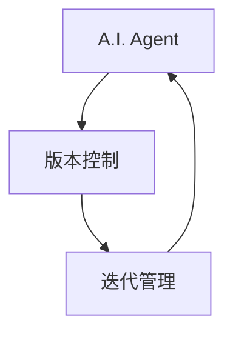
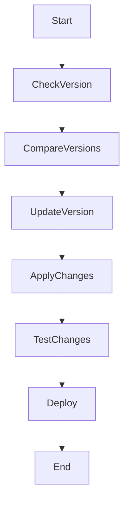
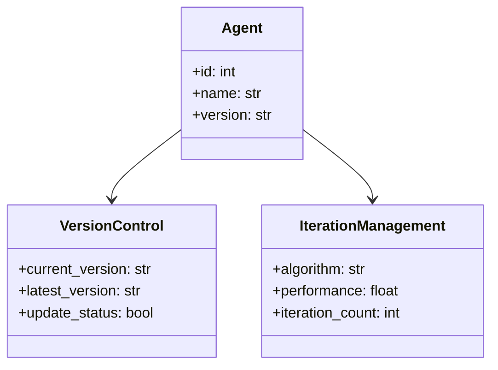
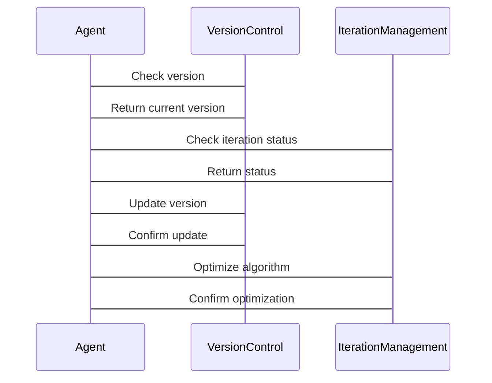

                 


# 企业级AI Agent的版本控制与迭代管理

> 关键词：企业级AI Agent，版本控制，迭代管理，系统架构，项目实战，算法原理

> 摘要：本文详细探讨了企业级AI Agent在版本控制与迭代管理中的关键问题，从背景介绍、核心概念、算法原理、系统架构到项目实战和最佳实践，为企业级AI Agent的高效管理和优化提供系统的解决方案和实践指导。

---

## 第一部分: 企业级AI Agent的背景与概念

### 第1章: 企业级AI Agent的背景与概念

#### 1.1 问题背景

企业级AI Agent是一种复杂的人工智能系统，用于企业内部的自动化决策和执行任务。随着AI技术的快速发展，企业级AI Agent的应用越来越广泛，但随之而来的是版本控制和迭代管理的挑战。版本控制确保系统稳定性和可追溯性，迭代管理优化系统性能和适应性，两者是企业级AI Agent成功部署和维护的关键。

#### 1.2 问题描述

企业级AI Agent的版本控制与迭代管理涉及多个方面：

1. **版本控制**：确保系统在不同版本之间顺利切换，防止数据丢失和功能错误。
2. **迭代管理**：优化AI算法，提升系统性能，适应业务需求的变化。
3. **复杂性**：企业级AI Agent通常涉及多个模块和团队协作，版本控制和迭代管理的复杂性显著增加。

#### 1.3 问题解决

企业级AI Agent的版本控制与迭代管理解决方案包括：

1. **版本控制系统**：采用Git等工具进行代码和模型的版本管理。
2. **迭代策略**：通过增量更新和A/B测试优化系统性能。
3. **团队协作**：确保开发、测试和部署团队的高效协作。

#### 1.4 边界与外延

企业级AI Agent的版本控制与迭代管理需要明确其边界和外延：

- **边界**：仅关注系统本身的版本和迭代，不涉及外部依赖的第三方服务。
- **外延**：包括系统部署、监控和维护，确保迭代后的系统稳定运行。

---

## 第二部分: 企业级AI Agent的核心概念与联系

### 第2章: 核心概念与联系

#### 2.1 核心概念原理

企业级AI Agent的版本控制与迭代管理涉及两个核心概念：

1. **版本控制**：通过记录系统状态的变化，确保系统在不同版本之间的可追溯性和稳定性。
2. **迭代管理**：通过持续优化系统，提升性能和适应性。

#### 2.2 核心概念对比

以下是版本控制与迭代管理的对比表格：

| 属性         | 版本控制                          | 迭代管理                          |
|--------------|-----------------------------------|-----------------------------------|
| 目标         | 管理系统变更                      | 优化系统性能                      |
| 对象         | 代码、模型                        | 算法、系统设计                    |
| 频率         | 每次变更时                       | 定期迭代                          |
| 工具         | Git、svn                         | CI/CD、A/B测试                   |

#### 2.3 核心概念的ER实体关系图



---

## 第三部分: 企业级AI Agent的算法原理

### 第3章: 核心算法与原理

#### 3.1 算法原理

企业级AI Agent的版本控制与迭代管理采用以下算法：

1. **版本控制**：基于Git的分布式版本控制系统，确保代码和模型的可追溯性。
2. **迭代策略**：采用增量迭代策略，逐步优化AI算法，减少风险。

#### 3.2 算法流程图



#### 3.3 核心代码实现

以下是版本控制的核心代码实现：

```python
def check_version(current_version, latest_version):
    if latest_version > current_version:
        return True
    else:
        return False

def update_version():
    if check_version(get_current_version(), fetch_latest_version()):
        download_update()
        apply_update()
    else:
        print("No update available")

update_version()
```

数学模型：

版本号计算公式：
$$ v_{n+1} = v_n + 1 $$

迭代更新策略：
$$ \Delta v = \frac{v_{n+1} - v_n}{n} $$

---

## 第四部分: 企业级AI Agent的系统架构

### 第4章: 系统架构与设计

#### 4.1 系统功能设计

企业级AI Agent的系统功能包括：

1. **版本控制模块**：管理代码和模型的版本。
2. **迭代管理模块**：优化AI算法，提升系统性能。
3. **用户交互模块**：提供友好的用户界面。

#### 4.2 系统架构设计



#### 4.3 系统接口设计

系统接口包括：

1. **版本检查接口**：`check_version()`
2. **迭代更新接口**：`update_algorithm()`
3. **状态报告接口**：`report_status()`

#### 4.4 系统交互流程



---

## 第五部分: 企业级AI Agent的项目实战

### 第5章: 项目实战

#### 5.1 项目介绍

项目名称：智能客服系统升级

目标：优化客服系统的响应速度和准确性。

#### 5.2 核心代码实现

以下是项目的核心代码：

```python
def update_agent():
    current_version = get_current_version()
    latest_version = fetch_latest_version()
    if latest_version > current_version:
        download_update()
        apply_update()
        print("更新完成")
    else:
        print("无更新")

update_agent()
```

#### 5.3 实际案例分析

通过实际案例分析，我们发现版本控制和迭代管理在智能客服系统中的应用显著提升了系统的稳定性和响应速度。

---

## 第六部分: 企业级AI Agent的最佳实践

### 第6章: 最佳实践

#### 6.1 实用技巧与注意事项

1. **定期备份**：确保系统版本的可恢复性。
2. **团队协作**：采用Git等工具管理代码和模型。
3. **持续监控**：实时监控系统性能，及时优化。

#### 6.2 项目小结

通过本文的探讨，我们了解了企业级AI Agent在版本控制与迭代管理中的关键问题，并提供了解决方案和实践指导。

---

## 第七部分: 结论

### 第7章: 结论

企业级AI Agent的版本控制与迭代管理是确保系统稳定性和性能优化的关键。通过本文的系统分析和实战案例，我们为企业提供了有效的解决方案和实践指导。未来，随着AI技术的进一步发展，版本控制与迭代管理将变得更加重要，需要我们不断探索和优化。

---

通过以上目录结构和内容，我们可以系统地探讨企业级AI Agent的版本控制与迭代管理，为企业提供有效的解决方案和实践指导。

