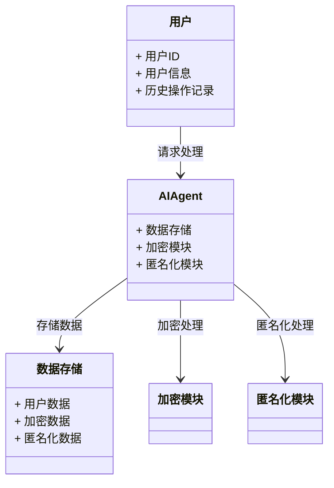
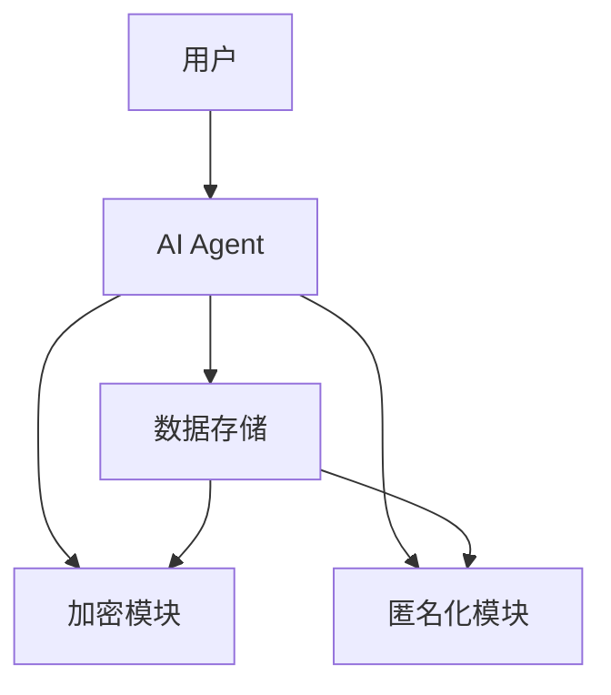
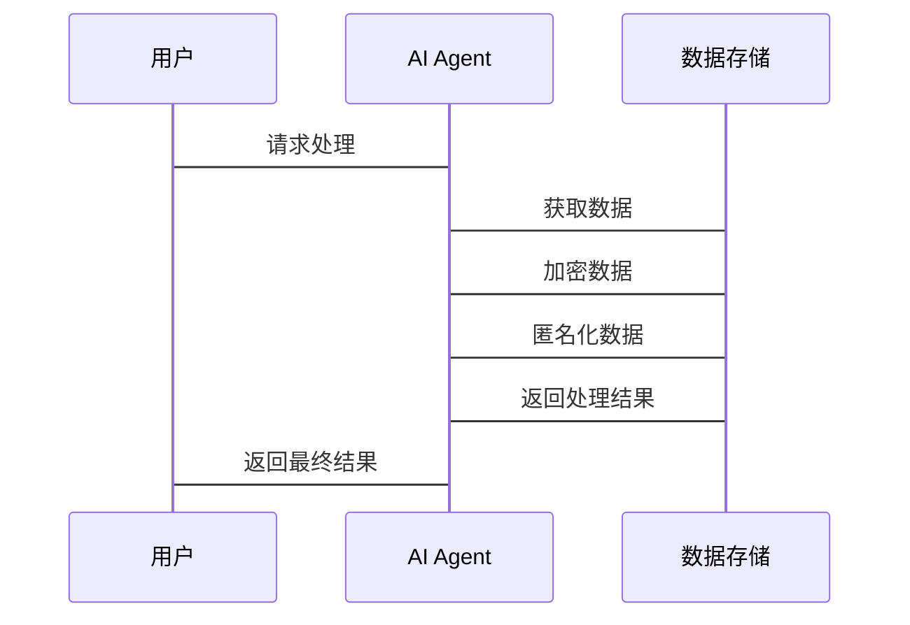

                 


# 企业级AI Agent的隐私保护与合规性考虑

---

## 关键词  
企业级AI Agent、隐私保护、数据加密、差分隐私、GDPR、AI合规性

---

## 摘要  
随着人工智能技术的快速发展，企业级AI Agent（智能代理）在各个行业的应用日益广泛。然而，AI Agent涉及大量敏感数据的处理和传输，如何在保证功能的同时，满足隐私保护和合规性要求，成为企业和开发者面临的重大挑战。本文从企业级AI Agent的背景出发，详细探讨隐私保护的核心概念、算法原理、系统架构设计及实际应用案例，为企业在AI Agent开发中提供隐私保护与合规性的思路和解决方案。

---

# 第一部分：企业级AI Agent的背景与核心概念

---

## 第1章：AI Agent概述

### 1.1 AI Agent的基本概念

#### 1.1.1 AI Agent的定义与分类  
AI Agent（智能代理）是指能够感知环境、自主决策并执行任务的智能系统。根据功能和应用场景，AI Agent可以分为任务型AI Agent、服务型AI Agent和决策型AI Agent。

#### 1.1.2 企业级AI Agent的特点  
企业级AI Agent具有高度定制化、高可用性、强实时性和高安全性的特点，通常用于企业内部的自动化决策、流程优化和数据分析。

#### 1.1.3 AI Agent与传统AI的区别  
AI Agent不仅具备AI的智能特性，还具有自主性、反应性、目标导向性和社会性四大核心特征。

---

### 1.2 企业级AI Agent的应用场景

#### 1.2.1 企业智能化转型的背景  
随着数字化转型的推进，企业需要通过智能化技术提升效率、降低成本并优化用户体验。

#### 1.2.2 AI Agent在企业中的典型应用  
- 自动化客户服务  
- 智能供应链管理  
- 内部流程自动化  
- 数据分析与决策支持  

#### 1.2.3 企业级AI Agent的边界与外延  
AI Agent的边界包括数据输入、处理逻辑和输出结果，其外延则涉及与企业现有系统的集成和数据源的扩展。

---

### 1.3 隐私保护与合规性的重要性

#### 1.3.1 数字化时代的隐私挑战  
随着数据量的爆炸式增长，用户数据的泄露风险也在不断增加。

#### 1.3.2 合规性要求对企业的影响  
GDPR（通用数据保护条例）等法律法规对企业数据处理提出了严格的要求。

#### 1.3.3 AI Agent中的隐私保护需求  
AI Agent涉及用户数据的收集、存储和处理，必须确保数据的隐私性和合规性。

---

## 1.4 本章小结  
本章从企业级AI Agent的基本概念、应用场景和隐私保护的重要性入手，为后续章节的深入分析奠定了基础。

---

# 第二部分：隐私保护的核心概念与原理

---

## 第2章：隐私保护的核心概念

### 2.1 数据隐私与数据安全

#### 2.1.1 数据隐私的定义  
数据隐私是指对个人数据的控制权和使用权的保护，确保数据不会被未经授权的主体访问或使用。

#### 2.1.2 数据安全的实现手段  
数据安全可以通过加密、访问控制、数据脱敏等技术手段实现。

#### 2.1.3 数据隐私与数据安全的关系  
数据隐私是目标，数据安全是实现隐私保护的手段。

---

### 2.2 合规性与法律框架

#### 2.2.1 数据保护相关法律概述  
主要数据保护法律包括GDPR（欧盟）、CCPA（加州消费者隐私法案）和中国的《个人信息保护法》。

#### 2.2.2 GDPR等法规对企业的影响  
GDPR要求企业明确数据处理的合法性，并在发生数据泄露时及时通知用户。

#### 2.2.3 合规性要求对企业AI Agent设计的约束  
AI Agent必须在设计阶段就考虑数据隐私和合规性要求，避免后期改造。

---

### 2.3 AI Agent中的隐私保护需求

#### 2.3.1 用户数据的处理方式  
AI Agent需要对用户数据进行加密存储和处理，确保数据在传输过程中的安全性。

#### 2.3.2 数据共享与隐私保护的平衡  
在AI Agent的应用中，数据共享是不可避免的，但必须在隐私保护的前提下进行。

#### 2.3.3 隐私保护在AI Agent设计中的优先级  
隐私保护应被视为AI Agent设计的核心要素，而非事后补救措施。

---

## 2.4 本章小结  
本章分析了隐私保护的核心概念，强调了数据隐私与数据安全的关系，以及合规性对企业AI Agent设计的约束。

---

# 第三部分：隐私保护的算法原理与数学模型

---

## 第3章：隐私保护的算法原理

### 3.1 数据加密与隐私保护

#### 3.1.1 加密算法的基本原理  
加密算法通过数学变换将明文转换为密文，确保数据在传输过程中的安全性。

#### 3.1.2 对称加密与非对称加密的对比  
| 对比维度 | 对称加密 | 非对称加密 |
|----------|----------|------------|
| 密钥管理 | 单一密钥 | 公私钥对    |
| 加密速度 | 快       | 较慢       |
| 适用场景 | 数据存储 | 数据传输   |

#### 3.1.3 加密在AI Agent中的应用  
AI Agent可以通过对称加密对用户数据进行加密存储，通过非对称加密对数据进行签名验证。

---

### 3.2 数据匿名化与脱敏技术

#### 3.2.1 数据匿名化的定义与实现  
数据匿名化是指通过技术手段去除数据中的个人身份信息，使其无法被重新识别。

#### 3.2.2 数据脱敏技术的分类  
数据脱敏技术包括数据替换、数据混淆和数据加密三种方式。

#### 3.2.3 数据匿名化在AI Agent中的应用  
AI Agent可以通过数据匿名化技术对用户数据进行处理，确保数据在分析过程中无法被还原到个人身份。

---

### 3.3 差分隐私与隐私保护

#### 3.3.1 差分隐私的定义与原理  
差分隐私是指在数据集中添加噪声，使得单个数据项的改变不会对整体统计结果产生显著影响。

#### 3.3.2 差分隐私的实现方式  
差分隐私可以通过拉普拉斯噪声或指数机制实现。

#### 3.3.3 差分隐私在AI Agent中的应用  
AI Agent可以通过差分隐私技术对用户数据进行匿名化处理，确保数据在分析过程中无法被逆向推断。

---

### 3.4 本章小结  
本章详细讲解了数据加密、数据匿名化和差分隐私三种隐私保护技术的原理和实现方式，并分析了它们在AI Agent中的应用。

---

## 3.5 算法实现示例

### 3.5.1 AES加密算法实现

```python
from cryptography.hazmat.primitives.ciphers import (
    Cipher, algorithms, modes
)
from cryptography.hazmat.primitives.asymmetric import padding
from cryptography.hazmat.backends import default_backend

# 加密密钥
key = b"secret_key_123"
cipher = Cipher(algorithms.AES(key), modes.ECB(), backend=default_backend())
encryptor = cipher.encryptor()
# 待加密数据
data = b"Sensitive user data"
encrypted_data = encryptor.update(data) + encryptor.finalize()
print("加密后的数据:", encrypted_data)
```

---

## 3.6 数学模型与公式

### 3.6.1 加密算法的数学模型

$$
\text{加密函数} = E(k, m) = c
$$

其中，\( k \) 是密钥，\( m \) 是明文，\( c \) 是密文。

---

### 3.6.2 差分隐私的数学模型

$$
\text{差分隐私概率} = P(Q(D) = Q(D')) \geq 1 - \epsilon
$$

其中，\( \epsilon \) 是隐私预算，控制着差分隐私的概率。

---

## 3.7 本章小结  
本章通过算法实现和数学模型，详细讲解了数据加密、数据匿名化和差分隐私的实现原理和应用方式。

---

# 第四部分：系统分析与架构设计

---

## 第4章：系统分析与架构设计

### 4.1 问题场景介绍

#### 4.1.1 企业级AI Agent的隐私保护需求  
AI Agent需要处理大量敏感数据，必须确保数据的隐私性和合规性。

#### 4.1.2 系统需要解决的问题  
- 数据加密与存储  
- 数据匿名化处理  
- 差分隐私实现  

#### 4.1.3 系统的目标与范围  
本系统旨在设计一个符合GDPR要求的AI Agent，确保数据的隐私保护和合规性。

---

### 4.2 系统功能设计

#### 4.2.1 领域模型设计（Mermaid类图）



---

### 4.3 系统架构设计（Mermaid架构图）



---

### 4.4 系统接口设计

#### 4.4.1 API接口设计  
- `encrypt(data)`：对数据进行加密  
- `decrypt(data)`：对数据进行解密  
- ` anonymize(data)`：对数据进行匿名化处理  

#### 4.4.2 接口交互流程图（Mermaid序列图）



---

## 4.5 本章小结  
本章通过系统分析与架构设计，明确了AI Agent的隐私保护需求，并设计了相应的功能模块和接口。

---

# 第五部分：项目实战与案例分析

---

## 第5章：项目实战

### 5.1 环境安装与配置

#### 5.1.1 安装依赖  
安装Python的加密库和数据处理库：

```bash
pip install cryptography pandas numpy
```

---

#### 5.1.2 环境配置  
配置加密模块的密钥和匿名化模块的参数。

---

### 5.2 系统核心实现

#### 5.2.1 加密模块实现

```python
import os
from cryptography.hazmat.primitives.ciphers import Cipher, algorithms, modes
from cryptography.hazmat.primitives.asymmetric import padding
from cryptography.hazmat.backends import default_backend

def encrypt_data(plaintext, key):
    cipher = Cipher(algorithms.AES(key), modes.ECB(), backend=default_backend())
    encryptor = cipher.encryptor()
    ciphertext = encryptor.update(plaintext) + encryptor.finalize()
    return ciphertext

# 示例
key = os.urandom(16)  # 16字节的随机密钥
plaintext = b"Sensitive user data"
ciphertext = encrypt_data(plaintext, key)
print("加密后的数据:", ciphertext)
```

---

#### 5.2.2 匿名化模块实现

```python
import pandas as pd
import numpy as np

def anonymize_data(df):
    # 随机替换部分数据
    df[' anonymized_data'] = np.random.permutation(df['原始数据'])
    return df

# 示例
data = {'原始数据': [1, 2, 3, 4, 5]}
df = pd.DataFrame(data)
anonymized_df = anonymize_data(df)
print(anonymized_df)
```

---

### 5.3 代码解读与分析

#### 5.3.1 加密模块解读  
上述代码实现了AES加密算法，对明文进行加密处理，确保数据在传输过程中的安全性。

#### 5.3.2 匿名化模块解读  
上述代码通过随机置换实现数据匿名化，确保数据在分析过程中无法被还原到个人身份。

---

### 5.4 实际案例分析

#### 5.4.1 案例背景  
某企业希望通过AI Agent实现客户数据分析，但需要遵守GDPR的隐私保护要求。

#### 5.4.2 案例实现  
在实现过程中，企业通过上述加密和匿名化技术，确保客户数据的安全性和隐私性。

---

## 5.5 项目小结  
本章通过实际案例分析，展示了如何在企业级AI Agent中实现数据加密和匿名化处理，确保隐私保护和合规性。

---

# 第六部分：总结与展望

---

## 第6章：总结与展望

### 6.1 最佳实践 tips

- 在AI Agent设计中，隐私保护应贯穿始终，而非事后补救。
- 数据加密和匿名化是实现隐私保护的核心技术。
- 差分隐私是一种有效的数据隐私保护方法，值得在AI Agent中广泛应用。

---

### 6.2 小结  
本文从企业级AI Agent的背景出发，详细探讨了隐私保护的核心概念、算法原理、系统架构设计及实际应用案例，为企业在AI Agent开发中提供了隐私保护与合规性的思路和解决方案。

---

### 6.3 注意事项  
企业在实现AI Agent的隐私保护时，需注意以下几点：  
1. 遵守相关法律法规，确保数据处理的合法性。  
2. 在设计阶段就考虑隐私保护需求，避免后期改造。  
3. 定期进行安全审计，确保隐私保护措施的有效性。  

---

### 6.4 拓展阅读  
- 《Data Privacy and Security: A Comprehensive Guide》  
- 《AI in Business: Challenges and Opportunities》  
- 《GDPR: A Practical Guide for Businesses》  

---

## 6.5 本章小结  
本章总结了全文的主要内容，并提出了未来的研究方向和实践建议。

---

# 结语  
企业级AI Agent的隐私保护与合规性是一个复杂的系统工程，需要企业在设计、开发和运营的全生命周期中持续关注。通过本文的探讨，我们希望能够为企业的AI Agent开发提供有价值的参考和指导。

