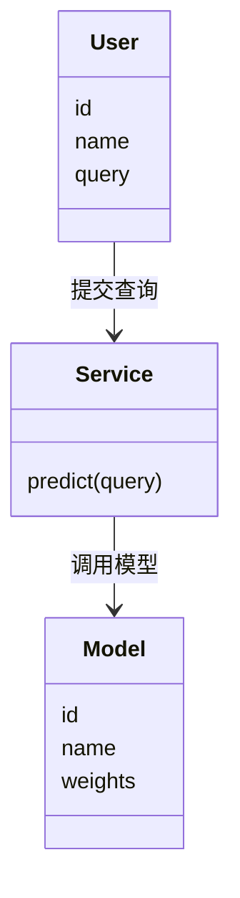

                 


# 《企业级AI模型的集成与部署策略》

---

## 关键词：
- 企业级AI模型
- 模型集成
- 模型部署
- 机器学习
- 深度学习
- 系统架构

---

## 摘要：
随着人工智能技术的快速发展，企业级AI模型的集成与部署已成为技术落地的关键环节。本文从企业级AI模型的背景出发，深入探讨其核心概念、集成策略、部署架构、算法原理以及系统设计，结合实际案例分析，为企业提供切实可行的部署策略和优化建议。

---

## 目录大纲

### 第一部分：企业级AI模型的背景与现状
1. 企业级AI模型的背景与现状
2. 企业级AI模型的核心概念与特点

### 第二部分：企业级AI模型的集成策略
3. 模型集成的概念与原理
4. 模型集成的实现方式与优化策略

### 第三部分：企业级AI模型的部署架构
5. 模型部署的概念与原理
6. 模型部署的实现方式与系统设计

### 第四部分：企业级AI模型的算法原理
7. 常用算法原理与实现
8. 模型优化与性能提升

### 第五部分：企业级AI模型的系统分析与设计
9. 系统分析与领域模型设计
10. 系统架构设计与接口交互

### 第六部分：企业级AI模型的项目实战
11. 实战案例分析与实现
12. 项目总结与经验分享

### 第七部分：企业级AI模型的最佳实践
13. 部署优化与维护策略
14. 未来趋势与发展方向

---

### 正文部分

---

## 第1章：企业级AI模型的背景与现状

### 1.1 企业级AI模型的背景

#### 1.1.1 从传统AI到企业级AI的演进
人工智能技术经历了从学术研究到工业应用的转变，企业级AI模型的出现标志着AI技术在企业中的深度应用。企业级AI模型不仅需要处理复杂的业务逻辑，还需具备高可用性和可扩展性。

#### 1.1.2 企业级AI模型的核心概念
企业级AI模型是指在企业环境中部署和集成的AI模型，旨在解决实际业务问题。其核心概念包括模型集成、模型部署、模型优化等。

#### 1.1.3 企业级AI模型的边界与外延
企业级AI模型的边界包括数据预处理、模型训练、模型集成和模型部署，而外延则涉及数据源、业务系统和用户交互。

#### 1.1.4 企业级AI模型的定义与特点
- **定义**：企业级AI模型是为特定企业需求设计的，能够处理大规模数据和复杂业务逻辑的AI模型。
- **特点**：高可用性、可扩展性、实时性、可解释性。

---

### 1.2 企业级AI模型的现状

#### 1.2.1 当前AI模型的发展趋势
AI模型正朝着小型化、轻量化和高效化的方向发展，以适应企业级部署的需求。

#### 1.2.2 企业级AI模型的应用场景
企业级AI模型广泛应用于智能客服、 fraud detection、供应链优化等领域。

#### 1.2.3 企业级AI模型的挑战与机遇
- **挑战**：数据隐私、计算资源限制、模型维护成本。
- **机遇**：技术进步、行业需求、政策支持。

---

## 第2章：企业级AI模型的集成策略

### 2.1 模型集成的概念与原理

#### 2.1.1 模型集成的定义
模型集成是将多个独立模型的输出进行融合，以获得更好的性能。

#### 2.1.2 模型集成的核心原理
通过投票、加权投票或模型融合等方法，提升模型的准确性和稳定性。

#### 2.1.3 模型集成的分类与对比

| 类型       | 描述                                                                 |
|------------|----------------------------------------------------------------------|
| 简单投票   | 通过多数投票决定最终结果                                           |
| 加权投票   | 根据模型性能赋予不同权重，加权求和                                   |
| 模型融合   | 将多个模型的输出特征组合，重新训练一个模型                         |

---

### 2.2 模型集成的实现方式

#### 2.2.1 简单投票法
```python
def simple_voting(models, X_test):
    predictions = []
    for model in models:
        pred = model.predict(X_test)
        predictions.append(pred)
    final_pred = np.mean(predictions, axis=0)
    return final_pred
```

#### 2.2.2 加权投票法
```python
def weighted_voting(models, weights, X_test):
    predictions = []
    for i, model in enumerate(models):
        pred = model.predict(X_test)
        predictions.append(pred * weights[i])
    final_pred = np.sum(predictions, axis=0)
    return final_pred
```

---

### 2.3 模型集成的优势与挑战

#### 2.3.1 模型集成的优势
- **稳定性**：通过多个模型的集成，降低单个模型的过拟合风险。
- **准确性**：模型集成通常能获得更高的准确率。

#### 2.3.2 模型集成的挑战
- **计算成本**：集成多个模型需要额外的计算资源。
- **模型选择**：如何选择合适的模型进行集成是关键问题。

---

## 第3章：企业级AI模型的部署架构

### 3.1 模型部署的概念与原理

#### 3.1.1 模型部署的定义
模型部署是将训练好的AI模型应用于实际业务场景的过程。

#### 3.1.2 模型部署的核心原理
通过API接口或微服务架构，将模型嵌入到企业现有的系统中。

---

### 3.2 模型部署的实现方式

#### 3.2.1 基于容器的部署
使用Docker容器化部署模型，确保模型在不同环境下的一致性。

#### 3.2.2 基于微服务的部署
将模型服务化，通过API Gateway暴露接口，实现高可用性和可扩展性。

---

## 第4章：企业级AI模型的算法原理

### 4.1 常用算法原理与实现

#### 4.1.1 模型蒸馏
- **原理**：通过教师模型指导学生模型，减少模型大小。
- **公式**：
  $$ \text{loss} = \alpha \times \text{student\_loss} + (1-\alpha) \times \text{teacher\_loss} $$
- **代码示例**：
  ```python
  def distillation_loss(y_true, y_pred, teacher_pred, alpha=0.1):
      return alpha * sparse_categorical_crossentropy(y_true, y_pred) + \
             (1 - alpha) * sparse_categorical_crossentropy(y_true, teacher_pred)
  ```

---

## 第5章：企业级AI模型的系统分析与设计

### 5.1 系统分析

#### 5.1.1 项目介绍
设计一个电商客服系统的AI模型部署方案，解决用户咨询问题。

#### 5.1.2 领域模型设计


---

## 第6章：企业级AI模型的项目实战

### 6.1 实战案例分析与实现

#### 6.1.1 环境配置
- 安装Python、TensorFlow、Flask框架。

#### 6.1.2 核心代码实现
```python
from flask import Flask, request, jsonify
import tensorflow as tf

app = Flask(__name__)
model = tf.keras.models.load_model('model.h5')

@app.route('/predict', methods=['POST'])
def predict():
    data = request.json['query']
    prediction = model.predict(data)
    return jsonify({'result': prediction.tolist()})

if __name__ == '__main__':
    app.run(debug=True)
```

---

## 第7章：企业级AI模型的最佳实践

### 7.1 部署优化与维护策略

#### 7.1.1 模型优化
- 使用模型剪枝和量化技术，减少模型体积。
- 优化推理速度，降低延迟。

#### 7.1.2 模型维护
- 定期更新模型，适应数据分布的变化。
- 监控模型性能，及时发现异常。

---

## 总结

企业级AI模型的集成与部署是AI技术落地的关键，本文从背景、概念、算法、系统设计和实战案例等多个方面进行了详细探讨。通过合理的集成策略和优化部署架构，企业可以更好地发挥AI模型的潜力，实现业务价值的最大化。未来，随着技术的进步和需求的演变，企业级AI模型的应用将更加广泛和深入。

