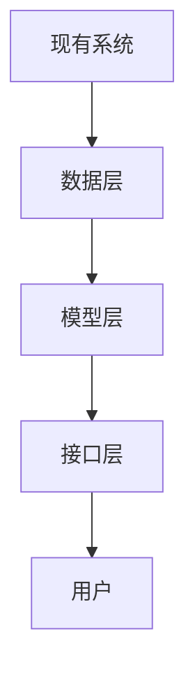
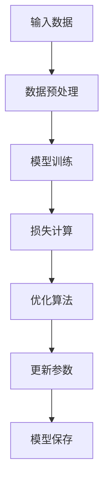
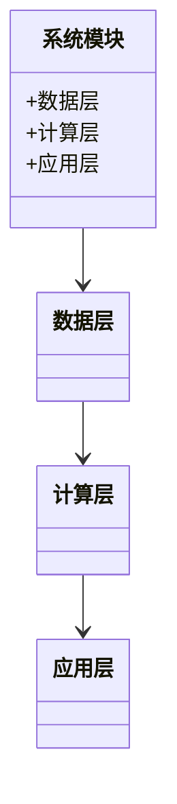
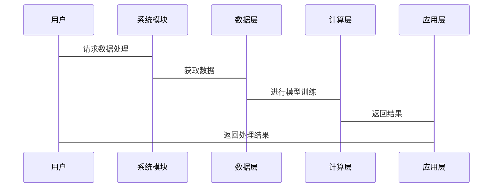

                 


# 企业级AI模型的集成策略：无缝对接现有系统

**关键词**：企业AI集成，系统架构，模型对接，数据兼容性，技术实现

**摘要**：本文详细探讨了如何将企业级AI模型无缝集成到现有系统中，解决数据孤岛和模型孤岛的问题，提升系统的智能化水平和性能。通过分析集成策略、算法原理和系统架构，本文为技术架构师和开发人员提供了实用的指导，帮助企业高效地将AI模型与现有系统对接，实现业务价值的最大化。

---

# 《企业级AI模型的集成策略：无缝对接现有系统》

## 第1章: 企业级AI模型集成的背景介绍

### 1.1 问题背景

#### 1.1.1 传统企业系统的局限性
传统的企业系统在设计时往往基于特定的业务需求，缺乏对AI模型的支持。随着业务的扩展和复杂性增加，这些系统暴露出以下问题：
- 数据孤岛：各部门之间的数据孤立，难以共享和利用。
- 功能单一：难以适应新的业务需求和技术发展。
- 维护成本高：系统升级和维护需要大量资源。

#### 1.1.2 AI模型在企业中的潜在价值
AI模型能够为企业带来以下优势：
- 提高决策效率：通过分析大量数据，提供更精准的决策支持。
- 自动化处理：减少人工干预，提高业务流程的效率。
- 创新业务模式：基于AI的推荐系统和预测模型，开拓新的业务领域。

#### 1.1.3 集成AI模型的需求与挑战
企业需要将AI模型集成到现有系统中，以充分利用其潜力。然而，这一过程面临以下挑战：
- 系统兼容性问题：现有系统可能不支持AI模型的接口。
- 数据格式不统一：AI模型需要特定格式的数据，而现有系统可能无法提供。
- 性能瓶颈：AI模型的计算资源需求可能对现有系统造成压力。

### 1.2 问题描述

#### 1.2.1 现有系统与AI模型的不兼容性
现有系统的设计通常基于传统的数据库和API，而AI模型需要特定的输入格式和计算环境。这种不兼容性导致AI模型无法直接集成到现有系统中。

#### 1.2.2 数据孤岛与模型孤岛的问题
数据孤岛是指数据分布在不同的系统中，难以共享和利用。模型孤岛则是指不同的AI模型分散在各个系统中，无法协同工作。这些问题限制了企业利用AI模型的潜力。

#### 1.2.3 集成过程中的技术障碍
技术障碍包括：
- 数据预处理的复杂性：AI模型需要特定格式的数据，而现有系统可能无法提供。
- 模型训练和推理的资源需求：AI模型通常需要大量的计算资源，而现有系统可能无法支持。

### 1.3 问题解决

#### 1.3.1 集成AI模型的目标
- 实现AI模型与现有系统的无缝对接。
- 提高系统的智能化水平和业务效率。
- 降低集成的成本和复杂性。

#### 1.3.2 集成过程中的关键问题
- 确保系统的兼容性。
- 解决数据格式的统一问题。
- 优化模型的性能，减少资源消耗。

#### 1.3.3 解决方案的初步框架
- 数据预处理：将现有系统的数据转换为AI模型所需的格式。
- 系统架构优化：设计一个支持AI模型的系统架构。
- 模型优化：选择适合现有系统的AI模型，并对其进行优化。

### 1.4 边界与外延

#### 1.4.1 集成的边界条件
- 系统边界：明确AI模型集成的范围和限制。
- 数据边界：定义数据流动和处理的范围。
- 性能边界：设定AI模型对系统性能的影响范围。

#### 1.4.2 相关概念的外延
- 集成范围：不仅包括AI模型，还包括相关的数据、接口和计算资源。
- 系统扩展：AI模型的集成可能需要扩展系统功能和性能。

#### 1.4.3 与其他技术的关联
- 云计算：提供计算资源和支持。
- 大数据分析：处理和分析大量数据。
- 微服务架构：支持系统的模块化设计和扩展。

### 1.5 核心要素组成

#### 1.5.1 数据、模型、接口的关系
- 数据是AI模型的输入，模型是处理数据的核心，接口是数据和模型与系统交互的桥梁。

#### 1.5.2 集成策略的关键要素
- 数据转换：将现有系统数据转换为AI模型所需的格式。
- 接口设计：定义AI模型与现有系统的交互接口。
- 模型选择：选择适合现有系统的AI模型。

#### 1.5.3 系统架构的核心组件
- 数据层：负责数据的存储和处理。
- 计算层：负责AI模型的训练和推理。
- 应用层：负责与现有系统的交互和应用。

---

## 第2章: 企业级AI模型集成的核心概念

### 2.1 核心概念原理

#### 2.1.1 AI模型的可集成性
AI模型的可集成性取决于其输入输出格式、计算资源需求和接口设计。可集成性高的模型更容易与现有系统对接。

#### 2.1.2 系统集成的兼容性
系统集成的兼容性是指现有系统与AI模型之间的接口和数据格式的一致性。兼容性好的系统更容易集成AI模型。

#### 2.1.3 数据流与模型流的统一
数据流与模型流的统一是指在系统中，数据和模型能够无缝流动和交互。这需要数据格式和模型接口的高度一致性。

### 2.2 核心概念属性对比

| 模型类型 | 可集成性 | 数据需求 | 接口复杂度 |
|----------|----------|----------|------------|
| GPT      | 高       | 高       | 中          |
| BERT     | 中       | 高       | 高          |

### 2.3 实体关系图



---

## 第3章: 企业级AI模型集成的算法原理

### 3.1 算法原理

#### 3.1.1 损失函数
损失函数用于衡量模型预测值与真实值之间的差异。常用的损失函数包括均方误差（MSE）和交叉熵损失。

- 均方误差（MSE）：
  $$MSE = \frac{1}{n}\sum_{i=1}^{n}(y_i - \hat{y_i})^2$$
- 交叉熵损失：
  $$CE = -\frac{1}{n}\sum_{i=1}^{n} y_i \log(\hat{y_i}) + (1 - y_i) \log(1 - \hat{y_i})$$

#### 3.1.2 优化算法
优化算法用于最小化损失函数。常用的优化算法包括随机梯度下降（SGD）和Adam优化器。

- 随机梯度下降（SGD）：
  $$\theta = \theta - \eta \nabla J(\theta)$$
- Adam优化器：
  $$m_t = \beta_1 m_{t-1} + (1 - \beta_1) g_t$$
  $$v_t = \beta_2 v_{t-1} + (1 - \beta_2) g_t^2$$
  $$\theta = \theta - \alpha \frac{m_t}{\sqrt{v_t + \epsilon}}$$

### 3.2 算法流程图



---

## 第4章: 企业级AI模型集成的系统架构设计

### 4.1 系统功能设计

#### 4.1.1 领域模型
领域模型是系统的核心功能模块，包括数据处理、模型训练和结果输出。



#### 4.1.2 接口设计
接口设计定义了系统与AI模型之间的交互方式，包括数据输入和输出接口。



---

## 第5章: 企业级AI模型集成的项目实战

### 5.1 环境安装

#### 5.1.1 安装Python
安装Python 3.8或更高版本。

#### 5.1.2 安装依赖库
安装以下依赖库：
```bash
pip install numpy pandas scikit-learn transformers
```

### 5.2 核心代码实现

#### 5.2.1 数据预处理
```python
import pandas as pd
import numpy as np

def data_preprocessing(data):
    # 数据清洗
    data = data.dropna()
    # 数据转换
    data['label'] = data['label'].astype(int)
    return data
```

#### 5.2.2 模型训练
```python
from sklearn.model_selection import train_test_split
from sklearn.linear_model import LogisticRegression

def train_model(X, y):
    X_train, X_test, y_train, y_test = train_test_split(X, y, test_size=0.2)
    model = LogisticRegression()
    model.fit(X_train, y_train)
    return model
```

### 5.3 案例分析

#### 5.3.1 数据分析
分析数据分布，确保数据质量。

#### 5.3.2 模型评估
评估模型性能，包括准确率、召回率和F1分数。

---

## 第6章: 企业级AI模型集成的总结与展望

### 6.1 总结

#### 6.1.1 核心内容回顾
本文详细介绍了企业级AI模型集成的背景、核心概念、算法原理和系统架构设计，并提供了实际的项目案例。

#### 6.1.2 最佳实践
- 确保数据的准确性和完整性。
- 选择适合的AI模型，并进行优化。
- 设计良好的系统架构，确保系统的可扩展性和可维护性。

### 6.2 注意事项

#### 6.2.1 系统兼容性
确保AI模型与现有系统的接口和数据格式兼容。

#### 6.2.2 数据隐私与安全
保护数据隐私，确保数据的安全性。

#### 6.2.3 模型性能监控
定期监控模型性能，及时进行优化和调整。

### 6.3 拓展阅读

#### 6.3.1 相关技术
- 云计算与大数据分析
- 微服务架构设计
- 分布式系统开发

#### 6.3.2 未来趋势
- 自动化AI集成工具的发展
- 更高效、更智能的AI模型开发
- 多模态AI模型的应用

---

通过本文的详细讲解，读者可以全面了解企业级AI模型集成的核心策略和实现方法。希望本文能为企业技术架构师和开发人员提供实用的指导，帮助企业高效地将AI模型与现有系统对接，实现业务价值的最大化。

