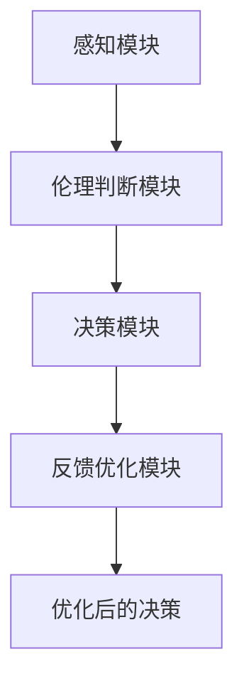
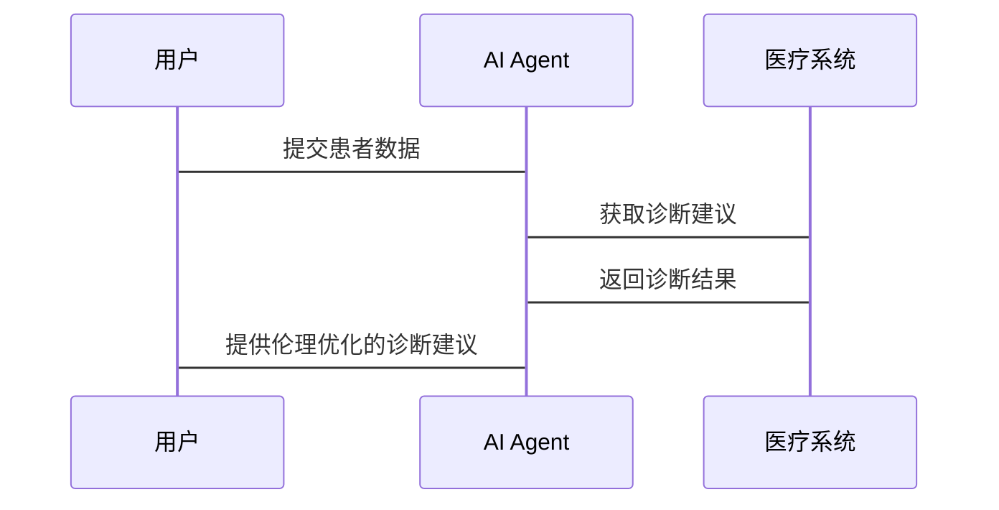

                 


# 伦理AI：设计符合道德标准的AI Agent

> 关键词：伦理AI，AI Agent，人工智能伦理，伦理设计，道德标准，算法透明度

> 摘要：  
随着人工智能技术的快速发展，伦理问题日益成为AI Agent设计中的核心挑战。本文从伦理AI的基本概念出发，深入分析其核心原理、算法设计与系统架构，结合实际案例，探讨如何构建符合道德标准的AI Agent。文章详细介绍了伦理AI的定义、框架、算法实现、系统设计以及项目实战，并总结了最佳实践方法，为AI开发者和研究者提供了全面的指导。

---

## 第一部分: 伦理AI的背景与核心概念

### 第1章: 人工智能的快速发展与伦理挑战

#### 1.1 AI技术的现状与发展
人工智能（AI）技术近年来取得了飞速发展，广泛应用于医疗、金融、交通、教育等领域。然而，这种技术进步也带来了诸多伦理问题。AI系统的决策过程往往缺乏透明度，导致用户对其行为的合理性和合法性产生质疑。

#### 1.2 人工智能的伦理问题与挑战
AI系统的伦理问题主要体现在以下几个方面：
- **偏见与歧视**：AI算法可能基于历史数据中的偏差，导致不公平的决策。
- **隐私与数据安全**：AI系统需要处理大量用户数据，存在数据泄露风险。
- **透明度与可解释性**：复杂的AI模型难以解释其决策过程，影响用户信任。
- **责任归属**：当AI系统出现问题时，责任归属尚不明确。

---

### 第2章: 伦理AI的核心概念与框架

#### 2.1 伦理AI的定义与目标
伦理AI（Ethical AI）是指在设计和开发AI系统时，充分考虑伦理原则，确保系统行为符合社会道德标准。其目标是通过技术手段实现公平、透明和可解释的AI决策。

#### 2.2 伦理AI的框架与原则
伦理AI的框架通常包括以下原则：
- **公正性**：确保AI系统对所有用户一视同仁。
- **透明性**：用户能够理解AI系统的决策过程。
- **隐私保护**：保护用户数据不被滥用。
- **可解释性**：AI系统的行为可以被人类理解。
- **责任归属**：明确AI系统出现问题时的责任方。

---

## 第二部分: 伦理AI的核心概念与联系

### 第3章: 伦理AI的核心概念原理

#### 3.1 伦理AI的核心原理
伦理AI的设计需要结合伦理学和计算机科学，通过技术手段实现伦理目标。其核心原理包括：
- **伦理评分机制**：对AI系统的决策进行伦理评估，确保其符合道德标准。
- **强化学习模型**：通过奖励机制训练AI系统，使其在决策过程中优先考虑伦理因素。
- **可解释性设计**：确保AI系统的决策过程可以被人类理解。

#### 3.2 伦理AI与AI Agent的结合
AI Agent是一种能够感知环境并执行任务的智能体。伦理AI在AI Agent中的应用主要体现在：
- **伦理判断模块**：AI Agent能够根据伦理框架对决策进行评估。
- **反馈优化模块**：根据伦理评分调整AI Agent的行为策略。

---

## 第三部分: 伦理AI的算法原理讲解

### 第4章: 伦理AI的算法原理

#### 4.1 伦理评分机制
伦理评分机制用于评估AI系统的决策是否符合伦理标准。其计算公式如下：

$$ E = \frac{1}{n}\sum_{i=1}^{n} e_i $$

其中，$E$ 表示伦理评分，$e_i$ 表示每个决策的伦理得分，$n$ 表示决策总数。

#### 4.2 基于强化学习的伦理决策模型
基于强化学习的伦理决策模型通过奖励机制训练AI Agent，使其在决策过程中优先考虑伦理因素。模型的核心算法如下：

1. 初始化奖励函数 $R$，定义伦理行为的奖励值。
2. 训练AI Agent在不同场景下的决策策略。
3. 根据伦理评分调整奖励函数，优化AI Agent的行为。

---

## 第四部分: 伦理AI的系统架构与设计

### 第5章: 伦理AI的系统架构设计

#### 5.1 系统功能设计
AI Agent的系统功能模块包括：
- **感知模块**：获取环境信息。
- **伦理判断模块**：评估决策的伦理性。
- **决策模块**：根据伦理评分做出决策。
- **反馈优化模块**：优化决策策略。

#### 5.2 系统架构设计
以下是伦理AI系统的架构图：



---

## 第五部分: 伦理AI的项目实战

### 第6章: 伦理AI的实际应用

#### 6.1 项目环境配置
为了实现伦理AI系统，首先需要安装以下工具：
- Python 3.8+
- TensorFlow 2.0+
- Scikit-learn 0.24+

#### 6.2 核心代码实现
以下是伦理评分计算的Python代码：

```python
def calculate_ethical_score(decisions, weights):
    # 计算伦理评分
    ethical_scores = []
    for decision in decisions:
        score = sum([d * w for d, w in zip(decision, weights)]) / len(weights)
        ethical_scores.append(score)
    return ethical_scores
```

#### 6.3 实际案例分析
以医疗辅助诊断系统为例，AI Agent需要根据患者数据和伦理框架做出诊断建议。以下是系统交互流程图：



---

## 第六部分: 伦理AI的最佳实践

### 第7章: 伦理AI的关键点与注意事项

#### 7.1 数据隐私保护
在设计伦理AI系统时，必须确保用户数据的安全性和隐私性。

#### 7.2 算法透明度
AI系统的决策过程需要透明化，以便用户理解和信任。

#### 7.3 持续优化
伦理AI是一个动态优化的过程，需要根据实际应用反馈不断调整和优化。

---

## 第七部分: 总结与展望

### 第8章: 伦理AI的未来发展

#### 8.1 伦理AI的重要性
随着AI技术的广泛应用，伦理问题将越来越重要。伦理AI的设计将直接影响社会对AI技术的信任和接受度。

#### 8.2 伦理AI的未来方向
未来，伦理AI将更加注重可解释性和透明性，同时结合边缘计算和分布式系统，实现更高效、更安全的AI决策。

---

## 参考文献
1. Russell, S. (2019).《人工智能：一种现代方法》
2. Turing, A. M. (1950). Computing machinery and intelligence.
3. ethics.ai/《伦理AI设计指南》

---

通过以上内容，我们可以看到，设计符合道德标准的AI Agent需要综合考虑伦理学、计算机科学和实际应用场景。伦理AI不仅是技术问题，更是社会问题，需要开发者、伦理学家和社会各界的共同努力。

