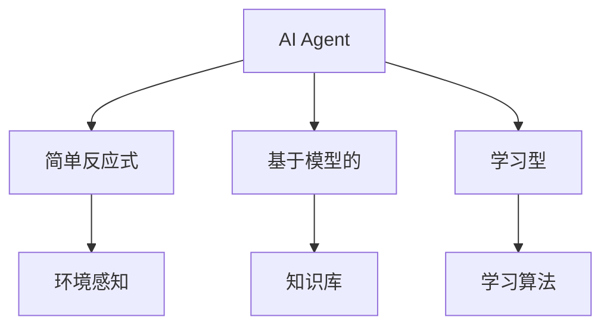
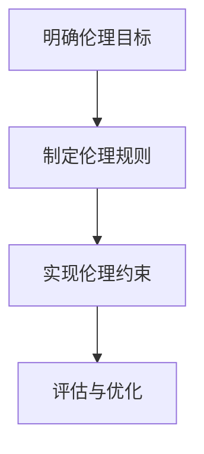
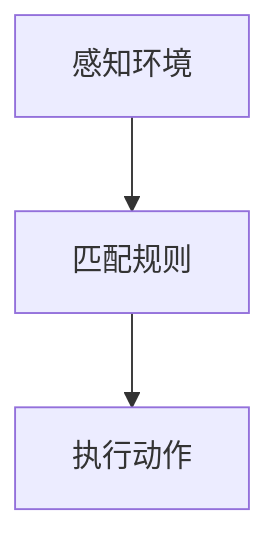
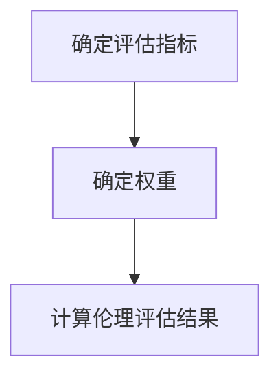
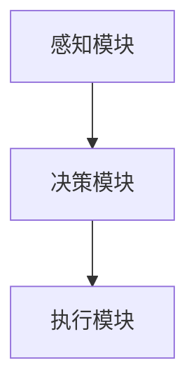
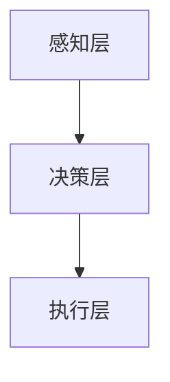

                 


# 伦理考量：设计负责任的AI Agent

## 关键词：AI Agent、伦理设计、责任分配、决策模型、系统架构

## 摘要：
在AI技术迅速发展的今天，设计负责任的AI Agent变得至关重要。本文从AI Agent的基本概念出发，探讨其在伦理设计中的核心问题，包括责任分配、决策模型、系统架构等方面。通过详细分析和实际案例，本文为设计负责任的AI Agent提供了理论依据和实践指导。

---

## 第一部分: 伦理考量与AI Agent的背景介绍

### 第1章: AI Agent的基本概念与伦理问题

#### 1.1 AI Agent的定义与核心要素

**1.1.1 AI Agent的基本定义**
AI Agent（人工智能代理）是指能够感知环境、自主决策并执行任务的智能实体。它可以是一个软件程序、机器人或其他智能系统，旨在通过交互和操作实现特定目标。

**1.1.2 AI Agent的核心属性**
- **自主性**：AI Agent能够在没有外部干预的情况下自主决策。
- **反应性**：能够实时感知环境并做出响应。
- **目标导向**：所有行为均以实现特定目标为导向。
- **学习能力**：能够通过数据和经验不断优化自身的决策能力。

**1.1.3 AI Agent的分类与应用场景**
AI Agent可以根据智能水平、决策方式和应用场景进行分类：
1. **简单反应式AI Agent**：基于当前感知做出反应，适用于简单的环境。
2. **基于模型的AI Agent**：利用内部模型和知识库进行决策，适用于复杂环境。
3. **学习型AI Agent**：通过机器学习算法不断优化决策模型，适用于动态环境。

**对比表格：不同类型的AI Agent对比**

| 类型                | 简单反应式AI Agent | 基于模型的AI Agent | 学习型AI Agent |
|---------------------|---------------------|--------------------|----------------|
| 决策方式            | 基于当前感知       | 基于内部模型和知识库 | 基于历史数据和学习 |
| 适用场景            | 简单环境           | 复杂环境           | 动态环境         |
| 代表应用            | 智能家电           | 医疗诊断系统       | 自动驾驶汽车     |

**Mermaid图：AI Agent的分类与关系**



---

#### 1.2 伦理问题在AI Agent中的重要性

**1.2.1 伦理问题的背景与现状**
随着AI Agent在医疗、交通、金融等领域的广泛应用，伦理问题日益凸显。例如，自动驾驶汽车在紧急情况下的决策可能涉及生命安全，这引发了广泛的社会讨论。

**1.2.2 伦理问题对AI Agent设计的影响**
伦理问题直接影响AI Agent的设计目标和实现方式。例如，如何在保证效率的同时，确保决策的公平性和透明性。

**1.2.3 伦理问题的边界与外延**
伦理问题不仅涉及技术本身，还包括社会、法律等多个方面。例如，数据隐私、算法偏见等都属于伦理问题的外延。

---

### 第2章: AI Agent的伦理框架与责任分配

#### 2.1 伦理框架的核心概念

**2.1.1 伦理框架的定义与作用**
伦理框架是一种规范AI Agent行为的规则体系，旨在确保其决策符合社会伦理和法律法规。

**2.1.2 伦理框架的关键组成部分**
- **伦理原则**：如公正、尊重、不伤害等。
- **伦理规则**：具体的行为规范，如数据使用规则。
- **伦理评估**：对AI Agent决策的伦理合规性进行评估。

**2.1.3 伦理框架的实施步骤**
1. **明确伦理目标**：确定AI Agent需要遵循的伦理原则。
2. **制定伦理规则**：将伦理原则转化为具体的规则。
3. **实现伦理约束**：将伦理规则嵌入到AI Agent的决策过程中。
4. **评估与优化**：对AI Agent的行为进行伦理评估并不断优化。

**Mermaid图：伦理框架的实施步骤**



---

#### 2.2 责任分配的理论基础

**2.2.1 责任分配的基本原则**
责任分配需要遵循公平性、可追溯性和可操作性原则。

**2.2.2 责任分配的模型与方法**
- **责任链模型**：将责任分配到AI Agent的设计者、开发者和使用方。
- **责任分配矩阵**：根据AI Agent的行为和结果，明确各方的责任。

**2.2.3 责任分配的案例分析**
例如，在自动驾驶汽车发生事故时，责任可能涉及制造商、软件开发者和驾驶员。

---

## 第二部分: AI Agent的算法原理与伦理实现

### 第3章: AI Agent的决策机制与伦理影响

#### 3.1 基于规则的决策模型

**3.1.1 基于规则的决策模型概述**
基于规则的决策模型通过预定义的规则进行决策，适用于规则明确的场景。

**3.1.2 基于规则的伦理实现方法**
将伦理规则嵌入到决策规则中，例如“在紧急情况下优先保护乘客”。

**3.1.3 基于规则的优缺点分析**
- 优点：简单易懂，易于实现。
- 缺点：难以应对复杂和动态的伦理问题。

**Mermaid图：基于规则的决策模型**



---

#### 3.2 基于学习的决策模型

**3.2.1 基于学习的决策模型概述**
基于学习的决策模型通过机器学习算法从数据中学习决策策略。

**3.2.2 基于学习的伦理实现方法**
通过训练数据中的伦理案例，学习伦理决策模式。

**3.2.3 基于学习的优缺点分析**
- 优点：能够应对复杂和动态的伦理问题。
- 缺点：决策过程缺乏透明性，难以解释。

**数学公式：基于学习的决策模型示例**

$$ P(y|x) = \frac{P(x|y)P(y)}{P(x)} $$

其中，\( P(y|x) \) 表示在输入 \( x \) 的情况下，输出 \( y \) 的概率。

---

### 第4章: AI Agent的伦理评估与验证

#### 4.1 伦理评估的数学模型

**4.1.1 伦理评估的数学公式**
$$ E = \sum_{i=1}^{n} w_i \cdot f_i $$
其中，\( E \) 表示伦理评估结果，\( w_i \) 表示评估指标的权重，\( f_i \) 表示评估指标的值。

**4.1.2 伦理评估的实现步骤**
1. 确定评估指标。
2. 确定各指标的权重。
3. 计算伦理评估结果。

**Mermaid图：伦理评估流程**



---

## 第三部分: 系统分析与架构设计

### 第5章: 负责任的AI Agent系统架构

#### 5.1 系统功能设计

**5.1.1 系统功能模块划分**
- **感知模块**：负责环境感知。
- **决策模块**：负责决策制定。
- **执行模块**：负责执行动作。

**5.1.2 系统功能的领域模型**

**Mermaid图：领域模型**



---

#### 5.2 系统架构设计

**5.2.1 系统架构的总体设计**
采用分层架构，包括感知层、决策层和执行层。

**5.2.2 系统架构的模块划分**
- **感知层**：负责环境数据的采集。
- **决策层**：负责决策的制定。
- **执行层**：负责动作的执行。

**Mermaid图：系统架构**



---

## 第四部分: 项目实战与最佳实践

### 第6章: 项目实战

#### 6.1 环境安装与配置
- 安装必要的开发工具和库，如Python、TensorFlow等。

#### 6.2 核心代码实现

**6.2.1 伦理约束实现**

```python
def apply_ethical_constraint(action, context):
    # 判断是否符合伦理约束
    if violates_ethical_rule(action, context):
        return None
    else:
        return action
```

**6.2.2 决策模型实现**

```python
class EthicalDecisionModel:
    def __init__(self, rules):
        self.rules = rules

    def make_decision(self, state):
        for rule in self.rules:
            if rule.applies_to(state):
                return rule.action
        return None
```

---

#### 6.3 案例分析与优化

**案例分析：自动驾驶汽车的伦理决策**
在自动驾驶汽车面临紧急情况时，如何在保护乘客和行人之间做出决策。

**优化建议：**
1. 建立完善的伦理规则库。
2. 定期进行伦理评估和优化。

---

### 第7章: 最佳实践与小结

#### 7.1 最佳实践

**7.1.1 伦理设计的注意事项**
- 确保伦理规则的透明性和可解释性。
- 定期更新伦理规则以适应新的伦理挑战。

**7.1.2 系统设计的注意事项**
- 确保系统的可扩展性和可维护性。
- 定期进行系统测试和优化。

---

## 结语

设计负责任的AI Agent是一个复杂而重要的任务，需要综合考虑伦理、技术和法律等多个方面。通过本文的分析和实践，我们可以为设计负责任的AI Agent提供有价值的参考和指导。

---

# END

