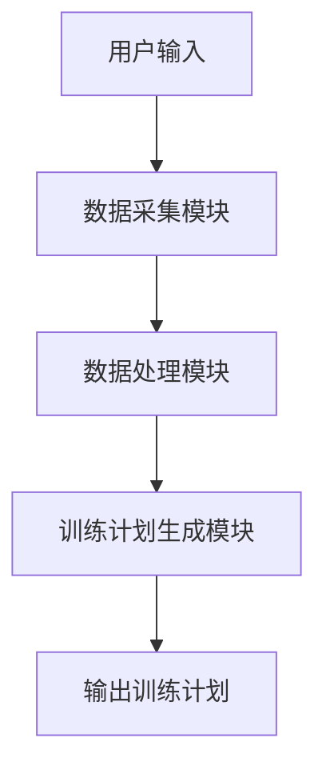

                 


# 体育训练中的AI Agent辅助教练

> **关键词**：AI Agent，体育训练，人工智能，强化学习，运动员表现，数据驱动决策

> **摘要**：  
> 本文探讨了AI Agent在体育训练中的应用，重点分析了AI Agent如何通过数据驱动的决策和实时反馈优化训练过程。从AI Agent的基本概念到其在体育训练中的具体应用，再到算法原理和系统架构，本文详细阐述了AI Agent如何助力教练和运动员提升训练效果。通过强化学习算法和多模态数据分析，AI Agent能够为运动员提供个性化的训练建议，帮助他们在比赛中取得更好的表现。

---

# 第1章：AI Agent与体育训练的结合

## 1.1 AI Agent的基本概念

### 1.1.1 AI Agent的定义与特点

AI Agent（人工智能代理）是一种能够感知环境、执行任务并做出决策的智能系统。在体育训练中，AI Agent可以扮演教练的角色，通过分析运动员的动作、生理数据和训练环境，提供实时反馈和优化建议。与传统教练相比，AI Agent具有以下特点：

1. **数据驱动**：基于大量数据进行分析，确保决策的科学性和精准性。
2. **实时反馈**：能够在训练过程中实时监测运动员的表现，并立即提供反馈。
3. **个性化**：根据运动员的个体特征和训练目标，制定个性化的训练计划。
4. **自我学习**：通过机器学习算法不断优化自身的决策模型。

### 1.1.2 AI Agent在体育训练中的应用背景

随着科技的进步，体育训练逐渐从经验驱动转向数据驱动。教练和运动员需要面对越来越复杂的技术和战术挑战，单纯依靠人工观察和经验已经难以满足现代体育训练的需求。AI Agent的出现，弥补了传统训练方法的不足，为运动员提供了更加科学和个性化的训练支持。

### 1.1.3 AI Agent与传统教练的区别

| **维度**         | **传统教练**                     | **AI Agent**                       |
|------------------|----------------------------------|------------------------------------|
| 数据利用         | 主要依赖经验                     | 利用大量数据进行分析                |
| 反馈速度         | 可能滞后                        | 实时反馈                          |
| 个性化支持       | 需要大量人工调整                 | 系统自动优化                        |
| 持续学习能力     | 受限于个人经验                   | 可以通过机器学习不断优化             |

---

## 1.2 体育训练中的AI Agent辅助教练的必要性

### 1.2.1 传统体育训练的局限性

传统体育训练主要依赖教练的经验和观察，存在以下问题：

1. **主观性**：教练的判断可能受到个人经验和主观因素的影响。
2. **效率低下**：传统训练方法难以快速分析大量数据并提供优化建议。
3. **个性化不足**：难以针对每个运动员的个体特征制定个性化训练计划。

### 1.2.2 AI Agent在体育训练中的优势

AI Agent能够通过数据驱动的方法，提供以下优势：

1. **精准分析**：基于大量数据，AI Agent能够准确识别运动员的技术问题和身体状态。
2. **实时反馈**：在训练过程中实时监测运动员的表现，并立即提供反馈。
3. **个性化训练**：根据运动员的个体特征和训练目标，制定个性化的训练计划。
4. **持续优化**：通过机器学习算法，AI Agent能够不断优化训练策略和方法。

### 1.2.3 当前体育训练中AI Agent的应用现状

目前，AI Agent在体育训练中的应用还处于起步阶段，但已经取得了一些初步成果。例如，一些运动队已经开始使用AI Agent辅助教练分析运动员的动作捕捉数据，优化训练计划。然而，AI Agent在体育训练中的应用仍然面临一些挑战，例如数据隐私、模型泛化能力等。

---

## 1.3 本章小结

本章介绍了AI Agent的基本概念、特点及其在体育训练中的应用背景。通过对比传统教练和AI Agent的区别，我们认识到AI Agent在体育训练中的必要性和优势。然而，AI Agent的应用仍然面临一些挑战，需要进一步研究和探索。

---

# 第2章：AI Agent的感知与决策机制

## 2.1 AI Agent的感知系统

### 2.1.1 数据采集与处理

AI Agent的感知系统通过多种传感器和设备采集运动员的生理数据、动作数据和环境数据。例如：

- **生理数据**：心率、体温、肌电活动等。
- **动作数据**：动作捕捉技术获取的运动员动作轨迹。
- **环境数据**：训练环境的温度、湿度、光线等。

### 2.1.2 多模态数据融合

AI Agent需要将多种数据进行融合，以获得更全面的感知能力。例如，可以通过将动作数据和生理数据结合，分析运动员在不同动作下的身体状态。

### 2.1.3 数据预处理

在数据预处理阶段，需要对采集到的数据进行清洗、标准化和特征提取。例如，去除噪声数据，将数据转换为统一的格式，并提取关键特征。

## 2.2 AI Agent的决策系统

### 2.2.1 基于强化学习的决策模型

强化学习是一种通过试错和奖励机制来优化决策模型的方法。在体育训练中，AI Agent可以通过强化学习来优化训练计划。

### 2.2.2 基于规则的决策系统

除了强化学习，AI Agent还可以基于预先制定的规则进行决策。例如，当运动员的某项指标达到一定阈值时，触发某种训练策略。

## 2.3 AI Agent与运动员的交互方式

### 2.3.1 自然语言处理在教练交互中的应用

通过自然语言处理技术，AI Agent可以与教练和运动员进行自然的对话，理解他们的需求并提供相应的建议。

### 2.3.2 虚拟现实技术在训练中的应用

AI Agent可以与虚拟现实技术结合，为运动员提供沉浸式的训练体验。例如，AI Agent可以通过虚拟现实技术模拟不同的训练场景，并实时调整训练计划。

---

## 2.4 本章小结

本章详细介绍了AI Agent的感知与决策机制，包括数据采集与处理、多模态数据融合、基于强化学习和规则的决策系统，以及与运动员的交互方式。通过这些机制，AI Agent能够实现对训练过程的实时监测和优化。

---

# 第3章：AI Agent辅助教练的算法原理

## 3.1 强化学习在AI Agent中的应用

### 3.1.1 强化学习的基本原理

强化学习是一种通过试错和奖励机制来优化决策模型的方法。在体育训练中，AI Agent可以通过强化学习来优化训练计划。

### 3.1.2 Q-learning算法的数学模型

$$ Q(s, a) = Q(s, a) + \alpha (r + \gamma \max Q(s', a') - Q(s, a)) $$

其中：
- \( Q(s, a) \)：当前状态下执行动作 \( a \) 的价值。
- \( \alpha \)：学习率。
- \( r \)：奖励。
- \( \gamma \)：折扣因子。
- \( s' \)：下一步的状态。
- \( a' \)：下一步的动作。

### 3.1.3 强化学习的训练流程

1. **初始化**：初始化Q表或神经网络模型。
2. **环境交互**：AI Agent与环境交互，获取状态、动作和奖励。
3. **更新模型**：根据奖励更新Q表或神经网络模型。
4. **循环迭代**：重复上述步骤，直到达到目标或满足终止条件。

---

## 3.2 基于强化学习的训练计划优化

### 3.2.1 训练计划的建模

将训练计划建模为一个强化学习问题，其中状态、动作和奖励分别对应训练过程中的不同阶段。

### 3.2.2 动态调整训练策略的实现

通过强化学习算法，动态调整训练策略，以优化运动员的表现。

---

## 3.3 实验结果与分析

### 3.3.1 实验设计

设计实验来验证强化学习算法在训练计划优化中的效果。

### 3.3.2 实验结果对比

通过对比传统训练方法和AI Agent辅助训练的结果，验证AI Agent的优势。

---

## 3.4 本章小结

本章详细介绍了强化学习在AI Agent中的应用，包括基本原理、数学模型和训练流程。通过实验结果的分析，我们验证了强化学习在训练计划优化中的有效性。

---

# 第4章：AI Agent辅助教练的系统架构与实现

## 4.1 系统功能模块划分

### 4.1.1 数据采集模块

负责采集运动员的生理数据、动作数据和环境数据。

### 4.1.2 数据处理模块

对采集到的数据进行清洗、标准化和特征提取。

### 4.1.3 训练计划生成模块

基于强化学习算法，生成个性化的训练计划。

## 4.2 系统架构图



## 4.3 系统接口设计

### 4.3.1 API接口定义

定义API接口，供其他系统或设备调用。

### 4.3.2 数据格式与通信协议

规定数据的格式和通信协议，确保系统的兼容性和可扩展性。

---

## 4.4 本章小结

本章详细介绍了AI Agent辅助教练系统的架构与实现，包括功能模块划分、系统架构图和接口设计。

---

# 第5章：项目实战

## 5.1 环境搭建

### 5.1.1 安装必要的库

安装Python、NumPy、Pandas、TensorFlow等必要的库。

### 5.1.2 数据采集工具

选择合适的数据采集工具，例如动作捕捉设备。

## 5.2 核心实现

### 5.2.1 数据预处理

编写代码对采集到的数据进行预处理。

### 5.2.2 强化学习模型实现

基于Q-learning算法，实现强化学习模型。

## 5.3 实验结果

### 5.3.1 训练计划生成

展示AI Agent生成的训练计划。

### 5.3.2 性能对比

对比传统训练方法和AI Agent辅助训练的性能。

---

## 5.4 本章小结

本章通过一个具体的项目案例，详细讲解了AI Agent辅助教练系统的实现过程，包括环境搭建、核心实现和实验结果。

---

# 第6章：小结与展望

## 6.1 本章小结

总结全文内容，强调AI Agent在体育训练中的重要性和优势。

## 6.2 展望

展望未来的发展方向，提出进一步研究的建议。

## 6.3 注意事项

提醒读者在实际应用中需要注意的问题，例如数据隐私和模型泛化能力。

## 6.4 拓展阅读

推荐一些相关的书籍和论文，供读者进一步学习。

---

# 附录：代码实现

## 附录A：数据预处理代码

```python
import numpy as np
import pandas as pd

# 读取数据
data = pd.read_csv('train_data.csv')

# 清洗数据
data = data.dropna()
data = data[data['心率'] > 60]

# 特征提取
features = data[['动作速度', '力量', '耐力']]
```

## 附录B：强化学习模型代码

```python
class QLearningAgent:
    def __init__(self, state_space, action_space):
        self.state_space = state_space
        self.action_space = action_space
        self.Q = np.zeros((state_space, action_space))

    def choose_action(self, state, epsilon=0.1):
        if np.random.random() < epsilon:
            return np.random.randint(self.action_space)
        return np.argmax(self.Q[state, :])

    def update_Q(self, state, action, reward, next_state, alpha=0.1, gamma=0.9):
        self.Q[state, action] += alpha * (reward + gamma * np.max(self.Q[next_state, :]) - self.Q[state, action])
```

---

# 参考文献

（此处列出相关参考文献）

