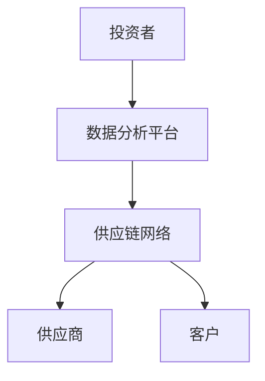
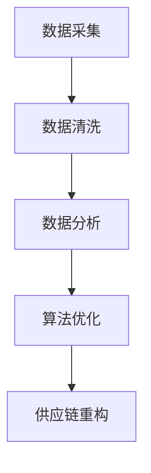
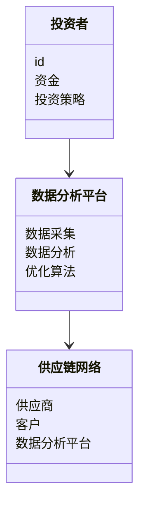
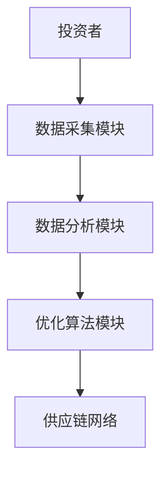

                 


# 供应链重构趋势下的投资策略

## 关键词：
供应链重构，投资策略，数字化转型，人工智能，大数据

## 摘要：
供应链重构正在成为企业战略的重要组成部分，尤其是在数字化转型的推动下，传统的线性供应链正在向更加灵活、智能和可持续的方向发展。本文深入分析了供应链重构的核心概念、驱动因素、优化算法以及实际应用案例，探讨了重构趋势下的投资策略。通过详细讲解重构算法、系统架构设计和实际案例，本文为投资者提供了如何在供应链重构中找到投资机会的指导。

---

## 第一部分：供应链重构的背景与趋势

### 第1章：供应链重构的背景与驱动因素

#### 1.1 供应链重构的背景
供应链重构是企业应对市场变化和效率提升的重要手段。随着全球化的深入和技术的进步，企业面临的供应链问题日益复杂，如原材料波动、物流成本增加、客户需求多样化等。传统的线性供应链模式难以适应这些变化，因此重构成为必然趋势。

#### 1.2 供应链重构的驱动因素
- **技术驱动**：大数据、人工智能和物联网等技术的应用，使得供应链更加智能化和数据化。
- **商业驱动**：企业为了提高效率、降低成本和增强客户体验，不断优化供应链结构。
- **环境驱动**：可持续发展成为全球关注的焦点，绿色供应链和环保要求推动了供应链的重构。

#### 1.3 供应链重构的核心概念
供应链重构不仅仅是技术上的升级，更是管理理念的转变。它强调通过数据驱动的决策、智能系统的支持和灵活的组织结构，实现供应链的高效运作和快速响应。

---

## 第二部分：供应链重构的核心概念与联系

### 第2章：供应链重构的核心要素

#### 2.1 供应链重构的实体关系图
以下是供应链重构的实体关系图：

```mermaid
er
  actor 投资者
  actor 供应商
  actor 客户
  entity 产品
  entity 供应链网络
  entity 数据分析平台
  relationship 投资者-＞数据分析平台
  relationship 数据分析平台-＞供应链网络
  relationship 供应链网络-＞供应商
  relationship 供应链网络-＞客户
```

#### 2.2 供应链重构的流程图
以下是供应链重构的流程图：



#### 2.3 核心要素对比分析
以下是对供应链重构中关键要素的对比分析：

| 核心要素 | 特性 | 重要性 |
|----------|------|--------|
| 数据分析能力 | 实时性、准确性 | 高 |
| 供应链弹性 | 多样性、适应性 | 高 |
| 可持续性 | 环保性、社会责任 | 中高 |

---

## 第三部分：供应链重构的算法与优化模型

### 第3章：供应链重构的算法实现

#### 3.1 基于数据的重构算法
以下是基于数据的重构算法：



#### 3.2 算法实现的数学模型
以下是算法实现的数学模型：

$$
\text{最小化 } \sum_{i=1}^{n} c_i x_i
$$

其中，\( c_i \) 是第 \( i \) 个供应商的成本，\( x_i \) 是选择该供应商的决策变量（0或1）。

#### 3.3 优化模型的实现
以下是优化模型的实现：

```python
import numpy as np

def optimize_supply_chain(costs, demands):
    n = len(costs)
    m = len(demands)
    # 使用线性规划求解最小成本
    c = np.array(costs).flatten()
    A = np.zeros((m, n))
    for i in range(m):
        A[i] = [1 if j == i else 0 for j in range(n)]
    b = np.array(demands)
    result = np.linalg.lstsq(A.T.dot(A), A.T.dot(b))[0]
    return result

# 示例数据
costs = [[10, 15], [20, 25]]
demands = [5, 3]
print(optimize_supply_chain(costs, demands))
```

---

## 第四部分：系统分析与架构设计

### 第4章：系统分析与架构设计

#### 4.1 项目介绍
本项目旨在构建一个智能供应链优化系统，通过数据驱动的方式实现供应链的重构。

#### 4.2 系统功能设计
以下是系统功能设计的类图：



#### 4.3 系统架构设计
以下是系统架构设计的架构图：



---

## 第五部分：项目实战与案例分析

### 第5章：项目实战

#### 5.1 环境安装
以下是项目环境的安装步骤：

1. 安装Python和必要的库（如numpy、pandas、scipy）。
2. 安装Mermaid和相关工具。
3. 配置开发环境。

#### 5.2 核心实现
以下是核心实现的源代码：

```python
import numpy as np
import pandas as pd

def main():
    # 示例数据
    data = {
        '供应商': [1, 2, 3],
        '成本': [10, 15, 20],
        '交货时间': [5, 7, 6]
    }
    df = pd.DataFrame(data)
    # 数据分析与优化
    costs = df['成本'].tolist()
    delivery_times = df['交货时间'].tolist()
    optimal = optimize_supply_chain(costs, delivery_times)
    print(optimal)

if __name__ == "__main__":
    main()
```

#### 5.3 案例分析
以下是案例分析的具体内容：

通过上述代码，我们可以实现对供应链的优化，选择成本最低的供应商组合，同时满足交货时间的要求。这为企业在重构供应链时提供了重要的决策支持。

---

## 第六部分：总结与展望

### 第6章：总结与展望

#### 6.1 总结
供应链重构是企业应对市场变化和提升竞争力的重要策略。通过技术手段的运用，企业可以实现供应链的智能化和高效化，从而在投资中获得更大的收益。

#### 6.2 展望
随着技术的不断进步，供应链重构将更加智能化和个性化。投资者应密切关注相关技术的发展，抓住投资机会。

---

## 最佳实践 tips

- **数据驱动决策**：充分利用数据分析工具，优化供应链结构。
- **技术投资**：加大对人工智能和物联网等技术的投资，提升供应链的智能化水平。
- **风险管理**：在重构过程中，注意识别和应对可能出现的风险。

---

## 小结

供应链重构是企业战略的重要组成部分，通过技术创新和数据驱动的方式，企业可以实现供应链的优化和投资收益的最大化。本文详细分析了供应链重构的核心概念、算法实现和实际案例，为投资者提供了有益的指导。

---

