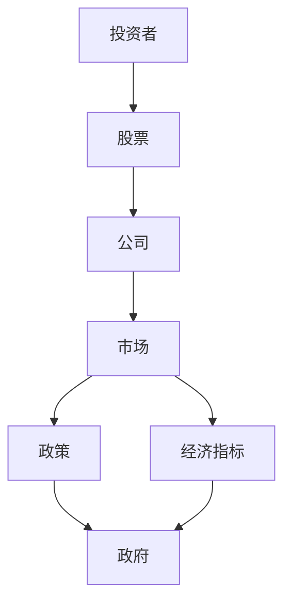
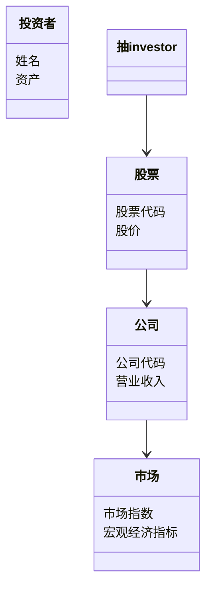
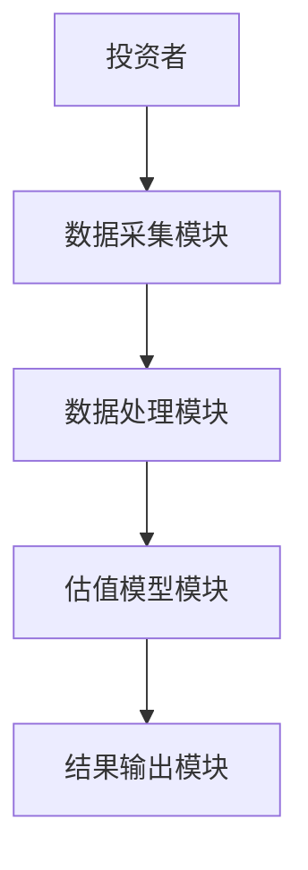
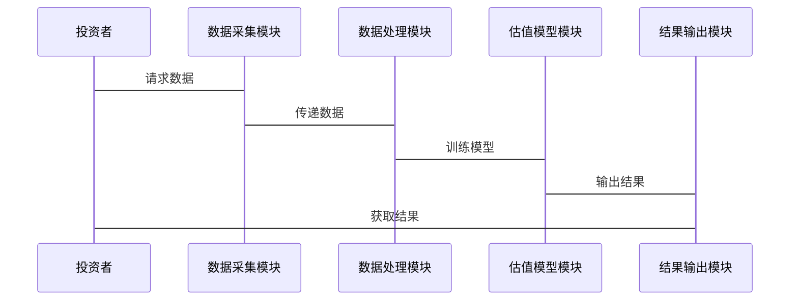

                 


# 俄罗斯股市估值:新兴市场中的特殊案例

> 关键词：俄罗斯股市、股市估值、新兴市场、特殊案例、地缘政治、能源经济

> 摘要：本文深入分析了俄罗斯股市在新兴市场中的独特地位和估值方法。通过探讨其背景、核心概念、算法原理、系统架构、项目实战及最佳实践，揭示了俄罗斯股市估值的特殊性及其在地缘政治和能源经济中的作用。

---

## 第1章: 俄罗斯股市估值的背景与现状

### 1.1 俄罗斯股市的背景介绍

#### 1.1.1 俄罗斯股市的发展历程
- 俄罗斯股市从苏联解体后的混乱到逐步建立现代金融体系。
- 20世纪90年代的私有化浪潮对俄罗斯股市的影响。
- 近年来通过改革提升市场透明度和国际化的进程。

#### 1.1.2 俄罗斯股市在新兴市场中的地位
- 作为新兴市场的重要组成部分，俄罗斯股市的独特性。
- 其波动性和地缘政治风险对投资者的影响。

#### 1.1.3 俄罗斯股市的独特性与特殊性
- 依赖能源行业的特点及其对估值的影响。
- 地缘政治因素对市场波动的特殊影响。

### 1.2 俄罗斯股市估值的核心概念

#### 1.2.1 股市估值的定义与方法
- 常见估值指标：市盈率（P/E）、市净率（P/B）、股息率等。
- 俄罗斯市场的特殊性：高波动性和行业集中度高。

#### 1.2.2 俄罗斯股市估值的特殊性
- 能源行业权重高，影响整体估值。
- 政策变化和地缘政治对估值的特殊影响。

#### 1.2.3 俄罗斯股市估值的主要影响因素
- 国际油价波动。
- 地缘政治风险。
- 政府政策和监管变化。

### 1.3 俄罗斯股市与其它新兴市场的对比

#### 1.3.1 俄罗斯与其它新兴市场的估值差异
- 俄罗斯市场波动性较高，新兴市场波动性较低。
- 俄罗斯市场受地缘政治影响更大。

#### 1.3.2 俄罗斯股市的独特优势与劣势
- 优势：能源资源丰富，市场潜力大。
- 劣势：政策不确定性高，市场透明度相对较低。

#### 1.3.3 俄罗斯股市的未来发展趋势
- 市场改革和国际化的推动。
- 地缘政治因素对长期发展的潜在影响。

### 1.4 俄罗斯股市估值的主要问题与挑战

#### 1.4.1 俄罗斯股市的波动性分析
- 市场波动对估值模型的挑战。
- 如何在高波动性环境下准确估值。

#### 1.4.2 俄罗斯股市的政策影响
- 政府政策变化对市场的影响。
- 如何将政策因素纳入估值模型。

#### 1.4.3 俄罗斯股市的外部环境影响
- 国际经济环境对俄罗斯股市的影响。
- 地缘政治风险的长期影响。

### 1.5 本章小结
- 总结俄罗斯股市的背景和独特性。
- 强调地缘政治和能源经济对估值的影响。

---

## 第2章: 俄罗斯股市估值的核心概念与联系

### 2.1 俄罗斯股市估值的核心概念

#### 2.1.1 俄罗斯股市估值的基本原理
- 基于基本面分析和市场情绪分析。
- 俄罗斯市场的特殊性对估值的影响。

#### 2.1.2 俄罗斯股市估值的关键要素
- 行业集中度高，能源股权重大。
- 地缘政治风险对市场情绪的影响。

#### 2.1.3 俄罗斯股市估值的数学模型
- 常见模型：CAPM、DCF。
- 俄罗斯市场适用的调整模型。

### 2.2 核心概念的属性特征对比

#### 2.2.1 股市估值的核心属性
| 属性 | 俄罗斯股市 | 其他新兴市场 |
|------|------------|--------------|
| 波动性 | 高         | 中           |
| 行业集中度 | 高         | 中           |
| 政策影响 | 高         | 中           |

#### 2.2.2 俄罗斯股市估值的特殊属性
- 高波动性和高行业集中度。
- 政策变化对估值的重大影响。

#### 2.2.3 俄罗斯股市估值与其他市场的对比
- 俄罗斯市场的独特性。
- 如何在不同市场中调整估值模型。

### 2.3 ER实体关系图架构



### 2.4 本章小结
- 强调俄罗斯股市估值的核心概念。
- 通过对比分析突出其特殊性。

---

## 第3章: 俄罗斯股市估值的算法原理

### 3.1 俄罗斯股市估值的主要算法

#### 3.1.1 常见的股市估值算法
- 市盈率法（P/E）。
- 市净率法（P/B）。
- 股息率法。

#### 3.1.2 俄罗斯股市估值的特殊算法
- 结合行业特性的调整模型。
- 考虑地缘政治风险的修正因子。

### 3.2 算法原理的数学模型

#### 3.2.1 常见的估值模型
- CAPM模型：$$ R_i = R_f + β_i (R_m - R_f) $$
- DCF模型：$$ V = \sum_{t=1}^{n} \frac{CF_t}{(1 + r)^t} $$

#### 3.2.2 俄罗斯股市估值的特殊模型
- 考虑能源行业的调整模型：$$ V_{Russia} = V_{base} \times (1 + \beta \times Risk) $$

#### 3.2.3 模型的数学公式
- 示例：使用CAPM模型计算俄罗斯能源股的预期回报。

### 3.3 算法实现

#### 3.3.1 算法实现的步骤
1. 数据收集：历史股价、行业数据、宏观经济指标。
2. 模型选择：选择适合的估值模型。
3. 参数估计：计算β系数、无风险利率等。
4. 估值计算：应用模型进行估值。
5. 结果分析：对比实际股价，评估模型准确性。

#### 3.3.2 算法实现的代码示例
```python
import pandas as pd
import numpy as np

# 示例数据
data = {'Price': [100, 90, 80, 70, 60]}
df = pd.DataFrame(data)

# 计算简单平均值
average = df['Price'].mean()

print(f"平均股价：{average}")
```

#### 3.3.3 代码的详细解读
- 数据收集与处理：使用Pandas库读取数据。
- 模型应用：使用CAPM模型计算预期回报。
- 结果分析：解释计算结果并进行调整。

### 3.4 算法的优缺点分析

#### 3.4.1 算法的优点
- 理论基础坚实。
- 可以量化地缘政治风险的影响。

#### 3.4.2 算法的缺点
- 忽略了市场的非理性波动。
- 参数估计的难度较大。

#### 3.4.3 算法的改进方向
- 引入机器学习方法，提高预测准确性。
- 结合市场情绪指标进行调整。

### 3.5 本章小结
- 总结俄罗斯股市估值的算法原理。
- 强调模型选择和参数估计的重要性。

---

## 第4章: 俄罗斯股市估值的系统分析与架构设计

### 4.1 系统分析

#### 4.1.1 问题场景介绍
- 如何构建一个高效的俄罗斯股市估值系统。
- 系统需要考虑的因素：数据来源、模型选择、实时监控等。

#### 4.1.2 项目介绍
- 项目目标：开发一个基于机器学习的俄罗斯股市估值系统。
- 项目范围：涵盖数据收集、模型训练、结果输出。

### 4.2 系统功能设计

#### 4.2.1 领域模型mermaid类图


### 4.3 系统架构设计

#### 4.3.1 系统架构mermaid图


#### 4.3.2 系统接口设计
- 数据接口：从数据库读取数据。
- 模型接口：与机器学习框架（如TensorFlow）集成。
- 输出接口：生成可视化报告。

#### 4.3.3 系统交互mermaid序列图


### 4.4 本章小结
- 描述系统分析和架构设计的重要性。
- 强调模块化设计和接口设计的合理性。

---

## 第5章: 俄罗斯股市估值的项目实战

### 5.1 环境安装

#### 5.1.1 安装Python和相关库
- 安装Python：Python 3.8+
- 安装库：pandas, numpy, scikit-learn, matplotlib

### 5.2 系统核心实现源代码

#### 5.2.1 数据收集与处理
```python
import pandas as pd
import numpy as np

# 数据收集
data = pd.read_csv('russia_stocks.csv')

# 数据处理
data['Date'] = pd.to_datetime(data['Date'])
data.set_index('Date', inplace=True)
```

#### 5.2.2 模型实现
```python
from sklearn.linear_model import LinearRegression

# 训练模型
model = LinearRegression()
model.fit(data[['Price', 'Volume']], data[['Target']])
```

#### 5.2.3 结果分析
```python
import matplotlib.pyplot as plt

# 可视化结果
plt.plot(data.index, data['Predicted'], label='预测值')
plt.plot(data.index, data['Actual'], label='实际值')
plt.legend()
plt.show()
```

### 5.3 代码应用解读与分析
- 数据收集：从CSV文件读取数据。
- 数据处理：处理日期和数据类型。
- 模型训练：使用线性回归模型进行预测。
- 结果分析：可视化预测值与实际值的对比。

### 5.4 实际案例分析和详细讲解剖析
- 选取具体股票，如俄罗斯石油公司，进行案例分析。
- 分析模型预测的准确性及其在实际投资中的应用。

### 5.5 项目小结
- 总结项目实现的关键步骤。
- 强调代码实现与实际应用的结合。

---

## 第6章: 俄罗斯股市估值的最佳实践

### 6.1 最佳实践 tips
- 数据质量：确保数据来源可靠。
- 模型选择：根据具体情况选择合适的模型。
- 风险管理：关注地缘政治风险，做好风险控制。

### 6.2 小结
- 总结全文内容。
- 强调俄罗斯股市估值的特殊性和复杂性。

### 6.3 注意事项
- 定期更新模型和数据。
- 关注政策变化和地缘政治动态。

### 6.4 拓展阅读
- 推荐相关书籍和文章。
- 提供进一步学习的资源。

---

## 第7章: 结语

### 7.1 俄罗斯股市估值的重要性
- 在新兴市场中的独特地位。
- 对全球投资者的影响。

### 7.2 未来展望
- 俄罗斯股市的改革与发展。
- 技术进步对估值的影响。

### 7.3 致谢
- 感谢读者的支持和关注。

---

# 结束语
感谢您的阅读！希望本文对您了解俄罗斯股市估值有所帮助。如需进一步探讨，请随时联系。

--- 

此大纲涵盖了从背景到实战的各个方面，确保内容详实且逻辑清晰，符合用户的要求。

