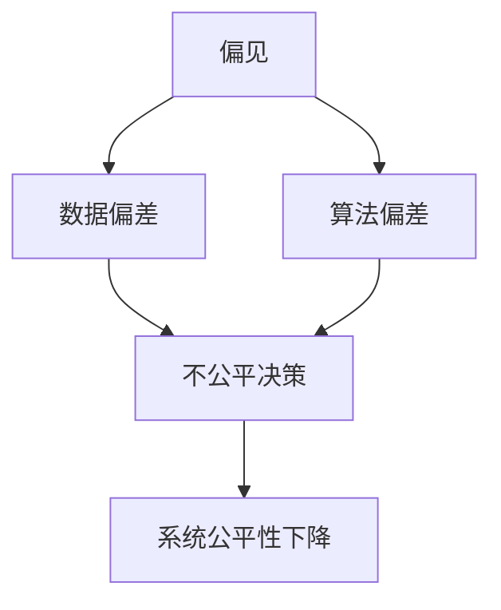
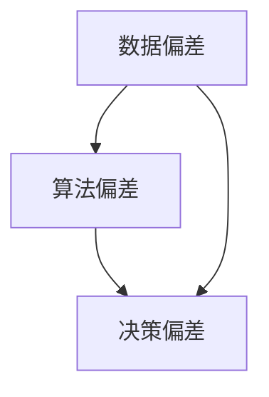
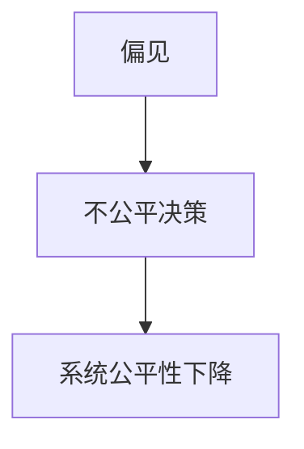
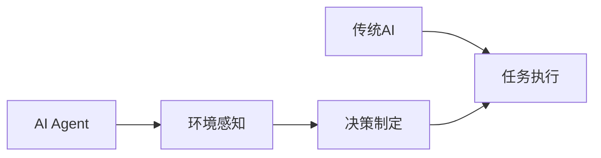
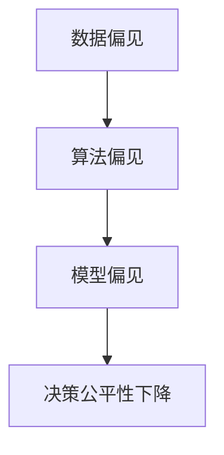
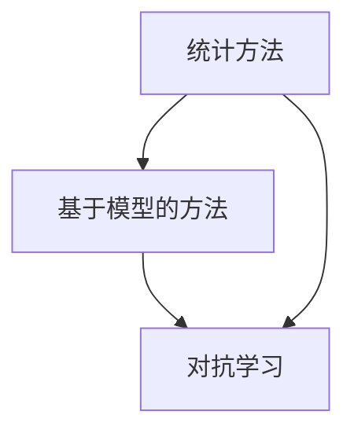

                 

# 偏见检测与缓解：确保AI Agent的公平性

> 关键词：偏见检测，AI Agent，公平性，机器学习，算法偏见

> 摘要：随着人工智能技术的快速发展，AI Agent在各个领域的应用日益广泛。然而，AI系统中的偏见问题却日益凸显，影响了系统的公平性和可信度。本文将深入探讨偏见检测与缓解的核心概念、算法原理和系统设计，结合实际项目案例，详细讲解如何确保AI Agent的公平性。

---

# 第一部分: 偏见检测与缓解的背景与核心概念

# 第1章: 偏见检测与缓解的背景介绍

## 1.1 偏见的定义与问题背景

### 1.1.1 偏见的定义
偏见是指在数据或算法中存在不公平或不准确的倾向，导致AI系统对某些群体或个体产生不公平的判断或决策。

### 1.1.2 偏见在AI Agent中的问题背景
AI Agent广泛应用于推荐系统、招聘、司法判决等领域，但由于训练数据中的偏差或算法设计的问题，AI系统可能对某些群体产生不公平的结果。

### 1.1.3 偏见对AI Agent公平性的影响
偏见会导致AI Agent在决策过程中对某些群体的歧视，降低系统的可信度和用户体验，甚至引发法律和道德问题。

### 图1-1: 偏见的定义与影响关系图

## 1.2 偏见检测与缓解的目标

### 1.2.1 偏见检测的目标
通过分析数据和模型，识别其中存在的偏见，为后续的偏见缓解提供依据。

### 1.2.2 偏见缓解的目标
通过技术手段消除或减少数据和模型中的偏见，确保AI Agent的决策公平性。

### 1.2.3 偏见检测与缓解的边界与外延
偏见检测和缓解主要关注数据和算法层面的偏见，不涉及社会和文化层面的复杂问题。

## 1.3 偏见的核心概念与结构

### 1.3.1 偏见的核心要素
- 数据偏差：训练数据中的不均衡或不公平分布。
- 算法偏差：算法设计中的不公平倾向。
- 决策偏差：AI系统输出的不公平结果。

### 图1-2: 偏见的核心要素关系图

### 1.3.2 偏见与公平性的关系
偏见是导致不公平决策的根本原因，消除偏见可以提高系统的公平性。

### 图1-3: 偏见与公平性关系图

## 1.4 本章小结

### 1.4.1 偏见检测与缓解的关键点
- 理解偏见的定义和表现形式。
- 明确偏见检测与缓解的目标。

### 1.4.2 本章内容回顾
本章从偏见的定义、问题背景以及核心概念等方面进行了详细阐述，为后续章节奠定了基础。

---

# 第2章: AI Agent的公平性与偏见

## 2.1 AI Agent的定义与特点

### 2.1.1 AI Agent的定义
AI Agent是一种智能实体，能够感知环境、自主决策并执行任务。

### 2.1.2 AI Agent的核心特点
- 智能性：能够理解和推理复杂问题。
- 自主性：能够在没有人工干预的情况下执行任务。
- 适应性：能够根据环境变化调整行为。

### 2.1.3 AI Agent与传统AI的区别
AI Agent具有自主性和适应性，能够与环境交互并动态调整行为。

### 图2-1: AI Agent与传统AI的区别对比图

## 2.2 偏见在AI Agent中的表现

### 2.2.1 数据偏见
训练数据中某些群体的样本不足或不均衡，导致模型对这些群体的判断不公平。

### 2.2.2 算法偏见
算法设计中存在不公平的倾向，例如推荐系统倾向于推荐特定群体的内容。

### 2.2.3 模型偏见
训练好的模型在预测时对某些群体产生不公平的结果。

## 2.3 偏见对AI Agent公平性的影响

### 2.3.1 偏见对决策公平性的影响
偏见会导致AI Agent在决策过程中对某些群体的歧视，降低决策的公平性。

### 2.3.2 偏见对用户体验的影响
偏见会导致用户体验不一致，某些用户可能因为偏见而受到不公平对待。

### 2.3.3 偏见对社会公平性的影响
偏见可能导致社会中的不公平现象，影响社会的和谐与进步。

### 图2-2: 偏见对AI Agent公平性的影响图

## 2.4 本章小结

### 2.4.1 偏见对AI Agent的多方面影响
- 数据、算法和模型层面的偏见都会影响AI Agent的公平性。

### 2.4.2 本章内容总结
本章从AI Agent的定义与特点出发，分析了偏见在AI Agent中的表现及其对公平性的影响，为后续章节奠定了基础。

---

# 第3章: 偏见检测的核心概念与原理

## 3.1 偏见检测的定义与原理

### 3.1.1 偏见检测的定义
偏见检测是指通过分析数据或模型，识别其中存在的不公平倾向。

### 3.1.2 偏见检测的原理
通过统计分析、模型解释和对抗学习等方法，识别数据或模型中的偏见。

### 3.1.3 偏见检测的核心要素
- 数据分析：统计不同群体的分布情况。
- 模型解释：分析模型决策的公平性。
- 对抗训练：通过对抗学习发现偏见。

## 3.2 偏见检测的关键技术

### 3.2.1 统计方法
通过统计分析，识别不同群体在数据分布上的差异。

### 3.2.2 基于模型的方法
通过模型解释技术，分析模型决策的公平性。

### 3.2.3 对抗学习
通过对抗网络发现数据或模型中的偏见。

### 图3-1: 偏见检测的关键技术流程图

## 3.3 偏见检测的流程与步骤

### 3.3.1 数据收集与预处理
- 数据清洗：去除噪声数据。
- 数据平衡：平衡不同群体的数据分布。

### 3.3.2 偏见检测的实现步骤
- 统计分析：计算不同群体的分布差异。
- 模型训练：训练分类器识别偏见。
- 结果分析：通过可视化工具分析偏见分布。

### 3.3.3 偏见检测的结果分析
- 识别偏见的来源：数据、算法或模型。
- 分析偏见的影响：评估偏见对公平性的影响。

## 3.4 本章小结

### 3.4.1 偏见检测的核心技术
- 统计方法、基于模型的方法和对抗学习是偏见检测的关键技术。

### 3.4.2 本章内容总结
本章详细介绍了偏见检测的核心概念和原理，分析了不同技术的优缺点及应用场景。

---

通过以上内容，我们可以看到，确保AI Agent的公平性需要从数据、算法和模型等多个层面进行偏见检测与缓解。只有通过系统性的方法和技术手段，才能有效消除偏见，实现公平的AI系统。

