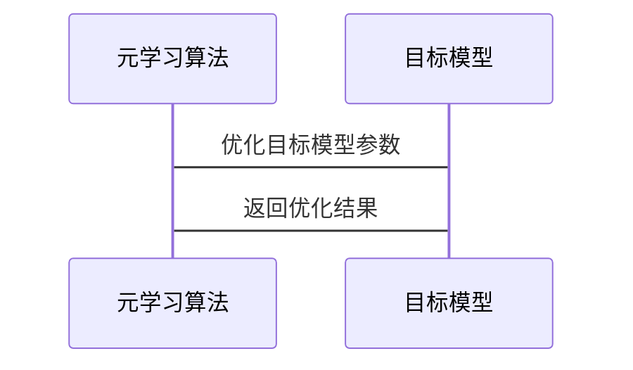

                 


# 元学习在AI Agent中的应用：快速适应新任务

---

## 关键词：元学习、AI Agent、快速适应、迁移学习、任务生成、自适应策略、算法实现

---

## 摘要

本文深入探讨了元学习（Meta-Learning）在AI Agent中的应用，重点分析了元学习如何帮助AI Agent快速适应新任务。文章从元学习的基本概念和AI Agent的定义出发，逐步展开讨论，涵盖元学习的理论基础、算法实现、系统设计以及实际应用案例。通过结合数学公式、算法流程图和系统架构图，本文详细解读了元学习在AI Agent中的核心作用，并通过项目实战展示了如何将元学习应用于实际场景中。最后，本文总结了元学习在AI Agent中的优势与挑战，并展望了未来的研究方向。

---

# 第1章 元学习与AI Agent概述

## 1.1 元学习的基本概念

### 1.1.1 元学习的定义

元学习（Meta-Learning）是一种机器学习技术，旨在通过学习如何学习，从而快速适应新任务。与传统机器学习不同，元学习不依赖于大量标注数据，而是通过在多个任务上的经验，提取通用的特征和策略，从而在新任务上实现快速学习和适应。

$$
\text{元学习的核心目标是：} \quad \text{快速适应新任务}
$$

### 1.1.2 元学习的核心思想

元学习的核心思想是通过“学习如何学习”，将经验迁移到新任务中。具体来说，元学习系统通常包含两个层次：元任务（Meta-Task）和目标任务（Target Task）。元任务用于训练模型的元参数，目标任务用于验证模型的适应能力。

### 1.1.3 元学习与传统机器学习的区别

| 特性 | 元学习 | 传统机器学习 |
|------|--------|--------------|
| 数据需求 | 依赖少量标注数据 | 依赖大量标注数据 |
| 适应能力 | 能够快速适应新任务 | 适应能力较弱 |
| 学习目标 | 学习如何学习 | 学习特定任务 |

---

## 1.2 AI Agent的定义与特点

### 1.2.1 AI Agent的定义

AI Agent（人工智能代理）是一种能够感知环境、自主决策并执行任务的智能体。AI Agent通常具备以下特点：自主性、反应性、目标导向和社交能力。

### 1.2.2 AI Agent的核心特点

| 特性 | 描述 |
|------|------|
| 自主性 | 能够自主决策，无需外部干预 |
| 反应性 | 能够实时感知环境并做出反应 |
| 目标导向 | 以实现特定目标为导向 |
| 社交能力 | 能够与其他Agent或人类进行交互 |

### 1.2.3 元学习与AI Agent的结合

元学习通过增强AI Agent的适应能力，使其能够快速应对新任务和复杂环境。具体而言，元学习帮助AI Agent在以下方面表现出色：

1. 快速学习新任务。
2. 跨任务迁移。
3. 动态环境适应。

---

## 1.3 元学习在AI Agent中的作用

### 1.3.1 元学习如何提升AI Agent的适应能力

元学习通过学习任务的通用特征，使得AI Agent能够快速适应新任务。例如，在多任务学习中，元学习可以帮助AI Agent提取多个任务的共同特征，从而在新任务上实现快速学习。

### 1.3.2 元学习在AI Agent中的应用场景

1. **任务生成**：通过元学习，AI Agent可以生成新任务并进行快速学习。
2. **迁移学习**：元学习可以帮助AI Agent在新任务上快速迁移已有的知识和经验。
3. **自适应策略**：元学习使得AI Agent能够根据环境变化动态调整策略。

### 1.3.3 元学习与AI Agent结合的优势

1. **快速适应能力**：元学习使得AI Agent能够在新任务上线快速学习。
2. **多任务处理能力**：元学习帮助AI Agent同时处理多个任务。
3. **环境适应能力**：元学习使得AI Agent能够更好地适应动态环境。

---

## 1.4 本章小结

本章介绍了元学习的基本概念和AI Agent的定义与特点，并重点分析了元学习在AI Agent中的作用。通过元学习，AI Agent能够快速适应新任务，展现出强大的多任务处理能力和环境适应能力。

---

# 第2章 元学习的理论基础

## 2.1 元学习的核心概念

### 2.1.1 元任务与元学习目标

元任务（Meta-Task）是指用于训练元学习模型的任务集合。元学习的目标是通过元任务训练模型的元参数，使得模型能够在目标任务上快速学习。

### 2.1.2 元学习的数学模型

元学习的数学模型通常包括以下两部分：

1. **元模型**（Meta-Model）：用于学习如何学习的模型。
2. **目标模型**（Target Model）：用于具体任务的模型。

### 2.1.3 元学习的优化方法

元学习的优化通常涉及两个层次的优化目标：元目标和目标目标。例如，通过优化元目标函数来优化目标模型的参数。

$$
\text{元目标函数：} \quad L_{\text{meta}} = \mathbb{E}_{(x,y) \sim D_{\text{meta}}}[\mathcal{L}(f_{\theta}(x,y))]
$$

其中，$D_{\text{meta}}$ 是元任务数据分布，$\mathcal{L}$ 是目标任务的损失函数。

---

## 2.2 元学习的算法原理

### 2.2.1 元学习算法的基本流程

元学习算法通常包括以下步骤：

1. **训练元模型**：通过元任务数据训练元模型。
2. **优化目标模型**：通过目标任务数据优化目标模型。
3. **适应新任务**：将目标模型应用到新任务。

### 2.2.2 元学习算法的分类

| 类型 | 描述 |
|------|------|
| 基于梯度的元学习 | 通过优化目标模型的梯度来更新元模型参数 |
| 基于模型的元学习 | 通过构建元模型来直接生成目标模型 |
| 基于策略的元学习 | 通过策略优化方法来实现元学习 |

### 2.2.3 元学习算法的优缺点

| 优缺点 | 描述 |
|------|------|
| 优点 | 能够快速适应新任务，具有良好的迁移能力 |
| 缺点 | 对计算资源要求较高，模型复杂度较高 |

---

## 2.3 元学习与迁移学习的关系

### 2.3.1 迁移学习的定义与特点

迁移学习是指将一个任务上的知识迁移到另一个任务上。迁移学习的核心思想是通过共享任务之间的特征或参数，减少新任务的学习成本。

### 2.3.2 元学习与迁移学习的联系

元学习与迁移学习的联系主要体现在以下方面：

1. **共同目标**：两者都致力于减少新任务的学习成本。
2. **方法上的相似性**：元学习可以看作是一种特殊的迁移学习方法。
3. **应用场景**：元学习通常用于多任务学习，而迁移学习更广泛应用于单任务迁移。

### 2.3.3 元学习在迁移学习中的应用

通过元学习，可以实现跨任务的知识迁移，从而提高迁移学习的效果和效率。

---

## 2.4 本章小结

本章详细介绍了元学习的理论基础，包括核心概念、数学模型和算法原理。通过元学习，AI Agent能够快速适应新任务，展现出强大的迁移能力和环境适应能力。

---

## 第3章 元学习在AI Agent中的应用

### 3.1 元学习在任务生成中的应用

任务生成是指通过元学习生成新任务并进行快速学习。例如，在NLP任务中，可以通过元学习生成新的文本分类任务。

### 3.2 元学习在迁移学习中的应用

通过元学习，AI Agent可以快速迁移已有的知识和经验到新任务中。例如，在图像分类任务中，元学习可以帮助AI Agent快速适应新的图像类别。

### 3.3 元学习在自适应策略中的应用

通过元学习，AI Agent可以动态调整策略以适应环境变化。例如，在游戏AI中，元学习可以帮助AI快速适应新规则。

---

## 第4章 元学习算法的实现细节

### 4.1 元学习算法的基本实现

通过代码实现元学习算法，例如Meta-SGD算法。代码如下：

```python
def meta_sgd_step(meta_params, target_params, loss_fn, inner_step=1):
    # 计算目标模型的梯度
    gradients = compute_gradients(target_params, loss_fn)
    # 更新元模型参数
    meta_params = [p - lr_meta * g for p, g in zip(meta_params, gradients)]
    return meta_params
```

### 4.2 元学习算法的数学模型

元学习的数学模型通常包括以下部分：

1. **元模型参数**：$\theta_{\text{meta}}$
2. **目标模型参数**：$\theta_{\text{target}}$
3. **损失函数**：$\mathcal{L}(\theta_{\text{target}})$

通过优化元模型参数，使得目标模型能够在新任务上实现快速学习。

---

## 第5章 系统设计与架构

### 5.1 系统功能设计

AI Agent的系统功能设计包括任务管理模块、学习模块和策略执行模块。

### 5.2 系统架构设计

系统架构设计通常包括以下部分：

1. **任务管理模块**：负责任务的生成和管理。
2. **学习模块**：负责元学习算法的实现。
3. **策略执行模块**：负责策略的执行和优化。

### 5.3 系统交互设计

通过Mermaid序列图展示系统交互流程。



---

## 第6章 项目实战

### 6.1 环境配置

需要安装以下依赖：

```bash
pip install numpy torch matplotlib
```

### 6.2 核心实现代码

实现Meta-SGD算法的代码如下：

```python
import torch

def meta_sgd_step(meta_params, target_params, loss_fn, inner_step=1, lr_meta=0.1):
    # 计算目标模型的梯度
    loss = loss_fn(target_params)
    gradients = [torch.autograd.grad(loss, p, create_graph=True)[0] for p in target_params]
    # 更新元模型参数
    meta_params = [p - lr_meta * g for p, g in zip(meta_params, gradients)]
    return meta_params
```

### 6.3 案例分析

通过具体案例分析，展示元学习在AI Agent中的实际应用。

---

## 第7章 总结与展望

### 7.1 本章总结

本文详细探讨了元学习在AI Agent中的应用，分析了元学习的核心概念、算法实现和系统设计，并通过项目实战展示了元学习的实际应用效果。

### 7.2 未来研究方向

1. **更高效的元学习算法**：研究更高效的元学习算法，降低计算成本。
2. **多模态元学习**：探索多模态数据的元学习方法。
3. **动态环境适应**：研究AI Agent在动态环境中的适应能力。

### 7.3 注意事项

1. **计算资源需求**：元学习对计算资源要求较高，需要优化算法和硬件配置。
2. **模型复杂度**：元学习模型通常较为复杂，需要优化模型结构。

---

## 结语

通过本文的探讨，读者可以深入了解元学习在AI Agent中的应用，掌握快速适应新任务的方法和技巧。未来，随着元学习技术的不断发展，AI Agent将在更多领域展现出强大的应用潜力。

