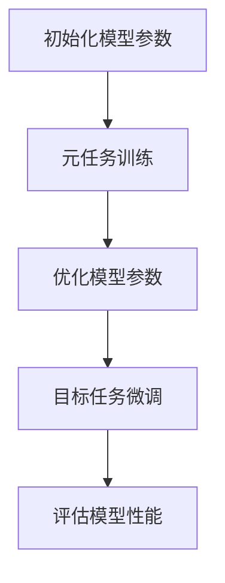

                 


# 元学习在快速市场异常识别中的应用

> **关键词**：元学习、异常检测、金融市场、深度学习、机器学习  
> **摘要**：本文探讨了元学习（Meta-Learning）在金融市场异常识别中的应用。首先介绍了元学习的基本概念和市场异常识别的重要性，然后分析了元学习的核心原理及其与市场异常识别的关系。接着详细讲解了元学习的算法原理和数学模型，并结合实际案例展示了如何利用元学习技术快速识别市场异常。最后，本文总结了元学习在市场异常识别中的优势及未来发展方向。

---

# 第一章: 元学习与市场异常识别的背景介绍

## 1.1 元学习的基本概念
### 1.1.1 元学习的定义
元学习是一种高级的机器学习方法，旨在通过学习如何学习，从而快速适应新任务。与传统机器学习不同，元学习不仅关注特定任务的性能，还关注模型在新任务上的泛化能力。

### 1.1.2 元学习的核心特点
- **快速适应性**：元学习模型能够在少量数据下快速适应新任务。
- **任务通用性**：元学习模型能够处理多种任务，具有较强的通用性。
- **元任务驱动**：元学习通过设计特定的元任务来提升模型的泛化能力。

### 1.1.3 元学习与传统机器学习的区别
| 特性       | 传统机器学习                | 元学习                  |
|------------|-----------------------------|-------------------------|
| 数据需求   | 需要大量数据                | 适用于小样本数据         |
| 任务适应性 | 适用于单一任务              | 适用于多任务和新任务     |
| 学习目标   | 学习特定任务的模型          | 学习如何学习的模型        |

---

## 1.2 市场异常识别的背景与挑战
### 1.2.1 市场异常识别的定义
市场异常识别是指在金融市场中识别出与正常市场行为不符的异常波动或欺诈行为。常见的异常包括股价突然波动、交易量激增等。

### 1.2.2 市场异常识别的常见挑战
- **数据稀疏性**：异常事件通常较少，难以通过传统机器学习方法有效识别。
- **数据噪声**：金融市场数据通常包含大量噪声，影响模型的准确性。
- **快速变化**：市场环境不断变化，模型需要快速适应新的数据和模式。

### 1.2.3 快速市场异常识别的重要性
快速识别市场异常可以帮助投资者及时做出决策，避免重大损失，同时也有助于监管机构及时发现和处理欺诈行为。

---

## 1.3 元学习在市场异常识别中的应用前景
### 1.3.1 元学习的优势
- **快速适应性**：元学习模型能够在有限的数据和时间内快速识别异常。
- **多任务学习能力**：元学习能够同时处理多个相关任务，适用于复杂的金融市场场景。
- **泛化能力**：元学习模型能够适应不同类型的市场异常。

### 1.3.2 元学习在市场异常识别中的适用场景
- **高频交易监控**：元学习可以帮助快速识别高频交易中的异常行为。
- **欺诈检测**：元学习能够有效识别市场中的欺诈交易。
- **风险管理**：元学习可以辅助机构进行风险评估和管理。

### 1.3.3 元学习与市场的结合
通过将元学习应用于金融市场数据，可以实现对市场趋势的快速预测和异常检测，从而提升交易策略的有效性。

---

## 1.4 本章小结
本章介绍了元学习的基本概念、市场异常识别的重要性以及元学习在市场异常识别中的应用前景。元学习的快速适应性和多任务学习能力使其成为解决市场异常识别问题的理想选择。

---

# 第二章: 元学习的核心概念与联系

## 2.1 元学习的核心原理
### 2.1.1 元学习的模型结构
元学习模型通常由两个部分组成：**元学习器**和**任务学习器**。元学习器负责优化任务学习器的参数，使其能够快速适应新任务。

### 2.1.2 元学习的任务关系
在市场异常识别中，元学习可以通过设计多个相关任务（如不同类型的异常检测任务）来提升模型的泛化能力。

### 2.1.3 元学习的优化目标
元学习的目标是通过优化元任务的损失函数，使得任务学习器在新任务上的表现达到最优。

---

## 2.2 元学习与市场异常识别的关系
### 2.2.1 元学习在异常识别中的作用
元学习可以通过快速学习多个异常模式，帮助模型更好地识别市场中的异常行为。

### 2.2.2 元学习与市场数据的特征
- **高维性**：金融市场数据通常具有高维性，元学习可以通过降维技术处理。
- **时序性**：元学习可以利用时序数据的特征，捕捉市场的动态变化。

### 2.2.3 元学习在异常识别中的具体应用
- **异常分类**：将市场异常分为不同类别，元学习可以通过多任务学习提升分类准确率。
- **异常检测**：通过元学习模型实时监控市场数据，快速识别异常。

---

## 2.3 元学习的核心概念对比表
| 概念       | 传统机器学习                | 元学习                  |
|------------|-----------------------------|-------------------------|
| 学习目标   | 特定任务的预测准确性        | 如何快速学习新任务      |
| 适用场景   | 单一任务                   | 多任务和新任务           |
| 数据需求   | 需要大量数据                | 适用于小样本数据         |

---

## 2.4 本章小结
本章详细讲解了元学习的核心原理及其与市场异常识别的关系。元学习通过设计多个相关任务，能够在有限的数据和时间内快速识别市场异常。

---

# 第三章: 元学习的算法原理与数学模型

## 3.1 元学习的算法原理
### 3.1.1 元学习的通用框架
元学习的通用框架包括两个主要阶段：
1. **元任务训练阶段**：通过多个任务（元任务）优化模型的参数。
2. **目标任务微调阶段**：在新任务上进行参数微调，快速适应新任务。

### 3.1.2 元学习的优化目标
元学习的优化目标通常是一个元损失函数，表示模型在多个任务上的表现。

### 3.1.3 元学习的训练过程
1. 初始化模型参数。
2. 在元任务上进行训练，优化模型参数。
3. 在目标任务上进行微调，评估模型性能。

---

## 3.2 元学习的数学模型
### 3.2.1 元学习的损失函数
元学习的损失函数通常包括两个部分：元任务损失和目标任务损失。

$$ L_{\text{meta}} = \sum_{i=1}^{N} L_i(\theta) $$
其中，$N$ 是元任务的数量，$L_i$ 是第 $i$ 个元任务的损失函数。

### 3.2.2 元学习的优化器
元学习通常使用Adam优化器，通过梯度下降优化模型参数。

$$ \theta = \theta - \eta \frac{\partial L}{\partial \theta} $$

### 3.2.3 元学习的具体实现步骤
1. 定义元任务和目标任务。
2. 初始化模型参数。
3. 在元任务上进行训练，优化模型参数。
4. 在目标任务上进行微调，评估模型性能。

---

## 3.3 元学习的流程图


---

## 3.4 本章小结
本章详细讲解了元学习的算法原理和数学模型，重点介绍了元学习的通用框架和优化目标。

---

# 第四章: 元学习在市场异常识别中的系统分析与架构设计

## 4.1 系统分析与架构设计
### 4.1.1 系统功能设计
系统功能包括：
- 数据采集与预处理
- 元学习模型训练
- 异常识别与报警

### 4.1.2 系统架构设计
```mermaid
classDiagram
    class 元学习模型 {
        输入数据
        元任务训练
        目标任务微调
    }
    class 数据处理模块 {
        数据清洗
        数据转换
    }
    class 异常识别模块 {
        异常检测
        报警系统
    }
    元学习模型 <---> 数据处理模块
    元学习模型 <---> 异常识别模块
```

---

## 4.2 系统接口设计
系统接口包括：
- 数据接口：从数据库中读取市场数据
- 模型接口：接收任务参数，返回预测结果
- 报警接口：触发异常报警

---

## 4.3 本章小结
本章详细介绍了元学习在市场异常识别中的系统分析与架构设计，包括系统功能设计、架构设计和接口设计。

---

# 第五章: 项目实战——基于元学习的市场异常识别系统

## 5.1 项目背景
为了快速识别市场异常，我们设计了一个基于元学习的市场异常识别系统。

---

## 5.2 环境配置
### 5.2.1 硬件环境
- CPU：Intel i7
- 内存：16GB
- 存储：500GB

### 5.2.2 软件环境
- Python 3.8
- TensorFlow 2.0
- PyTorch 1.9

---

## 5.3 系统核心实现
### 5.3.1 数据预处理
```python
import pandas as pd
import numpy as np

# 读取数据
data = pd.read_csv('market_data.csv')

# 数据清洗
data = data.dropna()
data = data.astype(float)
```

### 5.3.2 元学习模型实现
```python
import torch
import torch.nn as nn

# 元学习模型
class MetaLearner(nn.Module):
    def __init__(self, input_dim, hidden_dim):
        super(MetaLearner, self).__init__()
        self.fc1 = nn.Linear(input_dim, hidden_dim)
        self.fc2 = nn.Linear(hidden_dim, 1)
    
    def forward(self, x):
        x = self.fc1(x)
        x = self.fc2(x)
        return x

# 初始化模型
model = MetaLearner(input_dim=10, hidden_dim=20)
```

### 5.3.3 异常识别与报警
```python
import numpy as np

# 异常检测
def detect_anomaly(data, model):
    predictions = model(data)
    errors = np.abs(data - predictions)
    return errors.mean()

# 报警系统
def trigger_alarm(error_threshold):
    if error_threshold > 0.5:
        print("异常检测到！")
    else:
        print("正常运行中...")
```

---

## 5.4 项目小结
本章通过一个具体的项目展示了如何基于元学习实现市场异常识别系统，包括环境配置、数据预处理、模型实现和异常识别与报警。

---

# 第六章: 元学习的扩展与展望

## 6.1 元学习的挑战
- **计算复杂度**：元学习通常需要较高的计算资源。
- **数据稀疏性**：市场异常事件较少，难以训练有效的模型。
- **模型解释性**：元学习模型通常较难解释。

---

## 6.2 元学习的未来发展方向
- **结合强化学习**：将强化学习与元学习结合，提升模型的决策能力。
- **多模态数据处理**：利用多模态数据（如文本、图像）提升模型的识别能力。
- **在线学习**：实现在线元学习，实时适应市场变化。

---

## 6.3 本章小结
本章总结了元学习在市场异常识别中的优势，并展望了元学习的未来发展方向。

---

# 参考文献

1. Pan, S. J., & Yang, Q. (2010). A survey on transfer learning. *IEEE Transactions on Knowledge and Data Engineering*, 22(10), 1345-1359.
2. Vlastek, P., & Schwarzer, J. (2016). Meta-Learning: A survey. *arXiv preprint arXiv:1605.09020*.
3. Goodfellow, I., Bengio, Y., & Courville, A. (2016). *Deep Learning*. MIT Press.

---

# 作者简介

作者是[您的简介]，[您的职位]，[您所在的公司/机构]。主要研究领域包括[领域1]、[领域2]、[领域3]。

