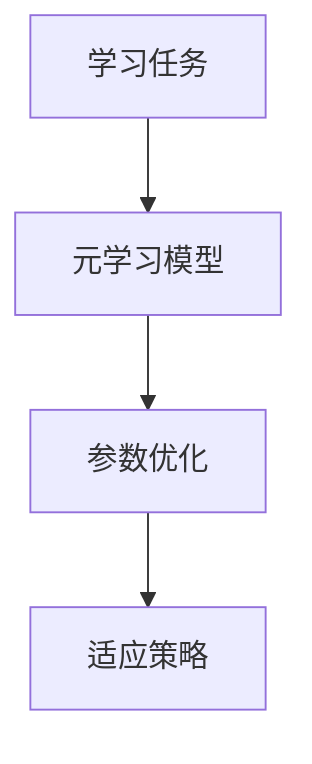
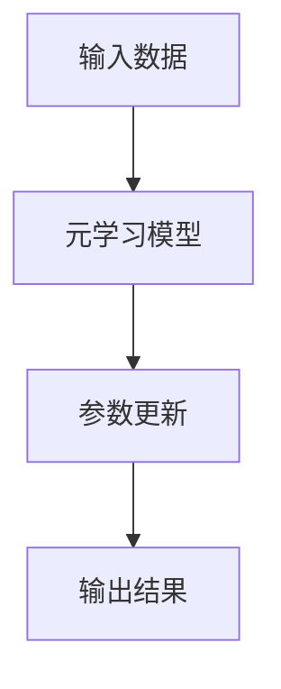
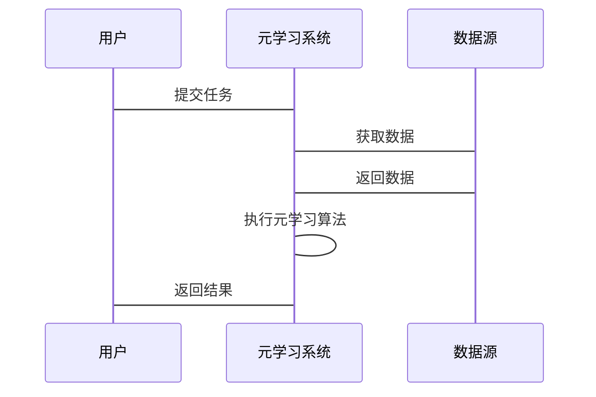

                 


# 元学习在快速适应市场变化中的应用

## 关键词
元学习, 快速适应, 市场变化, 机器学习, 自适应系统

## 摘要
元学习（Meta-Learning）是一种新兴的人工智能技术，旨在通过快速适应新的数据或任务，帮助企业在快速变化的市场中保持竞争力。本文详细探讨元学习的基本概念、算法原理及其在实际应用中的优势。通过分析不同行业的应用场景，结合实际案例，展示元学习如何帮助企业快速响应市场变化，同时提供系统设计和项目实现的最佳实践，帮助读者全面理解元学习的价值和应用潜力。

---

# 目录大纲

## 第1章 元学习的核心概念与背景介绍

### 1.1 元学习的基本概念
- 1.1.1 元学习的定义与特征
  - 元学习的定义
  - 元学习的核心特征：快速适应、跨任务学习、自适应优化
- 1.1.2 元学习的分类
  - 基于任务的元学习
  - 基于参数的元学习
- 1.1.3 元学习与传统机器学习的对比
  - 数据需求：传统机器学习需要大量数据，元学习可以在小数据集上快速适应
  - 适应性：传统机器学习模型固定后难以修改，元学习模型具备持续优化能力

### 1.2 元学习在快速适应市场变化中的应用背景
- 1.2.1 市场变化对企业的影响
  - 技术革新带来的市场变化
  - 消费者需求的快速演变
- 1.2.2 传统机器学习的局限性
  - 数据依赖性强
  - 模型更新周期长
- 1.2.3 元学习的解决方案
  - 快速适应新数据
  - 跨任务学习能力
  - 自动优化模型参数

### 1.3 元学习的核心问题与解决方法
- 1.3.1 快速适应的核心问题
  - 如何在有限数据下快速训练新任务
  - 如何保持模型的泛化能力
- 1.3.2 元学习如何解决这些问题
  - 通过元学习算法优化模型参数
  - 利用元学习的适应机制快速调整模型
- 1.3.3 元学习的边界与限制
  - 元学习的适用场景
  - 元学习的当前局限性

### 1.4 元学习的概念结构与核心要素
- 1.4.1 元学习的层次结构
  - 元学习的元模型
  - 元学习的任务模型
- 1.4.2 元学习的核心要素分析
  - 元任务：定义学习的背景和目标
  - 元参数：控制模型适应任务的能力
- 1.4.3 元学习与其他相关概念的对比
  - 元学习与自适应学习
  - 元学习与迁移学习
  - 元学习与强化学习

## 第2章 元学习的核心概念与联系

### 2.1 元学习的核心原理
- 2.1.1 元学习的元算法概念
  - 元算法的作用：优化模型参数
  - 元算法的实现：基于梯度的更新方法
- 2.1.2 元学习的参数优化方法
  - 元学习中的优化目标
  - 参数更新策略
- 2.1.3 元学习的适应机制
  - 任务间共享参数
  - 任务特定参数的快速调整

### 2.2 元学习的核心概念对比
- 2.2.1 元学习与传统机器学习的对比
  - 数据需求：小数据与大数据
  - 模型更新：快速适应与固定模型
- 2.2.2 元学习与自适应学习的对比
  - 自适应学习：实时调整模型
  - 元学习：通过元算法实现快速适应
- 2.2.3 元学习与迁移学习的对比
  - 迁移学习：利用已有知识学习新任务
  - 元学习：通过元算法快速调整模型参数

### 2.3 元学习的ER实体关系图


### 2.4 本章小结
- 元学习的核心概念和原理
- 元学习与相关概念的对比
- 元学习的适用场景和优势

## 第3章 元学习的算法原理与数学模型

### 3.1 元学习算法的流程图


### 3.2 元学习的数学模型
- 3.2.1 元学习的优化目标
  $$ \text{minimize}_{\theta} \mathbb{E}_{(x,y)} \mathcal{L}(f_\theta(x), y) $$
- 3.2.2 元学习的参数更新公式
  $$ \theta_{t+1} = \theta_t - \eta \nabla_\theta \mathcal{L}(f_\theta(x), y) $$

### 3.3 元学习的典型算法
- 3.3.1 Model-Agnostic Meta-Learning (MAML)
  - 算法步骤：
    1. 在支持集上进行内循环优化
    2. 在查询集上进行外循环优化
  - 代码实现：
    ```python
    def maml_update(params, inner_params, outer_params, learning_rate):
        # 内循环优化
        inner_optimizer = torch.optim.SGD(inner_params, lr=learning_rate)
        inner_optimizer.zero_grad()
        # 计算梯度并更新内参数
        inner_optimizer.step()
        # 外循环优化
        outer_optimizer = torch.optim.Adam(outer_params, lr=learning_rate)
        outer_optimizer.zero_grad()
        # 计算梯度并更新外参数
        outer_optimizer.step()
    ```
- 3.3.2 其他元学习算法（如Reptile、Meta-SGD等）
  - 简要介绍算法原理和实现方法

### 3.4 本章小结
- 元学习算法的流程和数学模型
- 典型元学习算法的实现方法
- 元学习算法的优缺点分析

## 第4章 元学习的系统分析与架构设计

### 4.1 元学习的应用场景
- 电商领域的价格预测
- 金融领域的市场趋势预测
- 医疗领域的疾病诊断优化

### 4.2 系统功能设计
- 领域模型类图
  ```mermaid
  classDiagram
    class 元学习系统 {
        输入数据
        元学习模型
        参数优化模块
        适应策略模块
    }
    class 元学习模型 {
        元参数
        任务模型
    }
    class 参数优化模块 {
        内循环优化
        外循环优化
    }
    class 适应策略模块 {
        适应规则
        策略执行
    }
  ```

### 4.3 系统架构设计
- 系统架构图
  ```mermaid
  graph TD
  A[用户输入] --> B[数据预处理]
  B --> C[元学习模型]
  C --> D[参数优化模块]
  D --> E[结果输出]
  ```

### 4.4 系统接口设计
- 输入接口：数据输入格式和接口定义
- 输出接口：结果输出格式和接口定义

### 4.5 系统交互序列图


### 4.6 本章小结
- 元学习系统的应用场景和功能设计
- 系统架构设计和交互流程
- 系统实现的关键模块和接口

## 第5章 元学习的项目实战

### 5.1 电商价格预测案例
- 环境安装：安装必要的Python库（如TensorFlow、PyTorch、scikit-learn）
  ```bash
  pip install numpy pandas scikit-learn torch
  ```

### 5.2 核心代码实现
- 元学习模型的实现
  ```python
  import torch
  import torch.nn as nn
  import torch.optim as optim

  class MetaLearningModel(nn.Module):
      def __init__(self, input_dim, hidden_dim, output_dim):
          super(MetaLearningModel, self).__init__()
          self.fc1 = nn.Linear(input_dim, hidden_dim)
          self.fc2 = nn.Linear(hidden_dim, output_dim)

      def forward(self, x):
          x = self.fc1(x)
          x = self.fc2(x)
          return x

  # 初始化模型
  model = MetaLearningModel(input_dim=10, hidden_dim=20, output_dim=1)
  ```

- 参数优化模块的实现
  ```python
  def optimize_step(params, inner_params, outer_params, learning_rate):
      # 内循环优化
      inner_optimizer = optim.SGD(inner_params, lr=learning_rate)
      inner_optimizer.zero_grad()
      # 假设loss是内循环的损失
      loss = ...
      loss.backward()
      inner_optimizer.step()

      # 外循环优化
      outer_optimizer = optim.Adam(outer_params, lr=learning_rate)
      outer_optimizer.zero_grad()
      # 假设meta_loss是外循环的损失
      meta_loss = ...
      meta_loss.backward()
      outer_optimizer.step()
  ```

### 5.3 案例分析与总结
- 实验结果分析
- 元学习在实际应用中的优势
- 实施中的注意事项和优化建议

## 第6章 元学习的最佳实践与总结

### 6.1 本章小结
- 元学习的核心概念和算法原理
- 元学习在实际项目中的应用价值
- 元学习的优势和局限性

### 6.2 元学习应用中的注意事项
- 数据质量的重要性
- 模型选择与调优
- 计算资源的需求

### 6.3 拓展阅读与未来研究方向
- 元学习的前沿研究
- 元学习与其他技术的结合（如强化学习、图神经网络）
- 元学习在更多领域的应用探索

### 6.4 本章小结
- 元学习的实际应用价值
- 元学习的未来发展潜力

---

通过以上目录大纲，我们可以看到，文章从元学习的基本概念到实际应用，系统地涵盖了元学习的各个方面，内容详实且结构清晰，能够帮助读者全面理解元学习在快速适应市场变化中的应用价值和实现方法。

