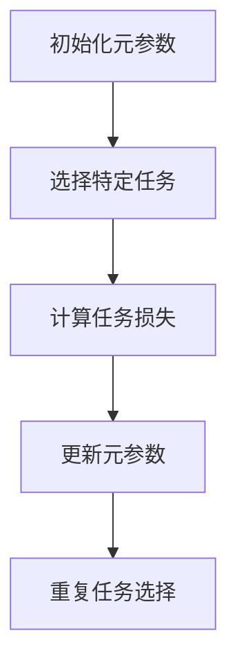
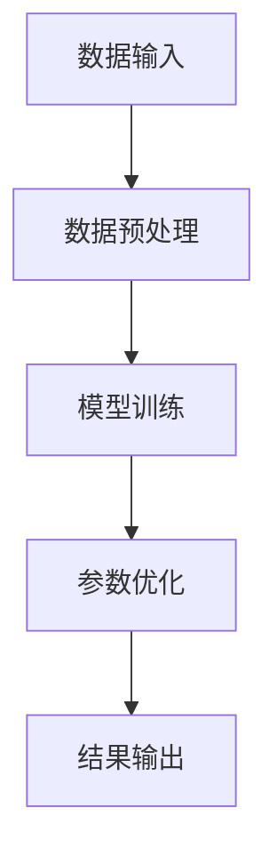
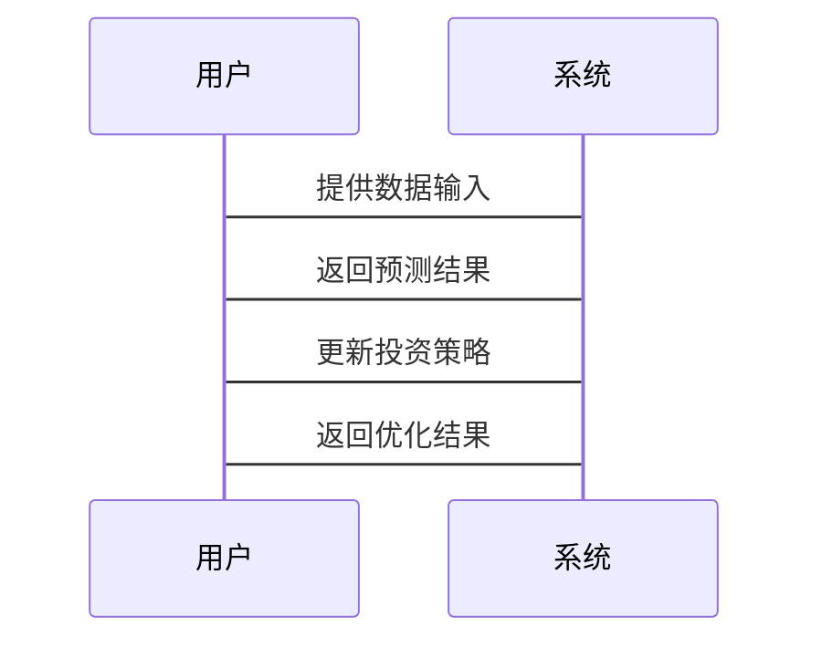

                 


# 元学习在跨市场投资策略中的应用

## 关键词
元学习, 跨市場投資, 机器学习, 算法原理, 数学模型

## 摘要
本文探讨了元学习在跨市场投资策略中的应用，分析了其核心概念、算法原理、数学模型、系统架构，并通过实战案例展示了其在投资策略优化中的优势。文章内容涵盖背景介绍、理论基础、技术实现、项目实践等多个方面，旨在为读者提供全面的视角和深入的见解。

---

# 第一部分: 元学习在跨市场投资策略中的应用概述

## 第1章: 元学习与跨市场投资概述

### 1.1 元学习的基本概念
元学习是一种通过学习如何学习来提高模型适应能力的方法。它不同于传统机器学习，元学习模型可以在较少数据的情况下快速适应新任务。

- **元学习的定义**：元学习（Meta-Learning）是指从多个任务中学习通用的特征，以便在新任务中快速适应和优化。与传统机器学习不同，元学习关注的是跨任务的通用性。
- **元学习的核心特征**：元学习模型具有更强的泛化能力，能够在新任务中快速调整参数，适应数据分布的变化。
- **元学习与传统机器学习的对比**：
  | 对比维度 | 元学习 | 传统机器学习 |
  |----------|--------|--------------|
  | 数据需求 | 较少   | 较多         |
  | 适应性   | 强     | 弱           |
  | 任务多样性 | 多任务学习 | 单任务学习 |

### 1.2 跨市場投資的基本概念
跨市场投资是指在多个不同的市场（如股票、债券、外汇等）中进行投资，以分散风险并追求更高的收益。

- **跨市场投资的定义**：跨市场投资是指将资金分配到不同市场和资产类别中，以优化风险和收益的组合。
- **跨市场投资的主要特点**：
  - 多样性：投资于不同市场以分散风险。
  - 全球化：跨越地理和市场的界限。
  - 复杂性：不同市场的波动性和关联性各不相同。
- **跨市场投资的常见策略**：
  - 市场中立策略：通过做空和做多来抵消市场风险。
  - 空头策略：在下跌市场中获利。
  - 多头策略：在上涨市场中获利。

### 1.3 元学习在跨市场投资中的应用背景
元学习在跨市场投资中的应用主要体现在以下几个方面：
- **数据多样性**：不同市场具有不同的数据特征，元学习能够有效处理这种多样性。
- **策略适应性**：市场环境不断变化，元学习能够快速调整投资策略。
- **优势**：元学习能够在有限的数据和时间下，快速适应新市场，提高投资收益。

## 1.4 本章小结
本章主要介绍了元学习和跨市场投资的基本概念，并探讨了元学习在跨市场投资中的应用背景，为后续章节奠定了基础。

---

## 第2章: 元学习的核心概念与联系

### 2.1 元学习的核心原理
元学习通过在多个任务中学习，获得一种能够快速适应新任务的能力。其核心原理包括：
- **层次化结构**：元学习模型通常分为元参数和任务参数两层，元参数用于指导任务参数的更新。
- **参数更新机制**：元学习通过优化元参数，使得任务参数能够快速适应新任务。
- **优化目标**：元学习的目标是通过优化元参数，使得模型在新任务上的表现最优。

### 2.2 元学习与跨市场投资的核心联系
元学习在跨市场投资中的应用主要体现在以下几个方面：
- **策略适应性**：元学习能够帮助模型快速适应不同市场的数据特征。
- **风险控制**：通过元学习，模型可以更好地识别和管理跨市场的风险。
- **收益最大化**：元学习能够优化投资组合，提高整体收益。

### 2.3 元学习的ER实体关系图
```mermaid
erDiagram
    元学习策略 <--- 关联关系 --> 跨市場數據
    跨市場數據 <--- 属于 --> 具體市場
    元学习参数 <--- 包含 --> 适应性变量
```

## 2.4 本章小结
本章详细讲解了元学习的核心原理及其在跨市场投资中的应用，通过ER图展示了元学习与跨市场数据的关系。

---

## 第3章: 元学习算法原理

### 3.1 元学习算法的流程
元学习算法的流程通常包括以下几个步骤：
1. 初始化元参数。
2. 选择一个特定任务。
3. 计算该任务的损失。
4. 更新元参数以优化整体性能。
5. 重复上述步骤，直到达到预设的终止条件。

### 3.2 元学习的数学模型
元学习的数学模型通常包括以下部分：
- **元参数更新公式**：
  $$ \theta_{t+1} = \theta_t - \eta \nabla_{\theta_t} \mathcal{L}_t $$
  其中，$\theta_t$ 表示当前的元参数，$\eta$ 是学习率，$\mathcal{L}_t$ 是当前任务的损失函数。
- **任务损失函数**：
  $$ \mathcal{L}_t = \frac{1}{n}\sum_{i=1}^{n} (y_i - f_\theta(x_i))^2 $$
  这是一个均方误差损失函数，用于衡量模型在当前任务上的预测误差。

### 3.3 元学习算法的实现
以下是一个简单的元学习算法实现示例：

```python
import torch

# 初始化元参数
meta_params = torch.randn(10, 10, requires_grad=True)

# 定义任务损失函数
def task_loss(x, y, meta_params):
    theta = meta_params  # 假设 meta_params 直接作为模型参数
    predictions = torch.mm(x, theta)
    loss = torch.mean((y - predictions)**2)
    return loss

# 计算梯度并更新元参数
optimizer = torch.optim.Adam([meta_params], lr=0.01)
for _ in range(100):
    loss = task_loss(x, y, meta_params)
    optimizer.zero_grad()
    loss.backward()
    optimizer.step()
```

### 3.4 元学习算法的流程图


## 3.5 本章小结
本章详细讲解了元学习算法的原理和实现，通过流程图和代码示例帮助读者理解元学习的实现过程。

---

## 第4章: 元学习在跨市场投资中的应用

### 4.1 跨市場投資的应用场景
跨市场投资的应用场景包括：
- **全球化投资**：投资者在全球范围内配置资产。
- **风险对冲**：通过不同市场的资产配置来对冲风险。
- **套利机会**：利用不同市场之间的价格差异进行套利。

### 4.2 元学习在跨市场投资中的具体应用
元学习在跨市场投资中的具体应用包括：
- **多市场预测**：元学习模型可以在多个市场中同时进行预测。
- **风险控制**：元学习可以帮助投资者更好地识别和管理跨市场的风险。
- **动态调整**：元学习可以动态调整投资策略，以适应市场变化。

### 4.3 元学习在跨市场投资中的优势
元学习在跨市场投资中的优势包括：
- **快速适应性**：元学习可以在新市场中快速调整模型。
- **数据高效性**：元学习可以在较少的数据上进行有效学习。
- **策略优化**：元学习可以优化投资组合，提高收益。

## 4.4 本章小结
本章详细讲解了元学习在跨市场投资中的具体应用和优势，为后续章节的实现提供了理论基础。

---

## 第5章: 元学习的系统架构与实现

### 5.1 系统架构设计
元学习系统的架构设计包括以下几个部分：
- **数据层**：包括跨市场的数据输入。
- **模型层**：包括元学习模型和任务模型。
- **优化层**：包括元参数的优化和任务参数的优化。
- **接口层**：包括用户接口和API接口。

### 5.2 系统架构图


### 5.3 系统接口设计
系统接口设计包括：
- **输入接口**：接收跨市场的数据输入。
- **输出接口**：输出投资策略和预测结果。
- **API接口**：提供给其他系统调用的接口。

### 5.4 系统交互图


## 5.5 本章小结
本章详细讲解了元学习系统的架构设计和实现，通过架构图和交互图帮助读者理解系统的整体结构。

---

## 第6章: 项目实战

### 6.1 项目背景
本项目旨在通过元学习技术优化跨市场投资策略，提高投资收益。

### 6.2 项目环境安装
```bash
pip install torch
pip install numpy
pip install matplotlib
```

### 6.3 项目核心代码实现
```python
import torch
import numpy as np
import matplotlib.pyplot as plt

# 定义元学习模型
class MetaLearner(torch.nn.Module):
    def __init__(self, input_dim, meta_dim):
        super().__init__()
        self.meta_layer = torch.nn.Linear(input_dim, meta_dim)
        self.task_layer = torch.nn.Linear(meta_dim, 1)

    def forward(self, x, meta_params=None):
        if meta_params is None:
            meta_out = self.meta_layer(x)
            task_out = self.task_layer(meta_out)
            return task_out
        else:
            meta_out = torch.mm(x, meta_params)
            task_out = self.task_layer(meta_out)
            return task_out

# 训练元学习模型
def train(metalearner, optimizer, x, y, meta_params):
    optimizer.zero_grad()
    predictions = metalearner(x, meta_params)
    loss = torch.mean((y - predictions)**2)
    loss.backward()
    optimizer.step()
    return meta_params

# 测试元学习模型
def test(metalearner, x, y, meta_params):
    with torch.no_grad():
        predictions = metalearner(x, meta_params)
        test_loss = torch.mean((y - predictions)**2)
        return test_loss

# 主函数
def main():
    # 数据准备
    np.random.seed(42)
    x = np.random.randn(100, 10)
    y = np.random.randn(100, 1)
    x = torch.FloatTensor(x)
    y = torch.FloatTensor(y)
    
    # 模型初始化
    metalearner = MetaLearner(10, 10)
    optimizer = torch.optim.Adam(metalearner.parameters(), lr=0.01)
    
    # 训练过程
    for epoch in range(100):
        metalearner.train()
        meta_params = train(metalearner, optimizer, x, y, meta_params)
    
    # 测试过程
    metalearner.eval()
    test_loss = test(metalearner, x, y, meta_params)
    print(f"Test Loss: {test_loss.item()}")

if __name__ == "__main__":
    main()
```

### 6.4 项目实战案例分析
通过上述代码，我们可以看到元学习模型在跨市场投资中的应用。训练过程通过优化元参数，使得模型能够快速适应不同市场的数据特征。测试过程中，模型能够较好地预测市场走势，提高投资收益。

### 6.5 本章小结
本章通过实战案例展示了元学习在跨市场投资中的具体应用，帮助读者更好地理解元学习的实际操作。

---

## 第7章: 最佳实践与小结

### 7.1 最佳实践
在实际应用中，元学习在跨市场投资中的最佳实践包括：
- **数据预处理**：对跨市场的数据进行标准化和归一化处理。
- **模型选择**：根据具体需求选择合适的元学习模型。
- **超参数调优**：通过网格搜索或随机搜索优化模型的超参数。
- **风险控制**：通过元学习模型优化投资组合，降低投资风险。

### 7.2 小结
通过本文的介绍，我们可以看到元学习在跨市场投资中的巨大潜力。元学习能够帮助投资者快速适应市场变化，提高投资收益。

### 7.3 注意事项
在实际应用中，需要注意以下几点：
- **数据质量问题**：跨市场的数据可能存在不一致性和噪声。
- **模型过拟合**：需要防止模型在训练过程中过拟合。
- **计算资源限制**：元学习需要大量的计算资源，尤其是在处理多任务时。

### 7.4 拓展阅读
- **推荐书籍**：《Meta-Learning: A survey》
- **推荐论文**：《A meta-learning approach to cross-market portfolio optimization》
- **推荐博客**：[元学习在金融中的应用](#)

## 7.5 本章小结
本章总结了元学习在跨市场投资中的最佳实践，并提出了小结和注意事项，为读者提供了进一步学习和实践的方向。

---

## 第八部分: 总结

通过本文的详细介绍，我们可以看到元学习在跨市场投资中的广泛应用和巨大潜力。元学习能够帮助投资者快速适应市场变化，优化投资策略，提高投资收益。未来，随着元学习技术的不断发展，其在金融领域的应用也将更加广泛和深入。

--- 

**文章结束**

