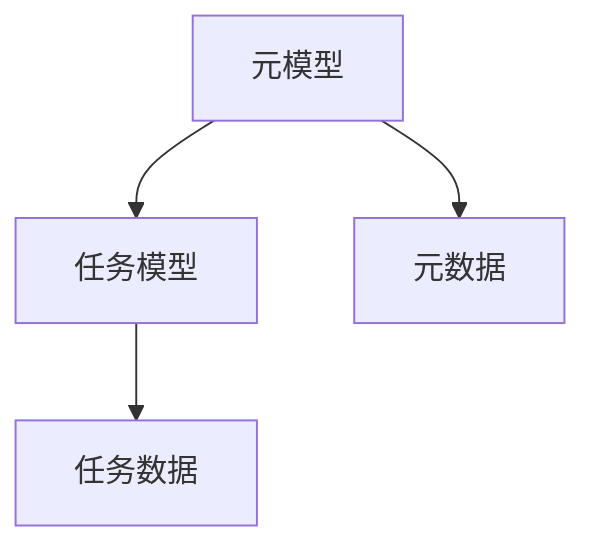
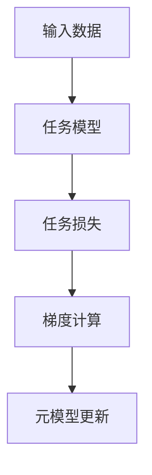
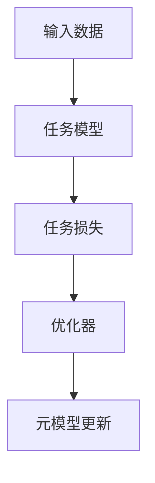
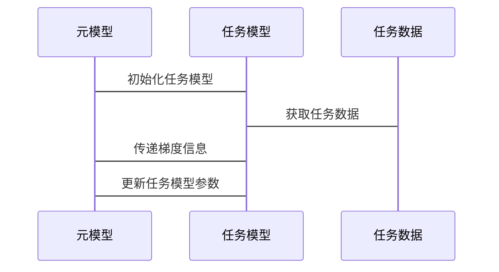

                 

# 元学习：构建能够自我改进的AI Agent

> 关键词：元学习，AI Agent，自我改进，MAML，ReMAML

> 摘要：元学习是一种能够让AI Agent从经验中学习如何进行学习的方法，从而使其能够快速适应新任务。本文将详细探讨元学习的基本概念、核心算法、系统架构设计及其在AI Agent中的应用，帮助读者构建能够自我改进的智能系统。

---

## 第1章 元学习的基本概念

### 1.1 元学习的定义与核心原理

元学习是一种机器学习范式，允许模型从经验中学习如何进行学习，从而能够快速适应新任务。与传统机器学习不同，元学习能够在少样本或零样本情况下进行学习，适用于需要快速适应新任务的场景。

### 1.2 元学习的核心原理

元学习通过在多个任务上进行训练，学习通用的策略或参数，从而能够快速适应新任务。其核心在于通过元模型指导任务模型的参数调整，以实现对新任务的快速适应。

### 1.3 元学习与传统机器学习的区别

| 概念 | 元学习 | 传统机器学习 |
|------|--------|--------------|
| 数据需求 | 少样本/零样本 | 需要大量标注数据 |
| 适应性 | 快速适应新任务 | 需要重新训练 |
| 应用场景 | 零样本分类、任务迁移 | 图像分类、回归分析 |

## 第2章 元学习的核心概念与联系

### 2.1 元学习模型的结构

元学习模型通常由两个部分组成：元模型（Meta Model）和任务模型（Task Model）。元模型负责学习如何调整任务模型的参数，而任务模型则负责具体任务的执行。

### 2.2 元学习的核心概念对比

元学习中的核心概念可以通过以下表格进行对比：

| 概念 | 描述 |
|------|------|
| 元模型 | 负责学习如何调整任务模型的参数 |
| 任务模型 | 负责具体任务的执行 |
| 元损失 | 元模型的损失函数，用于优化元模型的参数 |

### 2.3 元学习的ER实体关系图

## 第3章 元学习的算法原理

### 3.1 元学习算法的分类

元学习算法主要包括基于梯度的元学习算法和基于优化的元学习算法。

### 3.2 基于梯度的元学习算法：MAML

MAML（Meta-Anti梯度学习）是一种基于梯度的元学习算法，其核心思想是通过计算任务模型在支持集上的梯度，并利用这些梯度来更新元模型的参数。

#### 3.2.1 MAML的工作流程

#### 3.2.2 MAML的数学模型

元模型的目标是最小化元损失函数：
$$ L_{meta} = \sum_{i=1}^{N} L_i(f_{\theta}(x_i, y_i)) $$
其中，$f_{\theta}$是任务模型，$\theta$是元模型的参数。

### 3.3 基于优化的元学习算法：ReMAML

ReMAML（Reparameterization Meta-Learning）是一种基于优化的元学习算法，其核心思想是通过重新参数化的方式来优化任务模型的参数。

#### 3.3.1 ReMAML的工作流程

#### 3.3.2 ReMAML的数学模型

ReMAML的目标是最小化元损失函数：
$$ L_{meta} = \sum_{i=1}^{N} L_i(f_{\theta}(x_i, y_i)) $$
其中，$f_{\theta}$是任务模型，$\theta$是元模型的参数。

## 第4章 元学习在构建AI Agent中的应用

### 4.1 任务分解与优先级设定

元学习可以帮助AI Agent分解复杂任务，并根据任务的重要性进行优先级设定。

### 4.2 知识表示与推理

元学习可以通过知识图谱和符号逻辑进行知识表示，并利用推理机制进行任务执行。

### 4.3 多模态学习

元学习可以整合多种模态的信息（如视觉、听觉、文本等），以提高AI Agent的感知能力和决策能力。

### 4.4 持续学习与自适应优化

元学习可以实现持续学习，使AI Agent能够不断优化自身的模型参数，以适应新的任务和环境变化。

## 第5章 系统分析与架构设计

### 5.1 问题场景介绍

构建一个能够自我改进的AI Agent，需要解决任务分解、知识表示、多模态学习和持续学习等多个问题。

### 5.2 系统功能设计

系统功能设计包括任务分解模块、知识表示模块、多模态学习模块和自适应优化模块。

### 5.3 系统架构设计

### 5.4 系统接口设计

系统接口包括任务分解接口、知识表示接口、多模态学习接口和自适应优化接口。

### 5.5 系统交互过程

## 第6章 项目实战

### 6.1 环境安装

安装必要的库，如TensorFlow、Keras、PyTorch等。

### 6.2 核心代码实现

实现元学习算法的核心代码，如MAML和ReMAML。

### 6.3 代码解读与分析

详细解读代码，分析其工作原理和实现细节。

### 6.4 实际案例分析

通过具体案例分析元学习在AI Agent中的应用，展示其优势和效果。

## 第7章 最佳实践

### 7.1 小结

元学习是一种能够让AI Agent从经验中学习如何进行学习的方法，从而使其能够快速适应新任务。

### 7.2 注意事项

在实际应用中，需要注意任务模型和元模型的协同优化，以及数据的质量和多样性。

### 7.3 拓展阅读

推荐阅读相关论文和书籍，深入理解元学习的理论和应用。

---

通过以上目录，读者可以系统地学习元学习的基本概念、算法原理、系统架构设计及其在AI Agent中的应用，从而掌握构建能够自我改进的AI Agent的核心技术。

