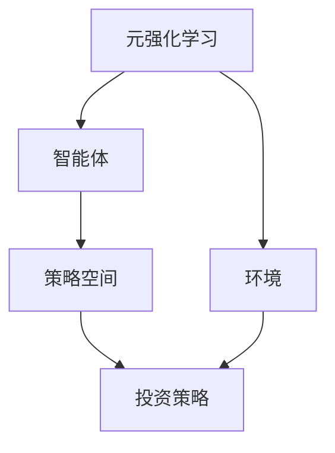
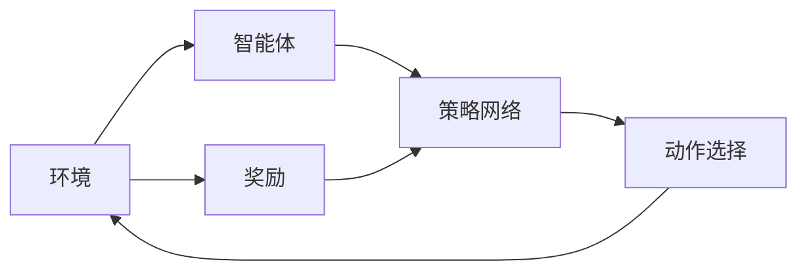
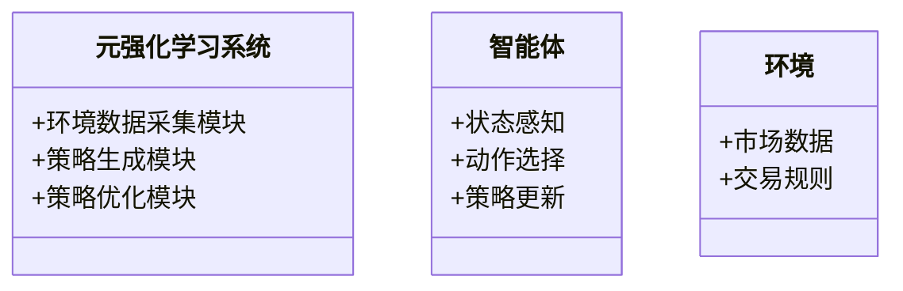

                 


# 元强化学习在投资策略快速迭代中的应用

## 关键词
元强化学习, 投资策略, 快速迭代, 强化学习, 自适应策略, 多智能体协作, 金融建模

## 摘要
本文探讨了元强化学习（Meta-Reinforcement Learning）在投资策略快速迭代中的应用。通过分析元强化学习的核心概念、算法原理以及系统架构，结合实际案例和项目实战，展示了如何利用元强化学习技术实现投资策略的高效优化与快速迭代。文章还提供了详细的数学模型、代码实现和系统设计，帮助读者深入理解并应用这一前沿技术。

---

# 第一部分: 元强化学习与投资策略的背景

## 第1章: 元强化学习的基本概念

### 1.1 强化学习的基本原理
强化学习是一种机器学习范式，通过智能体与环境的交互，学习最优策略以最大化累计奖励。智能体通过试错过程，逐步逼近最优决策路径。

### 1.2 元强化学习的核心概念
元强化学习是在强化学习的基础上，引入元学习机制，使智能体能够快速适应新任务。其核心在于通过元学习，提升策略生成与优化的速度与效率。

### 1.3 元强化学习与传统强化学习的区别
| 特性 | 传统强化学习 | 元强化学习 |
|------|--------------|------------|
| 环境复杂度 | 单一任务 | 多任务、动态变化 |
| 策略更新 | 慢 | 快速、高效 |

---

## 第2章: 投资策略的背景与挑战

### 2.1 投资策略的基本概念
投资策略是指导投资决策的一套规则或模型，旨在通过优化资产配置和交易时机，实现收益最大化。

### 2.2 传统投资策略的局限性
传统策略依赖历史数据，难以快速适应市场变化，且策略优化过程耗时较长。

### 2.3 快速迭代投资策略的需求
快速迭代要求投资策略能够实时调整，适应市场波动，提升收益并降低风险。

---

## 第3章: 元强化学习在投资中的应用背景

### 3.1 元强化学习在投资中的优势
通过数据驱动的决策和自适应策略生成，元强化学习能够显著提升投资策略的优化速度与效率。

### 3.2 核心概念的联系
通过实体关系图，展示了元强化学习、智能体、策略空间和环境之间的关系。



---

# 第二部分: 元强化学习的算法原理

## 第4章: 元强化学习的算法原理

### 4.1 元强化学习的核心算法
Q-learning和DQN算法是元强化学习的重要组成部分，通过数学公式和流程图展示其工作原理。

#### Q-learning算法公式
$$ Q(s, a) = Q(s, a) + \alpha (r + \gamma \max Q(s', a') - Q(s, a)) $$

#### DQN算法流程图


### 4.2 元强化学习的数学模型
通过详细讲解数学公式，展示元强化学习的内在机制。

---

# 第三部分: 系统架构与设计

## 第5章: 系统架构设计

### 5.1 项目介绍
构建一个基于元强化学习的投资策略优化系统，旨在实现策略的快速迭代与优化。

### 5.2 系统功能设计
通过类图展示系统各模块之间的关系。



### 5.3 系统架构设计
通过架构图展示系统的整体设计。


---

# 第四部分: 项目实战

## 第6章: 项目实战

### 6.1 环境安装
安装必要的库和工具，如Python、TensorFlow等。

### 6.2 系统核心实现源代码
提供关键代码片段，展示如何实现元强化学习算法。

```python
class MetaRLAgent:
    def __init__(self, state_space, action_space):
        self.state_space = state_space
        self.action_space = action_space
        # 初始化策略网络和目标网络
        self.policy_network = ...
        self.target_network = ...
    
    def act(self, state):
        # 选择动作
        pass
    
    def update(self, experience):
        # 更新策略网络
        pass
```

### 6.3 代码应用解读
详细解读代码实现，展示如何将理论应用于实践。

---

# 第五部分: 最佳实践与小结

## 第7章: 最佳实践

### 7.1 实践中的注意事项
强调数据质量、模型调参和系统优化的重要性。

### 7.2 未来研究方向
探讨元强化学习在投资中的进一步应用，如多智能体协作和实时策略优化。

---

## 第8章: 小结

元强化学习为投资策略的快速迭代提供了新的思路，通过本文的深入分析与实践，读者可以更好地理解和应用这一技术，提升投资决策的效率与效果。

---

以上是文章的完整目录和部分内容展示，希望对您有所帮助！如果需要进一步扩展或补充，请随时告诉我。

