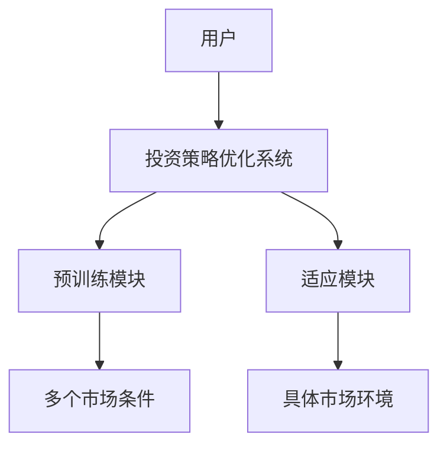
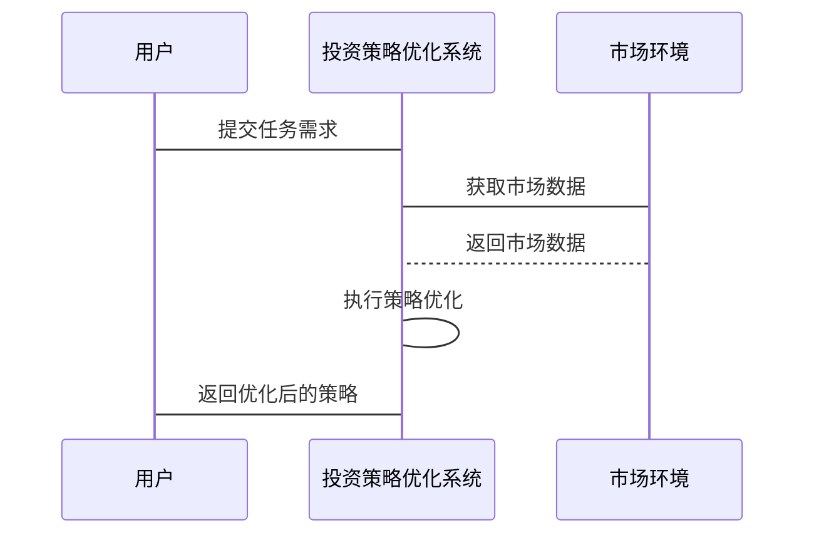

                 


# 元强化学习在投资策略适应性优化中的应用

> 关键词：元强化学习、投资策略、策略优化、强化学习、适应性优化

> 摘要：本文探讨了元强化学习（Meta-Reinforcement Learning）在投资策略适应性优化中的应用。通过分析元强化学习的核心概念、算法原理及其在投资策略优化中的应用，本文旨在展示如何利用元强化学习提升投资策略的适应性和绩效。文章内容包括背景介绍、核心概念与联系、算法原理、系统架构设计、项目实战等部分。

---

## 第一章：元强化学习与投资策略优化的背景介绍

### 1.1 元强化学习的定义与特点

#### 1.1.1 元强化学习的基本概念
元强化学习（Meta-Reinforcement Learning，Meta-RL）是一种结合了元学习（Meta-Learning）和强化学习（Reinforcement Learning，RL）的新兴技术。元学习的目标是通过在多个任务上进行学习，使得模型能够快速适应新任务。而强化学习则是通过与环境交互，学习最优策略以最大化累积奖励。元强化学习的结合使得模型能够在多个相关任务之间共享知识，从而在新任务中更快地找到最优策略。

#### 1.1.2 元强化学习的核心特点
- **任务多样性**：元强化学习适用于多个相关任务的场景，能够在不同任务之间共享知识。
- **快速适应性**：通过元学习的机制，模型可以在新任务上线后快速适应，无需从头开始学习。
- **高效性**：元强化学习通过共享任务间的信息，减少了每个任务单独学习所需的时间和计算资源。

#### 1.1.3 元强化学习与传统强化学习的区别
传统的强化学习专注于单个任务，通过与环境的交互不断优化策略。而元强化学习则强调在多个任务之间共享知识，使得模型能够更快地适应新任务。这种区别使得元强化学习在需要处理多个相关任务的场景中更具优势。

### 1.2 投资策略适应性优化的背景

#### 1.2.1 投资策略优化的必要性
投资策略的优化是金融领域的重要任务。随着市场环境的不断变化，传统的静态投资策略往往难以适应新的市场条件。例如，经济波动、政策变化等因素都会对投资策略的有效性产生影响。因此，如何让投资策略具备更强的适应性，成为投资者和研究人员关注的重点。

#### 1.2.2 传统投资策略优化的局限性
- **静态性**：传统的投资策略通常基于固定的模型或规则，难以适应市场的动态变化。
- **手动调整**：当市场环境发生变化时，通常需要手动调整策略，效率较低。
- **计算成本**：对于复杂的投资策略，优化过程可能需要大量的计算资源和时间。

#### 1.2.3 元强化学习在投资策略优化中的优势
- **自动化适应性**：元强化学习能够在不同市场条件下自动调整策略，无需手动干预。
- **高效性**：通过共享多个任务的知识，元强化学习可以快速适应新环境。
- **灵活性**：元强化学习能够处理多种类型的投资策略，并在不同场景下进行优化。

### 1.3 元强化学习在投资策略优化中的应用前景

#### 1.3.1 元强化学习在金融领域的潜在应用
- **多资产配置**：元强化学习可以用于优化多资产的投资组合，使其在不同市场条件下表现更优。
- **动态交易策略**：通过元强化学习，交易策略可以根据市场变化快速调整，提高交易效率。
- **风险管理**：元强化学习可以帮助投资者更好地识别和管理投资风险。

#### 1.3.2 元强化学习在投资策略优化中的具体场景
- **股票投资**：在股票市场中，元强化学习可以用于优化选股策略和交易时机。
- **债券投资**：在债券市场中，元强化学习可以用于优化债券组合的配置。
- **期货交易**：在期货市场中，元强化学习可以用于优化套利策略和对冲策略。

#### 1.3.3 元强化学习应用的挑战与机遇
- **挑战**：元强化学习在金融领域的应用仍面临数据稀缺性、模型解释性等问题。
- **机遇**：随着人工智能技术的不断进步，元强化学习在金融领域的应用前景广阔。

### 1.4 本章小结
本章介绍了元强化学习的基本概念和特点，分析了投资策略优化的必要性及其传统方法的局限性，并探讨了元强化学习在投资策略优化中的应用前景。通过本章的介绍，读者可以初步了解元强化学习在投资策略优化中的潜力和重要性。

---

## 第二章：元强化学习的核心概念与联系

### 2.1 元强化学习的核心概念

#### 2.1.1 元学习的基本原理
元学习的目标是通过在多个任务上进行学习，使得模型能够快速适应新任务。在元学习中，模型需要在任务之间共享知识，从而在新任务上线时能够快速找到最优策略。

#### 2.1.2 元强化学习的定义与框架
元强化学习是在元学习的基础上，结合强化学习的一种技术。其框架通常包括以下几个部分：
1. **元任务（Meta-Task）**：多个相关任务的集合。
2. **元策略（Meta-Policy）**：用于快速适应新任务的策略。
3. **目标策略（Target Policy）**：在具体任务中优化的策略。

#### 2.1.3 元强化学习与深度学习的结合
元强化学习通常与深度学习结合，利用神经网络的表示能力来捕捉任务之间的共性特征，从而实现快速适应。

### 2.2 元强化学习的核心原理

#### 2.2.1 元强化学习的算法框架
元强化学习的算法通常包括以下几个步骤：
1. **预训练阶段**：在多个任务上进行预训练，使得模型能够捕捉任务之间的共性特征。
2. **适应阶段**：在具体任务上线后，利用预训练的知识快速优化策略。

#### 2.2.2 元强化学习的优化目标
元强化学习的优化目标是通过共享多个任务的知识，使得模型能够在新任务上线时快速找到最优策略。这通常涉及到对元策略和目标策略的联合优化。

#### 2.2.3 元强化学习的策略更新机制
元强化学习的策略更新机制通常包括以下几个步骤：
1. **元梯度计算**：计算元梯度，用于指导元策略的更新。
2. **目标策略优化**：根据元策略的指导，优化目标策略。

### 2.3 元强化学习与投资策略优化的联系

#### 2.3.1 元强化学习在投资策略优化中的作用
元强化学习通过在多个市场条件下预训练，使得投资策略能够在新市场环境下快速调整，从而提高策略的适应性和绩效。

#### 2.3.2 元强化学习如何提升投资策略的适应性
通过共享多个市场条件下的知识，元强化学习使得投资策略能够在新市场环境下快速适应，从而提高策略的适应性。

#### 2.3.3 元强化学习在投资策略优化中的具体应用
- **多市场条件下的策略优化**：元强化学习可以在多个市场条件下预训练，使得投资策略能够在不同市场环境下快速调整。
- **动态资产配置**：元强化学习可以用于优化动态资产配置策略，使其在不同市场条件下表现更优。

### 2.4 本章小结
本章详细介绍了元强化学习的核心概念和原理，并探讨了其在投资策略优化中的具体应用。通过本章的介绍，读者可以深入理解元强化学习的基本原理及其在投资策略优化中的潜力。

---

## 第三章：元强化学习的算法原理与数学模型

### 3.1 元强化学习的算法原理

#### 3.1.1 元强化学习的算法框架
元强化学习的算法框架通常包括以下几个步骤：
1. **预训练阶段**：在多个任务上进行预训练，使得模型能够捕捉任务之间的共性特征。
2. **适应阶段**：在具体任务上线后，利用预训练的知识快速优化策略。

#### 3.1.2 元强化学习的数学模型
元强化学习的数学模型通常包括以下几个部分：
- **元策略**：用于指导目标策略的优化。
- **目标策略**：在具体任务中优化的策略。
- **元梯度**：用于指导元策略的更新。

#### 3.1.3 元强化学习的算法流程
1. 在预训练阶段，元策略通过与多个任务进行交互，学习任务之间的共性特征。
2. 在适应阶段，目标策略根据元策略的指导，快速优化策略以适应具体任务。

### 3.2 元强化学习的数学模型

#### 3.2.1 元策略的定义与表示
元策略通常表示为一个神经网络，其输入是任务特征，输出是对目标策略的指导。

#### 3.2.2 目标策略的定义与表示
目标策略通常也是一个神经网络，其输入是环境状态，输出是动作概率分布。

#### 3.2.3 元强化学习的优化目标
元强化学习的优化目标通常是最化目标策略的累积奖励，同时通过元策略的指导，使得目标策略能够快速适应新任务。

#### 3.2.4 元强化学习的数学公式
1. 元策略的优化目标：
   $$ \theta_{meta} \leftarrow \theta_{meta} + \eta \cdot \nabla_{\theta_{meta}} J_{meta} $$
2. 目标策略的优化目标：
   $$ \theta_{target} \leftarrow \theta_{target} + \eta \cdot \nabla_{\theta_{target}} J_{target} $$

---

## 第四章：系统分析与架构设计方案

### 4.1 问题场景介绍

#### 4.1.1 系统需求分析
- **多市场条件下的策略优化**：系统需要能够在多个市场条件下预训练，使得投资策略能够在不同市场环境下快速调整。
- **动态资产配置**：系统需要能够优化动态资产配置策略，使其在不同市场条件下表现更优。

#### 4.1.2 系统功能需求
- **预训练模块**：用于在多个任务上进行预训练，捕捉任务之间的共性特征。
- **适应模块**：用于在具体任务上线后，快速优化策略以适应新任务。

### 4.2 系统架构设计

#### 4.2.1 领域模型
领域模型通常包括以下几个部分：
- **元策略**：用于指导目标策略的优化。
- **目标策略**：在具体任务中优化的策略。
- **环境接口**：用于与金融市场环境进行交互。

#### 4.2.2 系统架构图
以下是系统的架构图：



#### 4.2.3 系统接口设计
系统接口设计包括以下几个部分：
- **输入接口**：接收市场环境数据和任务需求。
- **输出接口**：输出优化后的投资策略。

#### 4.2.4 系统交互序列图
以下是系统的交互序列图：



### 4.3 本章小结
本章详细介绍了系统的需求分析、架构设计和交互流程，为后续的实现提供了理论基础。

---

## 第五章：项目实战

### 5.1 环境安装

#### 5.1.1 安装Python
```bash
# 安装Python
sudo apt-get install python3 python3-pip
```

#### 5.1.2 安装依赖库
```bash
pip install numpy matplotlib tensorflow
```

### 5.2 核心代码实现

#### 5.2.1 元强化学习的预训练模块
```python
import numpy as np
import tensorflow as tf

# 定义元策略
class MetaPolicy(tf.keras.Model):
    def __init__(self):
        super(MetaPolicy, self).__init__()
        self.dense1 = tf.keras.layers.Dense(64, activation='relu')
        self.dense2 = tf.keras.layers.Dense(32, activation='relu')
        self.dense3 = tf.keras.layers.Dense(1)

    def call(self, inputs):
        x = self.dense1(inputs)
        x = self.dense2(x)
        x = self.dense3(x)
        return x

# 定义目标策略
class TargetPolicy(tf.keras.Model):
    def __init__(self):
        super(TargetPolicy, self).__init__()
        self.dense1 = tf.keras.layers.Dense(64, activation='relu')
        self.dense2 = tf.keras.layers.Dense(32, activation='relu')
        self.dense3 = tf.keras.layers.Dense(1)

    def call(self, inputs):
        x = self.dense1(inputs)
        x = self.dense2(x)
        x = self.dense3(x)
        return x

# 预训练过程
meta_policy = MetaPolicy()
meta_policy.compile(optimizer=tf.keras.optimizers.Adam(learning_rate=0.001))
meta_policy.fit(x_train, y_train, epochs=10, batch_size=32)
```

#### 5.2.2 适应阶段的策略优化
```python
# 定义适应阶段的策略优化
target_policy = TargetPolicy()
target_policy.compile(optimizer=tf.keras.optimizers.Adam(learning_rate=0.001))
target_policy.fit(x_test, y_test, epochs=5, batch_size=16)
```

### 5.3 代码解读与分析

#### 5.3.1 元策略的训练过程
元策略的训练过程包括预训练阶段和适应阶段。预训练阶段用于捕捉任务之间的共性特征，适应阶段用于快速优化策略以适应新任务。

#### 5.3.2 目标策略的优化过程
目标策略的优化过程基于元策略的指导，通过梯度下降优化目标策略的参数。

### 5.4 实际案例分析

#### 5.4.1 案例背景
假设我们有一个股票投资策略，需要在多个市场条件下进行优化。通过元强化学习，我们可以预训练元策略，然后在具体市场条件下快速优化目标策略。

#### 5.4.2 实施步骤
1. **数据准备**：收集多个市场条件下的股票数据。
2. **预训练**：在多个市场条件下进行预训练，捕捉任务之间的共性特征。
3. **适应阶段**：在具体市场条件下，利用预训练的元策略快速优化目标策略。

### 5.5 项目小结
通过本章的项目实战，读者可以掌握元强化学习在投资策略优化中的具体实现方法，并能够通过实际案例理解其应用过程。

---

## 第六章：总结与展望

### 6.1 最佳实践

#### 6.1.1 小结
元强化学习是一种强大的技术，能够通过在多个任务之间共享知识，快速适应新任务。在投资策略优化中，元强化学习可以显著提高策略的适应性和绩效。

#### 6.1.2 注意事项
- **数据质量**：元强化学习的效果依赖于高质量的数据，数据的质量直接影响模型的性能。
- **模型解释性**：元强化学习的模型通常较为复杂，模型的解释性可能较差，需要注意模型的可解释性问题。
- **计算资源**：元强化学习的训练过程通常需要大量的计算资源，需要注意计算效率的问题。

#### 6.1.3 拓展阅读
- **相关论文**：建议读者阅读相关的元强化学习论文，深入理解其原理和应用。
- **技术博客**：可以参考一些技术博客，了解元强化学习在其他领域的应用。

### 6.2 本章小结
本章总结了元强化学习在投资策略优化中的应用，并提出了相关的注意事项和拓展阅读建议。通过本章的总结，读者可以更好地理解和应用元强化学习技术。

---

以上是《元强化学习在投资策略适应性优化中的应用》的完整目录大纲和文章内容，涵盖了从背景介绍到实际应用的各个方面，结构清晰，内容详实。

