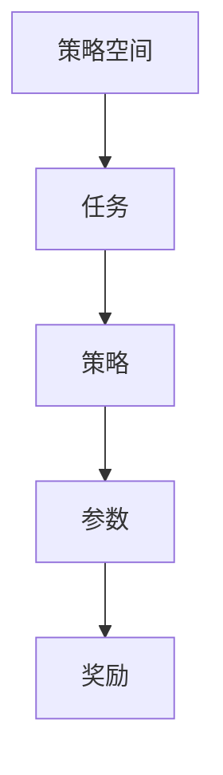
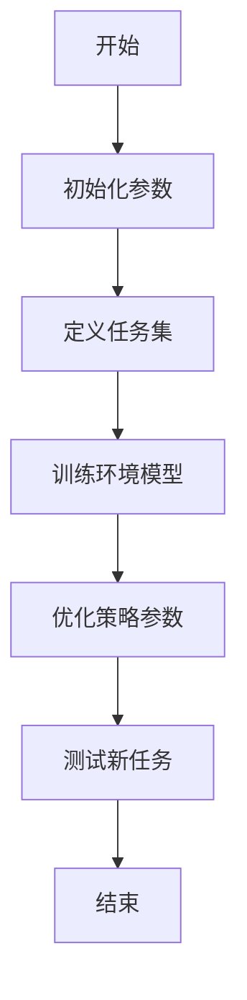
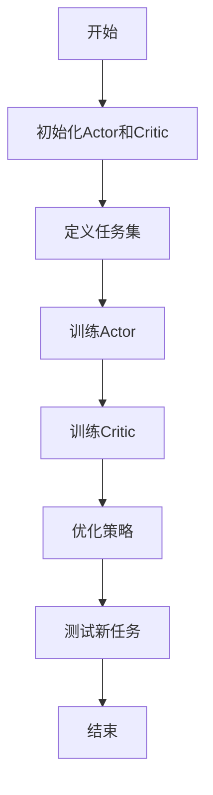
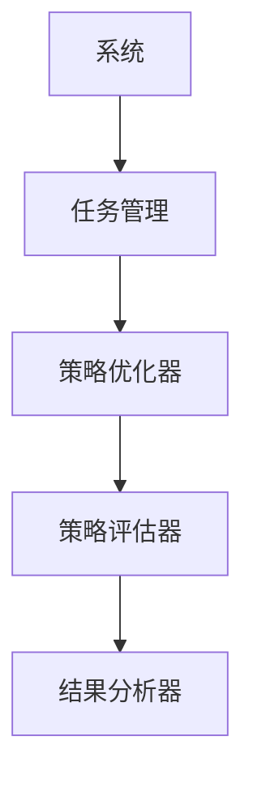
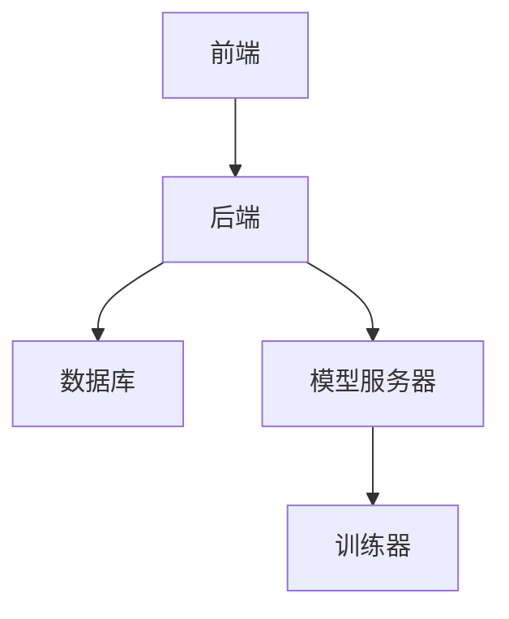
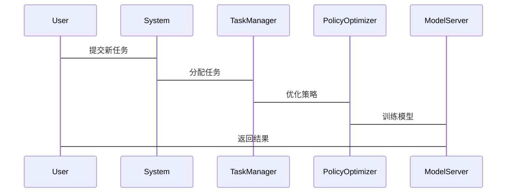

                 


# 元强化学习：AI Agent的策略泛化

## 关键词：
元强化学习，AI Agent，策略泛化，强化学习，多智能体协作

## 摘要：
本文系统地探讨了元强化学习（Meta Reinforcement Learning）的核心概念、算法原理及其在AI Agent策略泛化中的应用。文章首先介绍强化学习和元强化学习的基本概念，分析元强化学习的优势与挑战。接着，深入讲解元强化学习的核心原理，包括数学模型、策略表示与泛化方法。随后，分别阐述基于模型和无模型的元强化学习算法，详细分析其算法流程与实现。此外，文章还从系统架构设计的角度，探讨了元强化学习系统的构建与优化，并通过一个实际项目案例展示其应用。最后，总结元强化学习的研究进展与未来方向，提出若干实践建议。

---

## 正文：

### 第1章：元强化学习概述

#### 1.1 强化学习基础

强化学习（Reinforcement Learning, RL）是一种机器学习范式，通过智能体与环境的交互，学习如何采取适当的行动以最大化累积的奖励。其核心要素包括：

- **状态（State）**：智能体所处环境的当前情况。
- **动作（Action）**：智能体在给定状态下选择的行为。
- **奖励（Reward）**：智能体执行动作后获得的反馈，通常是一个标量值，表示该动作的好坏程度。
- **策略（Policy）**：决定智能体在特定状态下采取哪个动作的规则，通常表示为概率分布。
- **值函数（Value Function）**：估计从当前状态开始，遵循策略所能获得的预期累积奖励。

强化学习的目标是通过与环境的交互，优化策略，使其在长期目标上的累积奖励最大化。

#### 1.2 元强化学习的定义与特点

元强化学习（Meta Reinforcement Learning, Meta-RL）是一种新兴的强化学习范式，旨在通过元学习（Meta-Learning）技术，使智能体能够快速适应新任务或环境的变化。与传统强化学习相比，元强化学习具有以下特点：

- **快速适应**：通过元学习，智能体能够在少量样本或经验中快速掌握新任务。
- **策略泛化**：元强化学习的目标是生成能够在多个任务或环境中有效执行的策略，而非针对单一任务优化。
- **多任务学习**：元强化学习通常涉及多个相关任务，通过共享知识和经验，提高学习效率和泛化能力。

元强化学习的核心目标是通过元学习机制，使得智能体能够高效地泛化策略，适应不同的任务和环境。

#### 1.3 元强化学习的应用领域

元强化学习在多个领域展现出广泛的应用潜力：

- **游戏AI**：在复杂游戏环境中，元强化学习可以帮助AI快速适应不同的游戏规则和场景。
- **智能机器人**：元强化学习可以提升机器人在不同环境中的自主决策能力。
- **多智能体协作**：通过元强化学习，多个智能体可以更好地协作，共同完成复杂任务。
- **动态环境适应**：在环境动态变化的情况下，元强化学习可以帮助智能体快速调整策略。

#### 1.4 元强化学习的核心问题

元强化学习的核心问题可以归结为如何实现策略的泛化，即通过元学习机制，生成能够在多个任务或环境中有效执行的策略。具体挑战包括：

- **策略表示**：如何有效地表示和优化策略，使其能够适应多个任务。
- **任务多样性**：如何处理不同任务之间的差异，同时提取共享的特征和知识。
- **训练效率**：如何在有限的训练资源下，快速学习并泛化策略。

#### 1.5 本章小结

本章首先介绍了强化学习的基本概念和核心要素，然后定义了元强化学习并分析其特点和优势。最后，探讨了元强化学习的应用领域和核心问题，为后续章节的深入分析奠定了基础。

---

### 第2章：元强化学习的核心原理

#### 2.1 元学习机制

元学习（Meta-Learning）是一种通过学习如何学习的方法，其目标是使模型能够快速适应新任务。在元强化学习中，元学习机制通常涉及以下步骤：

1. **元任务的定义**：将多个相关任务组织为一个元任务集。
2. **元模型的构建**：设计一个元模型，能够从多个任务中学习共享的特征和策略。
3. **策略优化**：通过元任务的训练，优化元模型的参数，使其能够在新任务中快速生成有效的策略。

#### 2.2 策略表示与泛化

策略的表示方式直接影响其泛化能力。常见的策略表示方法包括：

- **参数化策略**：策略通过参数化的函数表示，如神经网络。
- **非参数化策略**：策略通过经验或样本直接存储，适用于离散动作空间。
- **层次化策略**：将策略分解为多个层次，分别处理不同粒度的决策。

为了实现策略的泛化，元强化学习通常采用共享参数的方法，使得不同任务的策略共享部分参数，从而提高学习效率和泛化能力。

#### 2.3 元强化学习的数学模型

元强化学习的数学模型通常包括以下几个部分：

1. **元任务集**：定义一组相关任务，每个任务对应一个环境和奖励函数。
2. **策略空间**：定义策略的参数空间，通常由神经网络参数表示。
3. **优化目标**：通过优化元任务的训练目标，使策略能够在新任务中快速收敛。

常用的优化目标包括：

$$ \theta^{*} = \arg\max_{\theta} \sum_{i=1}^{N} \mathbb{E}_{s,a \sim \pi_{\theta}(i)} [R_i(s,a)] $$

其中，$\theta$ 是策略参数，$N$ 是元任务的数量，$R_i$ 是第$i$个任务的奖励函数。

#### 2.4 策略空间的ER实体关系图

策略空间的实体关系可以通过以下ER图表示：



图中，策略空间包含多个任务，每个任务对应一个策略，策略由参数表示，参数影响策略的奖励。

#### 2.5 本章小结

本章详细介绍了元强化学习的核心原理，包括元学习机制、策略表示方法以及数学模型。通过ER实体关系图，展示了策略空间的结构和各部分之间的关系。

---

### 第3章：基于模型的元强化学习算法

#### 3.1 算法概述

基于模型的元强化学习算法通过构建环境模型，加速策略的优化过程。常见的算法包括Meta-DeepRL和Meta-Q-Network。

#### 3.2 Meta-DeepRL算法

Meta-DeepRL是一种基于深度强化学习的元强化学习算法，其核心步骤如下：

1. **环境建模**：通过神经网络建模环境的动力学。
2. **策略优化**：利用环境模型，优化策略参数，使得在多个任务中都能获得高奖励。

算法流程图如下：



#### 3.3 Meta-Q-Network算法

Meta-Q-Network通过共享Q值函数来实现多任务强化学习。其伪代码如下：

```python
def Meta_Q_Network():
    # 定义Q网络
    Q = Sequential()
    Q.add(Dense(64, activation='relu'))
    Q.add(Dense(64, activation='relu'))
    Q.add(Dense(actions, activation='softmax'))
    
    # 元学习步骤
    for task in tasks:
        for step in steps:
            state, action, reward = get_experience(task)
            Q.fit(state, reward, epochs=1)
```

#### 3.4 本章小结

本章介绍了两种基于模型的元强化学习算法，Meta-DeepRL和Meta-Q-Network，详细讲解了其算法流程和实现方法。

---

### 第4章：无模型的元强化学习算法

#### 4.1 算法概述

无模型的元强化学习算法不依赖于环境模型，直接通过策略优化实现泛化。

#### 4.2 Meta-Policy Gradient算法

Meta-Policy Gradient通过优化策略的梯度实现元学习。其核心公式为：

$$ \nabla_{\theta} J = \mathbb{E}_{i}[\nabla_{\theta} J_i] $$

其中，$J_i$ 是第$i$个任务的策略目标函数。

#### 4.3 Meta-Actor Critic算法

Meta-Actor Critic结合了策略评估和优化，通过Actor和Critic网络实现。其流程图如下：



#### 4.4 本章小结

本章介绍了两种无模型的元强化学习算法，Meta-Policy Gradient和Meta-Actor Critic，详细讲解了其算法流程和实现方法。

---

### 第5章：系统分析与架构设计

#### 5.1 问题场景

系统需要支持多个智能体在不同环境中的协作与策略共享。

#### 5.2 系统功能设计

系统功能模块包括任务管理、策略优化、策略评估等。



#### 5.3 系统架构设计

系统架构采用分布式设计，包括前端和后端。



#### 5.4 接口设计

系统接口包括任务接口、策略接口和结果接口。

#### 5.5 交互流程

交互流程如下：



#### 5.6 本章小结

本章分析了元强化学习系统的架构设计，包括功能模块、接口设计和交互流程。

---

### 第6章：项目实战

#### 6.1 环境配置

安装必要的库：

```bash
pip install gym numpy tensorflow
```

#### 6.2 代码实现

实现Meta-RL算法：

```python
import gym
import numpy as np
import tensorflow as tf

class MetaRLAgent:
    def __init__(self, state_space, action_space):
        self.state_space = state_space
        self.action_space = action_space
        self.model = self.build_model()
    
    def build_model(self):
        model = tf.keras.Sequential([
            tf.keras.layers.Dense(64, activation='relu'),
            tf.keras.layers.Dense(64, activation='relu'),
            tf.keras.layers.Dense(self.action_space, activation='softmax')
        ])
        return model
    
    def train(self, tasks, steps):
        for task in tasks:
            env = gym.make(task)
            for _ in range(steps):
                state = env.reset()
                action = self.model.predict(state)[0]
                next_state, reward, done, _ = env.step(action)
                # Update model
                target = np.zeros((1, self.action_space))
                target[0][env.action_space] = reward
                self.model.fit(state, target, epochs=1)
```

#### 6.3 结果分析

分析训练结果，观察策略在不同任务中的表现。

#### 6.4 代码解读

详细解读代码实现，说明每部分的作用。

#### 6.5 本章小结

本章通过一个实际项目展示了元强化学习算法的实现过程，包括环境配置、代码实现和结果分析。

---

### 第7章：总结与展望

#### 7.1 核心内容回顾

总结元强化学习的核心概念、算法和应用。

#### 7.2 研究热点与未来方向

讨论当前研究热点和未来的发展方向。

#### 7.3 最佳实践

给出实践建议，包括算法选择、环境设计、性能优化等。

#### 7.4 本章小结

本章总结了文章的核心内容，并展望了元强化学习的未来发展方向。

---

## 结语：

元强化学习作为人工智能领域的重要研究方向，正在推动AI Agent在复杂环境中的策略泛化能力。通过本文的系统介绍，读者可以深入了解元强化学习的核心原理和实际应用。未来，随着算法的不断优化和计算能力的提升，元强化学习将在更多领域展现出其强大的潜力。

