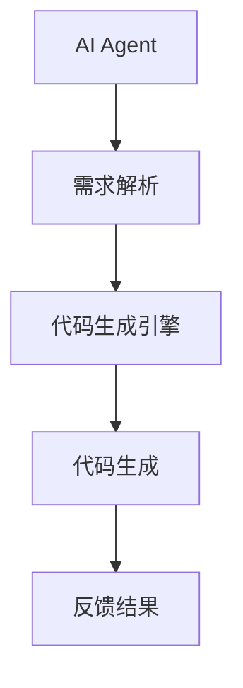
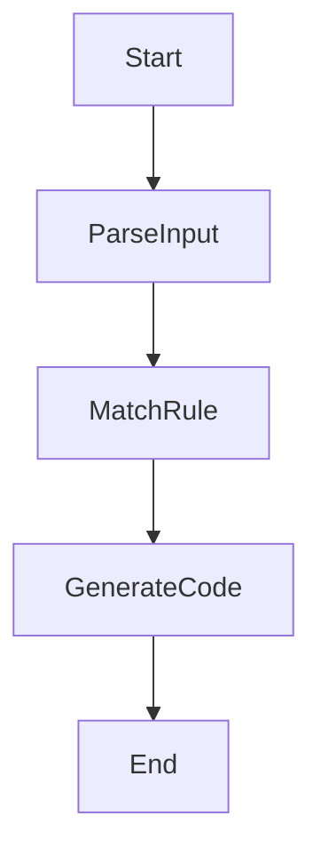
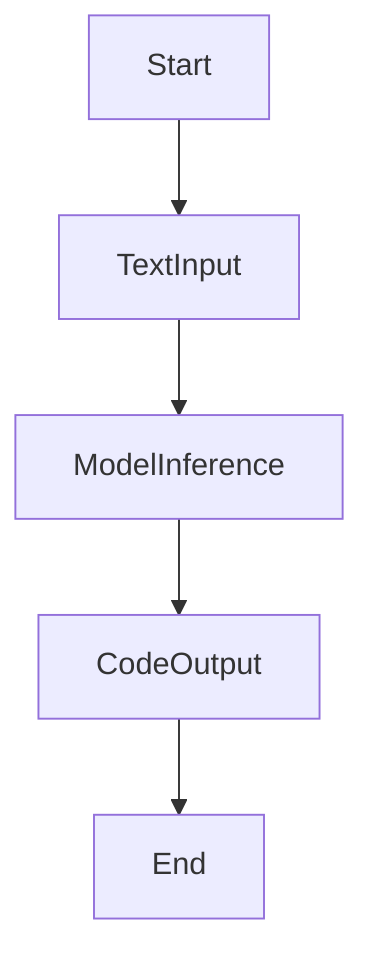
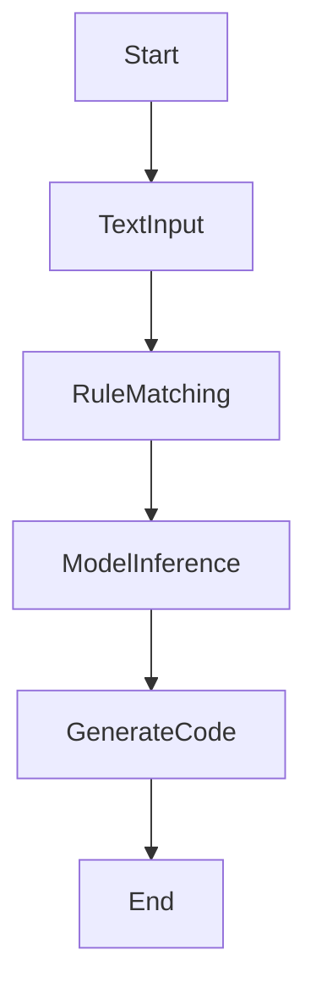
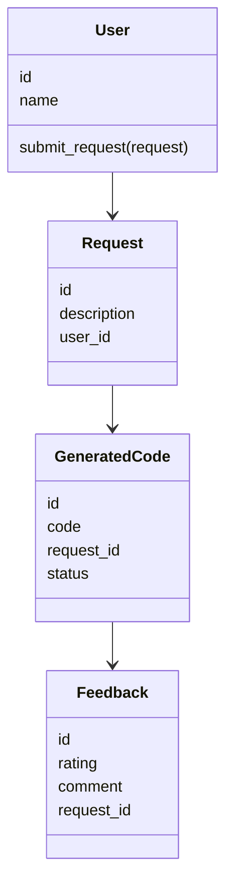
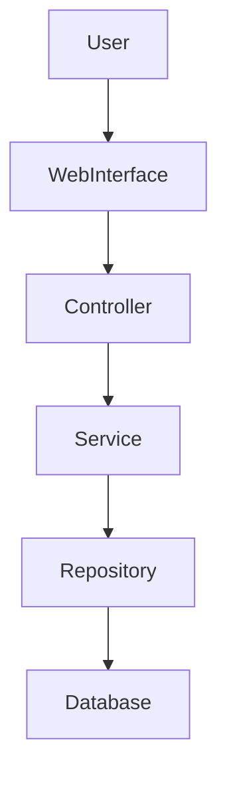

                 


# 元编程：让AI Agent生成和修改代码

> **关键词**：元编程，AI Agent，代码生成，自动化编程，机器学习，自然语言处理

> **摘要**：  
元编程是一种高级的编程范式，通过生成和操作代码来实现复杂的编程任务。结合人工智能（AI）代理（Agent），元编程能够实现代码的自动生成和优化，从而提升开发效率和代码质量。本文将详细探讨元编程与AI Agent的结合，分析其核心原理、算法机制、系统架构，并通过实际项目案例展示其应用。我们还将讨论当前技术的最佳实践、潜在挑战以及未来发展方向。

---

## 第1章：元编程与AI Agent概述

### 1.1 元编程的基本概念

元编程是一种通过生成和操作代码来实现编程任务的高级范式。它允许程序在运行时动态地生成、修改或分析代码，从而实现更灵活和高效的开发。

- **四个层次**：
  1. **语法级元编程**：在代码生成时直接操作语法结构，如Lisp的宏。
  2. **编译级元编程**：在编译过程中生成代码，如C语言的预处理。
  3. **运行级元编程**：在运行时动态生成代码，如Python的`exec`函数。
  4. **反射级元编程**：通过反射机制操作代码结构，如Java的反射API。

- **核心思想**：元编程的核心思想是“程序生成程序”，通过抽象和自动化减少手动编码的工作量。

- **应用场景**：元编程广泛应用于编译器生成、配置管理、代码生成工具、动态Web页面生成等领域。

---

### 1.2 AI Agent的基本概念

AI Agent是一种能够感知环境、做出决策并执行操作的智能实体。它可以是一个独立的程序或系统，具备以下核心特征：

- **感知能力**：通过传感器或数据输入接口获取环境信息。
- **决策能力**：基于感知信息，使用算法做出决策。
- **执行能力**：通过执行器或输出接口实现决策结果。

AI Agent可以分为以下几类：
- **简单反射式Agent**：基于当前感知做出即时反应。
- **基于模型的反射式Agent**：维护环境模型并基于模型做出决策。
- **目标驱动的Agent**：根据预设目标选择行动。

AI Agent的核心优势在于其智能化和自动化能力，能够处理复杂、动态的环境任务。

---

### 1.3 元编程与AI Agent的结合

元编程与AI Agent的结合为代码生成和修改提供了新的可能性。通过AI Agent的智能决策能力，元编程可以实现更复杂、更高效的代码生成任务。

- **结合背景**：
  - 元编程需要处理复杂的语法和逻辑结构。
  - AI Agent具备智能分析和决策能力，能够辅助元编程完成代码生成任务。

- **核心优势**：
  - 提高代码生成的效率和准确性。
  - 支持动态环境下的代码自适应调整。

- **应用价值**：
  - 简化复杂系统的开发过程。
  - 提高代码质量和可维护性。
  - 支持快速原型开发和迭代优化。

---

## 第2章：元编程的核心概念与原理

### 2.1 元编程的核心原理

元编程的核心在于代码生成和操作。通过元编程，程序可以动态地生成新代码，或者在运行时修改现有代码的行为。

- **语法分析与代码生成**：
  - 元编程需要理解目标语言的语法结构。
  - 通过解析用户输入，生成符合语法的代码。

- **动态执行与代码操作**：
  - 元编程允许程序在运行时动态生成代码。
  - 使用反射机制或动态代码执行技术（如Python的`exec`）来操作代码。

---

### 2.2 AI Agent的核心原理

AI Agent通过感知环境、分析数据、做出决策并执行操作，实现智能化任务处理。

- **感知环境**：
  - 通过API或数据接口获取输入信息。
  - 解析用户需求或任务目标。

- **决策逻辑**：
  - 使用机器学习模型（如自然语言处理模型）进行分析。
  - 基于预设规则或模型输出做出决策。

- **执行操作**：
  - 调用代码生成工具或API。
  - 输出生成的代码或操作结果。

---

### 2.3 元编程与AI Agent的交互机制

通过元编程与AI Agent的结合，AI Agent可以作为元编程的驱动引擎，实现代码的自动生成和优化。

- **交互流程**：
  1. 用户向AI Agent提交代码生成请求。
  2. AI Agent解析需求，生成代码生成指令。
  3. 元编程引擎根据指令生成代码。
  4. AI Agent验证生成代码的正确性，并反馈结果。

- **Mermaid实体关系图**：



---

## 第3章：元编程与AI Agent的代码生成算法原理

### 3.1 基于规则的代码生成算法

基于规则的代码生成是一种简单但有效的代码生成方法。

- **规则定义**：
  - 预定义代码生成规则，如模板和条件。
  - 通过解析输入需求，匹配相应的规则。

- **代码生成流程**：



- **Python实现示例**：

```python
def generate_code(rule, input):
    if rule['condition'](input):
        return rule['template'].format(**input)
    else:
        return ''
```

---

### 3.2 基于机器学习的代码生成算法

基于机器学习的代码生成利用自然语言处理模型（如GPT）生成代码。

- **模型训练**：
  - 使用大量代码语料库训练模型。
  - 模型学习代码的语法和结构。

- **生成流程**：



- **Python实现示例**：

```python
import tensorflow as tf
from tensorflow.keras import layers

model = tf.keras.Sequential()
model.add(layers.Embedding(input_dim=1000, output_dim=100))
model.add(layers.Dense(10, activation='relu'))
model.add(layers.Dense(1, activation='sigmoid'))
model.compile(optimizer='adam', loss='binary_crossentropy', metrics=['accuracy'])
```

---

### 3.3 混合式代码生成算法

混合式代码生成结合规则和机器学习的优势，生成更准确和高效的代码。

- **代码生成流程**：



- **优点**：
  - 充分利用规则的精确性和机器学习的泛化能力。
  - 提高代码生成的准确性和效率。

---

## 第4章：系统架构与设计实现

### 4.1 系统问题场景与项目介绍

本系统旨在实现一个基于AI Agent的代码生成系统，帮助用户自动生成高质量的代码。

- **问题场景**：
  - 用户提出代码生成需求。
  - 系统解析需求并生成代码。

- **项目目标**：
  - 提供高效的代码生成服务。
  - 实现AI Agent与元编程的结合。

---

### 4.2 系统功能设计（领域模型）

系统的核心实体包括用户、需求、生成代码和反馈。

- **Mermaid类图**：



---

### 4.3 系统架构设计

系统采用分层架构，包括数据层、服务层和表现层。

- **Mermaid架构图**：



---

## 第5章：项目实战：基于AI Agent的代码生成系统实现

### 5.1 项目环境与工具安装

- **开发工具**：
  - Python 3.8+
  - TensorFlow 2.5+
  - Flask 2.0+

- **依赖安装**：
  ```bash
  pip install flask tensorflow
  ```

---

### 5.2 核心代码实现

#### 5.2.1 需求解析模块

- **代码实现**：

```python
def parse_request(request_text):
    # 使用自然语言处理模型解析需求
    return parsed_request
```

#### 5.2.2 代码生成模块

- **代码实现**：

```python
def generate_code(request):
    # 调用代码生成算法生成代码
    return generated_code
```

---

### 5.3 系统实现与功能解读

系统实现包括用户界面、需求解析、代码生成和反馈模块。用户提交需求后，系统解析需求并生成代码，用户可以查看生成结果并提供反馈。

- **功能模块**：
  - 用户界面：提交需求和查看结果。
  - 需求解析：自然语言处理解析需求。
  - 代码生成：基于规则和机器学习生成代码。
  - 反馈模块：收集用户反馈并优化系统。

---

## 第6章：总结与展望

### 6.1 核心知识点回顾

- 元编程的四个层次。
- AI Agent的核心原理和功能。
- 基于规则和机器学习的代码生成算法。
- 系统架构设计与实现。

### 6.2 最佳实践 tips

- 在代码生成中，确保数据质量以提高生成结果的准确性。
- 结合规则和机器学习模型，平衡精确性和泛化能力。

### 6.3 小结与注意事项

- 元编程与AI Agent的结合提高了代码生成的效率和质量。
- 在实际应用中，需注意系统的性能优化和错误处理。
- 需要结合具体场景选择合适的代码生成方法。

### 6.4 拓展阅读与未来方向

- **推荐书籍**：
  - 《元编程》：深入理解元编程的核心思想。
  - 《人工智能：一种现代的方法》：学习AI Agent的相关知识。

- **未来方向**：
  - 提高代码生成的可解释性和可维护性。
  - 探索多模态代码生成，结合图像、文本等多种输入形式。
  - 研究代码生成的可定制化和动态适应性。

---

**结语**：  
元编程与AI Agent的结合为代码生成和修改带来了新的可能性。通过本文的分析和实践，我们能够更好地理解其核心原理和应用场景，并在实际开发中充分利用这些技术提升效率和代码质量。未来，随着AI技术的不断发展，元编程与AI Agent的结合将更加紧密，推动软件开发进入一个更加智能化和自动化的时代。

