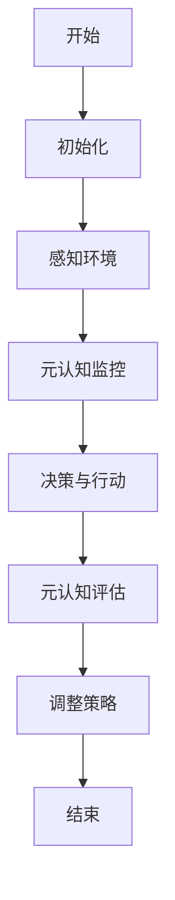
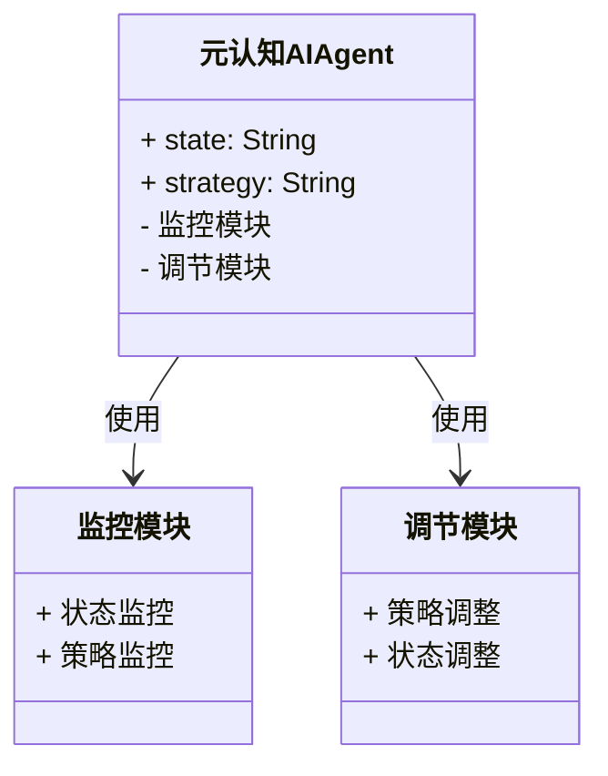
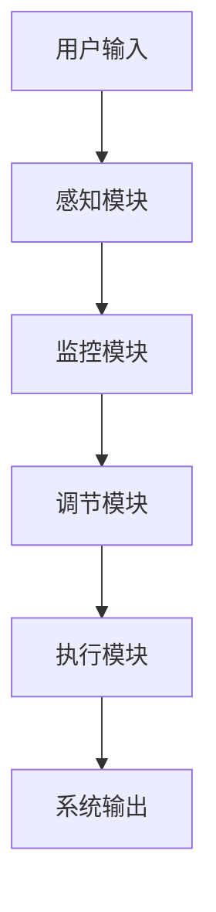
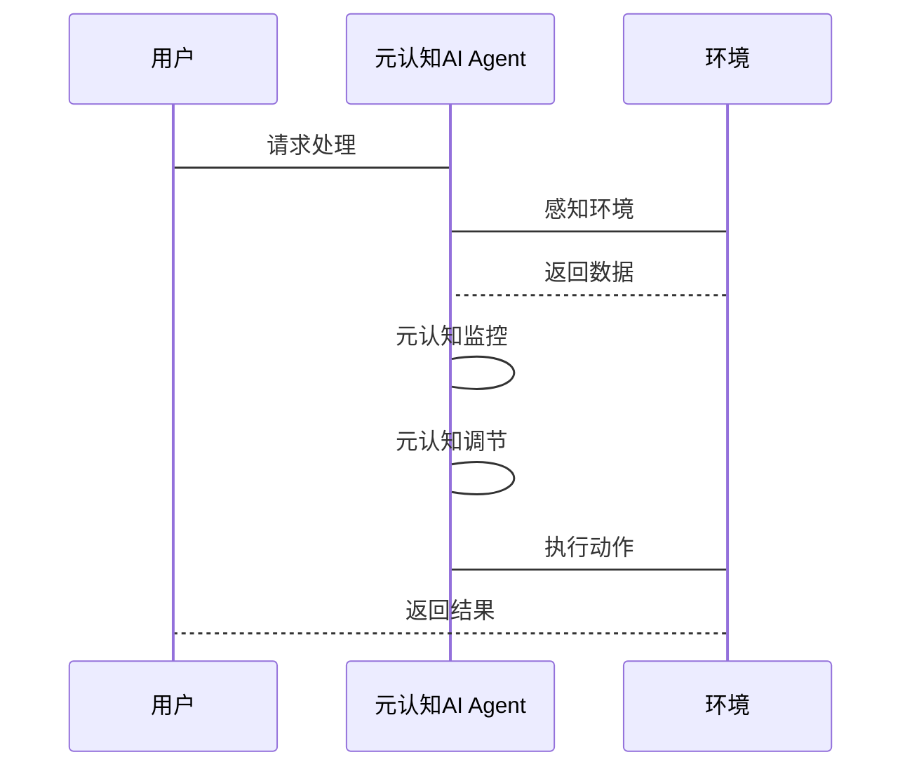

                 


# 元认知AI Agent：自我监控与调节

## 关键词
元认知，AI Agent，自我监控，自我调节，人工智能，系统架构

## 摘要
元认知AI Agent是一种具备自我监控与调节能力的智能体，它通过元认知理论的应用，能够自主优化其行为和决策过程。本文将从元认知的基本概念出发，探讨元认知AI Agent的核心原理、算法实现、系统架构设计以及实际应用案例，旨在为读者提供全面而深入的理解。

---

# 第1章：元认知与AI Agent概述

## 1.1 元认知的基本概念

### 1.1.1 元认知的定义与特点
元认知（Metacognition）是认知科学中的一个重要概念，指个体对自身认知过程的认知与调控。它包括对认知过程的监控、评估和调节。元认知的核心特点在于其“元”性质，即对思维过程的反思与调整。

- **定义**：元认知是指个体对自身认知过程的意识和调控能力。
- **特点**：
  1. 自我监控：能够实时观察自己的认知过程。
  2. 自我调节：根据监控结果调整认知策略。
  3. 自我优化：通过反思不断改进认知方式。

### 1.1.2 元认知的核心要素与功能
元认知由以下几个核心要素构成：
- **元认知知识**：关于认知过程、策略和任务的知识。
- **元认知监控**：对认知过程的实时观察与评估。
- **元认知调节**：根据监控结果调整认知策略。

元认知的功能主要体现在以下几个方面：
- **提高学习效率**：通过合理选择策略优化学习过程。
- **增强问题解决能力**：在复杂问题中灵活调整解题思路。
- **提升决策质量**：在决策过程中避免认知偏差。

### 1.1.3 元认知与AI的结合
元认知理论为AI技术提供了新的视角，尤其是在智能体的设计中，元认知能力能够帮助AI具备自我监控与调节的能力。通过元认知，AI可以更好地理解自身的行为，从而实现更智能的决策和优化。

---

## 1.2 AI Agent的基本概念

### 1.2.1 AI Agent的定义与分类
AI Agent（智能体）是指能够感知环境并采取行动以实现目标的实体。根据功能和复杂度，AI Agent可以分为以下几类：
- **简单反射型AI Agent**：基于规则的简单反应。
- **基于模型的AI Agent**：具备内部状态和目标的智能体。
- **实用推理型AI Agent**：能够进行复杂推理和决策。
- **人机协作型AI Agent**：与人类协同工作的智能体。

### 1.2.2 AI Agent的核心功能与应用场景
AI Agent的核心功能包括：
- **感知环境**：通过传感器或数据输入获取环境信息。
- **决策与行动**：基于感知信息做出决策并执行行动。
- **学习与优化**：通过经验不断优化自身的行为。

AI Agent的应用场景广泛，包括自动驾驶、智能助手、机器人控制等领域。

### 1.2.3 元认知AI Agent的独特性
元认知AI Agent的独特性在于其具备自我监控与调节的能力，能够在运行过程中动态调整自身的策略和行为，从而实现更高效和智能的决策。

---

## 1.3 元认知AI Agent的背景与意义

### 1.3.1 元认知AI Agent的提出背景
随着AI技术的快速发展，传统的基于规则的AI Agent逐渐暴露出在复杂环境下的局限性。元认知AI Agent的提出，旨在通过引入元认知能力，提升AI Agent的适应性和智能性。

### 1.3.2 元认知AI Agent在AI领域的意义
元认知AI Agent的引入，使得AI Agent具备了自我反思和优化的能力，能够更好地应对动态变化的环境和复杂任务。

### 1.3.3 元认知AI Agent的未来发展
元认知AI Agent将朝着更智能化、更自主化的方向发展，其应用范围也将进一步扩展，涵盖更多复杂的实际场景。

---

# 第2章：元认知AI Agent的核心概念

## 2.1 元认知AI Agent的理论基础

### 2.1.1 元认知理论的起源与发展
元认知理论起源于20世纪70年代，由美国认知心理学家John H. Flavell提出。其核心观点认为，元认知是个体对自身认知过程的认知与调控。

### 2.1.2 AI Agent的理论基础
AI Agent的理论基础包括认知科学、人工智能、机器人学等多个领域。元认知AI Agent的理论基础是元认知理论与AI Agent理论的结合。

### 2.1.3 元认知与AI Agent的结合理论
元认知AI Agent的理论基础是元认知理论与AI Agent理论的结合，通过引入元认知能力，提升AI Agent的智能性和适应性。

---

## 2.2 元认知AI Agent的核心要素

### 2.2.1 自我监控机制
自我监控机制是元认知AI Agent的核心要素之一，它负责对AI Agent的认知过程进行实时监控。

### 2.2.2 自我调节机制
自我调节机制是元认知AI Agent的另一个核心要素，它基于监控结果调整AI Agent的行为策略。

### 2.2.3 自我优化机制
自我优化机制通过不断学习和总结经验，优化AI Agent的认知过程和行为策略。

---

## 2.3 元认知AI Agent的属性特征对比

| 属性 | 元认知AI Agent | 传统AI Agent |
|------|----------------|---------------|
| 自我监控 | √              | ×             |
| 自我调节 | √              | ×             |
| 自我优化 | √              | ×             |
| 环境适应性 | √              | ×             |
| 策略灵活性 | √              | ×             |

---

## 2.4 元认知AI Agent的ER实体关系图

```mermaid
erDiagram
    class 元认知AI Agent {
        id
        name
        状态
        目标
        策略
    }
    class 环境 {
        id
        感知数据
        事件
    }
    元认知AI Agent --> 环境 : 感知
    元认知AI Agent --> 环境 : 行动
```

---

# 第3章：元认知AI Agent的算法原理

## 3.1 元认知AI Agent的算法流程



## 3.2 元认知AI Agent的数学模型

元认知AI Agent的数学模型如下：

$$
P = \sum_{i=1}^{n} w_i x_i + b
$$

其中：
- $P$ 是决策概率。
- $w_i$ 是特征权重。
- $x_i$ 是输入特征。
- $b$ 是偏置项。

---

## 3.3 元认知AI Agent的实现代码

```python
class MetaCognitiveAgent:
    def __init__(self):
        self.state = 'idle'
        self.strategy = 'default'
    
    def perceive(self, environment):
        # 感知环境并返回决策
        pass
    
    def meta_monitor(self):
        # 元认知监控
        pass
    
    def meta_adjust(self):
        # 元认知调节
        pass
    
    def execute(self, decision):
        # 执行决策
        pass
```

---

# 第4章：元认知AI Agent的系统架构与设计

## 4.1 问题场景介绍

### 4.1.1 元认知AI Agent的应用场景
元认知AI Agent的应用场景包括智能助手、自动驾驶、智能推荐等领域。

### 4.1.2 系统目标与需求分析
系统目标是实现一个具备自我监控与调节能力的AI Agent，需求包括：
- 实时感知环境。
- 自我监控与调节。
- 动态调整策略。

---

## 4.2 系统功能设计

### 4.2.1 领域模型设计



### 4.2.2 功能模块划分
系统功能模块包括：
- 感知模块。
- 监控模块。
- 调节模块。
- 执行模块。

---

## 4.3 系统架构设计

### 4.3.1 系统架构图



---

## 4.4 系统接口设计

### 4.4.1 接口定义
- `perceive(environment)`：感知环境。
- `monitor(state)`：监控状态。
- `adjust(strategy)`：调节策略。
- `execute(action)`：执行动作。

### 4.4.2 交互流程图



---

## 4.5 系统交互流程图


---

## 总结与展望

元认知AI Agent通过引入元认知能力，显著提升了AI Agent的智能性和适应性。未来，元认知AI Agent将在更多领域得到应用，推动人工智能技术的发展。

---

## 最佳实践 Tips

1. 在设计元认知AI Agent时，确保监控模块和调节模块的有效性。
2. 定期对元认知AI Agent进行性能评估和优化。
3. 在实际应用中，结合具体场景调整元认知AI Agent的策略。

---

## 小结

本文详细介绍了元认知AI Agent的核心概念、算法原理和系统架构设计，通过实际案例展示了其应用价值。希望读者通过本文能够对元认知AI Agent有更深入的理解，并在实际应用中发挥其优势。

