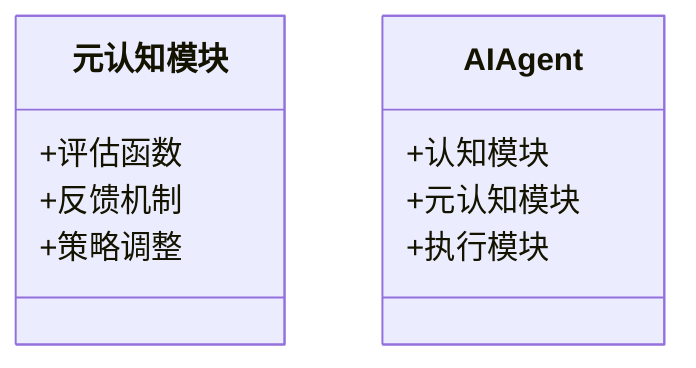
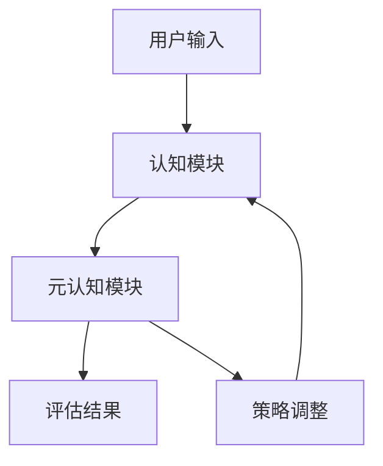
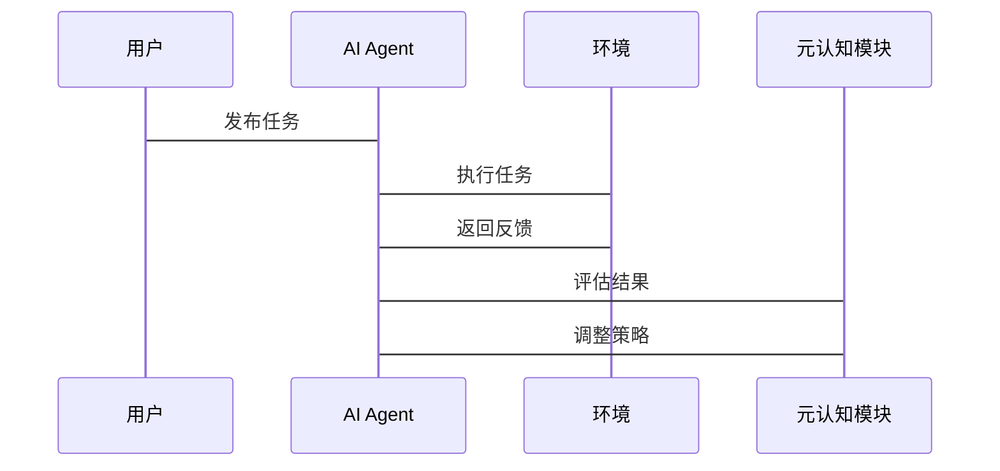

                 


# 元认知：赋予AI Agent自我评估能力

## 关键词：元认知，AI Agent，自我评估，自适应学习，反馈机制，数学模型，算法原理

## 摘要：元认知是指对自身认知过程的认知和调控能力，赋予AI Agent自我评估能力是实现更智能和自适应AI系统的关键。本文将从元认知的基本概念出发，探讨其在AI Agent中的应用，详细分析元认知的算法原理、系统架构，并通过实际项目案例展示如何实现元认知能力。文章内容涵盖背景介绍、核心概念、算法原理、系统架构、项目实战和最佳实践，为读者提供全面而深入的技术指导。

---

## 第1章: 元认知的基本概念与问题背景

### 1.1 元认知的定义与核心要素

#### 1.1.1 元认知的定义
元认知（Metacognition）是指对自身认知过程的认知和调控能力，包括对思维过程的监控、评估和调节。在AI Agent中，元认知能力使其能够反思自身的决策过程、评估任务完成情况，并根据反馈进行调整。

#### 1.1.2 元认知的核心要素
- **元认知知识**：关于认知过程的知识，例如任务类型、策略选择等。
- **元认知调控**：对认知过程的监控和调节，例如评估当前策略的有效性并进行调整。
- **元认知评估**：对自身行为和结果的评估，为后续决策提供依据。

#### 1.1.3 元认知与AI Agent的关系
元认知能力使AI Agent能够超越传统的基于规则或数据驱动的决策方式，具备更高级的自适应能力，能够根据环境变化动态调整自身行为。

### 1.2 问题背景与挑战

#### 1.2.1 当前AI Agent的局限性
传统的AI Agent通常依赖固定的规则或大量训练数据，缺乏对自身行为的反思和调整能力。在复杂或动态变化的环境中，这种局限性可能导致决策失误或效率低下。

#### 1.2.2 元认知能力的必要性
为了应对复杂任务和动态环境，AI Agent需要具备元认知能力，能够评估自身行为、发现不足并进行改进。

#### 1.2.3 元认知在AI Agent中的应用场景
- **任务规划**：评估当前策略的有效性，动态调整任务优先级。
- **错误修正**：识别决策错误并采取补救措施。
- **持续学习**：根据评估结果优化学习策略。

### 1.3 元认知能力的实现目标

#### 1.3.1 自我评估的核心目标
- 提供对自身行为的全面评估，包括任务完成度、策略有效性等。
- 识别潜在问题并提出改进建议。

#### 1.3.2 元认知与AI Agent的边界与外延
元认知能力的边界在于AI Agent的自我反思和调整，而其外延则涉及与外部环境和其他AI Agent的协作。

#### 1.3.3 元认知与AI Agent的结合方式
通过嵌入元认知模块，AI Agent能够在执行任务的同时，实时监控和评估自身行为，并根据评估结果进行调整。

## 1.4 本章小结

---

## 第2章: 元认知与AI Agent的核心概念联系

### 2.1 元认知的原理与机制

#### 2.1.1 元认知的三层架构
- **第一层**：感知与数据输入。
- **第二层**：认知过程，如学习、推理。
- **第三层**：元认知调控，监控并调整认知过程。

#### 2.1.2 元认知的反馈机制
- **内部反馈**：基于内部状态的评估。
- **外部反馈**：来自环境的反馈，用于调整行为。

#### 2.1.3 元认知的自适应能力
通过不断评估和调整，元认知能够使AI Agent在动态环境中保持高效和适应性。

### 2.2 元认知与AI Agent的核心联系

#### 2.2.1 元认知在AI Agent中的功能定位
- **监控与评估**：实时监控AI Agent的行为，并进行评估。
- **策略调整**：根据评估结果调整策略。

#### 2.2.2 元认知与AI Agent行为的关系
元认知能力直接影响AI Agent的行为选择和执行过程。

#### 2.2.3 元认知对AI Agent决策的影响
通过元认知评估，AI Agent能够更准确地理解任务需求，优化决策过程。

### 2.3 元认知与传统AI的区别

#### 2.3.1 传统AI的局限性
- 缺乏自我反思能力。
- 难以应对未见过的复杂情况。

#### 2.3.2 元认知AI的优势
- 具备自适应和自调节能力。
- 能够在动态环境中保持高效。

#### 2.3.3 元认知与AI Agent的融合方式
通过模块化设计，将元认知能力嵌入到AI Agent的核心架构中。

### 2.4 本章小结

---

## 第3章: 元认知能力的算法原理

### 3.1 元学习算法的基本原理

#### 3.1.1 元学习的定义
元学习是一种通过学习如何学习的方法，旨在使模型能够快速适应新任务。

#### 3.1.2 元学习的核心算法
- **Meta-LSTM**：一种经典的元学习算法，用于处理序列数据。
- **MAML**：使用梯度下降的方法进行元学习。

#### 3.1.3 元学习的数学模型
元学习模型通常包括两个阶段：元学习阶段和任务学习阶段。

### 3.2 元认知评估机制的设计

#### 3.2.1 评估函数的定义
评估函数用于对AI Agent的行为进行打分，通常基于任务完成度和策略的有效性。

#### 3.2.2 评估机制的实现
通过对比实际结果与预期结果，评估函数能够给出具体的评分。

#### 3.2.3 评估结果的反馈
评估结果用于调整AI Agent的行为策略。

### 3.3 元认知自适应策略

#### 3.3.1 自适应学习的定义
自适应学习是指根据评估结果动态调整学习策略。

#### 3.3.2 自适应策略的设计
基于评估结果，选择最优的策略进行调整。

#### 3.3.3 自适应策略的实现
通过元学习算法优化自适应策略。

### 3.4 本章小结

---

## 第4章: 元认知系统的数学模型与公式

### 4.1 元学习的数学模型

#### 4.1.1 元学习的优化目标
元学习的目标是通过优化元参数，使得模型能够快速适应新任务。

#### 4.1.2 元学习的损失函数
$$ L = \sum_{i=1}^N L_i(\theta) $$

#### 4.1.3 元学习的更新规则
$$ \theta_{t+1} = \theta_t - \eta \nabla_\theta L(\theta_t) $$

### 4.2 评估函数的数学表达

#### 4.2.1 评估函数的定义
$$ f(e) = \begin{cases} 1 & \text{如果 } e \text{ 完成任务} \\ 0 & \text{否则} \end{cases} $$

#### 4.2.2 评估函数的参数
评估函数的参数包括任务完成度、策略有效性等。

#### 4.2.3 评估函数的计算过程
评估函数通过对比实际结果与预期结果，计算得分。

### 4.3 自适应策略的数学模型

#### 4.3.1 自适应策略的定义
$$ \pi(a|s) = \text{选择动作 } a \text{ 的概率} $$

#### 4.3.2 自适应策略的参数
策略参数θ，通过元学习算法优化。

#### 4.3.3 自适应策略的更新
$$ \theta_{t+1} = \theta_t - \eta \nabla_\theta L(\theta_t) $$

### 4.4 本章小结

---

## 第5章: 元认知系统的系统分析与架构设计

### 5.1 问题场景介绍

#### 5.1.1 问题场景描述
在动态变化的环境中，AI Agent需要具备自我评估和调整能力。

#### 5.1.2 项目介绍
设计一个具备元认知能力的AI Agent，能够在复杂任务中自我评估并调整策略。

### 5.2 系统功能设计

#### 5.2.1 领域模型


#### 5.2.2 系统架构设计


#### 5.2.3 系统接口设计
- **输入接口**：接收任务和环境反馈。
- **输出接口**：输出评估结果和调整后的策略。

#### 5.2.4 系统交互设计


### 5.3 本章小结

---

## 第6章: 项目实战

### 6.1 环境安装与配置

#### 6.1.1 环境要求
- Python 3.8+
- TensorFlow或PyTorch
- 其他依赖库

#### 6.1.2 安装步骤
```
pip install numpy
pip install matplotlib
pip install scikit-learn
```

### 6.2 系统核心实现源代码

#### 6.2.1 元认知模块实现
```python
class MetaCognition:
    def __init__(self):
        self.assessment_function = self.default_assessment
        self.feedback Mechanism = self.default_feedback

    def default_assessment(self, outcome):
        return outcome == 'success'

    def default_feedback(self, assessment):
        return 'adjust_strategy' if assessment else 'continue'
```

#### 6.2.2 评估机制实现
```python
def evaluate(agent_behavior):
    return 1 if agent_behavior == 'optimal' else 0
```

#### 6.2.3 自适应策略实现
```python
def adaptive_strategy(current_strategy, feedback):
    if feedback == 'adjust_strategy':
        return 'new_strategy'
    else:
        return current_strategy
```

### 6.3 代码应用解读与分析

#### 6.3.1 元认知模块的实现细节
元认知模块通过评估函数和反馈机制，动态调整AI Agent的行为策略。

#### 6.3.2 评估机制的具体实现
评估机制根据任务完成情况给出反馈，帮助AI Agent调整策略。

### 6.4 实际案例分析与详细讲解剖析

#### 6.4.1 案例背景
在一个动态任务分配场景中，AI Agent需要根据任务优先级和资源分配情况，动态调整策略。

#### 6.4.2 案例分析
- 初始策略：随机分配任务。
- 评估结果：任务完成率低。
- 策略调整：优先分配高优先级任务。
- 新策略：任务完成率提高。

### 6.5 项目小结

---

## 第7章: 最佳实践与总结

### 7.1 小结

#### 7.1.1 核心内容回顾
元认知能力使AI Agent具备自我评估和自适应能力，能够应对复杂任务和动态环境。

### 7.2 注意事项

#### 7.2.1 实际应用中的注意事项
- 确保元认知模块的有效性。
- 定期评估和优化策略。

#### 7.2.2 元认知能力的边界
元认知能力无法完全替代人类的监督和指导。

### 7.3 拓展阅读

#### 7.3.1 推荐书籍
- 《元认知与人工智能》
- 《自适应学习系统》

#### 7.3.2 推荐论文
- "Learning to Learn via Meta-Learning"
- "A Survey on Meta-Learning"

### 7.4 本章小结

---

## 总结

元认知能力是AI Agent实现自我评估和自适应学习的关键，本文从理论到实践，详细探讨了元认知的实现方法和应用场景。通过系统架构设计和项目实战，展示了如何将元认知能力嵌入到AI Agent中，使其具备更强大的自适应能力。未来，元认知能力将在更多领域发挥重要作用，为AI Agent的发展提供新的方向。

--- 

希望这篇文章能够为读者提供关于元认知与AI Agent结合的深入理解，并为实际应用提供有价值的参考。

