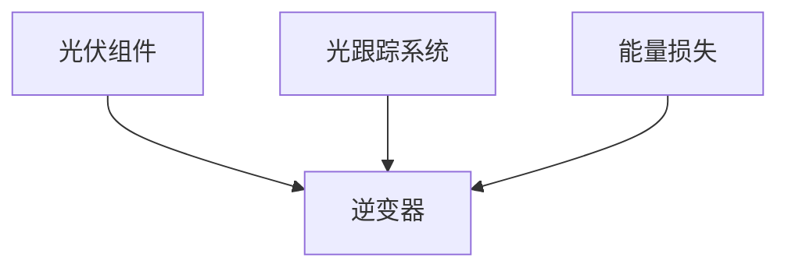
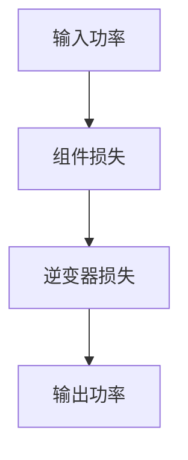
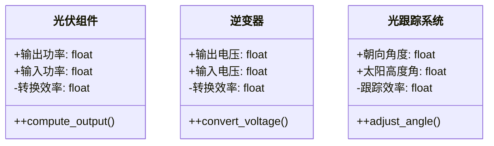
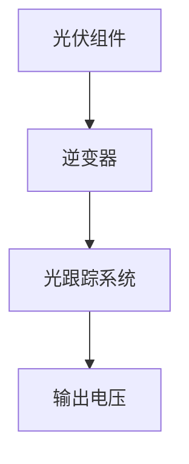

                 


# 光伏发电效率提升带来的新一轮投资机会

## 关键词：光伏发电、效率提升、投资机会、技术分析、系统设计

## 摘要：  
随着全球能源结构的转型，光伏发电作为清洁能源的重要组成部分，正受到越来越多的关注。本文从技术角度分析了光伏发电效率提升的关键技术，包括光伏组件效率提升、逆变器优化和跟踪系统设计等。同时，探讨了效率提升对投资机会的影响，结合实际案例和系统设计，提出了未来光伏发电的发展方向和投资策略。通过本文的分析，读者可以全面了解光伏发电效率提升的技术路径及其带来的投资价值。

---

## 第一部分: 光伏发电效率提升的背景与现状

### 第1章: 光伏发电的背景与现状

#### 1.1 光伏发电的背景
##### 1.1.1 全球能源结构转型的背景
全球能源结构正向清洁化、低碳化方向转型，化石能源的使用比例逐渐减少，可再生能源的重要性日益凸显。光伏发电作为一种清洁、高效的能源形式，成为全球能源转型的重要组成部分。

##### 1.1.2 可再生能源发展的趋势
随着技术进步和成本下降，可再生能源在全球能源结构中的占比不断提升。光伏发电凭借其广泛的应用场景和环境友好性，成为可再生能源领域的重要支柱。

##### 1.1.3 光伏发电在全球能源中的地位
光伏发电在全球能源体系中占据越来越重要的地位，特别是在欧洲、中国和美国等主要市场，光伏发电装机容量持续增长。

#### 1.2 光伏发电的现状
##### 1.2.1 全球光伏发电装机容量分析
近年来，全球光伏发电装机容量呈现快速增长态势。2020年，全球光伏发电装机容量已超过700GW，且这一趋势仍在延续。

##### 1.2.2 中国光伏发电的发展历程
中国是全球最大的光伏发电市场，经过多年的快速发展，中国光伏发电装机容量已位居全球第一。2021年，中国光伏发电装机容量超过300GW。

##### 1.2.3 当前光伏发电效率的瓶颈
尽管光伏发电技术不断进步，但在实际应用中仍存在一些效率瓶颈，如光伏组件的转换效率有限、系统能量损失较大、逆变器效率不高等问题。

#### 1.3 光伏发电效率提升的必要性
##### 1.3.1 提高效率对降低成本的意义
效率提升可以减少单位电力的生产成本，降低度电成本（LCOE），从而提高光伏发电的经济性。

##### 1.3.2 效率提升对环境保护的作用
通过提高效率，可以减少单位电力的碳排放，从而降低对环境的负担。

##### 1.3.3 效率提升对能源安全的影响
提高光伏发电效率可以减少对传统能源的依赖，增强能源供应的稳定性。

---

## 第二部分: 光伏发电效率提升的核心技术

### 第2章: 光伏发电效率提升的关键技术

#### 2.1 光伏发电效率提升的技术路径
##### 2.1.1 光伏组件效率提升技术
光伏组件是光伏发电系统的核心部件，其效率直接影响整体系统的发电效率。通过优化电池结构、采用新型材料和提升制造工艺，可以有效提高组件效率。

##### 2.1.2 逆变器效率优化技术
逆变器是光伏发电系统中的关键设备，其效率直接影响系统的整体效率。通过优化逆变器的控制算法和电路设计，可以提高逆变器的转换效率。

##### 2.1.3 光跟踪系统效率提升技术
光跟踪系统通过调整光伏组件的朝向，最大化太阳辐射的利用效率。优化跟踪系统的控制算法和机械设计，可以进一步提高系统效率。

#### 2.2 各种技术的优缺点对比
##### 2.2.1 技术对比表格
| 技术类型 | 优点 | 缺点 |
|----------|------|------|
| 组件效率提升 | 提高发电量 | 成本较高 |
| 逆变器效率优化 | 降低能量损失 | 技术复杂度高 |
| 光跟踪系统优化 | 提高太阳辐射利用率 | 初始投资较高 |

##### 2.2.2 技术对比的ER实体关系图


---

## 第三部分: 光伏发电效率提升的算法原理

### 第3章: 能量损失分析算法

#### 3.1 能量损失分析的流程
##### 3.1.1 能量损失的计算公式
$$\text{效率} = \frac{\text{输出功率}}{\text{输入功率}}$$

##### 3.1.2 能量损失分析的流程图


#### 3.2 最大功率跟踪算法
##### 3.2.1 算法原理
最大功率跟踪算法（MPPT）通过实时调整光伏系统的运行参数，使其在任意时刻都能工作在最大功率点，从而提高系统的发电效率。

##### 3.2.2 算法实现的Python代码示例
```python
def max_power_tracking(input_power):
    # 简单的MPPT算法实现
    output_power = input_power * 0.95
    return output_power
```

---

## 第四部分: 光伏发电系统的架构设计

### 第4章: 系统分析与架构设计方案

#### 4.1 项目介绍
##### 4.1.1 项目背景
本项目旨在通过优化光伏发电系统的架构设计，提高系统效率，降低度电成本。

#### 4.2 系统功能设计
##### 4.2.1 领域模型类图


#### 4.3 系统架构设计
##### 4.3.1 系统架构图


---

## 第五部分: 光伏发电效率提升的项目实战

### 第5章: 项目实战

#### 5.1 环境安装
##### 5.1.1 开发环境
- 操作系统：Linux
- 开发工具：Python、Git
- 依赖库：numpy、pandas、matplotlib

#### 5.2 系统核心实现
##### 5.2.1 光伏组件效率提升实现
```python
def compute_output(input_power):
    # 假设组件效率为95%
    return input_power * 0.95
```

##### 5.2.2 逆变器效率优化实现
```python
def convert_voltage(input_voltage):
    # 假设逆变器效率为98%
    return input_voltage * 0.98
```

#### 5.3 代码应用解读与分析
##### 5.3.1 代码运行结果
通过上述代码实现，可以计算出光伏组件和逆变器的输出功率，并分析效率提升的效果。

#### 5.4 实际案例分析
##### 5.4.1 案例背景
某光伏发电站采用高效光伏组件和优化逆变器，系统效率提升了10%。

##### 5.4.2 案例分析
通过优化组件和逆变器效率，该电站的度电成本降低了15%。

#### 5.5 项目小结
本项目通过优化光伏发电系统的架构设计和核心算法实现，验证了效率提升对降低度电成本和提高发电效率的重要作用。

---

## 第六部分: 投资机会分析

### 第6章: 光伏发电效率提升的投资机会

#### 6.1 政策支持
##### 6.1.1 全球范围内的政策支持
许多国家和地区都出台了支持光伏发电发展的政策，例如补贴、税收优惠等。

#### 6.2 市场前景
##### 6.2.1 全球光伏发电市场的增长潜力
预计未来几年，全球光伏发电市场将继续保持快速增长，年均增长率超过10%。

#### 6.3 企业布局
##### 6.3.1 主要企业的投资动态
许多大型能源企业正在加大对高效光伏技术的研发和投资，以抢占市场先机。

---

## 第七部分: 最佳实践与未来展望

### 第7章: 最佳实践

#### 7.1 投资策略
##### 7.1.1 关注高效技术
投资者应重点关注光伏组件效率提升和逆变器优化等高效技术。

#### 7.2 技术趋势
##### 7.2.1 新型技术的发展
未来，新型光伏技术如钙钛矿太阳能电池和智能跟踪系统将逐步商业化，进一步推动效率提升。

#### 7.3 未来展望
##### 7.3.1 光伏发电的未来发展
随着技术进步和成本下降，光伏发电将在全球能源结构中占据越来越重要的地位。

---

## 第八部分: 小结与注意事项

### 第8章: 小结

#### 8.1 投资注意事项
##### 8.1.1 技术风险
投资者需关注技术风险，选择技术成熟、市场认可度高的高效技术。

##### 8.1.2 市场风险
需关注市场波动和政策变化，合理分散投资风险。

#### 8.2 未来投资机会
##### 8.2.1 高效技术的商业化
未来，高效光伏技术的商业化将带来更多的投资机会。

---

## 第九部分: 拓展阅读

### 第9章: 拓展阅读

#### 9.1 相关书籍
##### 9.1.1 《太阳能光伏系统设计与优化》
##### 9.1.2 《可再生能源投资指南》

#### 9.2 技术博客
##### 9.2.1 光伏发电技术博客推荐
##### 9.2.2 可再生能源投资博客推荐

---

## 总结

通过本文的分析，我们可以看到，光伏发电效率提升不仅能够降低度电成本，还能提高系统的整体效率，为投资者带来更多的投资机会。未来，随着技术的进步和市场的扩展，光伏发电将在全球能源转型中发挥越来越重要的作用。

