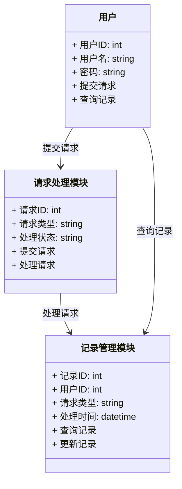
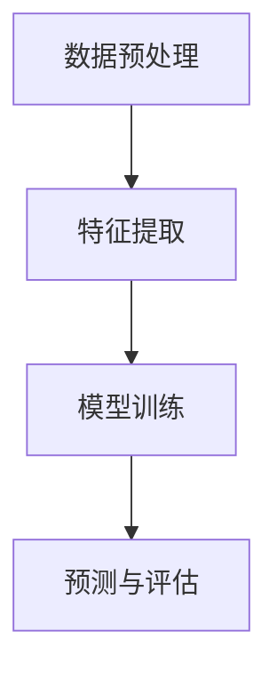
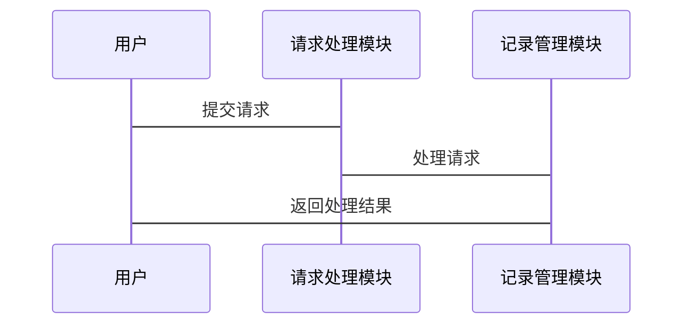

                 


# 全球股市估值与3D生物打印器官技术的伦理问题

> 关键词：全球股市估值，3D生物打印，器官技术，伦理问题，算法模型，系统架构，数学模型

> 摘要：本文将探讨全球股市估值与3D生物打印器官技术的伦理问题，通过分析股市估值的核心概念、数学模型与算法原理，以及3D生物打印技术的伦理挑战，结合系统架构与设计方案，提出解决方案。本文将从问题背景、核心概念、算法实现、系统设计、项目实战等多个角度进行详细分析，为读者提供全面的视角。

---

## 第一部分: 全球股市估值与3D生物打印器官技术的背景介绍

### 第1章: 全球股市估值的核心概念

#### 1.1 股市估值的基本原理
股票估值是通过对企业的财务数据、市场环境、行业趋势等多方面因素进行分析，以确定其市场价格是否合理的过程。常用的估值方法包括市盈率（P/E）、市净率（P/B）、股息率等。

#### 1.2 3D生物打印技术的基本原理
3D生物打印是一种通过计算机辅助技术，将生物材料逐层堆积，构建出具有特定功能的生物结构的技术。其核心在于将数字模型转化为实物，实现复杂形状和结构的精确制造。

#### 1.3 两者的关联性
股市估值与3D生物打印技术的关联性主要体现在技术进步对股市的影响和投资价值的评估上。例如，3D生物打印技术的突破可能影响相关企业的股票价格，而股市估值方法的准确性又直接影响投资者的决策。

---

## 第2章: 3D生物打印技术的伦理问题

### 2.1 技术伦理的核心问题
3D生物打印技术在医疗领域的应用引发了诸多伦理问题，包括生命伦理、知识产权、利益分配等。例如，人工器官的制造是否会影响人类器官的自然分配，技术的商业化是否会导致资源分配不均。

### 2.2 系统架构与设计方案
为了系统性地解决3D生物打印技术的伦理问题，我们需要构建一个涵盖技术、法律、伦理的综合架构。以下是系统的功能模块设计：

#### 2.2.1 功能模块设计（Mermaid类图）


#### 2.2.2 系统架构设计（Mermaid架构图）


---

## 第3章: 股市估值的数学模型与算法原理

### 3.1 股市估值的数学模型
股市估值的核心在于对企业未来现金流的折现，常用模型包括股利折现模型（DDM）和加权平均资本成本模型（WACC）。以下是股利折现模型的公式：
$$
P = \frac{D}{k - g}
$$
其中，$P$ 是股票的内在价值，$D$ 是预期股息，$k$ 是折现率，$g$ 是股息增长率。

### 3.2 基于机器学习的估值算法
随着大数据技术的发展，机器学习算法被广泛应用于股市估值。以下是基于线性回归的股市估值算法流程图：



以下是Python实现代码：
```python
import pandas as pd
from sklearn.linear_model import LinearRegression

# 数据预处理
data = pd.read_csv('stock_data.csv')
X = data[['市盈率', '市净率']]
y = data['股价']

# 模型训练
model = LinearRegression()
model.fit(X, y)

# 预测
predicted_price = model.predict(X)
```

---

## 第4章: 3D生物打印技术的伦理挑战与解决方案

### 4.1 技术伦理的系统分析
3D生物打印技术的伦理问题涉及生命伦理、知识产权、利益分配等多个方面。以下是系统的实体关系图：
```mermaid
erDiagram
    用户: 用户ID, 用户名, 密码
    请求处理模块: 请求ID, 请求类型, 处理状态
    记录管理模块: 记录ID, 用户ID, 请求类型, 处理时间
    用户 --> 请求处理模块: 提交请求
    请求处理模块 --> 记录管理模块: 处理请求
    用户 --> 记录管理模块: 查询记录
```

### 4.2 系统交互设计（Mermaid序列图）


---

## 第5章: 项目实战与系统优化

### 5.1 环境安装与配置
为了实现股市估值系统与3D生物打印系统的集成，我们需要安装以下环境：
- Python 3.8+
- Pandas、Scikit-learn、Mermaid等库

### 5.2 核心代码实现
以下是实现3D生物打印技术的伦理审核系统的代码示例：
```python
class EthicalReviewSystem:
    def __init__(self):
        self.requests = []

    def submit_request(self, user, request_type):
        new_request = {
            'user_id': user.id,
            'request_type': request_type,
            'status': 'pending'
        }
        self.requests.append(new_request)

    def process_request(self, request_id):
        request = self.requests[request_id]
        if request['status'] == 'pending':
            request['status'] = 'processing'
            # 处理逻辑
            pass

    def get_request_status(self, request_id):
        return self.requests[request_id]['status']
```

### 5.3 项目小结与最佳实践
在实现系统的过程中，我们需要注意以下几点：
- 确保系统的可扩展性，便于后续功能的添加。
- 定期进行系统维护和优化，确保系统的稳定性和安全性。
- 关注技术的前沿发展，及时更新系统的功能模块。

---

## 第6章: 总结与展望

### 6.1 总结
本文通过分析全球股市估值与3D生物打印器官技术的伦理问题，提出了系统的解决方案。通过数学模型、算法实现和系统架构的设计，为解决技术与伦理的矛盾提供了新的思路。

### 6.2 展望
未来的研究方向可以包括：
1. 探讨更多新兴技术的伦理问题。
2. 提出更高效的算法模型，提高系统的估值准确性。
3. 深入研究技术与伦理的协同进化。

---

以上是《全球股市估值与3D生物打印器官技术的伦理问题》的目录大纲及详细内容，涵盖了从理论到实践的各个方面，为读者提供了全面的视角和深入的分析。

