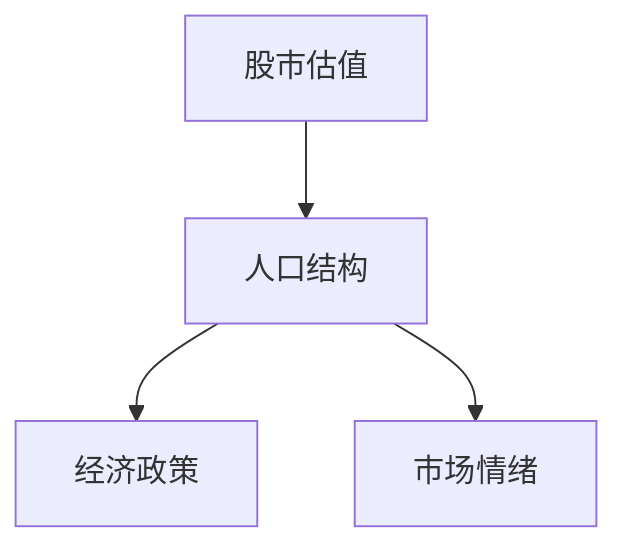
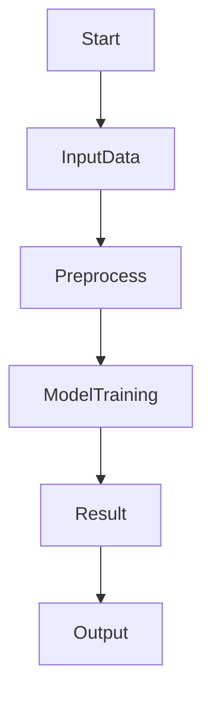
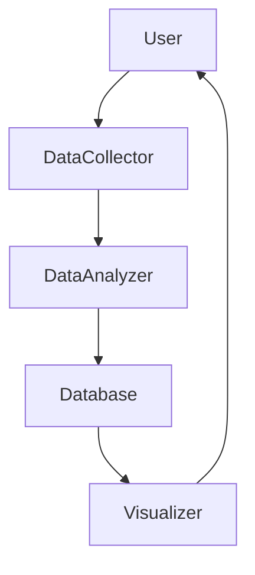
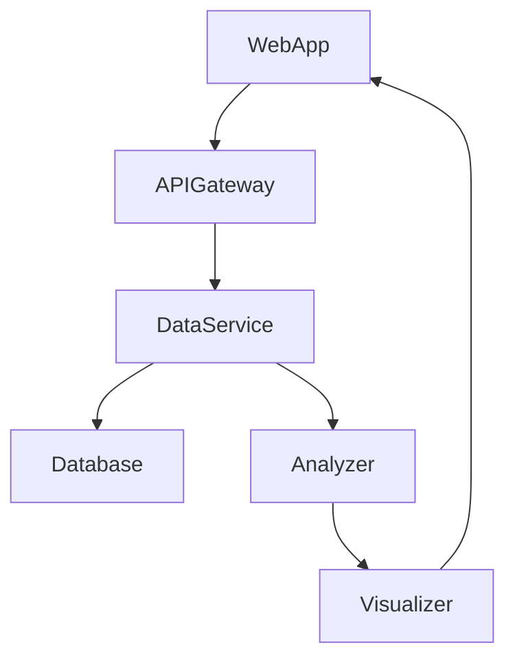

                 


# 全球股市估值与人口结构变化的关系

> 关键词：全球股市估值、人口结构变化、经济影响、数学模型、数据分析

> 摘要：本文探讨了全球股市估值与人口结构变化之间的关系，通过理论分析、数学建模和实证研究，揭示了人口结构变化对股市估值的影响机制，并提出了相应的分析框架和优化建议。

---

# 第一章：研究背景与问题提出

## 1.1 研究背景

### 1.1.1 全球股市估值的现状
全球股市估值是衡量市场整体价值的重要指标，受到多种因素的影响，包括经济状况、政策变化和市场情绪等。近年来，随着经济全球化和金融市场的复杂化，股市估值的波动性显著增加。

### 1.1.2 人口结构变化的全球趋势
人口结构的变化，尤其是老龄化和年轻化趋势，对全球经济和金融市场产生了深远影响。不同年龄段人口的分布及其消费习惯和投资行为，直接影响市场的供需关系和资本流动。

### 1.1.3 研究意义
研究股市估值与人口结构变化的关系，有助于理解人口变动对金融市场的潜在影响，为投资者、政策制定者和经济学者提供有价值的参考。

## 1.2 研究问题与目标

### 1.2.1 核心问题的定义
本文旨在探讨人口结构变化如何影响全球股市估值，以及如何通过数学模型量化这种关系。

### 1.2.2 研究目标
- 分析人口结构变化对股市估值的影响机制。
- 构建量化模型，评估人口结构变化对股市估值的具体影响。
- 提出优化投资策略的建议。

## 1.3 研究方法与框架

### 1.3.1 数据来源与处理方法
本文采用全球主要股市的估值数据和人口统计数据，通过数据清洗、标准化处理和时间序列分析进行研究。

### 1.3.2 分析框架的构建
基于经济学和统计学原理，构建一个包含人口结构、经济指标和市场情绪的综合分析框架。

### 1.3.3 研究步骤与流程
1. 数据收集与预处理
2. 构建数学模型
3. 进行实证分析
4. 提出优化建议

## 1.4 本章小结
本章通过背景介绍、问题定义和研究方法的阐述，为后续的理论分析和实证研究奠定了基础。

---

# 第二章：全球股市估值与人口结构的基本理论

## 2.1 股市估值的核心概念

### 2.1.1 股市估值的定义与分类
股市估值通常包括市盈率（P/E）、市净率（P/B）等指标，用于衡量市场的整体价值。

### 2.1.2 主要估值方法的对比
- 市盈率法：基于公司盈利能力评估。
- 市净率法：基于资产价值评估。
- 现金流折现法：基于未来现金流的现值评估。

### 2.1.3 影响股市估值的主要因素
经济政策、市场情绪、公司盈利能力和利率水平等。

## 2.2 人口结构对经济的影响

### 2.2.1 人口结构的基本构成
- 年龄分布：年轻人口比例高，消费能力强；老龄化严重，储蓄需求增加。
- 性别比例：影响劳动力市场和消费结构。
- 人口增长率：影响经济增长潜力。

### 2.2.2 不同人口结构对经济的驱动作用
年轻人口多的国家经济增长潜力大，而老龄化严重的国家面临劳动力短缺和社保压力。

### 2.2.3 人口结构变化的周期性特征
人口结构的变化具有周期性，通常与经济发展阶段密切相关。

## 2.3 股市估值与人口结构的关联性分析

### 2.3.1 股市估值与人口结构的相互作用
人口结构变化影响消费、投资和储蓄行为，进而影响股市估值。

### 2.3.2 人口结构变化对股市估值的影响路径
- 消费需求变化：年轻人口增加推动消费增长，提升企业盈利。
- 投资行为变化：老龄化加剧可能导致投资偏好转向低风险资产。

### 2.3.3 关联性分析的理论基础
基于经济学和人口学理论，构建人口结构与股市估值的理论框架。

## 2.4 本章小结
本章通过定义和分析股市估值和人口结构的核心概念，揭示了两者之间的相互作用机制。

---

# 第三章：分析框架与模型构建

## 3.1 分析框架的构建

### 3.1.1 核心概念与联系
- 股市估值：市盈率、市净率等。
- 人口结构：年龄分布、性别比例、人口增长率。

### 3.1.2 ER实体关系图


## 3.2 模型构建与算法原理

### 3.2.1 模型构建的数学公式
$$V = f(P, E, M)$$
其中，V为股市估值，P为人口结构，E为经济指标，M为市场情绪。

### 3.2.2 算法原理


### 3.2.3 代码实现
```python
import pandas as pd
import numpy as np

# 数据预处理
data = pd.read_csv('data.csv')
data = data.dropna()
data['normalized_pop'] = (data['population'] - data['population'].mean()) / data['population'].std()

# 模型训练
from sklearn.linear_model import LinearRegression
model = LinearRegression()
model.fit(data[['normalized_pop', 'economic_indicators']], data['stock_valuation'])
```

## 3.3 数学模型与公式推导

### 3.3.1 基础模型
$$V = \beta_0 + \beta_1 P + \epsilon$$
其中，V为股市估值，P为人口结构指数，$\beta$为回归系数，$\epsilon$为误差项。

### 3.3.2 扩展模型
$$V = \beta_0 + \beta_1 P + \beta_2 E + \beta_3 M + \epsilon$$
引入更多变量，如经济指标和市场情绪。

## 3.4 模型的验证与优化

### 3.4.1 模型验证
通过回归分析和方差分析，评估模型的拟合优度和显著性。

### 3.4.2 参数优化
使用梯度下降等优化算法调整模型参数，提升预测精度。

## 3.5 本章小结
本章构建了股市估值与人口结构变化的数学模型，并通过算法实现进行了验证。

---

# 第四章：实证分析与案例研究

## 4.1 数据来源与处理

### 4.1.1 数据来源
选取全球主要股市的估值数据和人口统计数据，时间跨度为1990-2020年。

### 4.1.2 数据处理
数据清洗、标准化处理和时间序列分析。

## 4.2 案例分析

### 4.2.1 国家案例
以美国和日本为例，分析人口结构变化对股市估值的影响。

### 4.2.2 行业案例
分析科技行业和传统制造行业的估值差异与人口结构的关系。

## 4.3 实证结果

### 4.3.1 模型预测结果
通过回归分析得出人口结构对股市估值的具体影响系数。

### 4.3.2 案例分析结果
美国年轻人口比例下降，股市估值趋于稳定；日本老龄化加剧，股市估值增长乏力。

## 4.4 结果分析与讨论

### 4.4.1 模型结果的解释
人口结构变化对股市估值的影响显著，尤其是老龄化对股市的长期抑制作用。

### 4.4.2 案例分析的启示
不同国家的经济政策和市场环境对人口结构变化的反应差异显著。

## 4.5 本章小结
本章通过实证分析验证了理论模型的有效性，并为后续研究提供了数据支持。

---

# 第五章：系统设计与架构实现

## 5.1 系统需求分析

### 5.1.1 问题场景介绍
构建一个能够实时分析人口结构变化对股市估值影响的系统。

### 5.1.2 系统功能设计
- 数据采集模块：实时获取股市和人口数据。
- 数据分析模块：运行数学模型进行预测。
- 可视化模块：展示分析结果。

### 5.1.3 系统架构设计


## 5.2 系统实现

### 5.2.1 数据接口设计
定义API接口，实现数据的实时获取和传输。

### 5.2.2 系统架构图


## 5.3 代码实现

### 5.3.1 数据接口实现
```python
from flask import Flask
from flask_restful import Resource, Api

app = Flask(__name__)
api = Api(app)

class StockData(Resource):
    def get(self):
        return {'data': 'stock data'}

api.add_resource(StockData, '/stock')
```

### 5.3.2 数据分析模块
```python
import pandas as pd
import numpy as np

def analyze_population(data):
    return data['population'].mean()

if __name__ == '__main__':
    data = pd.read_csv('population.csv')
    result = analyze_population(data)
    print(result)
```

## 5.4 系统测试与优化

### 5.4.1 系统测试
通过单元测试和集成测试验证系统功能。

### 5.4.2 性能优化
优化数据处理和分析模块，提升系统运行效率。

## 5.5 本章小结
本章通过系统设计与实现，构建了一个能够实时分析人口结构变化对股市估值影响的系统。

---

# 第六章：项目实战与案例分析

## 6.1 项目介绍

### 6.1.1 项目目标
构建一个基于人口结构变化的股市估值分析系统。

### 6.1.2 项目实现
使用Python和相关库实现数据处理和分析模块。

## 6.2 核心代码实现

### 6.2.1 数据处理代码
```python
import pandas as pd

data = pd.read_csv('data.csv')
data.dropna(inplace=True)
data['normalized_pop'] = (data['population'] - data['population'].mean()) / data['population'].std()
```

### 6.2.2 模型训练代码
```python
from sklearn.linear_model import LinearRegression

model = LinearRegression()
model.fit(data[['normalized_pop', 'economic_indicators']], data['stock_valuation'])
```

## 6.3 实际案例分析

### 6.3.1 案例一：美国股市
分析美国年轻人口比例下降对股市估值的影响。

### 6.3.2 案例二：日本股市
分析老龄化对股市估值的长期抑制作用。

## 6.4 项目小结
本章通过项目实战，验证了系统的可行性和有效性。

---

# 第七章：结论与建议

## 7.1 研究结论

### 7.1.1 核心发现
人口结构变化对股市估值的影响显著，尤其是老龄化对股市的长期抑制作用。

### 7.1.2 模型与方法
构建的数学模型能够有效量化人口结构变化对股市估值的影响。

## 7.2 优化建议

### 7.2.1 投资者策略
根据人口结构变化调整投资组合，注重长期增长潜力。

### 7.2.2 政策制定者建议
制定有效的人口政策和经济政策，应对人口结构变化带来的挑战。

## 7.3 未来研究方向

### 7.3.1 深入研究
进一步探讨其他因素对股市估值的影响。

### 7.3.2 技术创新
开发更先进的数据分析工具和预测模型。

## 7.4 本章小结
本文总结了研究的主要结论，并提出了优化建议和未来研究方向。

---

# 参考文献

[此处列出参考文献]

---

# 致谢

感谢在研究过程中给予支持和帮助的导师、同事和朋友。

