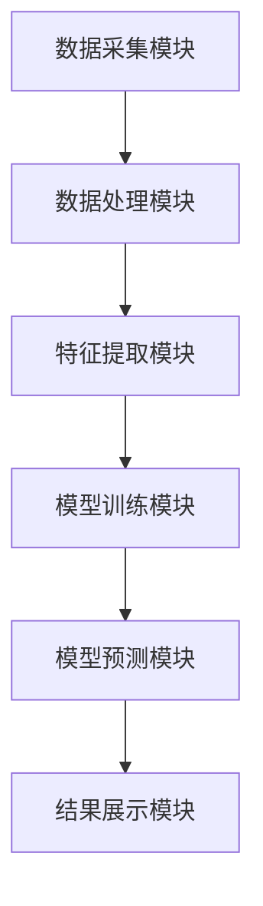
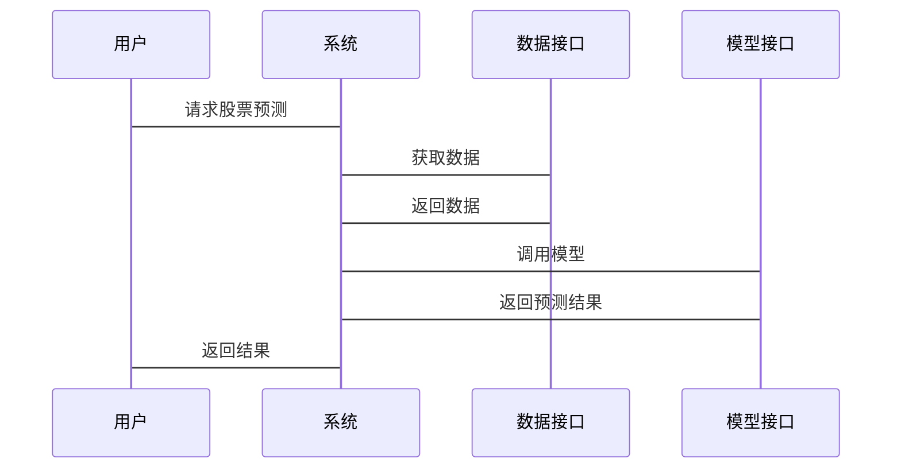

                 


# 全球股市估值与人工智能在司法系统中的应用

## 关键词：全球股市估值，人工智能，司法系统，机器学习，深度学习，自然语言处理

## 摘要：  
本文探讨了人工智能在金融和司法领域的应用，重点分析了股市估值和司法系统中的技术原理和实际应用。通过详细讲解时间序列分析、深度学习模型和自然语言处理技术，结合系统架构设计和项目实战，展示了AI如何提升股市预测的准确性并优化司法决策的透明度和效率。

---

# 第1章: 全球股市估值的背景与现状

## 1.1 股市估值的基本概念

### 1.1.1 股市估值的定义与作用
股市估值是通过对公司财务数据、市场趋势和宏观经济指标的分析，评估公司股票的合理价格范围。其作用在于帮助投资者做出理性决策，避免市场波动带来的风险。

### 1.1.2 股市估值的核心要素
- **公司基本面**：收入、利润、资产负债表等财务数据。
- **市场环境**：宏观经济指标（GDP、利率）和市场情绪。
- **行业趋势**：行业竞争格局和技术进步。

### 1.1.3 全球股市估值的现状与趋势
随着全球化的加剧，股市估值的复杂性增加，传统方法已难以应对高频交易和非线性波动，AI技术的应用成为必然趋势。

## 1.2 传统股市估值方法

### 1.2.1 市盈率（P/E）分析
$$ P/E = \frac{\text{股价}}{\text{每股收益}} $$
- 优点：简单易懂。
- 缺点：无法反映公司未来增长潜力。

### 1.2.2 市净率（P/B）分析
$$ P/B = \frac{\text{股价}}{\text{每股净资产}} $$
- 优点：适用于资产密集型行业。
- 缺点：忽视了收益和现金流。

### 1.2.3 股息率分析
$$ 股息率 = \frac{\text{每股股息}}{\text{股价}} $$
- 优点：适合追求稳定收益的投资者。
- 缺点：高股息率可能意味着公司增长潜力有限。

## 1.3 人工智能在股市估值中的潜力

### 1.3.1 数据驱动的估值方法
AI可以通过大数据分析，提取传统方法难以捕捉的市场信号。

### 1.3.2 机器学习在股市预测中的应用
- **监督学习**：使用历史数据训练模型，预测未来价格。
- **无监督学习**：发现市场中的隐藏模式。

### 1.3.3 大数据分析与股市估值的关系
通过分析社交媒体、新闻和交易数据，AI可以更全面地评估市场情绪和风险。

## 1.4 本章小结
传统估值方法有局限性，AI通过大数据和深度学习提供了更精准的预测工具，但需结合市场环境和公司基本面进行综合判断。

---

# 第2章: 人工智能在司法系统中的应用背景

## 2.1 司法系统的现状与挑战

### 2.1.1 司法系统的基本构成
- 法院、检察院、律师事务所等机构。
- 案件审理、法律文书撰写、判决执行等流程。

### 2.1.2 司法系统中的效率问题
- 案件处理周期长，资源分配不均。
- 人工审查效率低，容易出错。

### 2.1.3 司法系统中的公平性问题
- 人为因素可能影响判决公正性。
- 司法透明度不足，公众信任度低。

## 2.2 人工智能在司法系统中的潜在应用

### 2.2.1 司法文书的自动化处理
- **自动分词与实体识别**：使用自然语言处理技术提取关键信息。
- **智能合同审查**：识别法律条款中的潜在风险。

### 2.2.2 案件预测与风险评估
- **案件分类**：利用监督学习模型对案件类型进行分类。
- **风险评估**：预测案件的执行风险和上诉概率。

### 2.2.3 司法透明度的提升
- **公开数据平台**：AI分析和整理司法数据，提高透明度。
- **司法知识图谱**：构建法律知识网络，辅助法官和律师决策。

## 2.3 人工智能与司法系统的结合意义

### 2.3.1 提高司法效率
- AI辅助减少重复性工作，加快案件处理速度。
- 智能检索系统提高法律文书的查找效率。

### 2.3.2 优化司法决策
- 数据驱动的分析提供更全面的案件背景信息。
- AI辅助生成判决建议，降低人为错误。

### 2.3.3 促进司法公平
- AI处理数据时不受主观因素影响，确保公正性。
- 提高司法透明度，增强公众信任。

## 2.4 本章小结
AI技术的应用可以显著提高司法系统的效率和公平性，但需注意数据隐私和算法公平性问题。

---

# 第3章: 全球股市估值的核心算法与模型

## 3.1 时间序列分析

### 3.1.1 时间序列的基本概念
时间序列是指按时间顺序排列的数据，常用于预测未来趋势。

### 3.1.2 ARIMA模型的原理与应用
ARIMA（自回归积分滑动平均模型）适用于线性时间序列数据。
$$ ARIMA(p, d, q) $$
- p：自回归阶数。
- d：差分阶数。
- q：移动平均阶数。

### 3.1.3 LSTM模型的原理与应用
LSTM（长短期记忆网络）适用于非线性时间序列数据，擅长捕捉长期依赖关系。

## 3.2 机器学习在股市预测中的应用

### 3.2.1 线性回归模型
$$ y = \beta_0 + \beta_1x + \epsilon $$
适用于简单线性关系的预测。

### 3.2.2 支持向量机（SVM）模型
通过构建超平面进行分类，适用于非线性关系。

### 3.2.3 随机森林模型
集成学习方法，通过多个决策树投票进行预测，具有高准确性和鲁棒性。

## 3.3 深度学习在股市估值中的应用

### 3.3.1 卷积神经网络（CNN）的应用
适用于处理图像和序列数据，用于分析K线图和市场情绪。

### 3.3.2 循环神经网络（RNN）的应用
适用于时间序列预测，捕捉市场趋势。

### 3.3.3 图神经网络（GNN）的应用
用于分析市场网络结构，预测行业联动效应。

## 3.4 本章小结
深度学习模型在处理复杂非线性关系方面具有优势，但需注意过拟合和数据质量问题。

---

# 第4章: 人工智能在司法系统中的核心算法与模型

## 4.1 自然语言处理在司法文书中的应用

### 4.1.1 分词与实体识别
- 分词：将文本分割成词或短语。
- 实体识别：识别人名、地名、组织名等。

### 4.1.2 句法分析与语义理解
- 句法分析：分析句子结构。
- 语义理解：理解文本含义。

### 4.1.3 文本相似度计算
使用余弦相似度或Word2Vec计算文本相似度。

## 4.2 监督学习在司法案例分类中的应用

### 4.2.1 支持向量机（SVM）模型
用于案件分类，如民事、刑事等。

### 4.2.2 随机森林模型
用于预测案件结果，如胜诉概率。

### 4.2.3 神经网络模型
用于复杂案件分类，如合同纠纷类型。

## 4.3 司法透明度与知识图谱构建

### 4.3.1 司法知识图谱的构建
- 数据抽取：从司法文书提取信息。
- 实体关联：构建案件、法律条款的关联关系。

### 4.3.2 知识图谱的应用
- 智能检索：快速查找相关案例。
- 司法决策支持：辅助法官和律师决策。

## 4.4 本章小结
自然语言处理和机器学习技术为司法系统提供了强大的数据处理和分析能力，但需注意数据隐私和算法公平性。

---

# 第5章: 系统架构设计与项目实战

## 5.1 系统功能设计

### 5.1.1 全球股市估值模块
- 数据采集：实时采集股票数据。
- 数据处理：清洗和特征提取。
- 模型预测：使用深度学习模型进行预测。

### 5.1.2 司法系统模块
- 文本处理：自动处理司法文书。
- 案件分类：使用机器学习模型分类案件。
- 风险评估：预测案件风险。

## 5.2 系统架构设计

### 5.2.1 系统功能模块
- 数据层：数据采集、存储和管理。
- 业务逻辑层：模型训练和预测。
- 用户界面层：展示结果和交互界面。

### 5.2.2 系统架构图


## 5.3 系统接口设计

### 5.3.1 API接口
- 数据接口：获取实时股票数据。
- 模型接口：调用AI模型进行预测。

### 5.3.2 接口设计图


## 5.4 项目实战

### 5.4.1 环境配置
- 安装Python、TensorFlow、Keras等库。

### 5.4.2 核心实现代码
```python
import numpy as np
from sklearn.metrics import accuracy_score
from tensorflow.keras.models import Sequential
from tensorflow.keras.layers import LSTM, Dense, Dropout

# 示例：LSTM模型训练股票价格预测
def build_model(input_shape):
    model = Sequential()
    model.add(LSTM(units=50, return_sequences=True, input_shape=input_shape))
    model.add(Dropout(0.2))
    model.add(LSTM(units=50, return_sequences=False))
    model.add(Dense(1))
    model.compile(loss='mean_squared_error', optimizer='adam')
    return model

# 数据准备
X_train = np.random.randn(100, 1, 50)
y_train = np.random.randn(100, 1)

# 模型训练
model = build_model((1, 50))
model.fit(X_train, y_train, epochs=10, batch_size=32)

# 模型预测
X_test = np.random.randn(20, 1, 50)
y_pred = model.predict(X_test)
```

### 5.4.3 实际案例分析
通过具体案例展示AI在股市预测和司法决策中的实际应用效果。

## 5.5 本章小结
通过系统架构设计和项目实战，展示了如何将AI技术应用于实际场景，提升股市估值的准确性和司法决策的效率。

---

# 第6章: 结论与展望

## 6.1 本文总结
本文详细探讨了AI在股市估值和司法系统中的应用，分析了传统方法的局限性和AI技术的优势。

## 6.2 未来研究方向
- 提升模型的可解释性。
- 引入多模态数据，如图像和视频。
- 加强算法的公平性，避免偏见。

## 6.3 应用前景
AI技术将进一步渗透到金融和司法领域，推动行业智能化和数字化转型。

## 6.4 本章小结
AI技术的应用前景广阔，但仍需在技术、法律和伦理层面进行深入研究。

---

# 结语

人工智能正在改变我们对金融和司法的认知方式。通过本文的分析，我们看到了AI在提升股市估值准确性和优化司法决策中的巨大潜力。未来，随着技术的不断发展，AI将在更多领域展现其价值。

---

**参考文献**  
[此处列出相关参考文献]

---

**附录**  
[此处列出附录内容，如代码、数据表等]

