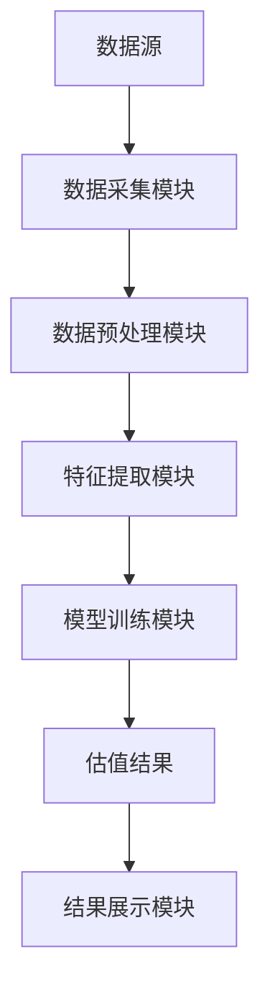
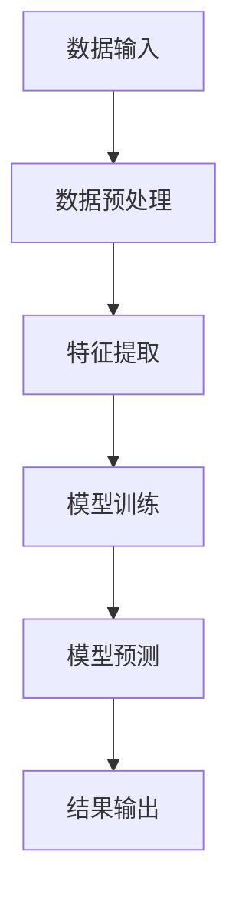

                 


# 全球股市估值与人工智能在城市规划中的应用

> 关键词：全球股市估值，人工智能，城市规划，机器学习，投资分析

> 摘要：本文探讨了全球股市估值的核心方法与人工智能技术在城市规划中的创新应用，详细分析了人工智能如何通过数据挖掘、模式识别和预测模型提升股市估值的准确性和效率，以及在城市交通优化、土地利用规划和城市扩展预测中的应用案例。文章结合理论与实践，深入解析了人工智能在这两个领域的技术原理、系统架构和实际效益，为投资者和城市规划者提供了新的思路和工具。

---

## 第一章：全球股市估值的核心方法与挑战

### 1.1 股市估值的基本概念

股市估值是通过对企业的财务状况、行业地位、市场前景等多方面因素的分析，确定股票的内在价值，从而判断其市场价格是否合理。常见的估值指标包括市盈率（PE）、市净率（PB）、股息率等。

- **市盈率（PE）**：股票价格与每股收益的比率，反映市场对公司盈利能力的预期。
- **市净率（PB）**：股票价格与每股净资产的比率，适用于评估资产密集型企业的价值。
- **股息率**：年度股息与股票价格的比率，用于衡量投资回报。

### 1.2 股市估值的主要方法

1. **基本面分析**：通过分析公司的财务报表、行业地位、竞争优势等，评估其内在价值。
2. **技术分析**：通过研究历史价格走势、成交量等市场数据，预测未来价格变动。
3. **相对估值法**：将目标公司的估值与同行业公司进行比较，寻找合理的估值区间。

### 1.3 股市估值的主要挑战

- **数据复杂性**：股市数据受到宏观经济、行业趋势、公司基本面等多种因素的影响，分析难度大。
- **市场情绪的影响**：投资者情绪波动可能导致股价短期偏离其实际价值。
- **模型局限性**：传统估值模型难以捕捉市场中的非线性关系和突发事件的影响。

---

## 第二章：人工智能在城市规划中的创新应用

### 2.1 人工智能与城市规划的结合背景

随着城市化进程的加快，城市规划的复杂性日益增加，传统的人工规划方法效率低下，难以应对大数据时代的挑战。人工智能技术的引入，为城市规划提供了新的解决方案。

- **数据驱动**：利用大数据分析城市交通、土地利用、人口分布等信息，提供科学的决策依据。
- **自动化与智能化**：通过机器学习算法，自动识别城市发展模式，优化城市结构。

### 2.2 人工智能在城市规划中的主要应用场景

1. **城市交通优化**：
   - 利用机器学习模型分析交通流量，预测高峰时段的拥堵情况，优化交通信号灯配置。
   - 通过实时数据调整公交路线，提高公共交通效率。

2. **土地利用规划**：
   - 基于卫星图像和GIS数据，训练深度学习模型识别土地利用类型，优化土地分配。
   - 预测城市扩展区域，合理规划新区建设。

3. **城市设计与风貌保护**：
   - 利用计算机视觉技术分析城市风貌，保护历史建筑，指导新建筑的设计风格。
   - 通过虚拟现实技术模拟城市景观，评估不同设计方案的视觉效果。

### 2.3 人工智能在城市规划中的优势

- **高效性**：通过自动化处理大量数据，提高规划效率。
- **精准性**：利用机器学习模型分析复杂数据，提供更精确的规划建议。
- **可扩展性**：适用于不同规模和类型的城市规划项目。

---

## 第三章：人工智能在股市估值中的应用

### 3.1 人工智能在股市分析中的优势

- **数据处理能力**：能够处理海量的历史数据，发现传统方法难以察觉的规律。
- **模式识别能力**：通过训练模型识别价格走势中的非线性关系，提高预测准确性。
- **实时性**：可以实时分析市场动态，提供及时的投资建议。

### 3.2 基于机器学习的股市预测模型

1. **数据特征提取**：
   - 从历史价格、成交量、技术指标等多维度提取特征。
   - 使用主成分分析（PCA）降低特征维度，提高模型效率。

2. **模型训练与优化**：
   - 采用神经网络（如LSTM）进行时间序列预测。
   - 通过网格搜索优化模型参数，提高预测精度。

3. **模型评估与验证**：
   - 使用均方误差（MSE）、R平方值等指标评估模型性能。
   - 采用交叉验证防止过拟合，确保模型的泛化能力。

### 3.3 人工智能在投资决策中的应用

- **量化交易**：基于机器学习模型生成交易信号，实现自动化交易。
- **风险控制**：通过实时监控市场风险，调整投资组合，降低风险敞口。

---

## 第四章：系统架构与算法设计

### 4.1 股市估值与AI结合的系统架构

1. **系统功能模块**：
   - 数据采集模块：收集股票价格、财务报表等数据。
   - 数据预处理模块：清洗数据，提取特征。
   - 模型训练模块：训练机器学习模型，生成估值结果。
   - 结果展示模块：可视化估值结果，提供投资建议。

2. **系统架构图（Mermaid）**



### 4.2 机器学习算法实现

1. **算法流程图（Mermaid）**



2. **算法实现代码示例（Python）**

```python
import numpy as np
import pandas as pd
from sklearn.model_selection import train_test_split
from sklearn.linear_model import LinearRegression
from sklearn.metrics import mean_squared_error

# 数据加载与预处理
data = pd.read_csv('stock_data.csv')
X = data[['PE', 'PB', 'dividend_yield']]
y = data['estimated_price']

# 数据分割
X_train, X_test, y_train, y_test = train_test_split(X, y, test_size=0.2, random_state=42)

# 模型训练
model = LinearRegression()
model.fit(X_train, y_train)

# 模型预测
y_pred = model.predict(X_test)

# 模型评估
mse = mean_squared_error(y_test, y_pred)
print(f'Mean Squared Error: {mse}')
```

3. **算法数学模型与公式**

$$
\hat{y} = \beta_0 + \beta_1x_1 + \beta_2x_2 + \ldots + \beta_nx_n
$$

其中，$$\hat{y}$$ 是预测的股票价格，$$x_i$$ 是各个特征变量，$$\beta_i$$ 是对应的回归系数。

---

## 第五章：项目实战与案例分析

### 5.1 项目环境搭建

1. **开发工具安装**：
   - 安装Python、Jupyter Notebook、TensorFlow、Keras等工具。
   - 安装GIS和数据可视化工具，如QGIS、ArcGIS。

2. **数据集准备**：
   - 股票数据：获取历史股价、财务报表等数据。
   - 城市数据：获取卫星图像、土地利用数据、交通数据等。

3. **环境配置**：
   - 安装必要的库和插件。
   - 配置数据存储路径和接口。

### 5.2 系统核心实现

1. **数据预处理**：
   - 清洗数据，处理缺失值和异常值。
   - 数据标准化或归一化处理。

2. **模型实现**：
   - 使用神经网络模型进行股票价格预测。
   - 利用机器学习算法优化城市交通流量。

3. **结果展示**：
   - 可视化股票估值结果。
   - 展示城市规划优化方案。

### 5.3 案例分析

#### 5.3.1 股市预测案例

某股票的历史数据如下：

| 日期   | 收盘价 | PE   | PB   | Dividend Yield |
|--------|--------|------|------|----------------|
| 2023-01| 100    | 15   | 3    | 2%             |
| 2023-02| 105    | 16   | 3.2  | 2%             |
| ...     | ...     | ...   | ...   | ...            |

通过机器学习模型预测该股票的价格走势，并根据模型结果制定投资策略。

#### 5.3.2 城市规划案例

某城市计划扩展新区，利用AI模型分析土地利用潜力，预测扩展区域，并优化交通网络设计，确保新区发展的可持续性。

---

## 第六章：总结与展望

### 6.1 总结

本文详细探讨了全球股市估值的核心方法与人工智能在城市规划中的创新应用。通过分析人工智能如何提升股市估值的准确性和效率，以及在城市交通优化、土地利用规划等方面的应用案例，展示了人工智能技术在实际中的巨大潜力。

### 6.2 展望

随着人工智能技术的不断发展，其在股市估值和城市规划中的应用将更加广泛和深入。未来，可以通过集成学习、强化学习等更高级的算法，进一步提高模型的预测精度和可解释性。同时，多模态数据的融合分析也将为城市规划和投资决策提供更全面的解决方案。

---

### 最佳实践 Tips

- 在进行股市估值时，建议结合多种估值方法，综合考虑宏观经济和公司基本面因素。
- 在应用人工智能技术时，要注意数据质量和模型的可解释性，避免因为数据偏差或模型过拟合导致的错误决策。

### 小结

人工智能作为一项革命性的技术，正在改变我们对股市估值和城市规划的认知和实践方式。通过本文的探讨，我们看到了人工智能在提升投资效率和优化城市结构方面的巨大潜力，也为未来的进一步研究和应用提供了宝贵的参考。

---

### 参考文献

1. 《投资学基础》
2. 《机器学习实战》
3. 《城市规划与人工智能》
4. 相关学术论文与研究报告

---

通过以上内容，我们系统地介绍了全球股市估值与人工智能在城市规划中的应用，结合理论与实践，为读者提供了全面而深入的分析。希望本文能为投资者和城市规划者在利用人工智能技术优化决策过程中提供有价值的参考和启发。

