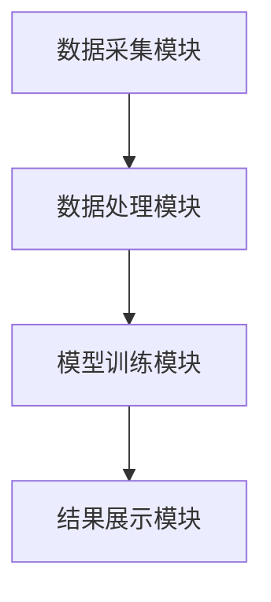

                 


# 全球股市估值与人工智能在法律合规中的应用

## 关键词

- 全球股市估值
- 人工智能
- 法律合规
- 机器学习
- 数据分析

## 摘要

本文探讨了人工智能在股市估值和法律合规中的应用。首先，介绍了股市估值的基本概念和挑战，然后详细分析了人工智能技术如何在法律合规中发挥作用。通过具体案例和算法原理的讲解，展示了AI在提升股市估值准确性和确保法律合规中的潜力和应用前景。

---

# 全球股市估值与人工智能在法律合规中的应用

## 第1章：全球股市估值概述

### 1.1 股市估值的基本概念

#### 1.1.1 股市估值的定义

股市估值是指通过对公司财务数据、市场趋势和其他相关信息进行分析，确定股票的内在价值或市场价值的过程。其目的是帮助投资者做出更明智的投资决策。

#### 1.1.2 股市估值的核心要素

- **公司基本面**：包括收入、利润、资产负债表等财务指标。
- **市场因素**：如整体市场走势、行业趋势。
- **宏观经济因素**：如利率、通货膨胀、政策变化等。
- **市场情绪**：投资者情绪和市场心理对股价的影响。

#### 1.1.3 股市估值的重要性

准确的股市估值可以帮助投资者识别被低估或高估的股票，降低投资风险，提高投资回报率。

### 1.2 全球股市估值的现状与挑战

#### 1.2.1 全球股市的多样性

全球股市分布广泛，涵盖不同国家和地区的经济体系，每个市场的特点和风险因素各不相同。

#### 1.2.2 股市估值的主要挑战

- 数据复杂性：涉及大量非结构化数据，如新闻、社交媒体等。
- 市场波动性：突发事件和市场情绪变化会影响股价。
- 数据获取难度：高质量数据的获取成本高且不易得。

#### 1.2.3 技术在股市估值中的作用

技术进步，尤其是人工智能和大数据技术的应用，显著提升了股市估值的效率和准确性。

---

## 第2章：人工智能在法律合规中的应用

### 2.1 法律合规的基本概念

#### 2.1.1 法律合规的定义

法律合规是指企业或组织在经营活动中遵守相关法律法规和行业规范，确保行为的合法性和正当性。

#### 2.1.2 法律合规的核心要素

- **法律框架**：了解和遵守相关法律法规。
- **合规流程**：建立系统的合规管理流程。
- **风险控制**：识别和防范合规风险。

### 2.2 人工智能

#### 2.2.1 人工智能的核心概念

人工智能（AI）是指模拟人类智能的计算机系统，能够执行学习、推理、识别和解决问题等任务。

#### 2.2.2 人工智能在法律合规中的应用

- **合同审查**：利用自然语言处理（NLP）技术自动审查合同，识别潜在法律风险。
- **法律咨询**：通过AI系统提供法律咨询服务，帮助用户快速获取法律信息。
- **合规监控**：实时监控企业行为，确保符合相关法规。

---

## 第3章：人工智能在股市估值中的应用

### 3.1 机器学习算法

#### 3.1.1 算法原理

机器学习通过训练模型从数据中学习模式，进而进行预测或分类。

#### 3.1.2 算法实现

- **线性回归**：用于预测股票价格。
- **支持向量机（SVM）**：用于分类问题。
- **随机森林**：用于特征重要性分析。

#### 3.1.3 算法优缺点

- **优点**：高准确性，能够处理复杂数据。
- **缺点**：需要大量数据，模型解释性较差。

### 3.2 数据分析

#### 3.2.1 数据清洗

- 去除缺失值和异常值。
- 标准化数据。

#### 3.2.2 数据建模

- 使用Python和机器学习库（如scikit-learn）进行建模。
- 通过交叉验证优化模型。

#### 3.2.3 结果解读

- 分析模型预测结果，识别影响股价的关键因素。

---

## 第4章：系统架构与设计

### 4.1 系统架构

#### 4.1.1 系统功能模块

- 数据采集模块：收集股票数据和相关市场信息。
- 数据处理模块：清洗和预处理数据。
- 模型训练模块：训练机器学习模型。
- 结果展示模块：可视化分析结果。

#### 4.1.2 系统架构图



---

## 第5章：项目实战

### 5.1 项目环境安装

- 安装Python和相关库（如pandas、scikit-learn、matplotlib）。
- 数据源：获取历史股票数据。

### 5.2 核心代码实现

```python
import pandas as pd
from sklearn.linear_model import LinearRegression
from sklearn.metrics import mean_squared_error

# 数据加载
data = pd.read_csv('stock_data.csv')

# 特征选择
features = data[['open', 'high', 'low', 'volume']]
target = data['close']

# 模型训练
model = LinearRegression()
model.fit(features, target)

# 预测
predictions = model.predict(features)
print('均方误差:', mean_squared_error(target, predictions))
```

### 5.3 案例分析

通过实际数据，展示模型预测结果，并分析其准确性。

---

## 第6章：最佳实践与小结

### 6.1 小结

本文详细介绍了全球股市估值和人工智能在法律合规中的应用，展示了如何利用AI技术提升股市估值的准确性和合规性。

### 6.2 注意事项

- 数据质量是关键，需确保数据的完整性和准确性。
- 模型选择应根据具体问题进行调整。
- 合规性是首要考虑因素，确保系统符合相关法规。

### 6.3 未来研究方向

- 结合更多AI技术，如深度学习，提升模型性能。
- 探讨AI在法律合规中的更多应用场景。

---

## 第7章：扩展阅读

### 7.1 推荐书籍

- 《机器学习实战》
- 《Python机器学习》

### 7.2 学术论文

- "Using AI for Stock Market Prediction"
- "AI in Legal Compliance"

### 7.3 在线资源

- Kaggle数据集
- GitHub开源项目

---

通过本文的系统介绍，读者可以深入了解如何利用人工智能技术提升股市估值和法律合规的效率与准确性，为未来的投资和合规管理提供有力支持。

