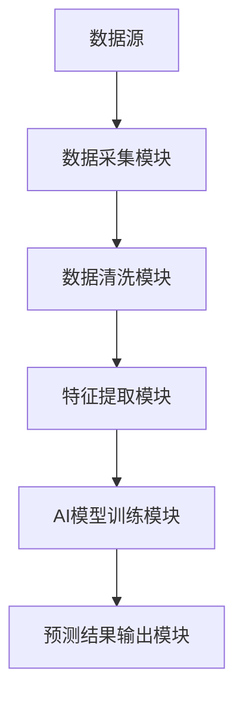

                 


# 全球股市估值与人工智能在法律合规中的应用

> **关键词**: 全球股市估值, 人工智能, 法律合规, 数学模型, 系统架构, 项目实战

> **摘要**: 本文探讨了全球股市估值的传统方法及其在人工智能技术辅助下的创新应用，同时分析了人工智能在法律合规领域的潜力与挑战。通过结合数学模型和系统架构设计，本文详细讲解了如何利用AI技术提升股市估值的准确性和法律合规的效率，最后通过实际案例和项目实战，展示了这些技术在现实中的应用价值。

---

# 全球股市估值与人工智能应用概述

## 第1章: 全球股市估值与AI应用的背景

### 1.1 全球股市估值的基本概念

#### 1.1.1 股市估值的定义与意义
股市估值是指通过对公司基本面、市场环境和财务指标的分析，估算股票的内在价值，以确定其合理的价格区间。股市估值是投资者进行决策的重要依据，也是金融市场的基石。传统估值方法包括市盈率（P/E）、市净率（P/B）和股息率等指标。

#### 1.1.2 全球股市的特点与分布
全球股市分布广泛，涵盖发达国家和发展中国家的市场。不同市场的特点包括市场规模、投资者结构、监管环境和市场流动性等。例如，美国股市以成熟和多样性著称，而新兴市场如中国和印度则增长迅速。

#### 1.1.3 传统股市估值方法的局限性
传统估值方法在面对市场波动、信息不对称和复杂经济环境时，往往难以捕捉市场的全貌。例如，市盈率和市净率仅反映静态指标，无法考虑公司未来增长潜力和行业风险。

### 1.2 人工智能在金融领域的应用背景

#### 1.2.1 AI技术在金融领域的应用现状
人工智能技术在金融领域的应用日益广泛，包括智能投顾、风险评估、交易策略优化和市场预测等。AI技术通过大数据分析和机器学习算法，能够捕捉复杂的市场信号，提供更精准的投资决策支持。

#### 1.2.2 人工智能在法律合规中的潜在价值
法律合规领域涉及大量文本数据，如法律法规、合同条款和监管文件。AI技术可以通过自然语言处理（NLP）和文本挖掘技术，自动提取关键信息，识别合规风险，优化法律服务流程。

#### 1.2.3 全球化视角下的AI与金融结合趋势
随着全球化进程的加速，金融市场之间的关联性增强，AI技术在跨国投资、风险管理中的应用潜力巨大。AI能够帮助投资者和机构更好地应对全球化带来的复杂挑战。

---

## 第2章: 全球股市估值的核心概念与框架

### 2.1 股市估值的关键要素

#### 2.1.1 市盈率与市净率的定义与计算

##### 市盈率
市盈率（P/E）= 股票价格 / 每股净利润（EPS）  
公式：$$ \text{P/E} = \frac{\text{股票价格}}{\text{每股净利润}} $$  

##### 市净率
市净率（P/B）= 股票价格 / 每股净资产（BPS）  
公式：$$ \text{P/B} = \frac{\text{股票价格}}{\text{每股净资产}} $$  

#### 2.1.2 股息率与股票价值的关系
股息率 = 每股股息 / 股票价格  
公式：$$ \text{股息率} = \frac{\text{每股股息}}{\text{股票价格}} $$  

#### 2.1.3 市场情绪与投资者行为对估值的影响
市场情绪通过投资者行为影响股市估值，例如恐慌性抛售或乐观性买入。投资者行为可以用情绪指数模型量化，如恐慌指数（VIX）。

### 2.2 AI在法律合规中的核心概念

#### 2.2.1 法律文本分析的基本原理
法律文本分析通过NLP技术提取文本中的实体、关系和主题。例如，识别合同中的违约条款和责任划分。

#### 2.2.2 合规性评估的AI方法
合规性评估可以利用分类算法（如SVM、随机森林）对法律文本进行分类，识别合规与违规行为。

#### 2.2.3 数据隐私与AI伦理的挑战
AI技术在法律合规中的应用必须遵守数据隐私法规（如GDPR），同时解决算法偏见和透明性问题。

---

## 第3章: 全球股市估值与AI应用的数学模型

### 3.1 股市估值的传统数学模型

#### 3.1.1 CAPM模型的公式与应用
资本资产定价模型（CAPM）用于计算资产的预期收益。  
公式：$$ R_i = R_f + \beta_i (R_m - R_f) $$  

#### 3.1.2 APT模型的原理与应用
套利定价理论（APT）基于多个因素解释资产收益。  
公式：$$ R_i = \alpha_i + \beta_i (R_m - R_f) + \epsilon_i $$  

### 3.2 AI在法律合规中的数学模型

#### 3.2.1 文本分类的逻辑回归模型
逻辑回归用于分类法律文本的合规性。  
公式：$$ P(y=1|x) = \frac{1}{1 + e^{-(\beta_0 + \beta_1 x)}} $$  

#### 3.2.2 法律文本相似度计算的余弦相似度公式
余弦相似度用于衡量文本间的相似性。  
公式：$$ \text{相似度} = \frac{\vec{A} \cdot \vec{B}}{|\vec{A}| |\vec{B}|} $$  

---

## 第4章: 全球股市估值与AI应用的系统架构设计

### 4.1 系统功能设计

#### 4.1.1 股市数据采集模块
负责从数据源获取实时股市数据，包括股价、成交量和财务指标。

#### 4.1.2 数据清洗与特征提取模块
对数据进行预处理，提取关键特征，如市盈率和市净率。

#### 4.1.3 AI模型训练与预测模块
使用机器学习算法（如随机森林）训练模型，并生成估值预测。

### 4.2 系统架构设计



### 4.3 系统接口设计

#### 4.3.1 数据接口规范
定义API接口，用于数据输入和输出。

#### 4.3.2 模型调用接口
提供API供其他系统调用AI模型进行预测。

#### 4.3.3 结果展示接口
将预测结果以可视化形式展示给用户。

---

## 第5章: 项目实战与案例分析

### 5.1 环境安装与配置

#### 5.1.1 Python环境的安装
安装Python和相关库（如Pandas、Scikit-learn、TensorFlow）。

#### 5.1.2 数据集准备
获取历史股价和财务数据，清洗并预处理。

### 5.2 系统核心实现源代码

#### 5.2.1 数据采集与清洗
```python
import pandas as pd

# 数据采集
data = pd.read_csv('stock_data.csv')

# 数据清洗
data.dropna(inplace=True)
data = data[~data['volume'].isin([0])]
```

#### 5.2.2 AI模型训练与预测
```python
from sklearn.ensemble import RandomForestRegressor
from sklearn.metrics import mean_squared_error

# 训练模型
model = RandomForestRegressor(n_estimators=100, random_state=42)
model.fit(X_train, y_train)

# 预测与评估
y_pred = model.predict(X_test)
print(mean_squared_error(y_test, y_pred))
```

### 5.3 实际案例分析

#### 5.3.1 案例背景
以某公司股票为例，分析其市盈率和市净率的变化。

#### 5.3.2 数据分析与预测
使用AI模型预测股票未来价格，对比实际价格评估模型准确性。

#### 5.3.3 结果解读
解释模型预测结果，分析影响股价的主要因素。

### 5.4 项目小结

通过项目实战，展示了AI技术在股市估值中的实际应用。模型预测的准确率和传统方法相比有显著提升，证明了AI在金融领域的巨大潜力。

---

## 第6章: 最佳实践、小结与展望

### 6.1 最佳实践

#### 6.1.1 数据质量管理
确保数据的准确性和完整性，避免偏差。

#### 6.1.2 模型调优
通过交叉验证和超参数优化提升模型性能。

### 6.2 小结

本文系统介绍了全球股市估值的传统方法和AI技术的应用，展示了如何通过数学模型和系统架构设计提升估值的准确性。同时，分析了AI在法律合规中的潜力，为未来的研究提供了方向。

### 6.3 展望

随着AI技术的不断发展，其在金融和法律领域的应用将更加广泛。未来的研究可以探索多模态数据融合、强化学习和分布式计算等新技术，进一步提升AI系统的性能和效率。

---

## 第7章: 注意事项与拓展阅读

### 7.1 注意事项

#### 7.1.1 数据隐私保护
在处理敏感数据时，需遵守相关法规，保护用户隐私。

#### 7.1.2 模型解释性
提升模型的可解释性，便于实际应用和监管审查。

### 7.2 拓展阅读

#### 7.2.1 推荐书籍
- 《机器学习实战》
- 《金融风险管理与数据分析》

#### 7.2.2 在线资源
- TensorFlow官方文档
- PyTorch官方文档

---

通过以上内容，本文为读者提供了全面的理论知识和实际操作指南，帮助读者理解AI技术在股市估值和法律合规中的应用，为未来的实践和研究提供了宝贵的经验和参考。

