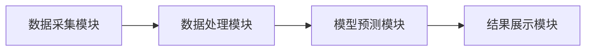

                 


# 全球股市估值与人工智能在环境监测中的应用

## 关键词：全球股市估值，人工智能，环境监测，机器学习，时间序列分析

## 摘要：  
本文深入探讨了全球股市估值与人工智能在环境监测中的应用。首先，从股市估值的基本概念和方法入手，分析了传统统计方法和机器学习算法在股市预测中的应用。接着，详细介绍了人工智能技术在环境监测中的创新应用，包括数据采集、特征提取、模型构建和系统架构设计。通过具体案例分析，展示了如何利用Python代码实现股市估值和环境监测系统的构建。最后，本文总结了人工智能在这两大领域的优势与挑战，并展望了未来的研究方向。

---

# 第1章 全球股市估值概述

## 1.1 股市估值的基本概念

### 1.1.1 股市估值的定义与意义  
股市估值是指对股票市场价格进行评估和预测的过程，旨在确定股票的合理价格区间。股市估值的意义在于帮助投资者做出科学的投资决策，降低投资风险。

### 1.1.2 股市估值的核心要素  
股市估值的核心要素包括：  
1. **市盈率（P/E）**：企业市值与净利润的比率，衡量股票价格是否合理。  
2. **市净率（P/B）**：企业市值与净资产的比率，反映股票价格与资产价值的匹配程度。  
3. **现金流折现模型（DCF）**：通过预测未来现金流，计算股票的内在价值。  

### 1.1.3 股市估值的分类与方法  
股市估值主要分为基本面分析和技术分析两类：  
- **基本面分析**：基于企业的财务数据（如收入、利润、负债等）进行估值。  
- **技术分析**：通过股票价格的历史走势预测未来价格变化。  

---

## 1.2 全球股市估值的背景与现状

### 1.2.1 全球股市的分布与特点  
全球股市分布广泛，主要市场包括纽约证券交易所（NYSE）、纳斯达克（NASDAQ）、伦敦证券交易所（LSE）等。不同市场的特点包括：  
- 美国股市以科技股为主导，波动性较大。  
- 欧洲股市以金融和工业股为主，稳定性较强。  

### 1.2.2 当前股市估值的主要挑战  
当前股市估值面临以下挑战：  
1. **数据复杂性**：股票价格受多种因素影响，包括经济指标、政策变化、企业业绩等。  
2. **市场波动性**：突发事件（如疫情、地缘政治冲突）会导致股市剧烈波动。  
3. **数据量爆炸**：海量数据的处理和分析需要高效的算法和工具支持。  

### 1.2.3 人工智能在股市估值中的应用前景  
人工智能技术（如机器学习、深度学习）在股市估值中的应用前景广阔，主要体现在：  
1. **预测精度提升**：通过分析历史数据，机器学习模型可以捕捉到传统方法难以发现的模式。  
2. **实时性增强**：人工智能能够快速处理实时数据，实现高频交易。  
3. **风险控制优化**：通过预测市场波动，投资者可以更好地进行风险管理和资产配置。  

---

# 第2章 股市估值的技术方法

## 2.1 数据预处理与特征提取

### 2.1.1 时间序列数据的处理  
时间序列数据是指按时间顺序排列的数据，如股票价格的历史数据。处理时间序列数据的关键步骤包括：  
1. **数据清洗**：去除缺失值、异常值。  
2. **数据平滑**：通过移动平均法（MA）或指数平滑法（ES）降低噪声。  
3. **特征提取**：提取时间序列中的趋势、周期性和随机性特征。  

### 2.1.2 数据清洗与标准化  
- **数据清洗**：去除重复数据、填补缺失值、处理异常值。  
- **数据标准化**：将数据归一化到统一范围，便于模型训练。  

### 2.1.3 特征选择与降维  
- **特征选择**：通过统计检验（如p值）或模型系数筛选重要特征。  
- **降维技术**：使用主成分分析（PCA）减少特征维度。  

---

## 2.2 传统统计方法

### 2.2.1 回归分析  
回归分析是一种统计方法，用于建立自变量与因变量之间的关系模型。例如，可以通过回归分析预测股票价格与公司利润的关系。  

### 2.2.2 时间序列预测  
时间序列预测方法包括：  
1. **简单移动平均法（SMA）**：基于过去n期的平均值预测未来值。  
2. **指数平滑法（ES）**：赋予近期数据更大权重，预测未来值。  

### 2.2.3 聚类分析  
聚类分析用于将相似的股票分组，便于分析市场趋势。例如，可以通过聚类分析识别出具有相似价格走势的股票群。  

---

## 2.3 机器学习方法

### 2.3.1 支持向量机（SVM）  
支持向量机是一种监督学习算法，适用于分类和回归问题。例如，可以使用SVM预测股票价格的涨跌趋势。  

### 2.3.2 随机森林  
随机森林是一种基于决策树的集成学习算法，具有高准确性和鲁棒性。例如，可以使用随机森林预测股票的收盘价。  

### 2.3.3 LSTM 网络  
长短时记忆网络（LSTM）是一种递归神经网络，特别适合处理时间序列数据。例如，可以通过LSTM网络预测股票的未来价格。  

---

## 2.4 机器学习算法的实现

### 2.4.1 数据集划分  
- **训练集**：用于模型训练。  
- **验证集**：用于调整模型参数。  
- **测试集**：用于评估模型性能。  

### 2.4.2 模型训练与优化  
- **训练过程**：使用训练集训练模型。  
- **验证过程**：通过验证集调整模型参数，防止过拟合。  
- **测试过程**：使用测试集评估模型的预测精度。  

### 2.4.3 模型评估指标  
- **均方误差（MSE）**：衡量预测值与真实值的差距。  
- **均方根误差（RMSE）**：MSE的平方根，衡量模型的预测误差。  
- **R²系数**：衡量模型解释变量的能力。  

---

# 第3章 人工智能在环境监测中的应用

## 3.1 环境监测的基本概念

### 3.1.1 环境监测的定义与意义  
环境监测是指通过技术手段对环境质量进行监测和评估的过程，旨在保护生态环境和人类健康。  

### 3.1.2 环境监测的核心要素  
环境监测的核心要素包括：  
1. **空气质量**：如PM2.5、PM10、SO2等污染物浓度。  
2. **水质**：如pH值、溶解氧、重金属含量等。  
3. **土壤质量**：如有机质含量、氮磷钾含量等。  

---

## 3.2 环境监测的数据采集与处理

### 3.2.1 数据采集技术  
环境监测数据的采集技术包括：  
1. **传感器技术**：如气压传感器、温度传感器等。  
2. **遥感技术**：通过卫星遥感技术监测大范围环境数据。  

### 3.2.2 数据预处理  
- **数据清洗**：去除噪声和异常值。  
- **数据融合**：整合多源数据，提高数据的准确性和完整性。  

---

## 3.3 人工智能在环境监测中的创新应用

### 3.3.1 环境数据的特征提取  
- **时间序列分析**：识别环境数据中的周期性变化。  
- **异常检测**：通过聚类分析或深度学习方法发现环境数据中的异常点。  

### 3.3.2 环境预测模型  
- **空气质量预测**：通过LSTM网络预测未来空气质量指数（AQI）。  
- **水质预测**：通过随机森林模型预测水质指标的变化趋势。  

### 3.3.3 环境风险评估  
- **污染源识别**：通过机器学习算法识别主要污染源。  
- **环境影响评估**：通过模型模拟环境变化对生态系统的影响。  

---

## 3.4 环境监测系统的架构设计

### 3.4.1 系统功能设计  
- **数据采集模块**：负责采集环境数据。  
- **数据处理模块**：负责数据清洗和特征提取。  
- **模型预测模块**：负责环境数据的预测和风险评估。  
- **结果展示模块**：以可视化方式展示预测结果。  

### 3.4.2 系统架构设计  
- **模块化设计**：各功能模块独立开发，便于维护和升级。  
- **分布式架构**：通过分布式计算提高系统的处理能力。  

### 3.4.3 系统接口设计  
- **数据接口**：与其他系统（如政府环保部门）进行数据交互。  
- **用户接口**：提供友好的用户界面，方便用户查看和分析数据。  

---

## 3.5 环境监测系统的实现

### 3.5.1 数据采集与处理  
- **传感器数据采集**：使用Python库（如paho-mqtt）接收传感器数据。  
- **数据预处理**：使用Pandas库清洗数据。  

### 3.5.2 模型构建与训练  
- **空气质量预测模型**：使用LSTM网络构建时间序列预测模型。  
- **水质预测模型**：使用随机森林模型进行分类或回归预测。  

### 3.5.3 系统部署与测试  
- **系统部署**：将环境监测系统部署到云服务器。  
- **系统测试**：通过实际数据验证系统的预测精度和稳定性。  

---

# 第4章 项目实战

## 4.1 股市估值项目实战

### 4.1.1 项目背景  
本文以纽约证券交易所（NYSE）的股票数据为例，构建一个基于LSTM网络的股票价格预测系统。  

### 4.1.2 项目实现  
- **数据获取**：使用Yahoo Finance API获取股票历史数据。  
- **数据预处理**：清洗数据并提取特征。  
- **模型训练**：使用LSTM网络训练股票价格预测模型。  
- **模型预测**：预测未来一段时间内的股票价格。  

### 4.1.3 代码实现  
```python
import numpy as np
import pandas as pd
from keras.models import Sequential
from keras.layers import LSTM, Dense

# 数据获取与预处理
data = pd.read_csv('stock.csv')
train_data = data.iloc[:100, :]
test_data = data.iloc[100:, :]

# 数据归一化
from sklearn.preprocessing import MinMaxScaler
scaler = MinMaxScaler()
train_data = scaler.fit_transform(train_data)

# LSTM模型构建
model = Sequential()
model.add(LSTM(50, return_sequences=True, input_shape=(1, 1)))
model.add(Dense(1))
model.compile(loss='mean_squared_error', optimizer='adam')

# 模型训练
model.fit(train_data, train_data, epochs=100, batch_size=32)

# 模型预测
test_data_scaled = scaler.transform(test_data)
test_data_scaled_reshaped = np.reshape(test_data_scaled, (test_data_scaled.shape[0], 1, 1))
predicted_prices = model.predict(test_data_scaled_reshaped)
predicted_prices = scaler.inverse_transform(predicted_prices)
```

---

## 4.2 环境监测项目实战

### 4.2.1 项目背景  
本文以空气质量监测为例，构建一个基于随机森林算法的空气质量预测系统。  

### 4.2.2 项目实现  
- **数据获取**：使用公开数据集（如UCI数据集）获取空气质量数据。  
- **数据预处理**：清洗数据并提取特征。  
- **模型训练**：使用随机森林模型训练空气质量预测模型。  
- **模型预测**：预测未来一段时间内的空气质量指数（AQI）。  

### 4.2.3 代码实现  
```python
import pandas as pd
from sklearn.ensemble import RandomForestRegressor
from sklearn.metrics import mean_squared_error

# 数据获取与预处理
data = pd.read_csv('air_quality.csv')
train_data = data.iloc[:200, :]
test_data = data.iloc[200:, :]

# 特征选择
features = ['PM2.5', 'PM10', 'SO2', 'NO2']
target = 'AQI'

# 模型训练
model = RandomForestRegressor(n_estimators=100)
model.fit(train_data[features], train_data[target])

# 模型预测
predicted_aqi = model.predict(test_data[features])
mse = mean_squared_error(test_data[target], predicted_aqi)
print(f'Mean Squared Error: {mse}')
```

---

# 第5章 总结与展望

## 5.1 核心结论  
1. 人工智能技术在股市估值和环境监测中的应用前景广阔。  
2. 机器学习算法（如LSTM、随机森林）在时间序列预测和特征提取方面具有显著优势。  
3. 环境监测系统的模块化设计和分布式架构能够提高系统的处理能力和稳定性。  

## 5.2 未来研究方向  
1. **多模态数据融合**：结合图像、文本等多种数据源，提升预测精度。  
2. **强化学习应用**：探索强化学习在动态环境中的应用，如高频交易和实时环境监测。  
3. **边缘计算技术**：通过边缘计算技术实现低延迟、高实时性的环境监测。  

## 5.3 注意事项  
1. 在实际应用中，需注意数据隐私和安全问题。  
2. 环境监测系统的部署需考虑硬件资源的限制。  
3. 股市估值模型需结合实际市场情况不断优化。  

---

# 附录  
## 附录A：常用机器学习算法对比表  
| 算法名称 | 主要特点 | 适用场景 |  
|----------|----------|----------|  
| LSTM     | 长短时记忆网络，适合时间序列数据 | 股票价格预测、环境数据预测 |  
| Random Forest | 集成学习算法，鲁棒性高 | 特征选择、分类与回归 |  

## 附录B：系统架构设计图  


---

通过本文的详细讲解，读者可以系统地了解全球股市估值与人工智能在环境监测中的应用，并能够通过实际案例掌握相关技术的实现方法。

