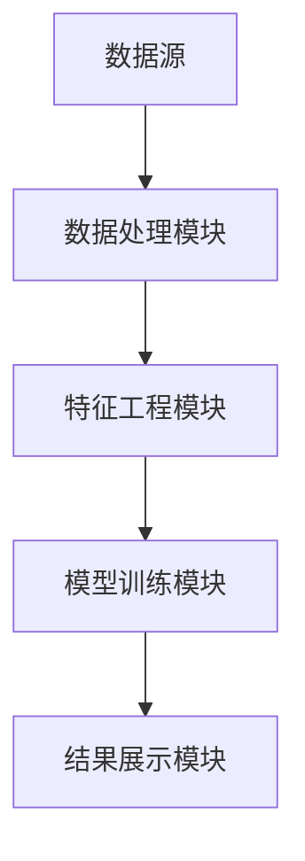

                 


# 全球股市估值与人工智能在金融风控中的应用

## 关键词
- 全球股市估值
- 人工智能
- 金融风控
- 机器学习
- 深度学习
- 自然语言处理（NLP）

## 摘要
本文探讨了全球股市估值的基本方法与人工智能在金融风控中的应用。首先，介绍了股市估值的核心概念，包括市盈率、市净率等方法，并分析了全球股市估值的复杂性。接着，深入探讨了人工智能技术如何提升金融风控的效率与准确性，特别是机器学习与NLP技术的应用。通过具体的技术实现和系统架构设计，展示了AI在金融领域的潜力与实际案例。最后，总结了当前技术成果，并展望了未来发展方向。

---

# 第1章 全球股市估值的基础

## 1.1 股市估值的基本概念

### 1.1.1 股票估值的定义与意义
股票估值是通过分析公司财务数据、市场环境等因素，对股票的内在价值进行评估的过程。准确的估值有助于投资者做出明智的投资决策。

### 1.1.2 市场估值与个股估值的区别
市场估值关注整体市场的表现，如道琼斯指数或标普500，而个股估值则针对特定股票的价值评估。

### 1.1.3 估值在投资决策中的作用
估值帮助投资者识别被低估或高估的股票，指导买入或卖出的时机。

## 1.2 股市估值的主要方法

### 1.2.1 市盈率（P/E）法
市盈率=股价/每股收益。低市盈率可能表示股票被低估，但需结合行业和公司盈利能力分析。

### 1.2.2 市净率（P/B）法
市净率=股价/每股净资产。适用于评估银行等资产密集型行业。

### 1.2.3 股息率法
股息率=每股股息/股价。高股息率可能表示股票收益稳定，但需考虑公司的分红能力。

### 1.2.4 内在价值法
通过DCF模型评估公司未来现金流的现值，确定其合理股价。

## 1.3 全球股市估值的特点与挑战

### 1.3.1 全球市场的多样性与复杂性
不同国家的经济政策、税率和市场环境差异影响估值结果。

### 1.3.2 经济周期对估值的影响
经济波动会导致市盈率、市净率等指标的变化，影响估值的准确性。

### 1.3.3 跨市场比较与联动效应
全球市场的联动性使得单一市场的估值需考虑全球宏观经济因素。

---

# 第2章 人工智能在金融领域的应用背景

## 2.1 人工智能与金融行业的结合

### 2.1.1 AI在金融领域的核心应用领域
AI广泛应用于股票预测、信用评估、风险控制等领域。

### 2.1.2 金融风控的核心问题与挑战
金融风控需解决数据噪声大、非线性关系复杂等问题，传统方法往往效率低下。

### 2.1.3 AI技术如何解决金融风控问题
AI通过深度学习和自然语言处理技术，有效识别隐藏的模式和风险因素。

## 2.2 人工智能在金融风控中的优势

### 2.2.1 数据处理能力
AI能够处理海量数据，提取关键特征，提升模型的准确性。

### 2.2.2 模型预测能力
通过机器学习，AI可以构建复杂的预测模型，捕捉市场中的微小变化。

### 2.2.3 实时分析能力
AI能够实时处理市场数据，快速做出风险预警。

## 2.3 金融风控中的AI技术现状与发展趋势

### 2.3.1 当前主流的AI技术在金融风控中的应用
支持向量机、随机森林等监督学习算法被广泛应用于信用评分和欺诈检测。

### 2.3.2 未来AI在金融风控中的潜在发展方向
强化学习和NLP技术的应用将进一步提升模型的自适应能力和对非结构化数据的处理能力。

---

# 第3章 金融风控中的特征工程

## 3.1 特征工程的基本概念

### 3.1.1 特征工程的定义与作用
特征工程是通过数据处理和特征变换，提取有助于模型性能提升的特征。

## 3.2 金融风控中的特征选择

### 3.2.1 常用的特征选择方法
- **过滤法**：基于统计指标筛选特征。
- **包装法**：通过模型性能评估特征重要性。
- **嵌入法**：在模型训练过程中自动提取特征。

### 3.2.2 金融数据的特征提取与处理
包括对缺失值的处理、异常值的剔除和数据标准化。

### 3.2.3 高维数据的降维方法
常用主成分分析（PCA）和t-SNE等技术降低维度。

## 3.3 特征工程的实践案例

### 3.3.1 股市波动特征的提取
通过分析历史价格和成交量，提取波动率和趋势特征。

### 3.3.2 风险因子的构建与优化
基于CAPM模型，构建Beta等风险因子。

### 3.3.3 特征工程对模型性能的影响分析
通过对比不同特征集的模型表现，验证特征工程的有效性。

---

# 第4章 金融风控中的机器学习算法

## 4.1 机器学习在金融风控中的应用

### 4.1.1 监督学习与无监督学习在风控中的应用
- **监督学习**：用于信用评分和欺诈检测。
- **无监督学习**：用于异常交易 detection。

### 4.1.2 分类算法在信用评估中的应用
如逻辑回归和随机森林用于客户信用评分。

### 4.1.3 回归算法在风险预测中的应用
线性回归用于预测股票价格走势。

## 4.2 常用机器学习算法解析

### 4.2.1 支持向量机（SVM）在金融风控中的应用
用于分类问题，如欺诈检测。

### 4.2.2 随机森林（Random Forest）在风险评估中的应用
用于特征重要性分析和模型解释。

### 4.2.3 神经网络（NN）在时间序列预测中的应用
如LSTM用于股票价格预测。

## 4.3 算法选择与优化策略

### 4.3.1 不同算法的优缺点分析
- **SVM**：高维数据表现优秀，但计算复杂度高。
- **随机森林**：模型解释性强，但对特征工程依赖较高。
- **神经网络**：适合复杂非线性关系，但需要大量数据。

### 4.3.2 基于业务需求的算法选择策略
根据数据类型、任务目标和计算资源选择合适的算法。

### 4.3.3 模型调优与性能优化方法
包括参数调整、交叉验证和集成学习等技术。

---

# 第5章 基于NLP的金融文本分析

## 5.1 自然语言处理在金融领域的应用

### 5.1.1 金融文本分析的基本概念
NLP用于处理新闻、财报等非结构化数据，提取情感倾向和关键信息。

### 5.1.2 基于NLP的金融信息提取
- **实体识别**：识别公司名称、金额等关键实体。
- **情感分析**：分析市场情绪对股价的影响。

### 5.1.3 NLP在风险预警中的应用
通过分析负面新闻和社交媒体情绪，提前识别潜在风险。

## 5.2 NLP在金融风控中的具体案例

### 5.2.1 财报文本分析
使用NLP提取财务数据，评估公司偿债能力。

### 5.2.2 新闻情感分析
通过分析新闻标题和内容，预测市场走势。

### 5.2.3 风险事件识别
利用NLP识别潜在的财务危机，如诉讼和管理层变动。

## 5.3 NLP技术的优势与挑战

### 5.3.1 技术优势
- **非结构化数据处理能力**：NLP能够提取隐藏在文本中的信息。
- **实时监控能力**：支持实时分析新闻和社交媒体数据。

### 5.3.2 技术挑战
- **数据质量**：金融文本可能存在歧义和不准确信息。
- **模型训练**：需要大量标注数据，训练成本高。

---

# 第6章 系统架构设计与实现

## 6.1 系统架构设计

### 6.1.1 系统功能模块划分
- **数据获取模块**：收集股票数据、新闻等信息。
- **特征工程模块**：处理数据，提取特征。
- **模型训练模块**：训练机器学习和深度学习模型。
- **结果展示模块**：可视化分析结果。

### 6.1.2 系统架构图


### 6.1.3 系统接口设计
- **数据接口**：API接口获取实时数据。
- **模型接口**：提供风险评估服务接口。

## 6.2 系统实现细节

### 6.2.1 数据获取与预处理
使用Python的pandas库清洗数据，处理缺失值和异常值。

### 6.2.2 特征工程实现
利用scikit-learn库进行特征选择和降维。

### 6.2.3 模型训练与优化
使用Keras框架训练深度学习模型，并通过交叉验证优化参数。

### 6.2.4 结果可视化
使用matplotlib库绘制股价预测图和模型性能分析图。

---

# 第7章 项目实战与应用案例

## 7.1 项目背景与目标
基于历史股价数据，构建LSTM模型预测股票价格走势。

## 7.2 核心代码实现

### 7.2.1 数据加载与预处理
```python
import pandas as pd
import numpy as np

# 加载数据
data = pd.read_csv('stock_data.csv')
# 划分训练集和测试集
train_data = data.iloc[:1000]
test_data = data.iloc[1000:]
```

### 7.2.2 模型构建
```python
from tensorflow.keras.models import Sequential
from tensorflow.keras.layers import LSTM, Dense

model = Sequential()
model.add(LSTM(64, input_shape=(None, 1)))
model.add(Dense(1))
model.compile(optimizer='adam', loss='mean_squared_error')
```

### 7.2.3 模型训练
```python
# 数据准备
train_sequences = train_data['close'].values.reshape(-1, 1)
test_sequences = test_data['close'].values.reshape(-1, 1)

# 训练模型
model.fit(train_sequences, epochs=50, batch_size=32, verbose=1)
```

### 7.2.4 结果预测与分析
```python
# 预测测试数据
predicted_prices = model.predict(test_sequences)
# 可视化结果
plt.plot(test_data.index, test_data['close'], label='Actual Price')
plt.plot(test_data.index, predicted_prices.reshape(-1), label='Predicted Price')
plt.legend()
plt.show()
```

## 7.3 项目总结与优化方向
模型在测试集上的表现良好，但存在预测精度不足的问题，未来可以尝试引入更多的特征和优化模型结构。

---

# 第8章 总结与展望

## 8.1 全文总结
本文系统介绍了全球股市估值的基本方法和人工智能在金融风控中的应用，展示了如何通过特征工程、机器学习和NLP技术提升金融分析的效率和准确性。

## 8.2 未来展望
随着AI技术的不断进步，金融风控将更加智能化，深度学习和强化学习的应用将推动行业进一步发展。

---

通过以上内容，您可以逐步构建一篇详尽的技术博客文章，涵盖全球股市估值与人工智能在金融风控中的各个方面。每个部分都结合理论和实践，提供丰富的案例和代码示例，帮助读者深入理解和应用相关技术。

