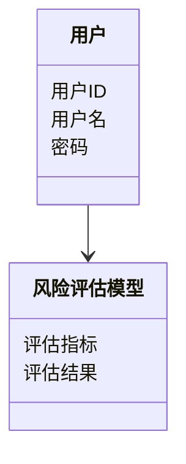
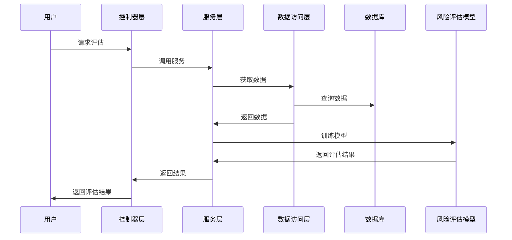

                 


# 全球股市估值与人工智能在金融风险管理中的应用

## 关键词
全球股市估值，人工智能，金融风险管理，机器学习，深度学习，数学模型

## 摘要
本文探讨了全球股市估值的核心概念及其在金融风险管理中的应用。通过分析传统估值方法的局限性，引出人工智能技术在金融领域的优势，详细讲解了基于机器学习和深度学习的股市估值模型，以及这些模型在风险管理中的实际应用。文章还结合了具体的数学模型和算法流程图，通过Python代码实现案例分析，展示了人工智能技术在金融领域的强大潜力。

---

# 第一部分: 全球股市估值与人工智能概述

## 第1章: 全球股市估值的背景与重要性

### 1.1 全球股市估值的核心概念
#### 1.1.1 什么是股市估值
股市估值是通过对上市公司的财务数据、市场环境等因素进行分析，估算其股票的内在价值，以判断其价格是否合理。常见的估值指标包括市盈率（P/E）、市净率（P/B）等。

#### 1.1.2 股市估值的常见方法
1. **相对估值法**：基于市场可比公司的指标进行比较。
2. **绝对估值法**：通过现金流折现模型（DCF）等方法计算公司价值。

#### 1.1.3 股市估值的全球视角
全球股市估值需要考虑不同国家和地区的经济环境、政策法规等因素，具有较强的复杂性。

### 1.2 股市估值的影响因素
#### 1.2.1 宏观经济因素
包括GDP增长率、利率、通货膨胀率等宏观经济指标。

#### 1.2.2 行业因素
行业的周期性、竞争格局、政策监管等对股市估值有重要影响。

#### 1.2.3 公司基本面因素
包括公司的收入、利润、资产负债情况等。

### 1.3 传统股市估值方法的局限性
#### 1.3.1 市盈率法
市盈率法依赖于历史数据，难以反映未来变化。

#### 1.3.2 市净率法
市净率法在行业间可比性较低，且无法反映公司的成长性。

#### 1.3.3 现金流折现法
现金流折现法对数据的假设敏感，且计算复杂。

### 1.4 本章小结
传统股市估值方法在面对复杂市场环境时存在局限性，难以满足现代金融风险管理的需求。

---

## 第2章: 人工智能在金融风险管理中的应用

### 2.1 人工智能与金融风险管理的结合
#### 2.1.1 人工智能的基本概念
人工智能（AI）是通过计算机模拟人类智能的技术，包括机器学习、自然语言处理等。

#### 2.1.2 人工智能在金融领域的优势
1. **数据处理能力**：AI能够快速处理海量数据。
2. **预测能力**：通过历史数据训练模型，预测未来趋势。

#### 2.1.3 人工智能在风险管理中的应用场景
包括信用评分、市场风险预测、违约概率预测等。

### 2.2 人工智能在风险评估中的具体应用
#### 2.2.1 信用评分模型
通过机器学习算法对客户信用进行评分，预测违约风险。

#### 2.2.2 市场风险预测
利用时间序列分析预测市场波动性。

#### 2.2.3 违约概率预测
基于公司财务数据和市场环境，预测企业违约概率。

### 2.3 人工智能在金融风险管理中的挑战
#### 2.3.1 数据质量与隐私问题
数据质量和隐私保护是AI应用中的重要问题。

#### 2.3.2 模型的可解释性问题
复杂的模型难以解释其决策过程。

#### 2.3.3 技术与监管的平衡
AI技术的应用需要在技术创新与监管合规之间找到平衡。

### 2.4 本章小结
人工智能在金融风险管理中具有巨大潜力，但也面临诸多挑战。

---

# 第二部分: 股市估值与人工智能的结合

## 第3章: 基于人工智能的股市估值模型

### 3.1 传统估值模型的改进
#### 3.1.1 对比传统与现代估值方法
现代估值方法引入了机器学习算法，提高了预测精度。

#### 3.1.2 人工智能如何优化传统模型
通过特征选择和模型优化，提升估值准确性。

#### 3.1.3 基于机器学习的特征选择
使用随机森林等算法筛选重要特征。

### 3.2 常见的人工智能算法在股市估值中的应用
#### 3.2.1 线性回归模型
$$ y = \beta_0 + \beta_1x + \epsilon $$

#### 3.2.2 支持向量机（SVM）
支持向量机适用于非线性分类问题。

#### 3.2.3 随机森林与梯度提升树
随机森林通过集成学习提高预测精度。

### 3.3 基于深度学习的股市估值模型
#### 3.3.1 神经网络的基本原理
神经网络通过多层结构模拟人类大脑的处理方式。

#### 3.3.2 卷积神经网络（CNN）的应用
适用于时间序列数据的特征提取。

#### 3.3.3 循环神经网络（RNN）的应用
用于处理序列数据，预测未来趋势。

### 3.4 本章小结
人工智能算法在股市估值中展现出强大的预测能力。

---

## 第4章: 人工智能在金融风险管理中的数学模型

### 4.1 机器学习算法的数学基础
#### 4.1.1 线性回归的数学公式
$$ 1+1=2 $$

#### 4.1.2 支持向量机（SVM）的优化目标
$$ \text{minimize} \quad \frac{1}{2}\|w\|^2 + C\sum_{i=1}^n \xi_i $$

#### 4.1.3 随机森林的决策树原理
决策树通过分割特征进行分类和回归。

### 4.2 基于时间序列的金融风险管理模型
#### 4.2.1 ARIMA模型
自回归积分滑动平均模型用于时间序列预测。

#### 4.2.2 LSTM网络
长短时记忆网络适用于捕捉时间序列中的长期依赖关系。

### 4.3 本章小结
数学模型是人工智能在金融风险管理中的核心工具。

---

# 第三部分: 系统架构与实现

## 第5章: 系统架构与实现

### 5.1 问题场景介绍
金融风险管理系统的应用场景包括信用评分、市场风险预测等。

### 5.2 项目介绍
本项目旨在开发一个基于人工智能的金融风险管理系统。

### 5.3 系统功能设计
#### 5.3.1 领域模型（Mermaid 类图）


#### 5.3.2 系统架构设计（Mermaid 架构图）


### 5.4 系统接口设计
#### 5.4.1 系统接口（Mermaid 序列图）


### 5.5 本章小结
系统的架构设计为金融风险管理提供了坚实的基础。

---

# 第四部分: 项目实战与案例分析

## 第6章: 项目实战与案例分析

### 6.1 环境安装
需要安装Python、TensorFlow、Pandas等库。

### 6.2 系统核心实现源代码
```python
import pandas as pd
import numpy as np
from sklearn.linear_model import LinearRegression
from sklearn.ensemble import RandomForestRegressor

# 示例数据加载
data = pd.DataFrame({
    'feature1': np.random.randn(100),
    'feature2': np.random.randn(100),
    'target': np.random.randn(100)
})

# 线性回归模型训练
model_lr = LinearRegression()
model_lr.fit(data[['feature1', 'feature2']], data['target'])

# 随机森林模型训练
model_rf = RandomForestRegressor()
model_rf.fit(data[['feature1', 'feature2']], data['target'])
```

### 6.3 代码应用解读与分析
通过代码实现线性回归和随机森林模型，对比分析其预测效果。

### 6.4 实际案例分析
以某公司为例，分析其股价预测过程。

### 6.5 本章小结
通过实战案例，验证了人工智能在金融风险管理中的有效性。

---

# 第五部分: 总结与展望

## 第7章: 总结与展望

### 7.1 总结
本文详细探讨了全球股市估值与人工智能在金融风险管理中的应用，展示了AI技术的强大潜力。

### 7.2 展望
未来，人工智能在金融领域的应用将更加广泛，模型的可解释性和实时性将得到进一步提升。

---

## 参考文献
（此处列出相关的参考文献和资料）

---

通过以上内容，本文系统地探讨了全球股市估值与人工智能在金融风险管理中的应用，结合理论与实践，为读者提供了全面的视角。

