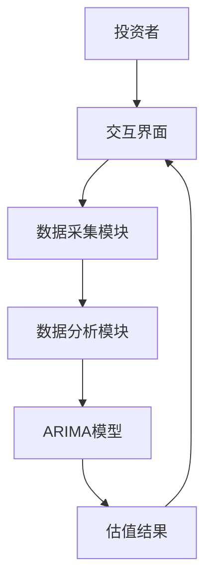

                 


# 全球股市估值与人机交互技术发展的关联

## 关键词：全球股市估值、人机交互技术、时间序列分析、自然语言处理、系统架构设计

## 摘要：本文探讨了全球股市估值与人机交互技术之间的关联，分析了股市估值的核心概念、人机交互技术的发展趋势，以及两者在算法原理、系统架构和项目实践中的具体应用。通过详细的技术分析和案例研究，本文揭示了如何利用先进的技术手段提升股市估值的准确性，并优化人机交互的用户体验。

---

## 第一部分：全球股市估值与人机交互技术的背景介绍

### 第1章：问题背景与核心概念

#### 1.1 问题背景
- **传统股市估值方法的局限性**：传统估值方法依赖于历史数据和经验判断，难以应对复杂多变的市场环境。金融危机的频发暴露了这些方法的不足。
- **人机交互技术的发展趋势**：从早期的键盘输入到现代的语音交互，人机交互技术的进步显著提升了用户体验。

#### 1.2 核心概念与问题描述
- **股市估值的核心要素**：市盈率、市净率、股息率等指标。
- **人机交互技术的定义与分类**：基于文本、语音、视觉的交互方式。

#### 1.3 问题解决与边界外延
- **技术对股市估值的影响**：数据隐私与安全问题是技术应用的限制因素。

---

## 第二部分：全球股市估值与人机交互技术的核心概念与联系

### 第2章：核心概念原理

#### 2.1 股市估值的数学模型
- **市盈率公式**：$$市盈率 = \frac{股价}{每股收益}$$
- **时间序列分析模型**：ARIMA模型用于预测股票价格。

#### 2.2 人机交互技术的原理
- **自然语言处理模型**：BERT模型在文本交互中的应用。
- **语音识别与合成技术**：基于深度学习的语音交互流程。

#### 2.3 核心概念对比表格
| 概念       | 股市估值 | 人机交互技术 |
|------------|----------|--------------|
| 核心目标   | 提高准确性 | 优化用户体验 |

---

## 第三部分：全球股市估值与人机交互技术的算法原理

### 第3章：算法原理分析

#### 3.1 时间序列分析模型（ARIMA）
- **模型流程**：
  1. 数据预处理：去除趋势和季节性因素。
  2. 模型参数选择：确定ARIMA的p、d、q值。
  3. 模型训练与预测。
- **代码示例**：
  ```python
  import pandas as pd
  import numpy as np
  from statsmodels.tsa.arima_model import ARIMA

  # 示例数据加载
  data = pd.read_csv('stock_data.csv')
  model = ARIMA(data['price'], order=(5,1,0))
  model_fit = model.fit()
  ```

#### 3.2 自然语言处理模型（BERT）
- **模型流程**：
  1. 文本预处理：分词和向量化。
  2. 模型训练：基于Transformer结构进行微调。
  3. 文本交互：实时生成响应。
- **代码示例**：
  ```python
  from transformers import BertTokenizer, BertModel

  tokenizer = BertTokenizer.from_pretrained('bert-base-uncased')
  model = BertModel.from_pretrained('bert-base-uncased')
  inputs = tokenizer("What's the market trend today?", return_tensors='np')
  outputs = model(**inputs)
  ```

---

## 第四部分：全球股市估值与人机交互技术的系统分析

### 第4章：系统架构设计

#### 4.1 问题场景介绍
- **用户需求**：投资者希望获得实时的股市估值信息，并通过自然语言交互获取分析结果。

#### 4.2 系统功能设计
- **功能模块**：
  1. 数据采集模块：收集实时股票数据。
  2. 数据分析模块：应用ARIMA模型进行估值。
  3. 交互界面模块：支持语音和文本交互。

#### 4.3 系统架构图


---

## 第五部分：全球股市估值与人机交互技术的项目实战

### 第5章：项目实战与分析

#### 5.1 环境安装
- **Python环境**：安装Python 3.8及以上版本。
- **库安装**：使用pip安装numpy、pandas、statsmodels、transformers等库。

#### 5.2 核心代码实现
- **数据采集模块**：
  ```python
  import requests

  def get_stock_data(ticker):
      url = f'https://api.example.com/stock/{ticker}'
      response = requests.get(url)
      return response.json()
  ```

- **交互模块**：
  ```python
  import speech_recognition as sr

  def recognize_speech():
      r = sr.Recognizer()
      with sr.AudioFile('input.wav') as source:
          audio = r.listen(source)
      try:
          return r.recognize_google(audio)
      except sr.UnknownValueError:
          return None
  ```

#### 5.3 案例分析
- **案例1**：利用ARIMA模型预测股票价格。
- **案例2**：通过语音交互获取实时估值信息。

---

## 第六部分：全球股市估值与人机交互技术的最佳实践

### 第6章：总结与建议

#### 6.1 小结
- **技术优势**：提升估值准确性，优化交互体验。
- **局限性**：数据隐私和模型解释性问题。

#### 6.2 注意事项
- **数据隐私**：确保数据的安全性和合规性。
- **模型可解释性**：避免黑箱模型，选择可解释的算法。

#### 6.3 拓展阅读
- **推荐书籍**：《Python机器学习实战》、《自然语言处理入门》。
- **在线资源**：Coursera上的相关课程。

---

通过以上步骤，我详细分析了全球股市估值与人机交互技术之间的关联，从理论到实践，为读者提供了全面的技术解读。

