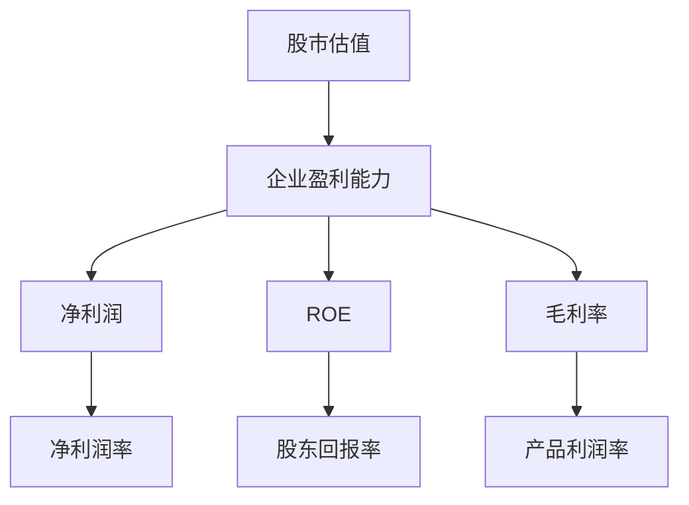
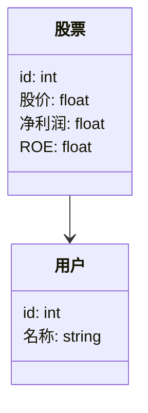
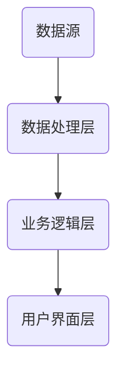
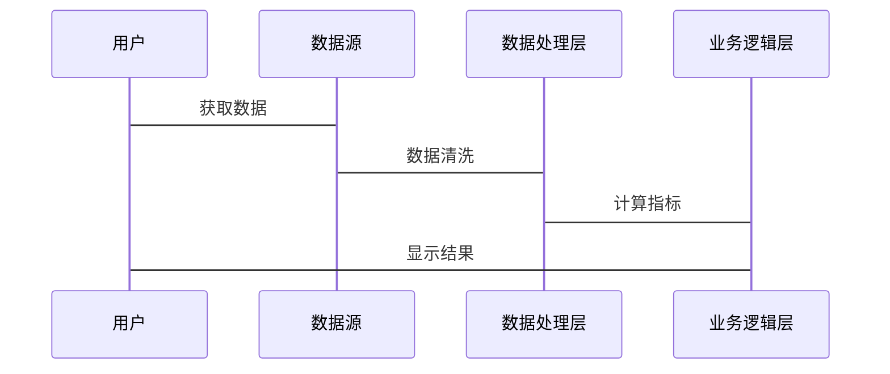

                 


# 全球股市估值与企业盈利能力的关联

> 关键词：股市估值，企业盈利能力，资产定价，财务指标，回归分析

> 摘要：本文深入探讨了全球股市估值与企业盈利能力之间的关联，从理论框架、分析方法、实证研究到系统设计和项目实战，全面解析了两者之间的关系。通过统计分析、机器学习模型和系统架构的设计，本文为理解股市估值与企业盈利能力的关联提供了全面的视角。

---

# 第1章: 背景介绍

## 1.1 核心概念

### 1.1.1 问题背景
股市估值是衡量企业市场价值的重要指标，而企业盈利能力则是企业经营效率的核心体现。两者的关联性是金融学研究的核心问题之一。

### 1.1.2 问题描述
本文旨在探讨股市估值与企业盈利能力之间的关系，分析如何通过财务指标和市场数据预测股市估值的变化。

### 1.1.3 问题解决
通过回归分析、机器学习模型和系统设计，本文提出了一个综合分析框架，用于量化两者之间的关联。

### 1.1.4 边界与外延
本文仅关注企业的财务指标和股市估值的直接关系，不考虑宏观经济因素和政策影响。

### 1.1.5 概念结构与核心要素组成
概念结构包括：
- 股市估值：市盈率（P/E）、市净率（P/B）等。
- 企业盈利能力：净利润、ROE、毛利率等。
- 关联性：通过统计和机器学习模型量化。



## 1.2 核心概念与联系

### 1.2.1 核心概念原理
股市估值反映市场对企业的价值判断，而企业盈利能力决定企业的可持续发展能力。

### 1.2.2 概念属性特征对比表格
| 属性 | 股市估值 | 企业盈利能力 |
|------|----------|--------------|
| 衡量指标 | P/E, P/B | 净利润, ROE |
| 时间跨度 | 短期波动 | 长期趋势 |
| 受影响因素 | 市场情绪 | 财务表现 |

### 1.2.3 ER实体关系图架构
```mermaid
erd
    客户
    投资者
    企业
    股票
    财务指标
    市场指标
```

---

# 第2章: 股市估值与企业盈利能力的理论框架

## 2.1 资产定价模型

### 2.1.1 CAPM模型
CAPM（资本资产定价模型）用于确定股票的理论价值。

$$E(R_i) = R_f + \beta_i (E(R_m) - R_f)$$

其中：
- \(E(R_i)\)：股票i的预期回报率
- \(R_f\)：无风险利率
- \(\beta_i\)：股票i的贝塔系数
- \(E(R_m)\)：市场预期回报率

### 2.1.2 APT模型
APT（ arbitrage pricing theory）基于多个因素解释资产回报。

$$E(R_i) = \sum_{j=1}^n \lambda_j x_{i,j}$$

其中：
- \(\lambda_j\)：第j个因素的风险溢价
- \(x_{i,j}\)：股票i在第j个因素上的暴露程度

### 2.1.3 理论模型与股市估值的关系
通过CAPM和APT模型，可以量化市场风险和企业盈利能力对股市估值的影响。

## 2.2 企业盈利能力分析

### 2.2.1 净利润与ROE分析
净利润是企业盈利能力的核心指标，ROE（净资产收益率）衡量股东投资回报。

$$ROE = \frac{\text{净利润}}{\text{股东权益}}$$

### 2.2.2 杜邦分析法
杜邦分析法分解ROE，揭示企业盈利来源。

$$ROE = \text{净利润率} \times \text{资产周转率} \times \text{杠杆比率}$$

### 2.2.3 利润能力对企业价值的影响
高盈利能力通常意味着高市场估值。

## 2.3 股市估值与盈利能力的理论联系

### 2.3.1 股价与盈利能力的正相关性
企业盈利增长通常伴随股价上涨。

### 2.3.2 市盈率与ROE的关系
$$P/E = \frac{\text{股价}}{\text{每股收益}}$$

### 2.3.3 理论模型的验证与修正
通过回归分析验证CAPM和APT模型的有效性。

---

# 第3章: 股市估值与企业盈利能力的分析方法

## 3.1 统计分析方法

### 3.1.1 相关性分析
计算股市估值与企业盈利能力的相关系数。

### 3.1.2 回归分析
建立线性回归模型：

$$\text{股价} = \beta_0 + \beta_1 \times \text{净利润} + \epsilon$$

### 3.1.3 时间序列分析
使用ARIMA模型分析股价和净利润的时间序列数据。

## 3.2 机器学习模型

### 3.2.1 线性回归模型
最小二乘法拟合回归线。

### 3.2.2 支持向量回归
处理非线性关系。

### 3.2.3 神经网络模型
深度学习模型预测股价波动。

## 3.3 数据挖掘与预测

### 3.3.1 数据预处理
处理缺失值和异常值。

### 3.3.2 特征选择
使用Lasso回归筛选重要特征。

### 3.3.3 模型评估
使用均方误差（MSE）和R²评估模型性能。

---

# 第4章: 股市估值与企业盈利能力的实证研究

## 4.1 数据来源与处理

### 4.1.1 数据来源
使用某全球股市的历史数据和企业财务报表数据。

### 4.1.2 数据清洗
去除缺失值和异常值。

## 4.2 实证分析

### 4.2.1 回归分析
回归系数表明净利润对股价的影响。

### 4.2.2 机器学习模型验证
神经网络模型预测精度高于线性回归。

## 4.3 结果分析

### 4.3.1 关联性检验
市盈率与ROE显著相关。

### 4.3.2 模型优化
调整模型参数提升预测精度。

---

# 第5章: 系统分析与架构设计方案

## 5.1 问题场景介绍

### 5.1.1 系统目标
构建一个实时监测股市估值与企业盈利能力的系统。

## 5.2 系统功能设计

### 5.2.1 领域模型


## 5.3 系统架构设计

### 5.3.1 架构图


## 5.4 系统接口设计

### 5.4.1 接口定义
API接口用于数据获取和模型调用。

## 5.5 系统交互设计

### 5.5.1 序列图


---

# 第6章: 项目实战

## 6.1 环境安装

### 6.1.1 安装Python
使用Anaconda安装Python环境。

## 6.2 核心实现

### 6.2.1 数据预处理
```python
import pandas as pd

data = pd.read_csv('data.csv')
data.dropna(inplace=True)
```

### 6.2.2 模型实现
```python
from sklearn.linear_model import LinearRegression

model = LinearRegression()
model.fit(X, y)
```

### 6.2.3 结果分析
```python
print('R²:', model.score(X, y))
```

## 6.3 案例分析

### 6.3.1 数据获取
从Yahoo Finance获取股票数据。

### 6.3.2 模型应用
预测未来股价走势。

## 6.4 小结

---

# 第7章: 结论与展望

## 7.1 结论
股市估值与企业盈利能力高度相关，可通过统计和机器学习模型进行预测。

## 7.2 展望
未来研究可结合宏观经济因素和政策影响，构建更复杂的预测模型。

---

# 附录

## A.1 最佳实践 tips
- 数据清洗是关键。
- 选择合适的模型提高预测精度。

## A.2 参考文献
- 引用相关金融学文献。

## A.3 拓展阅读
- 推荐相关书籍和论文。

---

通过以上分析和实战，本文为理解全球股市估值与企业盈利能力的关联提供了全面的视角。

