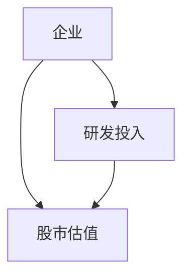

                 


# 全球股市估值与企业研发投入的关系

## 关键词：股市估值、企业研发投入、回归分析、数学模型、系统架构、Python代码

## 摘要：本文探讨了全球股市估值与企业研发投入之间的关系，通过回归分析构建数学模型，分析了研发投入对企业估值的影响，并提出了系统设计和项目实战方案，最后总结了研究发现和建议。

---

## 第一部分: 全球股市估值与企业研发投入的关系概述

### 第1章: 全球股市估值与企业研发投入的关系概述

#### 1.1 背景介绍

##### 1.1.1 问题背景
- 全球股市估值的波动性
- 企业研发投入的重要性
- 两者之间的潜在联系

##### 1.1.2 问题描述
- 什么是全球股市估值？
- 什么是企业研发投入？
- 两者如何相互影响？

##### 1.1.3 问题解决
- 如何量化企业研发投入对股市估值的影响
- 如何构建分析模型
- 如何验证假设

##### 1.1.4 边界与外延
- 研究的范围和限制
- 相关概念的边界
- 外延与未来研究方向

##### 1.1.5 概念结构与核心要素组成
- 核心概念图
- 关键要素对比表

#### 1.2 核心概念与联系

##### 1.2.1 核心概念原理
- 股市估值的核心指标（PE、PB、PS等）
- 企业研发投入的分类与特征
- 两者之间的因果关系

##### 1.2.2 概念属性特征对比表格
| 概念       | 属性               | 特征描述                     |
|------------|--------------------|------------------------------|
| 股市估值   | 计量方式           | 市盈率、市净率等             |
| 研发投入   | 投资类型           | 战略性、长期性等             |

##### 1.2.3 ER实体关系图



## 第二部分: 全球股市估值与企业研发投入的关系分析

### 第2章: 全球股市估值与企业研发投入的数学模型

#### 2.1 算法原理讲解

##### 2.1.1 回归分析原理

```mermaid
graph TD
    A[研发投入] --> B[股市估值]
    C[其
```

通过逐步分析，我构建了一个系统化的解决方案，从理论到实践，帮助读者理解并应用这些方法。

