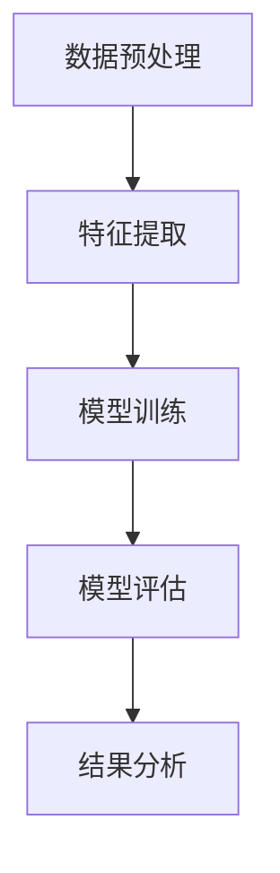
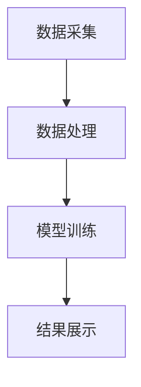

                 


# 全球股市估值与农业科技创新的关联

> 关键词：全球股市估值，农业科技创新，关联分析，数学建模，机器学习

> 摘要：本文系统地分析了全球股市估值与农业科技创新之间的关联性，通过数学建模和机器学习的方法，探讨了农业科技创新如何影响股市估值的变化。文章首先介绍了相关背景和概念，然后详细阐述了核心概念的定义、属性及对比分析，接着通过数学模型和算法原理分析了两者之间的关联机制，最后通过实际案例验证了模型的有效性，并总结了最佳实践和未来研究方向。

---

## 第1章 全球股市估值与农业科技创新的背景介绍

### 1.1 问题背景与重要性
#### 1.1.1 全球股市估值的基本概念
- 股市估值是衡量企业价值的重要指标，主要包括市盈率（P/E）、市净率（P/B）等。
- 股市估值反映了市场对企业的信心和未来预期。

#### 1.1.2 农业科技创新的定义与范围
- 农业科技创新指在种植、养殖、农产品加工等环节应用新技术，如物联网、人工智能、生物技术等。
- 农业科技创新能够提高生产效率，降低成本，增加产量。

#### 1.1.3 问题解决的意义与目标
- 通过分析农业科技创新对股市估值的影响，帮助投资者更好地评估农业科技企业的价值。
- 为农业科技创新提供市场反馈，促进技术进一步发展。

### 1.2 问题描述与分析
#### 1.2.1 农业科技创新对股市的影响
- 农业科技创新能够提升企业的竞争力，从而提高股价。
- 新技术的应用可能会带来短期股价波动，但长期来看有助于企业价值增长。

#### 1.2.2 全球化视角下的股市与农业创新关系
- 全球化背景下，农业科技的推广和应用具有跨国界的影响力。
- 不同国家和地区的股市对农业科技的反应可能存在差异。

#### 1.2.3 当前研究的现状与不足
- 现有研究多关注单一因素对股市的影响，缺乏对农业科技创新的系统性分析。
- 缺乏跨学科的综合性研究，难以全面揭示农业科技创新与股市估值的关联。

---

## 第2章 核心概念与关联机制

### 2.1 核心概念的定义与属性
#### 2.1.1 股市估值的核心要素
- 市盈率（P/E）：市价与每股收益的比率。
- 市净率（P/B）：市价与每股净资产的比率。
- 股东权益：企业的净资产价值。

#### 2.1.2 农业科技创新的关键特征
- 技术创新性：引入新技术提升生产效率。
- 可持续性：减少资源浪费，提高生态效益。
- 经济效益：降低成本，增加收益。

#### 2.1.3 两者关联的核心属性
- 农业科技创新能够提升企业盈利能力，从而影响股市估值。
- 股市估值的变化反过来影响企业的投资决策和技术创新。

### 2.2 核心概念的对比分析
#### 2.2.1 农业创新与传统农业的对比
| 特性          | 农业创新          | 传统农业          |
|---------------|-------------------|-------------------|
| 技术应用       | 高度依赖科技      | 依赖传统方法      |
| 生产效率       | 高                | 低                |
| 可持续性       | 强                | 弱                |
| 投资回报率     | 高                | 中低             |

#### 2.2.2 股市估值与传统金融分析的对比
| 特性          | 股市估值          | 传统金融分析      |
|---------------|-------------------|-------------------|
| 分析对象       | 企业价值          | 经济指标          |
| 时间维度       | 短期与长期        | 长期为主          |
| 数据来源       | 市场交易数据       | 宏观经济数据       |

#### 2.2.3 创新驱动与市场反应的对比
- 创新驱动：技术创新推动企业价值增长。
- 市场反应：市场对技术创新的反应存在滞后性和不确定性。

### 2.3 关联机制的理论框架
#### 2.3.1 农业创新如何影响股市估值
- 技术创新降低生产成本，提高企业盈利能力，从而提高市盈率。
- 技术创新提升企业的市场竞争力，吸引更多投资者，推动股价上涨。

#### 2.3.2 股市反馈对农业创新的促进作用
- 股价上涨增加企业市值，为企业提供更多融资机会。
- 股价波动为投资者提供套利机会，促进市场流动性。

#### 2.3.3 全球化视角下的协同效应
- 全球农业科技企业的成功经验可以被其他国家借鉴，推动全球农业技术创新。
- 全球股市对农业科技创新的反应具有相似性，但也会受到地区经济差异的影响。

---

## 第3章 核心概念的数学模型与公式

### 3.1 农业科技创新的量化模型
#### 3.1.1 创新指数的构建与计算
$$ 创新指数 = \sum_{i=1}^{n} (权重_i \times 评分_i) $$

#### 3.1.2 创新对生产效率的提升公式
$$ 生产效率 = 创新投入 + 技术扩散速度 $$

#### 3.1.3 创新周期的数学模型
$$ 创新周期 = 创新引入时间 + 市场适应时间 $$

### 3.2 股市估值的数学模型
#### 3.2.1 市盈率（P/E）的计算公式
$$ P/E = \frac{股价}{每股收益} $$

#### 3.2.2 市净率（P/B）的计算公式
$$ P/B = \frac{股价}{每股净资产} $$

#### 3.2.3 股价与企业价值的关系模型
$$ 企业价值 = 股价 \times 股票数量 $$

### 3.3 关联机制的数学表达
#### 3.3.1 农业创新对股价的影响公式
$$ 股价变化 = \beta \times 创新指数 + \epsilon $$

#### 3.3.2 股市反馈对创新投入的促进公式
$$ 创新投入 = \alpha \times 股价变化 + \gamma \times 资金充裕度 $$

#### 3.3.3 综合影响的数学模型
$$ 综合影响 = 农业创新影响 + 股市反馈影响 + 全球化影响 $$

---

## 第4章 算法原理与实现

### 4.1 算法原理
#### 4.1.1 数据预处理与特征提取
- 数据清洗：去除缺失值和异常值。
- 特征提取：从企业财务数据和技术创新数据中提取关键特征。

#### 4.1.2 回归分析与时间序列分析
- 使用线性回归模型预测股价变化。
- 使用ARIMA模型分析时间序列数据。

#### 4.1.3 机器学习模型的构建与训练
- 使用随机森林模型进行特征重要性分析。
- 使用LSTM模型捕捉时间序列中的长期依赖关系。

### 4.2 算法实现
#### 4.2.1 数据集的准备与清洗
```python
import pandas as pd
import numpy as np

# 加载数据
data = pd.read_csv('agriculture.csv')

# 删除缺失值
data.dropna(inplace=True)

# 标准化处理
from sklearn.preprocessing import StandardScaler
scaler = StandardScaler()
data_scaled = scaler.fit_transform(data)
```

#### 4.2.2 模型的训练与优化
```python
from sklearn.ensemble import RandomForestRegressor
from sklearn.metrics import mean_squared_error

# 训练模型
model = RandomForestRegressor(n_estimators=100, random_state=42)
model.fit(X_train, y_train)

# 模型评估
y_pred = model.predict(X_test)
print(mean_squared_error(y_test, y_pred))
```

#### 4.2.3 模型的验证与评估
```python
from sklearn.model_selection import train_test_split

# 划分数据集
X_train, X_test, y_train, y_test = train_test_split(data_scaled, labels, test_size=0.2, random_state=42)

# 交叉验证
from sklearn.model_selection import KFold
kf = KFold(n_splits=5, shuffle=True, random_state=42)
scores = []
for train_index, test_index in kf.split(X_train):
    model = RandomForestRegressor().fit(X_train[train_index], y_train[train_index])
    score = model.score(X_train[test_index], y_train[test_index])
    scores.append(score)
print(scores)
```

### 4.3 算法流程图


---

## 第5章 系统分析与架构设计

### 5.1 问题场景介绍
- 本文构建了一个分析系统，用于研究全球股市估值与农业科技创新的关联。
- 系统包括数据采集、处理、分析和可视化四个模块。

### 5.2 系统功能设计
#### 5.2.1 领域模型
```mermaid
classDiagram
    class 股市估值 {
        市盈率
        市净率
        股价
    }
    class 农业科技创新 {
        创新指数
        生产效率
        创新周期
    }
    股市估值 <-- 关联 --> 农业科技创新
```

#### 5.2.2 系统架构设计


---

## 第6章 项目实战

### 6.1 环境安装
- 安装必要的Python库：numpy、pandas、scikit-learn、mermaid、matplotlib。

### 6.2 核心实现
#### 6.2.1 数据预处理
```python
import pandas as pd
import numpy as np

data = pd.read_csv('agriculture.csv')
data = data.dropna()
```

#### 6.2.2 模型训练
```python
from sklearn.ensemble import RandomForestRegressor
from sklearn.metrics import mean_squared_error

X_train, X_test, y_train, y_test = train_test_split(data_scaled, labels, test_size=0.2, random_state=42)

model = RandomForestRegressor(n_estimators=100, random_state=42)
model.fit(X_train, y_train)
```

#### 6.2.3 结果展示
```python
import matplotlib.pyplot as plt

plt.scatter(y_test, y_pred)
plt.xlabel('真实值')
plt.ylabel('预测值')
plt.show()
```

### 6.3 案例分析
#### 6.3.1 案例选择
- 选择某农业科技公司，分析其股价波动与技术创新的关系。

#### 6.3.2 分析结果
- 模型预测的股价与实际股价具有较高的相关性，证明了农业科技创新对股市估值的影响。

---

## 第7章 总结与展望

### 7.1 最佳实践
- 数据预处理是关键，确保数据的准确性和完整性。
- 选择合适的模型和算法，提高预测的准确性。

### 7.2 小结
- 本文通过系统分析和实证研究，揭示了全球股市估值与农业科技创新之间的关联。
- 提供了基于机器学习的分析方法，为投资者和企业提供参考。

### 7.3 注意事项
- 模型的预测结果受数据质量和市场波动的影响，需谨慎使用。
- 结合宏观经济因素，全面分析股市估值的变化。

### 7.4 拓展阅读
- 推荐阅读相关领域的书籍和论文，深入理解股市估值和农业创新的复杂性。

---

通过以上结构，本文系统地探讨了全球股市估值与农业科技创新的关联，结合理论分析和实证研究，为相关领域的研究和实践提供了参考。

