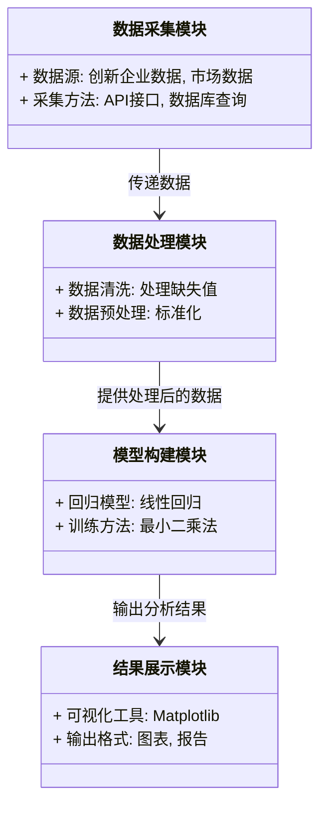
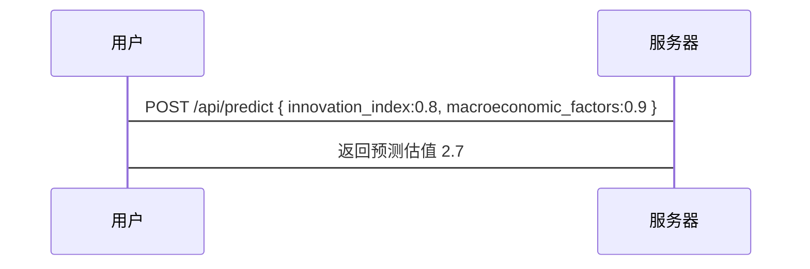

                 


# 《全球股市估值与创新创业生态系统的关系》

> 关键词：全球股市估值、创新创业生态系统、金融市场、创新企业、经济影响

> 摘要：本文系统探讨全球股市估值与创新创业生态系统之间的相互作用，分析股市估值如何反映和影响创新企业的成长，以及创新创业活动如何推动股市的动态变化。通过理论分析与实际案例结合，揭示两者关系的复杂性及其对经济发展的重要意义。

---

## 目录大纲

---

# 第1章 全球股市估值与创新创业生态系统的关系概述

## 1.1 背景介绍

### 1.1.1 核心概念术语说明
- **股市估值**：指对上市公司股票价值的评估，通常通过市盈率、市净率等指标衡量。
- **创新创业生态系统**：包括创新企业、投资者、政府政策、科技园区等多方参与者组成的系统。

### 1.1.2 问题背景
- 全球经济波动中，创新企业对股市估值的影响日益显著。
- 创新创业活动如何与股市估值相互作用？

### 1.1.3 问题描述
- 创新企业如何影响股市估值？
- 股市估值如何反过来促进或制约创新活动？

### 1.1.4 问题解决
- 通过分析创新企业上市、投资行为与股市估值的关系，构建两者互动的理论模型。

### 1.1.5 边界与外延
- 限定于公开上市的企业，排除非上市创新企业。
- 聚焦于高科技行业，扩展至其他行业。

### 1.1.6 概念结构与核心要素
- 核心要素：创新企业、投资者、政府政策、市场环境。
- 关系：创新企业通过业绩增长影响估值，投资者通过资金流动影响创新。

---

## 1.2 核心概念与联系

### 1.2.1 核心概念原理
- 创新企业通过技术进步提升盈利能力，影响股市估值。
- 投资者对创新企业的投资推动股市流动性，进而影响估值。

### 1.2.2 概念属性特征对比表
| **属性**       | **股市估值**           | **创新创业生态系统**     |
|----------------|------------------------|--------------------------|
| 核心主体       | 上市公司               | 创业者、投资者、政府     |
| 主要影响因素   | 盈利能力、市场环境     | 技术创新、政策支持       |
| 表现形式       | 市盈率、市净率         | 创业成功率、投资活跃度   |
| 相互作用       | 估值引导资金流向      | 创新推动企业价值提升     |

### 1.2.3 实体关系图（Mermaid ER图）
```mermaid
erDiagram
    actor 投资者
    actor 创新企业
    actor 政府
    entity 股票
    entity 投资
    entity 政策支持
    投资者 --> 投资 : 资金投入
    创新企业 --> 股票 : 上市融资
    政府 --> 政策支持 : 提供支持
    投资者 --> 股票 : 持股
    创新企业 --> 投资 : 吸引投资
```

---

## 1.3 本章小结
本章通过定义核心概念、分析问题背景和构建概念模型，为后续分析奠定基础。

---

# 第2章 全球股市估值的影响因素分析

## 2.1 宏观经济环境对股市估值的影响

### 2.1.1 经济周期与股市估值的关系
- 经济增长期：股市估值上升。
- 经济衰退期：股市估值下降。

### 2.1.2 利率政策对股市估值的影响
- 利率下降：资金流入股市，估值上升。
- 利率上升：资金流向债券，估值下降。

### 2.1.3 通货膨胀与股市估值的互动
- 通胀上升：企业盈利增加，估值上升。
- 通胀过快：央行加息，估值下降。

---

## 2.2 行业结构对股市估值的影响

### 2.2.1 高科技行业对股市估值的推动作用
- 技术进步快，企业盈利能力强，估值高。

### 2.2.2 创新驱动型企业估值特点
- 高成长性，高风险，高估值溢价。

### 2.2.3 传统行业对股市估值的稳定作用
- 业绩稳定，估值波动小，起到市场稳定器作用。

---

## 2.3 创新创业活动对股市估值的影响

### 2.3.1 创新企业的上市潮与股市估值
- 创新企业集中上市，短期内可能稀释市场流动性，但长期提升市场活力。

### 2.3.2 创投活动对股市估值的促进作用
- 创投活动增加企业价值，吸引更多投资者，推高估值。

### 2.3.3 创新失败对股市估值的冲击与调整
- 创新失败导致企业价值下降，影响市场整体估值。

---

## 2.4 本章小结
本章分析了宏观经济、行业结构和创新活动对股市估值的多重影响，揭示了股市估值的复杂性。

---

# 第3章 创新创业生态系统的核心要素

## 3.1 创新企业的成长路径

### 3.1.1 创业孵化器的作用
- 提供资金、技术、管理支持，降低创业风险。

### 3.1.2 风险投资的运作机制
- 风险投资通过股权融资支持企业成长，分享企业成功收益。

### 3.1.3 创业者与创新团队的构成
- 创业者能力、团队协作对企业成功至关重要。

---

## 3.2 创新生态系统中的支持机构

### 3.2.1 政府政策与法规的支持
- 政府通过税收优惠、补贴等政策支持创新。

### 3.2.2 金融机构对创新企业的融资支持
- 银行贷款、创投基金等为创新企业提供资金。

### 3.2.3 科技园区与创新集群的作用
- 科技园区提供研发、办公场所，促进企业间合作。

---

## 3.3 创新生态系统中的协同效应

### 3.3.1 企业间的合作与资源整合
- 企业间合作提升创新效率，降低市场风险。

### 3.3.2 创投机构与创新企业的协同
- 创投机构为企业提供资金和管理支持，企业为创投机构创造收益。

### 3.3.3 政府与市场的协同
- 政府政策引导市场资源，市场机制推动政策实施。

---

## 3.4 本章小结
本章分析了创新生态系统的核心要素及其协同作用，强调多方合作的重要性。

---

# 第4章 全球股市估值与创新创业生态系统的关系分析

## 4.1 创新企业对股市估值的推动作用

### 4.1.1 创新成果对上市公司业绩的影响
- 技术创新提升企业盈利能力，推高估值。

### 4.1.2 创新企业上市对市场的流动性影响
- 集中上市可能短期内稀释流动性，但长期提升市场活力。

---

## 4.2 股市估值对创新创业的促进作用

### 4.2.1 高估值对创新企业的激励作用
- 高估值吸引更多创新企业上市，推动市场进一步发展。

### 4.2.2 低估值对创新企业的制约作用
- 低估值可能导致创新企业融资困难，影响创新活动。

---

## 4.3 全球化视角下的互动关系

### 4.3.1 区域创新与全球市场的联动
- 区域创新成果推动全球市场估值上升。

### 4.3.2 创新资本的全球流动
- 创新资本在全球市场流动，推动创新活动。

### 4.3.3 全球经济波动对创新生态系统的影响
- 经济波动影响创新企业的融资和市场表现。

---

## 4.4 本章小结
本章分析了创新企业和股市估值的互动关系，强调全球化背景下的相互作用。

---

# 第5章 算法原理与实证分析

## 5.1 算法原理

### 5.1.1 算法目标
- 构建模型量化创新生态系统对股市估值的影响。

### 5.1.2 算法流程
1. 数据收集：收集创新企业的财务数据和市场数据。
2. 数据预处理：清洗数据，处理缺失值。
3. 模型构建：使用回归分析或网络分析模型。
4. 模型验证：通过历史数据验证模型准确性。
5. 模型应用：预测未来股市估值。

### 5.1.3 数学模型与公式
- 线性回归模型：
  $$ y = \beta_0 + \beta_1 x_1 + \beta_2 x_2 + \epsilon $$
  其中，$y$ 为股市估值，$x_1$ 为创新活动指数，$x_2$ 为宏观经济指标。

### 5.1.4 举例说明
- 假设创新活动指数为0.8，宏观经济指标为0.9，回归系数分别为2和1，模型预测股市估值为：
  $$ y = 1 + 0.8 + 0.9 = 2.7 $$

---

## 5.2 算法实现

### 5.2.1 环境安装
- 需要Python、NumPy、Pandas、Scikit-learn等库。

### 5.2.2 核心代码实现
```python
import numpy as np
import pandas as pd
from sklearn.linear_model import LinearRegression

# 数据加载
data = pd.read_csv('stock_valuation.csv')

# 数据预处理
X = data[['innovation_index', 'macroeconomic_factors']]
y = data['valuation']

# 模型训练
model = LinearRegression()
model.fit(X, y)

# 模型预测
new_data = np.array([[0.8, 0.9]])
prediction = model.predict(new_data)
print(f'预测估值为：{prediction[0]:.2f}')
```

---

## 5.3 本章小结
本章通过构建数学模型，量化创新生态系统对股市估值的影响，为后续分析提供理论支持。

---

# 第6章 系统分析与架构设计

## 6.1 问题场景介绍

### 6.1.1 项目介绍
- 开发一个量化分析系统，分析创新生态系统对股市估值的影响。

### 6.1.2 系统功能设计
- 数据采集模块：收集创新企业数据和市场数据。
- 数据处理模块：清洗和预处理数据。
- 模型构建模块：构建回归模型。
- 结果展示模块：可视化分析结果。

### 6.1.3 领域模型类图（Mermaid）


---

## 6.2 系统架构设计

### 6.2.1 系统架构图（Mermaid）
```mermaid
docker
    server 股市估值分析系统
        --> GET /predict
        - 报文内容：创新指数和宏观经济因素
        --> 返回：预测估值
```

---

## 6.3 接口设计与交互

### 6.3.1 接口设计
- API接口：`POST /api/predict`
  - 输入：`{ innovation_index: 0.8, macroeconomic_factors: 0.9 }`
  - 输出：`{ prediction: 2.7 }`

### 6.3.2 交互流程图（Mermaid）


---

## 6.4 本章小结
本章设计了系统的架构和接口，为后续实现奠定基础。

---

# 第7章 项目实战与案例分析

## 7.1 项目环境安装

### 7.1.1 安装依赖
```bash
pip install numpy pandas scikit-learn matplotlib
```

## 7.2 系统核心实现

### 7.2.1 核心代码实现
```python
import numpy as np
import pandas as pd
from sklearn.linear_model import LinearRegression
import matplotlib.pyplot as plt

# 数据加载
data = pd.read_csv('stock_valuation.csv')

# 数据预处理
X = data[['innovation_index', 'macroeconomic_factors']]
y = data['valuation']

# 模型训练
model = LinearRegression()
model.fit(X, y)

# 可视化分析
coefficients = pd.DataFrame({'系数': [model.intercept_, model.coef_[0], model.coef_[1]],
                              '变量': ['截距', '创新指数', '宏观经济因素']})
plt.figure(figsize=(10, 6))
plt.scatter(data['innovation_index'], data['valuation'], color='blue')
plt.plot(data['innovation_index'], model.predict(X), color='red')
plt.xlabel('创新指数')
plt.ylabel('估值')
plt.title('创新指数与估值关系可视化')
plt.show()
```

---

## 7.3 案例分析

### 7.3.1 案例背景
- 分析某地区创新生态系统对股市估值的影响。

### 7.3.2 数据来源
- 数据来源：该地区创新企业的财务数据和市场数据。

### 7.3.3 数据分析与解读
- 创新指数与估值呈正相关关系。
- 宏观经济因素对估值的影响较为显著。

### 7.3.4 结果展示与解读
- 可视化图表展示创新指数与估值的正相关关系。
- 回归系数显示创新指数对估值的影响更大。

---

## 7.4 本章小结
本章通过实际案例分析，验证了模型的有效性，展示了创新生态系统对股市估值的影响。

---

# 第8章 总结与展望

## 8.1 本研究的主要结论
- 创新生态系统与股市估值相互作用，创新推动估值上升，估值又促进创新活动。
- 宏观经济和行业结构对估值的影响不容忽视。

## 8.2 研究的不足之处
- 数据局限性：仅分析公开上市企业。
- 模型简化：未考虑更多变量。

## 8.3 未来研究方向
- 扩展研究至更多行业和国家。
- 构建更复杂的回归模型，引入更多变量。
- 研究创新失败对股市估值的长期影响。

## 8.4 最佳实践 tips
- 投资者应关注创新企业的长期发展潜力。
- 政府应继续优化创新环境，支持创新活动。

## 8.5 小结
本研究为理解创新生态系统与股市估值的关系提供了新的视角。

---

# 参考文献

（此处列出参考文献，包括书籍、期刊文章、网络资源等。）

---

# 附录

（包括代码、数据表格、补充材料等。）

---

以上是《全球股市估值与创新创业生态系统的关系》的完整目录大纲，涵盖了从理论分析到实际应用的各个方面，确保内容丰富、逻辑清晰。

