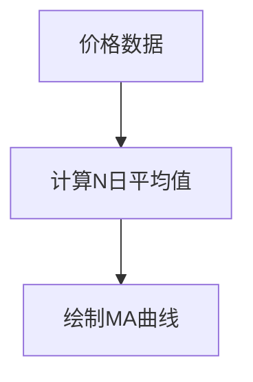
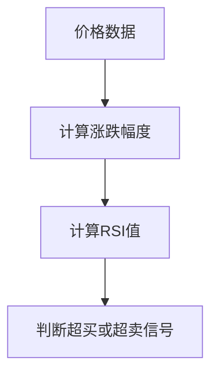

                 

# 全球股市估值与区块链在知识产权保护中的应用

---

## 关键词

- 全球股市估值
- 区块链技术
- 知识产权保护
- 股市分析
- 区块链应用

---

## 摘要

本文深入探讨了全球股市估值的核心方法与区块链技术在知识产权保护中的创新应用。首先，从股市估值的基本概念、数学模型到技术分析，系统地分析了如何利用多种方法评估股市价值。接着，重点介绍了区块链技术如何通过去中心化、不可篡改的特性，解决知识产权保护中的确权、溯源和侵权监测问题。文章结合实际案例，通过数学模型、算法流程图和系统架构图，详细阐述了区块链在知识产权保护中的应用场景，并提出了未来的优化方向。

---

## 第一部分：全球股市估值与分析

### 第1章：全球股市估值的背景与基础

#### 1.1 全球股市估值的定义与概念

股市估值是指通过对股票价格、公司基本面、市场情绪等多方面因素的分析，对股市的整体价值进行评估的过程。它不仅是投资者决策的重要依据，也是经济研究的重要工具。

##### 1.1.1 股市估值的定义

股市估值是通过对股票价格、公司财务数据和市场环境的分析，评估股市整体或个股的内在价值。其核心在于发现市场定价与实际价值之间的差异。

##### 1.1.2 全球股市的多样性与特点

全球股市分布在不同国家和地区，受当地经济、政策和文化的影响，具有多样性。例如，美国股市以科技股为主，而新兴市场则以制造业和资源股为主。

##### 1.1.3 股市估值的核心要素

- **股票价格**：反映市场对公司的整体看法。
- **公司基本面**：包括收入、利润、负债等。
- **市场情绪**：投资者情绪影响短期价格波动。

#### 1.2 股市估值的基本方法

##### 1.2.1 市盈率（P/E）分析

市盈率是衡量股票估值的重要指标，公式为：

$$ P/E = \frac{Price}{Earnings} $$

其中，Price为股票价格，Earnings为每股收益。

##### 1.2.2 市净率（P/B）分析

市净率是另一个常用的估值指标，公式为：

$$ P/B = \frac{Price}{Book\ Value} $$

其中，Book Value为每股账面价值。

##### 1.2.3 股息率与股息增长模型

股息率公式为：

$$ Dividend\ Yield = \frac{Dividend}{Price} $$

股息增长模型则用于预测股息的未来增长。

#### 1.3 影响股市估值的主要因素

##### 1.3.1 宏观经济因素

包括GDP增长率、通货膨胀率、利率水平等。

##### 1.3.2 行业周期与公司基本面

行业周期影响公司的盈利能力和股价走势，而公司基本面则包括收入、利润等财务指标。

##### 1.3.3 市场情绪与投资者行为

市场情绪和投资者行为通过影响供需关系，进而影响股价。

#### 1.4 股市估值与技术分析的结合

##### 1.4.1 技术分析的基本原理

技术分析通过分析历史价格数据，预测未来的价格走势。常用的技术指标包括移动平均线（MA）和相对强弱指数（RSI）。

##### 1.4.2 常用技术指标（如Dow Theory、K线图分析）

Dow Theory认为价格走势反映市场情绪，而K线图则通过开盘价、收盘价、最高价和最低价来分析市场走势。

##### 1.4.3 技术分析与基本面分析的对比

技术分析关注价格走势，而基本面分析关注公司基本面和宏观经济因素。

---

### 第2章：全球股市估值的数学模型与算法

#### 2.1 股市估值的数学模型

##### 2.1.1 市盈率模型

$$ P/E = \frac{Price}{Earnings} $$

##### 2.1.2 市净率模型

$$ P/B = \frac{Price}{Book\ Value} $$

##### 2.1.3 股息率模型

$$ Dividend\ Yield = \frac{Dividend}{Price} $$

#### 2.2 技术分析的核心算法

##### 2.2.1 移动平均线（MA）算法

##### 2.2.2 相对强弱指数（RSI）算法

#### 2.3 风险管理

风险管理是股市估值的重要组成部分，包括波动率和VaR模型。

##### 2.3.1 VaR模型

$$ VaR = \text{最大损失在一定置信水平下} $$

##### 2.3.2 对冲策略

对冲策略通过组合投资来降低风险。

---

## 第二部分：区块链在知识产权保护中的应用

### 第3章：区块链技术基础

#### 3.1 区块链的定义与工作原理

区块链是一种去中心化的分布式账本技术，通过共识机制确保数据的安全性和不可篡改性。

##### 3.1.1 区块链的定义

区块链是通过分布式节点共同维护的 ledger，记录交易数据。

##### 3.1.2 区块链的工作原理

数据通过区块结构组织，每个区块包含交易数据和时间戳，并通过链式结构连接。

##### 3.1.3 共识机制

常用的共识机制包括PoW（工作量证明）和PoS（权益证明）。

#### 3.2 智能合约

智能合约是区块链上的自动执行程序，用于自动执行合同条款。

##### 3.2.1 智能合约的定义

智能合约是在区块链上运行的自动执行代码。

##### 3.2.2 智能合约的功能

包括自动执行、自动履行和自动监督。

---

### 第4章：区块链在知识产权保护中的应用

#### 4.1 知识产权保护的核心问题

知识产权保护的核心问题包括确权、维权和侵权监测。

##### 4.1.1 确权

通过区块链记录知识产权的产生时间，提供确权证明。

##### 4.1.2 维权

通过区块链记录知识产权的使用和交易历史，便于维权。

##### 4.1.3 侵权监测

通过区块链实时监测知识产权的使用情况，及时发现侵权行为。

#### 4.2 区块链在知识产权保护中的具体应用

##### 4.2.1 知识产权的溯源

通过区块链记录知识产权的创建、交易和使用历史，提供溯源功能。

##### 4.2.2 知识产权的确权

通过区块链的时间戳和去中心化特性，确保知识产权的归属。

##### 4.2.3 知识产权的侵权监测

通过区块链实时监测知识产权的使用情况，及时发现侵权行为。

---

## 第5章：区块链在知识产权保护中的法律与伦理问题

### 5.1 区块链技术的法律挑战

##### 5.1.1 现有法律框架的不足

许多国家的法律体系尚未完全适应区块链技术的应用。

##### 5.1.2 跨界法律问题

区块链的跨国性质带来法律管辖难题。

##### 5.1.3 隐私与数据保护

区块链的透明性与隐私保护之间的矛盾。

### 5.2 区块链技术的伦理挑战

##### 5.2.1 数据所有权

区块链技术中的数据所有权归属问题。

##### 5.2.2 数据隐私

区块链的透明性可能泄露个人隐私信息。

##### 5.2.3 数据治理

区块链治理中的权力分配问题。

---

## 第6章：未来展望与最佳实践

### 6.1 未来展望

##### 6.1.1 技术进步

人工智能和大数据技术的进步将提升区块链在知识产权保护中的应用效果。

##### 6.1.2 政策支持

政府政策的支持将推动区块链技术的广泛应用。

##### 6.1.3 行业合作

行业合作将促进区块链技术的标准化和规范化。

### 6.2 最佳实践

##### 6.2.1 技术实施

在实施区块链技术时，需考虑技术可行性、安全性、可扩展性。

##### 6.2.2 法律合规

需遵守相关法律法规，确保区块链应用的合法性。

##### 6.2.3 用户教育

需加强对用户的教育，提高用户对区块链技术的认知和信任。

---

## 总结

全球股市估值与区块链在知识产权保护中的应用，分别代表了金融和科技领域的创新方向。通过合理运用区块链技术，可以有效解决知识产权保护中的确权、溯源和侵权监测问题，推动知识产权保护的数字化和智能化。同时，全球股市估值的精准性和实时性也将因区块链技术的应用而得到提升。未来，随着技术的不断进步和政策的完善，区块链将在更多领域发挥重要作用。

