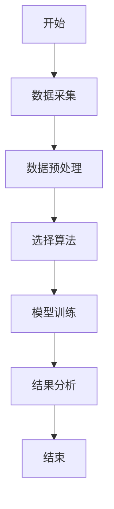
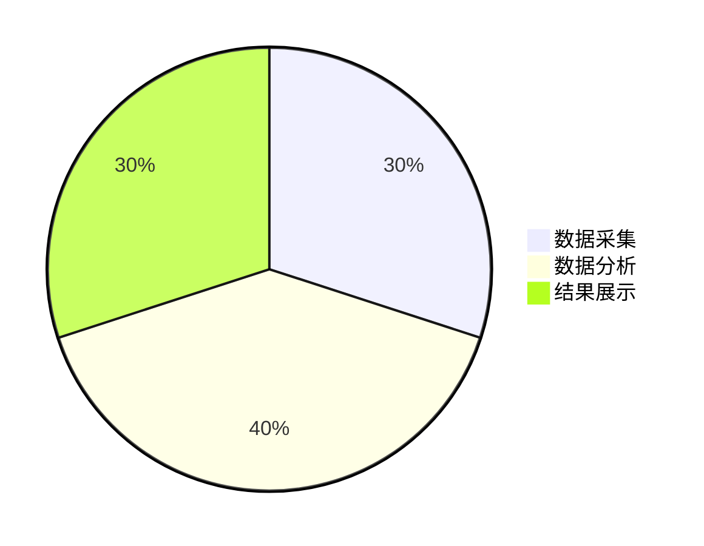
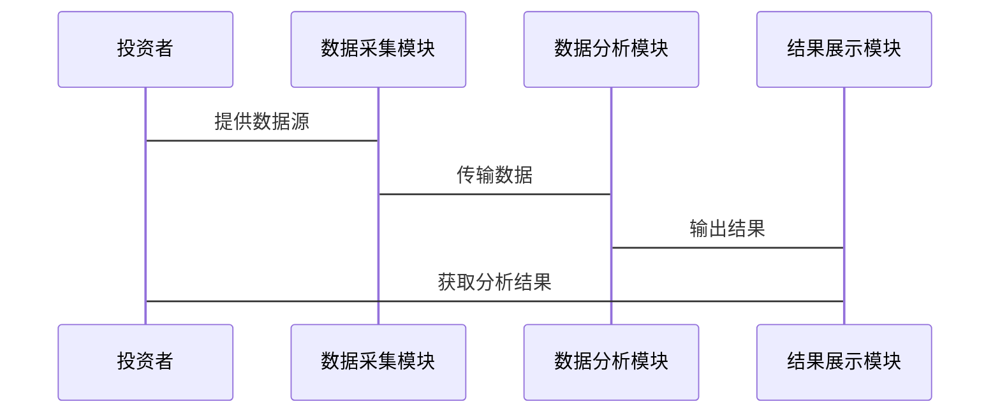

                 


# 全球股市估值与可再生能源存储技术的关系

---

## 关键词：
- 全球股市估值
- 可再生能源存储技术
- 技术与经济分析
- 算法建模
- 可持续发展

---

## 摘要：
本文探讨了全球股市估值与可再生能源存储技术之间的相互影响。通过分析股市估值的核心概念、可再生能源存储技术的特点，结合数学模型和算法原理，揭示技术进步对股市估值的影响。文章还通过实际案例展示了如何将技术与经济因素结合，为投资者和决策者提供参考。

---

# 第一部分：全球股市估值与可再生能源存储技术的背景介绍

## 第1章：背景与问题定义

### 1.1 全球股市估值的基本概念
#### 1.1.1 股市估值的定义与计算方法
股市估值是衡量企业价值的重要指标，常用市盈率（P/E）和市净率（P/B）等指标。

#### 1.1.2 股市估值的影响因素
包括宏观经济环境、企业盈利能力、行业竞争状况等。

#### 1.1.3 可再生能源行业的市场表现
可再生能源行业近年来快速发展，吸引了大量投资，对股市估值产生了显著影响。

### 1.2 可再生能源存储技术的定义与特点
#### 1.2.1 可再生能源存储技术的定义
指将风能、太阳能等不稳定能源转化为可储存和使用的能量的技术。

#### 1.2.2 可再生能源存储技术的核心特点
高效性、可持续性和环保性。

#### 1.2.3 可再生能源存储技术的分类与应用
包括电池存储、氢气存储和热能存储等。

### 1.3 问题背景与研究意义
#### 1.3.1 全球能源结构转型的背景
全球能源向可再生能源转型，推动了存储技术的发展。

#### 1.3.2 可再生能源存储技术对能源市场的影响
提升能源供应稳定性，降低能源成本。

#### 1.3.3 股市估值与可再生能源存储技术的关联性
存储技术的进步直接影响企业的盈利能力和股价。

### 1.4 研究目标与范围界定
#### 1.4.1 研究的核心目标
分析可再生能源存储技术对股市估值的影响。

#### 1.4.2 研究的边界与外延
限于主要股市和关键技术，不考虑政策因素。

#### 1.4.3 核心概念的结构与组成
包括技术、经济、市场三个维度。

---

## 第2章：核心概念与联系

### 2.1 股市估值与可再生能源存储技术的核心概念
#### 2.1.1 股市估值的核心要素
企业盈利、行业前景和宏观经济环境。

#### 2.1.2 可再生能源存储技术的关键指标
存储效率、成本和使用寿命。

#### 2.1.3 两者之间的关联性分析
存储技术进步提升企业竞争力，进而影响股价。

### 2.2 核心概念的属性特征对比
#### 2.2.1 股市估值的属性特征
- 时间性：随市场变化波动
- 相关性：受多种因素影响
- 预测性：可通过模型预测

#### 2.2.2 可再生能源存储技术的属性特征
- 技术性：依赖技术创新
- 环保性：减少碳排放
- 经济性：降低成本

#### 2.2.3 对比分析与表格总结
| 属性 | 股市估值 | 可再生能源存储技术 |
|------|----------|---------------------|
| 时间性 | 动态变化 | 技术渐进性          |
| 相关性 | 多因素影响 | 技术驱动市场        |
| 预测性 | 可模型化预测 | 技术进步可预测      |

### 2.3 ER实体关系图
```mermaid
erDiagram
    class 投资者 {
        <属性> 资金量
        <属性> 风险偏好
    }
    class 可再生能源企业 {
        <属性> 产能
        <属性> 技术水平
    }
    class 股市 {
        <属性> 股价
        <属性> 市场波动
    }
    投资者 --> 可再生能源企业 : 投资
    可再生能源企业 --> 股市 : 影响股价
    投资者 --> 股市 : 投资行为
```

---

## 第3章：算法原理与数学模型

### 3.1 算法原理
#### 3.1.1 时间序列分析
用于预测股价走势，考虑历史数据和趋势。

#### 3.1.2 回归分析
建立技术进步与股价之间的回归模型。

#### 3.1.3 聚类分析
分析不同企业或市场的相似性，为估值提供依据。

### 3.2 数学模型
#### 3.2.1 线性回归模型
$$ y = \beta_0 + \beta_1 x + \epsilon $$
其中，y为股价，x为存储技术参数，β为系数。

#### 3.2.2 时间序列模型
$$ ARIMA(p, d, q) $$
用于捕捉股价的短期波动。

### 3.3 算法流程图


---

## 第4章：系统分析与架构设计

### 4.1 系统功能设计
#### 4.1.1 数据采集模块
采集可再生能源企业的技术参数和股价数据。

#### 4.1.2 数据分析模块
使用回归分析和时间序列分析进行预测。

#### 4.1.3 结果展示模块
可视化分析结果，帮助用户理解。

### 4.2 系统架构设计


### 4.3 系统接口设计
定义各模块之间的接口，确保数据顺利传递。

### 4.4 系统交互序列图


---

## 第5章：项目实战

### 5.1 环境安装
- 数据库：MySQL
- 开发工具：Python、Jupyter

### 5.2 核心代码实现
```python
import pandas as pd
from sklearn.linear_model import LinearRegression

# 数据加载
data = pd.read_csv('renewable_storage.csv')

# 模型训练
model = LinearRegression()
model.fit(data[['technology'], data['stock_price'])

# 预测结果
predictions = model.predict(data[['technology']])
```

### 5.3 代码解读与分析
解释代码功能，展示模型如何预测股价。

### 5.4 案例分析
以某家可再生能源企业为例，分析其股价走势与存储技术的关系。

---

## 第6章：结论与展望

### 6.1 结论
可再生能源存储技术显著影响股市估值，技术进步带来股价上升。

### 6.2 未来展望
进一步研究政策影响和技术创新对股市估值的综合影响。

### 6.3 最佳实践 tips
- 投资者应关注技术进步和市场趋势
- 企业应加大研发投入，提升竞争力

---

## 总结

通过系统分析和实际案例，本文揭示了可再生能源存储技术对股市估值的重要影响，为投资者和企业提供了有价值的参考。未来的研究将进一步深入，结合更多因素，为决策提供更全面的支持。

