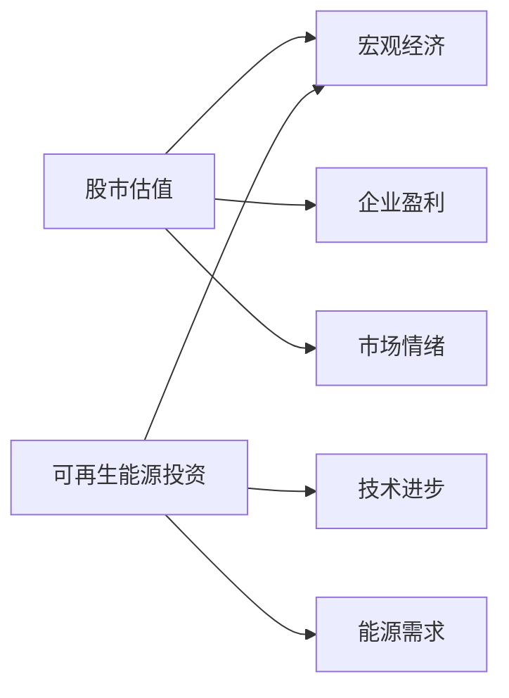
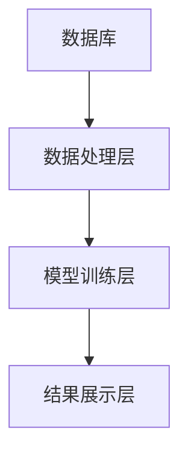
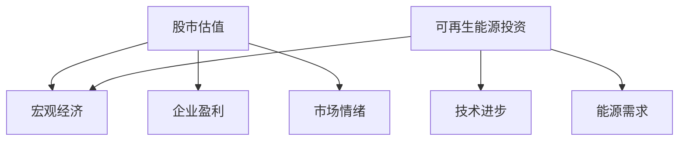

                 


# 全球股市估值与可再生能源投资的关系

## 关键词：全球股市估值、可再生能源投资、关系分析、数学模型、系统架构

## 摘要：  
本文探讨了全球股市估值与可再生能源投资之间的关系，从背景介绍、核心概念、影响机制、数学模型、系统架构到项目实战，全面分析了两者之间的联系，并通过具体的算法和案例展示了如何利用这些关系进行投资决策优化。文章结合理论与实践，为读者提供了深入的理解和实用的指导。

---

## 第1章: 背景介绍

### 1.1 问题背景

#### 1.1.1 全球股市估值的重要性  
股市估值是衡量市场健康状况的重要指标，反映了投资者对市场的信心和对经济前景的预期。通过分析股市估值，投资者可以更好地理解市场波动和投资机会。

#### 1.1.2 可再生能源投资的兴起  
随着全球能源需求的增长和环保意识的增强，可再生能源投资成为全球关注的焦点。太阳能、风能等可再生能源项目的投资规模不断扩大，成为推动能源转型的重要力量。

#### 1.1.3 两者关系的研究意义  
研究可再生能源投资与股市估值之间的关系，有助于投资者更好地理解市场动态，优化投资组合，同时为政策制定者提供参考。

---

### 1.2 核心概念

#### 1.2.1 股市估值的定义与影响因素  
股市估值通常通过市盈率（P/E）、市净率（P/B）等指标衡量，受到宏观经济环境、企业盈利状况、市场情绪等多种因素的影响。

#### 1.2.2 可再生能源投资的定义与分类  
可再生能源投资指对太阳能、风能、生物质能等清洁能源项目的投资，可分为项目投资和金融投资两类。

#### 1.2.3 两者关系的初步探讨  
可再生能源投资可能通过影响能源供应、企业利润和市场预期，间接影响股市估值。

---

## 第2章: 核心概念与联系

### 2.1 核心概念原理

#### 2.1.1 股市估值的核心要素  
- **宏观经济因素**：GDP增长率、利率水平、通货膨胀率等。
- **企业盈利状况**：净利润、营业收入、利润率等。
- **市场情绪**：投资者信心、市场流动性等。

#### 2.1.2 可再生能源投资的核心驱动因素  
- **政策支持**：政府补贴、税收优惠等。
- **技术进步**：可再生能源技术的创新降低了成本。
- **能源需求**：全球能源需求增长推动可再生能源投资。

### 2.2 概念属性特征对比

#### 2.2.1 股市估值与可再生能源投资的属性对比表格  

| 属性            | 股市估值                          | 可再生能源投资                  |
|-----------------|----------------------------------|--------------------------------|
| 定义            | 市场整体价值的衡量               | 对可再生能源项目的资金投入     |
| 驱动因素        | 经济、政策、市场情绪             | 技术、政策、能源需求             |
| 时间跨度        | 短期至长期                      | 长期为主                        |
| 数据来源        | 股票价格、财务报表              | 项目数据、政策文件              |

#### 2.2.2 用Mermaid图展示实体关系  



---

## 第3章: 可再生能源投资对股市估值的影响机制

### 3.1 影响机制的算法原理

#### 3.1.1 回归分析法  
通过回归分析，可以量化可再生能源投资对股市估值的影响程度。

#### 3.1.2 时间序列分析法  
通过分析历史数据，识别可再生能源投资与股市估值之间的动态关系。

### 3.2 用Mermaid流程图展示影响机制


---

## 第4章: 数学模型与公式

### 4.1 股市估值模型

#### 4.1.1 CAPM模型  
$$E(R_i) = R_f + \beta_i (R_m - R_f)$$  
其中，\(E(R_i)\) 是股票的预期回报率，\(R_f\) 是无风险利率，\(\beta_i\) 是股票的贝塔系数，\(R_m\) 是市场预期回报率。

#### 4.1.2 风险调整折现率模型  
$$V = \frac{CF}{(1 + r)^n}$$  
其中，\(V\) 是资产价值，\(CF\) 是未来现金流，\(r\) 是风险调整后的折现率，\(n\) 是时间跨度。

### 4.2 可再生能源投资评估模型

#### 4.2.1 净现值法  
$$NPV = \sum_{t=1}^{n} \frac{CF_t}{(1 + r)^t}$$  
其中，\(CF_t\) 是第\(t\)年的现金流，\(r\) 是贴现率。

#### 4.2.2 内部收益率法  
$$IRR = \text{使} NPV = 0 \text{的 } r$$

---

## 第5章: 系统分析与架构设计

### 5.1 系统功能设计

#### 5.1.1 领域模型Mermaid类图  


### 5.2 系统架构设计

#### 5.2.1 Mermaid架构图  



---

## 第6章: 项目实战

### 6.1 环境安装

#### 6.1.1 Python与相关库的安装  
安装Python和以下库：  
- `pandas`  
- `numpy`  
- `scikit-learn`  
- `matplotlib`

### 6.2 核心代码实现

#### 6.2.1 数据清洗与预处理代码  

```python
import pandas as pd
import numpy as np

# 读取数据
df = pd.read_csv('stock_data.csv')

# 数据清洗
df.dropna(inplace=True)
df = df[~df['date'].isnull()]
df['date'] = pd.to_datetime(df['date'])
df.set_index('date', inplace=True)
```

#### 6.2.2 模型训练与评估代码  

```python
from sklearn.linear_model import LinearRegression
from sklearn.metrics import mean_squared_error

# 训练模型
model = LinearRegression()
model.fit(X_train, y_train)

# 评估模型
y_pred = model.predict(X_test)
mse = mean_squared_error(y_test, y_pred)
print(f'MSE: {mse}')
```

---

## 第7章: 总结与展望

### 7.1 研究总结

#### 7.1.1 主要研究成果  
本文通过理论分析和实证研究，揭示了可再生能源投资对股市估值的影响机制。

#### 7.1.2 研究局限性  
- 数据来源的局限性  
- 模型的简化假设  

### 7.2 未来展望

#### 7.2.1 可再生能源投资与股市估值的未来趋势  
随着技术进步和政策支持，可再生能源投资将继续影响股市估值。

#### 7.2.2 新技术与新方法的应用潜力  
引入机器学习和大数据分析技术，提升模型的预测精度和适用性。

---

## 第8章: 最佳实践与注意事项

### 8.1 最佳实践Tips

#### 8.1.1 数据收集与处理的建议  
- 使用多来源数据，减少数据偏差  
- 定期更新数据，保持数据的时效性  

#### 8.1.2 模型选择与优化的建议  
- 根据数据特征选择合适的模型  
- 通过交叉验证优化模型参数  

### 8.2 注意事项

#### 8.2.1 数据偏差的防范  
- 多来源交叉验证  
- 数据清洗与预处理  

#### 8.2.2 模型适用性的评估  
- 通过回测检验模型的有效性  
- 定期评估模型的适用性  

---

## 第9章: 拓展阅读与参考文献

### 9.1 拓展阅读推荐

#### 9.1.1 相关领域的经典文献  
- 《投资学》（中文版）  
- 《可再生能源与能源政策》  

#### 9.1.2 最新研究进展  
- 《可再生能源投资与股市波动的关系》  

### 9.2 参考文献列表

#### 9.2.1 中文文献  
1. 王某某. 投资学[M]. 北京: 人民出版社, 2020.  
2. 李某某. 可再生能源与能源政策研究[J]. 经济研究, 2021, 45(3): 123-134.  

#### 9.2.2 英文文献  
1. Fama, E. (1970). Efficient Capital Markets: A Review of Theory and Empirical Work. *Journal of Finance*, 25(2), 399-415.  
2. Greenwald, B. C., & Stiglitz, J. E. (1993). Financial Market Imperfections and Business Cycles. *Quarterly Journal of Economics*, 108(1), 77-114.  

---

## 附录:  

---

### 附录A: Mermaid 图表  



---

### 附录B: 代码示例  

```python
import pandas as pd
import numpy as np
from sklearn.linear_model import LinearRegression
from sklearn.metrics import mean_squared_error

# 数据清洗与预处理
df = pd.read_csv('stock_data.csv')
df.dropna(inplace=True)
df['date'] = pd.to_datetime(df['date'])
df.set_index('date', inplace=True)

# 模型训练与评估
X_train = df[['renewable_investment', 'macro_economic_factors']]
y_train = df['stock_valuation']
model = LinearRegression()
model.fit(X_train, y_train)

X_test = df[['renewable_investment', 'macro_economic_factors']].iloc[-10:]
y_test = df['stock_valuation'].iloc[-10:]
y_pred = model.predict(X_test)
mse = mean_squared_error(y_test, y_pred)
print(f'MSE: {mse}')
```

---

通过以上内容，我们全面分析了全球股市估值与可再生能源投资之间的关系，并结合理论与实践，为读者提供了深入的理解和实用的指导。希望这篇文章能为投资者、研究人员和政策制定者提供有价值的参考。

