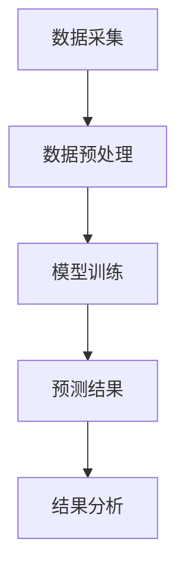

                 


# 全球股市估值与可再生能源预测技术的关系

> 关键词：全球股市估值、可再生能源、预测技术、机器学习、时间序列分析

> 摘要：本文探讨了全球股市估值与可再生能源预测技术之间的关系，分析了两者的核心概念、算法原理和相互影响。通过时间序列分析和机器学习模型，本文提出了可再生能源预测对股市估值的潜在影响，并展示了如何利用这些技术进行实际预测。

---

## 第一部分: 全球股市估值与可再生能源预测技术的背景与核心概念

### 第1章: 问题背景与研究意义

#### 1.1 问题背景
全球股市估值是衡量市场健康状况的重要指标，而可再生能源技术的快速发展正在改变能源市场的格局。随着环保意识的增强和政策的支持，可再生能源投资成为股市的重要组成部分。然而，股市估值受多种因素影响，包括经济指标、政策变化和技术进步。可再生能源技术的不确定性可能影响股市的波动，而股市的走势也可能反过来影响可再生能源投资的决策。

#### 1.2 研究意义
研究全球股市估值与可再生能源预测技术的关系，有助于投资者更好地理解市场动态，优化投资策略。同时，通过技术手段预测可再生能源的未来走势，可以为股市估值提供更精准的数据支持。这种跨领域的研究不仅具有学术价值，还能为实际投资决策提供参考。

### 1.3 核心概念
#### 1.3.1 全球股市估值
- 股市估值：通过市盈率、市净率等指标衡量市场的整体价值。
- 核心因素：宏观经济指标、企业盈利、政策变化等。

#### 1.3.2 可再生能源预测技术
- 可再生能源：太阳能、风能等清洁能源。
- 预测技术：利用时间序列分析、机器学习模型预测能源产出和需求。

#### 1.3.3 两者关系
- 可再生能源的波动影响股市估值。
- 股市估值的变化反过来影响可再生能源的投资。

---

## 第二部分: 可再生能源预测技术的核心原理

### 第2章: 可再生能源预测技术原理

#### 2.1 核心原理概述
可再生能源预测技术依赖于时间序列分析和机器学习模型。时间序列分析适用于历史数据的模式识别，而机器学习模型则能够捕捉复杂的非线性关系。

#### 2.2 算法原理讲解
##### 2.2.1 时间序列分析
- ARIMA模型：通过自回归和移动平均预测未来的数值。
- 算法流程图：
  ```mermaid
  graph TD
      A[数据预处理] --> B[特征提取]
      B --> C[模型训练]
      C --> D[预测结果]
      D --> E[结果评估]
  ```

##### 2.2.2 机器学习模型
- LSTM网络：适用于长序列数据的预测。
- 算法公式：
  $$f(t) = \text{LSTM}(f(t-1), x_t)$$

#### 2.3 数学模型与公式
- ARIMA模型公式：
  $$ARIMA(p, d, q) = y_t - \phi_1 y_{t-1} - \dots - \phi_p y_{t-p} = \theta_1 \epsilon_{t-1} + \dots + \theta_q \epsilon_{t-q}$$

---

## 第三部分: 全球股市估值与可再生能源预测的关联机制

### 第3章: 核心概念与联系

#### 3.1 全球股市估值与可再生能源的关系
- 能源价格波动对股市的影响：能源价格的上涨可能导致股市波动。
- 可再生能源技术进步对股市估值的推动：技术突破可能提升相关企业的估值。

#### 3.2 核心概念属性对比
| 属性       | 股市估值                  | 可再生能源预测技术             |
|------------|---------------------------|---------------------------|
| 核心指标    | 市盈率、市净率            | 预测准确率、误差范围          |
| 影响因素    | 经济指标、政策变化        | 天气条件、技术进步            |
| 数据类型    | 时间序列数据             | 时间序列数据                |

#### 3.3 ER实体关系图
```mermaid
erd
    股市估值
    ----> 关联关系
    可再生能源预测技术
```

---

## 第四部分: 系统分析与架构设计

### 第4章: 项目实战

#### 4.1 项目场景介绍
- 数据来源：公开的能源数据和股市数据。
- 项目目标：预测可再生能源的产出，分析其对股市的影响。

#### 4.2 系统功能设计
- 数据采集模块：收集可再生能源和股市数据。
- 模型训练模块：训练ARIMA和LSTM模型。
- 预测分析模块：生成预测结果并分析其对股市的影响。

#### 4.3 系统架构设计


---

## 第五部分: 最佳实践与总结

### 第5章: 小结与注意事项

#### 5.1 小结
- 全球股市估值与可再生能源预测技术密切相关。
- 通过时间序列分析和机器学习模型可以实现精准预测。

#### 5.2 注意事项
- 数据质量影响预测结果。
- 模型需要定期更新以适应市场变化。

### 第6章: 拓展阅读与深入思考

#### 6.1 拓展阅读
- 《时间序列分析》
- 《机器学习在金融中的应用》

#### 6.2 深入思考
- 如何优化预测模型以提高准确性？
- 可再生能源政策变化对股市的影响机制是什么？

---

## 结语

通过本文的分析，我们深入了解了全球股市估值与可再生能源预测技术的关系，掌握了相关的核心概念和算法原理。未来，随着技术的进步和市场的变化，这一领域将继续发展，为投资者和决策者提供更有力的支持。

