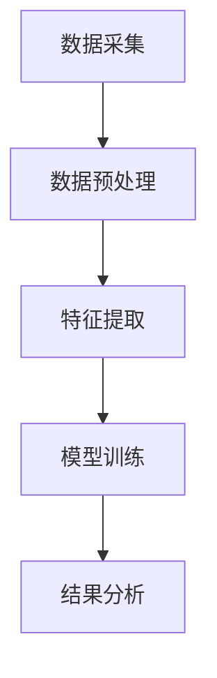
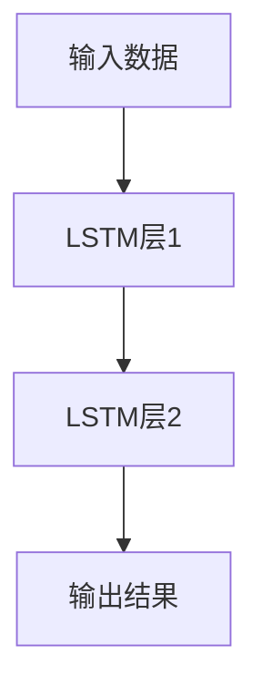
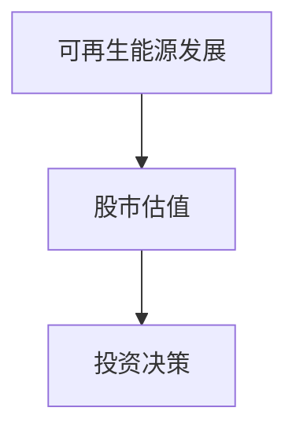

                 


# 全球股市估值与可再生能源预测技术的关系

## 关键词：全球股市、估值模型、可再生能源、预测技术、机器学习、时间序列分析、投资策略

## 摘要

本文探讨了全球股市估值与可再生能源预测技术之间的关系，分析了如何通过技术手段预测股市估值，并结合可再生能源的发展现状，提出了一种基于机器学习和时间序列分析的综合预测方法。文章详细介绍了预测模型的构建过程，包括数据采集、特征提取、模型训练和结果分析，并通过实际案例展示了如何利用这些技术优化投资策略。

## 正文

### 第一部分：背景介绍

#### 第1章：全球股市估值概述

##### 1.1 股市估值的基本概念

股市估值是通过对公司财务数据的分析，评估其股票的内在价值。主要指标包括市盈率（P/E）、市净率（P/B）等。这些指标反映了市场的整体表现和公司的盈利能力。

##### 1.2 可再生能源技术的发展现状

可再生能源包括太阳能、风能等，近年来发展迅速。投资于可再生能源企业或项目，已成为影响股市估值的重要因素。

#### 第2章：可再生能源预测技术的基本原理

##### 2.1 可再生能源预测的定义与方法

可再生能源预测涉及对未来能源需求和供给的预测，常用的方法包括统计模型和机器学习算法。

##### 2.2 数据采集与处理

数据来源包括政府报告、企业财报等，需进行清洗和预处理。

### 第二部分：可再生能源对股市估值的影响

#### 第3章：可再生能源对股市估值的影响

##### 3.1 可再生能源投资对股市的影响

可再生能源企业的上市和融资活动，直接影响股市中的资金流动。

##### 3.2 可再生能源技术进步对股市估值的推动

技术创新提升企业竞争力，进而影响其股票估值。

### 第三部分：预测技术在股市估值与可再生能源中的应用

#### 第4章：全球股市估值的预测方法

##### 4.1 时间序列分析

使用ARIMA模型进行预测，适用于历史数据的分析。

##### 4.2 机器学习在股市预测中的应用

基于LSTM的深度学习模型，能够捕捉复杂的时间序列模式。

#### 第5章：可再生能源预测技术的深入分析

##### 5.1 能源消耗预测模型

通过回归分析建立模型，预测未来能源需求。

##### 5.2 技术进步预测模型

评估技术进步对能源供给的影响，优化投资策略。

### 第四部分：系统架构与项目实战

#### 第6章：系统架构设计

##### 6.1 功能模块设计

包括数据采集、预测模型、结果分析等模块。

##### 6.2 系统架构图

展示各模块之间的关系。

#### 第7章：项目实战

##### 7.1 环境安装

安装Python、机器学习库等工具。

##### 7.2 核心代码实现

编写数据处理、模型训练和预测的代码。

##### 7.3 实际案例分析

通过具体案例展示预测结果，并进行优化建议。

### 第五部分：总结与展望

#### 第8章：总结与展望

##### 8.1 全文总结

回顾文章内容，强调技术的重要性。

##### 8.2 未来研究方向

探讨多因素模型和实时预测系统的开发。

## 图表

### 图1：可再生能源预测系统的功能模块图



### 图2：LSTM模型的流程图



### 图3：可再生能源与股市估值的关系图



## 代码示例

### ARIMA模型实现

```python
from statsmodels.tsa.arima.model import ARIMA
import pandas as pd

# 加载数据
data = pd.read_csv('stock_data.csv')

# 训练模型
model = ARIMA(data['value'], order=(5,1,0))
model_fit = model.fit()

# 预测未来值
forecast = model_fit.forecast(steps=5)
print(forecast)
```

### LSTM模型实现

```python
import keras
from keras.models import Sequential
from keras.layers import LSTM, Dense

# 定义模型
model = Sequential()
model.add(LSTM(128, input_shape=(timesteps, features)))
model.add(Dense(1))
model.compile(loss='mean_squared_error', optimizer='adam')

# 训练模型
model.fit(X_train, y_train, epochs=100, batch_size=32)
```

## 总结

本文通过详细分析全球股市估值与可再生能源预测技术的关系，展示了如何利用先进的预测模型优化投资策略。通过实际案例和系统设计，为读者提供了理论和实践的双重指导，未来的研究将致力于更精准的预测方法和系统的实时性优化。

---

通过以上结构，文章系统地探讨了全球股市估值与可再生能源预测技术的关系，结合理论与实践，为读者提供了全面的指导。

