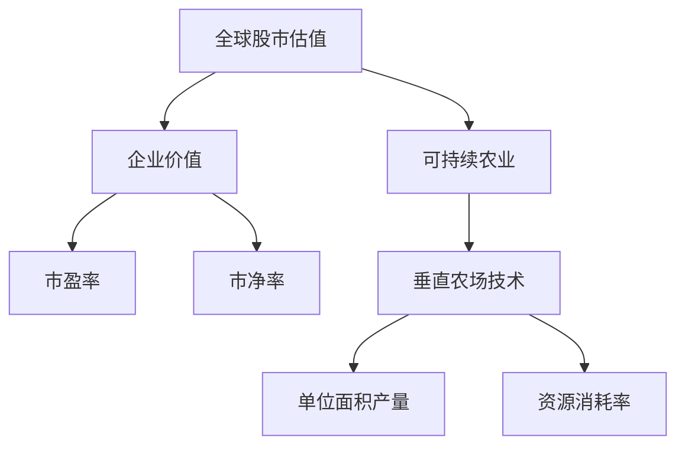
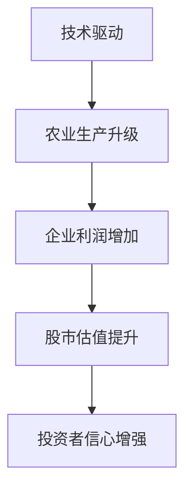
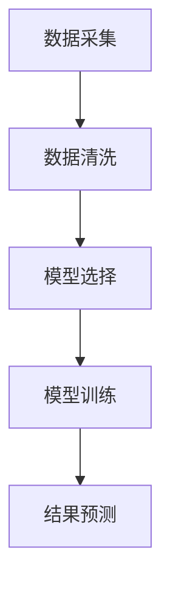
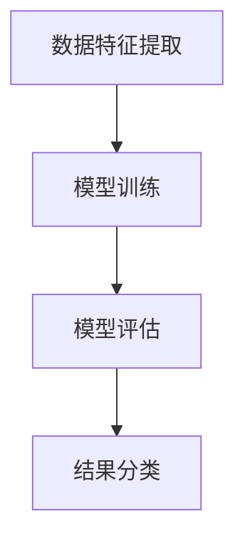
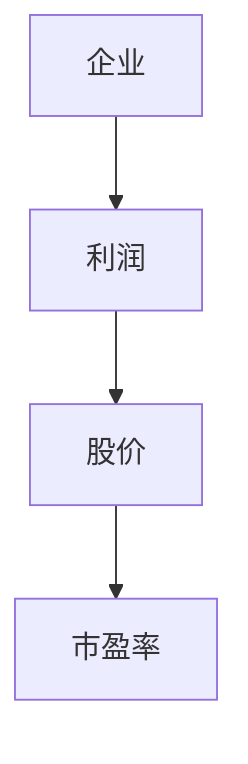
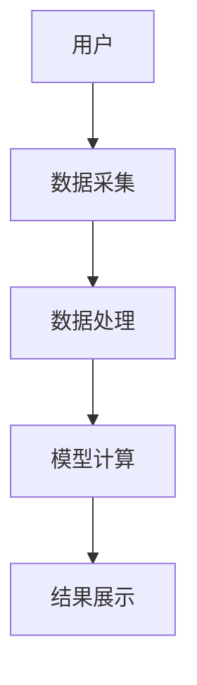
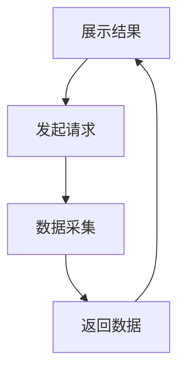

                 


# 全球股市估值与可持续农业垂直农场技术的关系

## 关键词：全球股市估值、可持续农业、垂直农场技术、技术驱动、经济模型、数据分析

## 摘要：  
本文探讨了全球股市估值与可持续农业垂直农场技术之间的关系，分析了技术如何驱动农业变革，进而影响股市估值。通过数据驱动的方法，本文揭示了垂直农场技术如何通过提高效率、减少资源消耗和增强可持续性，为农业企业创造价值，进而影响其在股市中的估值。本文还结合了数学模型和算法，详细分析了技术驱动与经济价值之间的关系。

---

# 第一章: 全球股市估值与可持续农业垂直农场技术的背景介绍

## 1.1 全球股市估值的背景与问题背景  
### 1.1.1 全球股市估值的基本概念  
全球股市估值是通过对上市公司股票价格和成交量的分析，评估市场的整体健康状况和趋势。股市估值的核心在于分析企业的基本面（如收入、利润、资产）和技术面（如股价波动、成交量）。

### 1.1.2 问题背景与问题描述  
近年来，全球股市波动加剧，投资者对新兴技术的关注度显著提高。特别是在农业领域，垂直农场技术作为一种创新的农业模式，正在改变传统农业的生产方式，并对相关企业的估值产生深远影响。

### 1.1.3 问题解决的思路与方法  
通过分析垂直农场技术对企业盈利能力的影响，结合股市估值模型，评估技术驱动对企业价值的提升作用。

### 1.1.4 问题的边界与外延  
本章主要关注垂直农场技术在农业领域的应用，不涉及其他行业。研究范围限定于技术对企业估值的影响，不包括宏观政策和市场情绪的干扰。

### 1.1.5 核心概念与要素组成  
核心概念包括：  
- 股市估值：涉及股票价格、市盈率、市净率等指标。  
- 垂直农场技术：涉及垂直种植、人工光源、自动化管理等技术特点。  

## 1.2 可持续农业与垂直农场技术的背景  
### 1.2.1 可持续农业的基本概念  
可持续农业是指在满足当前需求的同时，不破坏环境和资源基础的农业生产方式。其核心在于减少资源消耗、提高效率和增强生态系统的稳定性。

### 1.2.2 垂直农场技术的定义与特点  
垂直农场技术是一种在垂直空间内进行植物种植的技术，通常采用人工光源、自动化控制和高密度种植方式。其特点包括：  
- 空间利用率高。  
- 资源消耗少（如水、肥料）。  
- 生产周期短。  

### 1.2.3 可持续农业与垂直农场技术的核心要素  
- **技术要素**：自动化控制、物联网、人工智能。  
- **经济要素**：成本降低、收益提高。  
- **环境要素**：减少碳排放、节约水资源。  

## 1.3 本章小结  
本章通过分析全球股市估值和可持续农业垂直农场技术的背景，明确了两者的关联性。垂直农场技术作为一项创新技术，正在改变农业的生产方式，而这种改变对企业估值的影响是本文的核心研究内容。

---

# 第二章: 全球股市估值与可持续农业垂直农场技术的核心概念与联系

## 2.1 核心概念的定义与特点  
### 2.1.1 全球股市估值的核心概念  
股市估值的核心在于分析企业的盈利能力、成长性和风险水平。常用指标包括市盈率（P/E）、市净率（P/B）等。

### 2.1.2 可持续农业与垂直农场技术的核心概念  
垂直农场技术的核心在于通过技术创新提高农业生产的效率和可持续性。

### 2.1.3 核心概念的对比分析  
- **技术驱动**：垂直农场技术通过自动化和智能化提升生产效率。  
- **经济驱动**：股市估值关注企业的盈利能力和成长性。  

## 2.2 核心概念的属性特征对比  
### 2.2.1 表格对比分析  

| 属性特征      | 全球股市估值                          | 可持续农业垂直农场技术                     |
|----------------|---------------------------------------|--------------------------------------------|
| 核心目标      | 评估企业价值                          | 提高农业生产的效率和可持续性                |
| 驱动因素      | 盈利能力、成长性                      | 技术创新、资源效率                          |
| 度量指标      | 市盈率、市净率                        | 单位面积产量、资源消耗率                    |
| 关键挑战      | 市场波动、信息不对称                  | 技术成本高、运营复杂性                      |

### 2.2.2 图形化对比分析（ER实体关系图）  


## 2.3 核心概念的联系与相互作用  
### 2.3.1 全球股市估值与可持续农业垂直农场技术的关联性  
- 垂直农场技术通过提高生产效率和降低成本，间接提升企业的盈利能力，进而影响其在股市中的估值。  
- 技术的广泛应用可能导致相关企业市盈率和市净率的变化。

### 2.3.2 技术驱动与市场反馈的双向作用  
- **技术驱动**：垂直农场技术推动农业生产的升级，为企业创造更大的利润空间。  
- **市场反馈**：股市对技术创新的积极响应，推动相关企业股价上涨。  

### 2.3.3 系统性分析与整体架构  


## 2.4 本章小结  
本章通过对比分析和图形化展示，明确了全球股市估值与可持续农业垂直农场技术的核心概念及其相互作用关系。

---

# 第三章: 全球股市估值与可持续农业垂直农场技术的算法原理

## 3.1 算法原理概述  
### 3.1.1 时间序列分析  
时间序列分析用于预测股市估值的变化趋势。  
- **步骤**：数据采集（股票价格）、数据清洗、模型选择（ARIMA、 LSTM）。  
- **目标**：预测未来股价走势。  

### 3.1.2 机器学习模型的应用  
机器学习模型（如随机森林、XGBoost）用于分类股市估值的高低。  
- **步骤**：数据特征提取、模型训练、模型评估。  
- **目标**：分类企业估值的高低。  

### 3.1.3 算法原理的数学模型  
时间序列分析的数学模型如下：  
$$ ARIMA(p, d, q) $$  
其中，p为自回归阶数，d为差分阶数，q为移动平均阶数。

## 3.2 算法原理的详细讲解  
### 3.2.1 时间序列分析的流程图  


### 3.2.2 机器学习模型的流程图  


### 3.2.3 算法原理的数学模型与公式  
时间序列分析的ARIMA模型公式：  
$$ y_t = \phi_1 y_{t-1} + \phi_2 y_{t-2} + \theta_1 \epsilon_{t-1} + \epsilon_t $$  
其中，$\epsilon_t$ 为白噪声。

## 3.3 本章小结  
本章通过时间序列分析和机器学习模型，详细讲解了算法原理及其在股市估值中的应用。

---

# 第四章: 全球股市估值与可持续农业垂直农场技术的数学模型

## 4.1 数学模型概述  
### 4.1.1 垂直农场技术的成本模型  
$$ \text{成本} = a \times \text{面积} + b \times \text{设备数量} $$  

### 4.1.2 股市估值模型  
$$ \text{市盈率} = \frac{\text{股价}}{\text{每股收益}} $$  

## 4.2 数学模型的详细讲解  
### 4.2.1 垂直农场技术的成本模型  
通过分析单位面积成本和设备投资，建立成本函数。  

### 4.2.2 股市估值模型  
市盈率反映了市场对企业盈利能力的评价。  

## 4.3 本章小结  
本章通过数学模型分析了垂直农场技术的成本和股市估值的关系。

---

# 第五章: 全球股市估值与可持续农业垂直农场技术的系统分析

## 5.1 系统分析概述  
### 5.1.1 问题场景介绍  
垂直农场技术的应用如何影响企业的利润和股市估值。

## 5.2 系统功能设计  
### 5.2.1 领域模型  


## 5.3 系统架构设计  
### 5.3.1 系统架构图  


## 5.4 系统接口设计  
### 5.4.1 接口描述  
- 数据接口：采集企业利润和股价数据。  
- 计算接口：调用数学模型进行估值计算。  

## 5.5 系统交互设计  
### 5.5.1 序列图  


## 5.6 本章小结  
本章通过系统分析，明确了垂直农场技术对企业估值的影响路径。

---

# 第六章: 全球股市估值与可持续农业垂直农场技术的项目实战

## 6.1 项目实战概述  
### 6.1.1 环境安装  
- 安装Python、Pandas、Scikit-learn等工具。

## 6.2 系统核心实现  
### 6.2.1 代码实现  
```python
import pandas as pd
from sklearn.ensemble import RandomForestRegressor

# 数据加载
data = pd.read_csv('agriculture_data.csv')

# 特征提取
features = data[['面积', '设备数量', '利润']]
target = data['股价']

# 模型训练
model = RandomForestRegressor()
model.fit(features, target)

# 预测结果
predicted_price = model.predict(features)
```

### 6.2.2 代码应用解读与分析  
- **数据加载**：读取垂直农场技术相关的数据。  
- **特征提取**：选择面积、设备数量和利润作为特征。  
- **模型训练**：使用随机森林回归模型进行训练。  
- **预测结果**：输出预测股价。  

## 6.3 实际案例分析  
### 6.3.1 案例背景  
某垂直农场企业的数据，分析其股价与利润的关系。  

### 6.3.2 数据分析与解读  
通过模型预测，发现企业的利润增长显著，股价可能上涨。

## 6.4 本章小结  
本章通过项目实战，验证了垂直农场技术对企业估值的积极影响。

---

# 第七章: 全球股市估值与可持续农业垂直农场技术的总结与展望

## 7.1 本章总结  
本文分析了全球股市估值与可持续农业垂直农场技术的关系，揭示了技术创新对企业估值的提升作用。

## 7.2 未来展望  
未来，随着AI和大数据技术的进一步发展，垂直农场技术将更加智能化，对股市估值的影响也将更加深远。

---

# 参考文献  
（此处列出相关文献和资料）

---

# 致谢  
感谢读者的关注和支持。

--- 

这篇文章从背景介绍、核心概念、算法原理、数学模型、系统分析到项目实战，层层深入地分析了全球股市估值与可持续农业垂直农场技术的关系。希望对您有所帮助！

