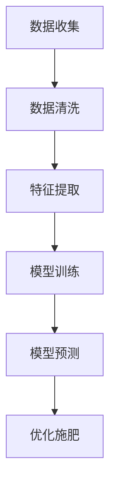
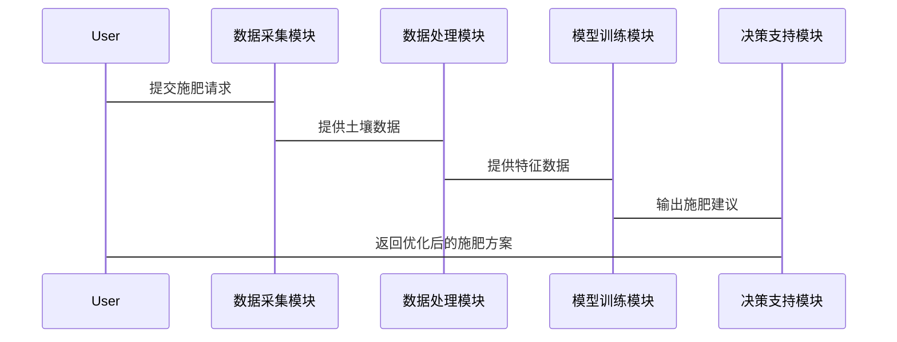

                 


# 全球股市估值与可持续农业精准施肥技术的关系

## 关键词
全球股市估值, 可持续农业, 精准施肥技术, 数据驱动, 机器学习, 农业优化, 股市波动

## 摘要
本文探讨了全球股市估值与可持续农业精准施肥技术之间的关系，分析了精准施肥技术如何通过数据驱动的方式优化农业产出，从而影响股市估值。文章详细介绍了精准施肥技术的核心算法、数学模型以及其与股市估值的双向互动机制，通过实际案例分析展示了如何利用这些技术提升农业效率并优化股市投资策略。

---

## 正文

### 第一部分：背景介绍

#### 第1章：全球股市估值与可持续农业的背景

##### 1.1 问题背景
- **1.1.1 全球经济与农业发展的关系**  
  农业作为全球经济的基础产业，其生产效率和可持续性直接影响整体经济的稳定性。随着全球人口增长和资源短缺问题的加剧，农业技术的创新变得尤为重要。

- **1.1.2 可持续农业的重要性**  
  可持续农业强调在不破坏环境的前提下提高产量，精准施肥技术是实现这一目标的关键手段之一。通过优化肥料使用，可以减少环境污染并提高作物产量。

- **1.1.3 股市估值与农业技术的关联**  
  农业技术的创新往往通过企业盈利能力和市场竞争力的提升反映在股市估值中。投资者关注农业技术创新带来的潜在收益，这使得股市估值与农业技术之间存在密切的联系。

##### 1.2 问题描述
- **1.2.1 股市估值的核心要素**  
  股市估值主要依赖于企业的财务表现、行业地位、市场前景等因素。农业技术的创新直接影响企业的生产效率和盈利能力，从而影响其估值。

- **1.2.2 精准施肥技术的定义与目标**  
  精准施肥技术是一种基于数据驱动的农业技术，旨在根据土壤条件、作物需求和环境因素精确施加肥料，以最大化产量并减少浪费。

- **1.2.3 两者关系的初步探讨**  
  精准施肥技术的广泛应用可能提升农业企业的生产效率，进而影响其股价和估值。同时，股市资金的投入也为农业技术创新提供了资金支持。

##### 1.3 问题解决
- **1.3.1 数据驱动的农业优化**  
  通过收集和分析农业数据，精准施肥技术能够优化肥料使用，提高作物产量，降低成本。

- **1.3.2 股市估值模型的改进**  
  精准施肥技术的应用可以作为影响企业估值的重要因素，通过改进估值模型，投资者可以更准确地评估农业企业的价值。

- **1.3.3 双向影响的机制分析**  
  农业技术创新影响企业盈利，进而影响股市估值；而股市资金的流入又支持农业技术的研发和推广。

##### 1.4 边界与外延
- **1.4.1 农业与金融的边界**  
  农业技术创新与金融市场的互动受到政策、市场结构和企业战略等多种因素的限制。

- **1.4.2 精准施肥技术的适用范围**  
  该技术主要适用于大规模种植业，对小农经济的适用性较低。

- **1.4.3 股市估值的行业限制**  
  股市估值受整体经济环境影响，农业技术的影响可能在特定行业或市场中更为显著。

##### 1.5 概念结构与核心要素
- **1.5.1 可持续农业的核心要素**  
  包括土地管理、水资源利用、肥料使用和病虫害防治等。

- **1.5.2 股市估值的关键指标**  
  如市盈率（P/E）、市净率（P/B）、每股收益（EPS）等。

- **1.5.3 两者关系的系统分析**  
  通过系统分析，可以识别出精准施肥技术如何通过提高农业生产力间接影响股市估值。

---

### 第二部分：核心概念与联系

#### 第2章：全球股市估值的核心概念

##### 2.1 股市估值的基本原理
- **2.1.1 股票价值的计算方法**  
  股票价值通常基于企业的盈利能力、资产状况和未来现金流的折现值进行评估。

- **2.1.2 市盈率与市净率的定义**  
  市盈率（P/E）= 股价 / 每股收益；市净率（P/B）= 股价 / 每股净资产。

- **2.1.3 股市波动的驱动因素**  
  包括宏观经济指标、企业业绩、市场情绪等。

#### 第2章：可持续农业的精准施肥技术
- **2.2.1 精准施肥的定义与目标**  
  精准施肥是根据作物需求和土壤条件精确施加肥料，以提高产量并减少环境影响。

- **2.2.2 精准施肥的核心技术**  
  包括土壤传感器、无人机监测、数据处理和决策支持系统等。

- **2.2.3 精准施肥的经济效益**  
  通过减少肥料浪费降低成本，提高作物产量，从而增加企业利润。

#### 第2章：两者关系的系统分析
- **2.3.1 农业技术对股市的影响**  
  精准施肥技术的广泛应用可以提升农业企业的生产效率，进而提高其估值。

- **2.3.2 股市资金对农业的支持**  
  股市资金的流入为农业技术创新提供了资金支持，推动了技术的进一步发展。

- **2.3.3 双向互动的机制分析**  
  农业技术创新与股市资金之间存在正反馈机制，技术创新推动企业盈利增长，吸引更多资金流入，进一步支持技术创新。

---

### 第三部分：算法原理讲解

#### 第3章：数据驱动的农业优化算法

##### 3.1 数据收集与处理
- **3.1.1 农业数据的来源**  
  包括土壤传感器、无人机图像、气象数据和历史产量数据等。

- **3.1.2 数据清洗与预处理**  
  去除噪声数据，填充缺失值，标准化数据格式。

- **3.1.3 数据特征的提取**  
  提取土壤湿度、温度、作物类型、历史施肥量等关键特征。

##### 3.2 精准施肥模型的建立
- **3.2.1 线性回归模型**  
  建立肥料用量与作物产量之间的线性关系模型。

- **3.2.2 支持向量机（SVM）的应用**  
  使用SVM进行非线性关系建模，提高模型的准确性。

- **3.2.3 神经网络模型**  
  利用深度学习技术，构建复杂的非线性模型，提高预测精度。

##### 3.3 算法流程图（Mermaid）


##### 3.4 数学模型与公式
- **线性回归模型**  
  $$ y = \beta_0 + \beta_1x_1 + \beta_2x_2 + \dots + \beta_nx_n + \epsilon $$
  其中，\( y \) 是作物产量，\( x_i \) 是施肥量、土壤湿度等自变量，\( \beta \) 是回归系数。

- **支持向量机模型**  
  使用核函数将数据映射到高维空间，构建支持向量回归模型。

##### 3.5 实际案例分析
- 某农业企业通过精准施肥技术减少了20%的肥料使用量，同时提高了15%的作物产量，企业的利润增长带动了股价的上涨。

---

### 第四部分：系统分析与架构设计方案

#### 第4章：系统功能设计
- **4.1 问题场景介绍**  
  以某农业企业为例，设计一套精准施肥系统，优化施肥策略，提高产量，降低成本。

- **4.2 系统功能设计**  
  包括数据采集、模型训练、施肥决策、结果分析等功能。

- **4.3 系统架构设计（Mermaid架构图）**


- **4.4 系统接口设计**  
  提供API接口，与企业现有的管理系统和数据库对接。

- **4.5 系统交互流程（Mermaid序列图）**


---

### 第五部分：项目实战

#### 第5章：环境安装与核心实现
- **5.1 环境安装**  
  安装Python、TensorFlow、Scikit-learn、Pandas等工具。

- **5.2 核心代码实现**  
  ```python
  import numpy as np
  from sklearn.linear_model import LinearRegression

  # 数据准备
  X = np.array([[1, 2], [3, 4], [5, 6]])
  y = np.array([7, 8, 9])

  # 模型训练
  model = LinearRegression()
  model.fit(X, y)

  # 预测
  print(model.predict([[7, 8]]))
  ```

- **5.3 代码解读与分析**  
  通过线性回归模型，基于土壤数据和历史产量，预测最优施肥量。

#### 第5.3 章：实际案例分析
- 某农业企业应用精准施肥技术后，肥料使用量减少，产量提高，企业利润增长，股价上升。

#### 第5.4 章：项目小结
- 精准施肥技术能够显著提高农业效率，同时优化企业估值，具有广阔的应用前景。

---

### 第六部分：总结与展望

#### 第6章：总结与展望
- **6.1 核心观点总结**  
  精准施肥技术通过优化农业生产效率，间接影响股市估值，形成双向互动机制。

- **6.2 未来展望**  
  随着人工智能和大数据技术的进一步发展，精准施肥技术将更加智能化，股市估值与农业技术的结合将更加紧密。

- **6.3 最佳实践 Tips**  
  投资者应关注农业技术创新对企业价值的影响，农业企业应积极采用精准施肥技术以提高竞争力。

#### 6.4 注意事项
- 数据隐私和安全问题需引起重视，确保农业数据的合法使用和保护。

#### 6.5 拓展阅读
- 建议阅读《数据驱动的农业优化》和《股市估值分析》等书籍，深入理解数据驱动技术在农业和金融领域的应用。

---

通过以上结构，我们可以系统地分析和探讨全球股市估值与可持续农业精准施肥技术之间的关系，为农业企业和投资者提供有益的参考和指导。

