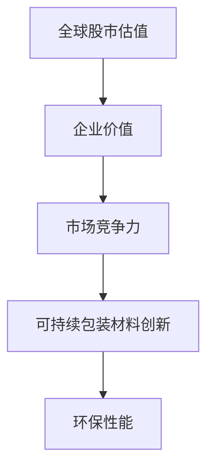
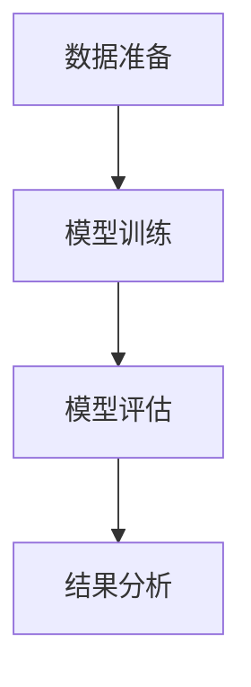
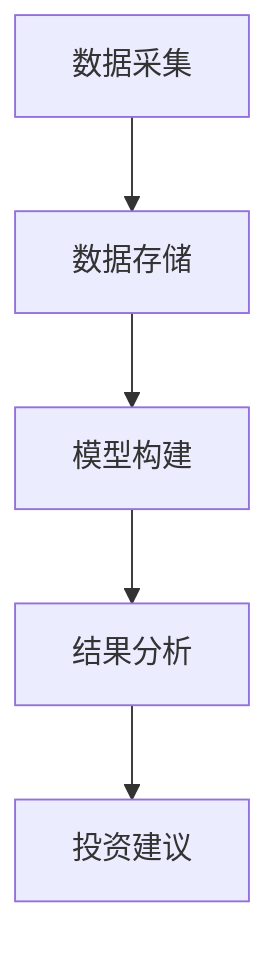
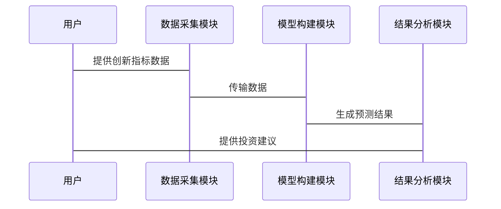

                 


# 全球股市估值与可持续包装材料创新的关联

> 关键词：全球股市估值、可持续包装材料、创新关联、算法原理、系统架构

> 摘要：本文探讨全球股市估值与可持续包装材料创新之间的关联性，通过背景介绍、核心概念、算法原理、系统架构、项目实战和最佳实践等部分，深入分析两者之间的关系，并通过实际案例和项目实战，帮助读者理解如何利用技术创新影响股市估值，推动可持续包装材料的创新与发展。

---

## 第1章 全球股市估值与可持续包装材料创新的背景介绍

### 1.1 问题背景与问题描述

#### 1.1.1 全球股市估值的现状与挑战
- 全球股市估值受多种因素影响，包括经济指标、政策变化、企业业绩等。
- 近年来，投资者对企业的可持续性关注增加，企业社会责任（CSR）成为影响股市估值的重要因素。

#### 1.1.2 可持续包装材料创新的背景与意义
- 包装行业是全球第二大污染源，可持续包装材料的创新对环境保护至关重要。
- 可持续包装材料（如可降解塑料、再生纸等）的推广有助于减少环境污染，符合全球绿色发展趋势。

#### 1.1.3 问题解决的必要性与目标
- 探讨可持续包装材料创新对全球股市估值的影响，为投资者提供新的评估维度。
- 通过技术创新和市场推广，推动可持续包装材料的广泛应用，促进全球经济的可持续发展。

### 1.2 问题的边界与外延

#### 1.2.1 全球股市估值的边界条件
- 股市估值主要关注企业的财务表现、市场竞争力和可持续性。
- 本研究仅关注与可持续包装材料创新相关的部分，不涉及其他行业。

#### 1.2.2 可持续包装材料创新的边界条件
- 可持续包装材料创新包括材料研发、生产过程优化和废弃物回收利用。
- 本研究聚焦于包装材料的创新对股市估值的影响，不涉及其他类型的可持续创新。

#### 1.2.3 两者的关联与外延
- 可持续包装材料创新可能影响企业的成本、市场竞争力和品牌形象，进而影响股市估值。
- 全球股市估值的变化可能反过来影响企业的研发投入和创新动力。

### 1.3 概念结构与核心要素

#### 1.3.1 核心概念的组成与属性
- **全球股市估值**：反映企业市场价值的综合指标，包括市盈率、市净率等。
- **可持续包装材料创新**：通过技术创新实现包装材料的环保和可持续性。

#### 1.3.2 核心要素的对比分析
| 要素 | 全球股市估值 | 可持续包装材料创新 |
|------|--------------|----------------------|
| 核心指标 | 市盈率、市净率 | 生物降解性、可再生性 |
| 影响因素 | 经济指标、政策 | 技术创新、市场需求 |
| 目标 | 评估企业价值 | 减少环境污染 |

#### 1.3.3 概念结构的可视化图解


---

## 第2章 核心概念与关联分析

### 2.1 核心概念的原理与特征

#### 2.1.1 全球股市估值的核心原理
- 股市估值基于企业的财务表现和市场预期。
- 可持续包装材料创新可能提升企业的市场竞争力和品牌价值。

#### 2.1.2 可持续包装材料创新的核心原理
- 创新包装材料通过降低环境影响，满足消费者和政策的双重需求。
- 创新可能降低生产成本，提高企业的盈利能力。

#### 2.1.3 两者的核心特征对比
| 特征 | 全球股市估值 | 可持续包装材料创新 |
|------|--------------|----------------------|
| 时间性 | 短期波动与长期趋势 | 长期技术研发与市场推广 |
| 主导因素 | 市场供需、政策 | 技术创新、环保需求 |

### 2.2 核心概念的联系与区别

#### 2.2.1 联系的分析与证据
- 可持续包装材料创新可能提升企业的市场竞争力，进而影响股市估值。
- 环保政策的趋严可能使采用可持续包装材料的企业更具优势。

#### 2.2.2 区别的分析与证据
- 股市估值是结果，而可持续包装材料创新是过程。
- 创新可能需要较长时间才能反映在股市估值中。

#### 2.2.3 联系与区别对关联性的影响
- 理解两者的联系与区别有助于制定有效的投资策略。

### 2.3 核心概念的ER实体关系图

```mermaid
erd
    entity 全球股市估值 {
        <市盈率>
        <市净率>
    }
    entity 可持续包装材料创新 {
        <生物降解性>
        <可再生性>
    }
    全球股市估值 --|{关联}| 可持续包装材料创新
```

---

## 第3章 全球股市估值与可持续包装材料创新的算法原理

### 3.1 算法原理概述

#### 3.1.1 算法选择的依据
- 选择多元回归分析（Multiple Linear Regression）来量化可持续包装材料创新对股市估值的影响。

#### 3.1.2 算法的基本原理
- 多元回归分析通过建立多个自变量（如创新指标）与因变量（如股市估值）之间的关系模型。

#### 3.1.3 算法的适用性分析
- 适用于分析多个变量对单一结果的影响。

### 3.2 算法的数学模型与公式

#### 3.2.1 数学模型的定义
$$ \text{股市估值} = \beta_0 + \beta_1 \times \text{创新指标} + \beta_2 \times \text{其他因素} + \epsilon $$

#### 3.2.2 关键公式与推导
- 标准回归系数 $$ \beta_1 $$ 表示创新指标对股市估值的影响程度。

#### 3.2.3 公式的可视化图解
$$ \text{创新指标} \rightarrow \text{股市估值} $$

### 3.3 算法的实现与优化

#### 3.3.1 算法实现的步骤


#### 3.3.2 算法优化的策略
- 使用正则化方法（如Lasso回归）减少过拟合。

#### 3.3.3 算法实现的代码示例
```python
import pandas as pd
from sklearn.linear_model import LinearRegression

# 数据准备
data = pd.DataFrame({
    '创新指标': [0.1, 0.2, 0.3, 0.4],
    '股市估值': [100, 120, 130, 150]
})

# 模型训练
model = LinearRegression()
model.fit(data[['创新指标']], data['股市估值'])

# 模型评估
print('回归系数：', model.coef_)
print('截距：', model.intercept_)
```

### 3.4 算法的验证与测试

#### 3.4.1 数据集的准备
- 使用真实企业的数据，包括创新指标和股市估值。

#### 3.4.2 算法的验证过程
- 通过交叉验证评估模型的准确性。

#### 3.4.3 算法的测试结果与分析
- 模型预测股市估值与实际值的误差分析。

---

## 第4章 全球股市估值与可持续包装材料创新的系统分析

### 4.1 系统分析与设计

#### 4.1.1 系统分析的步骤
- 确定系统目标：量化可持续包装材料创新对股市估值的影响。
- 识别系统边界：聚焦于包装行业和相关股市数据。

#### 4.1.2 系统功能设计
- 数据采集模块：收集创新指标和股市估值数据。
- 模型构建模块：建立多元回归模型。
- 分析模块：输出结果并提供投资建议。

#### 4.1.3 系统架构设计


### 4.2 项目实战

#### 4.2.1 环境安装
- 安装Python和相关库（如Pandas、Scikit-learn）。

#### 4.2.2 系统核心实现源代码
```python
import pandas as pd
from sklearn.linear_model import LinearRegression
import matplotlib.pyplot as plt

# 数据准备
data = pd.read_csv('sustainable_packaging.csv')

# 模型训练
model = LinearRegression()
model.fit(data[['创新指标']], data['股市估值'])

# 可视化
plt.scatter(data['创新指标'], data['股市估值'])
plt.plot(data['创新指标'], model.predict(data[['创新指标']]), color='red')
plt.xlabel('创新指标')
plt.ylabel('股市估值')
plt.show()
```

#### 4.2.3 代码应用解读与分析
- 代码实现多元回归模型，可视化数据与预测结果。

#### 4.2.4 实际案例分析
- 分析某企业的创新指标与股市估值变化，验证模型的有效性。

### 4.3 系统交互流程

#### 4.3.1 系统交互的流程图


---

## 第5章 全球股市估值与可持续包装材料创新的最佳实践

### 5.1 小结
- 可持续包装材料创新对全球股市估值有显著影响，企业应重视技术创新。

### 5.2 注意事项
- 数据质量和模型选择对结果准确性至关重要。

### 5.3 拓展阅读
- 推荐阅读相关领域的学术论文和行业报告，深入理解创新与估值的关联。

---

通过以上步骤，我们可以系统地分析全球股市估值与可持续包装材料创新之间的关联，并通过实际案例和项目实战，验证我们的理论和方法。这不仅有助于投资者制定更科学的投资策略，还能推动包装行业的可持续发展。

