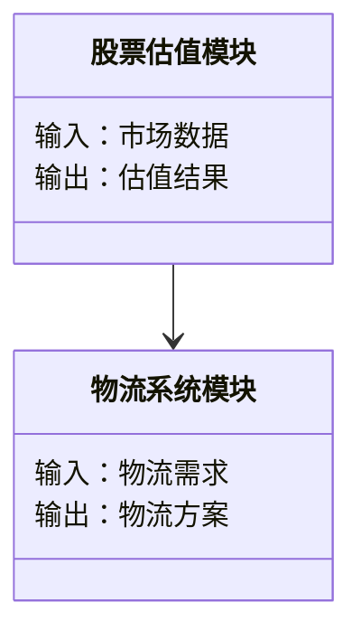
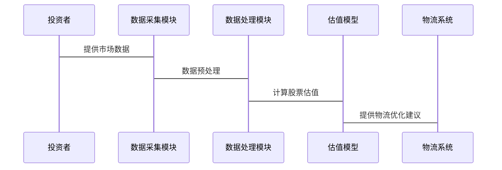

                 


# 全球股市估值与可持续城市地下物流系统的关联

> 关键词：全球股市估值、可持续城市、地下物流系统、关联分析、系统设计

> 摘要：本文探讨了全球股市估值与可持续城市地下物流系统的关联性，通过分析股市估值的核心概念、可持续城市地下物流系统的功能特点，以及两者的相互作用，提出了基于数据驱动的优化策略。文章从理论分析到系统设计，再到项目实战，系统性地阐述了如何通过技术创新和政策引导，实现股市估值优化与城市物流效率提升的双重目标。

---

# 第1章 全球股市估值与可持续城市地下物流系统的背景介绍

## 1.1 问题背景与问题描述

### 1.1.1 全球股市估值的现状与挑战
全球股市估值是衡量市场健康状况的重要指标，但近年来，传统估值模型面临以下挑战：
- **数据复杂性**：市场波动加剧，数据维度增加，传统模型难以捕捉非线性关系。
- **技术局限性**：基于统计的模型在处理大数据时效率不足，难以实时响应市场变化。
- **人为因素影响**：投资者情绪、政策变化等非理性因素对估值的影响难以量化。

### 1.1.2 可持续城市地下物流系统的概念与意义
可持续城市地下物流系统是一种通过地下交通网络优化城市物流的创新模式，具有以下特点：
- **资源节约**：减少地面交通压力，降低碳排放。
- **效率提升**：通过智能化调度，提高物流效率。
- **可持续性**：结合可再生能源和循环经济模式，实现绿色物流。

### 1.1.3 两者的关联性与研究价值
股市估值与城市物流系统的关联性体现在以下方面：
- **经济反馈**：股市估值的变化反映经济状况，影响物流企业的投资和运营。
- **技术驱动**：物流技术的创新（如自动化仓储、智能调度）可能影响企业的估值。
- **政策导向**：政府对可持续物流的支持政策可能间接影响股市估值。

---

## 1.2 问题解决与边界外延

### 1.2.1 全球股市估值的计算方法
- **传统方法**：市盈率（P/E）、市净率（P/B）等指标。
- **现代方法**：基于机器学习的预测模型，如LSTM网络。

### 1.2.2 可持续城市地下物流系统的功能边界
- **输入**：城市交通数据、物流需求、政策法规。
- **输出**：物流路径优化方案、资源分配计划。
- **限制条件**：城市地理限制、政策约束、技术可行性。

### 1.2.3 两者的关联范围与限制条件
- **关联范围**：从微观（企业估值）到宏观（城市经济）。
- **限制条件**：数据获取难度、模型精度、政策变化。

---

## 1.3 核心概念与组成要素

### 1.3.1 核心概念对比表格
```markdown
| 概念       | 全球股市估值 | 可持续城市地下物流系统 |
|------------|-------------|-----------------------|
| 核心目标   | 股票价值评估 | 提升城市物流效率       |
| 关键因素   | 市场供需、企业盈利 | 物流网络优化、技术应用 |
| 实施手段   | 金融模型、数据分析 | 基础设施建设、智能调度 |
```

### 1.3.2 ER实体关系图
```mermaid
erDiagram
    actor 投资者 {
        <属性> 资金
    }
    actor 企业 {
        <属性> 利润
    }
    actor 政府 {
        <属性> 政策
    }
    actor 消费者 {
        <属性> 需求
    }
    actor 物流公司 {
        <属性> 运输效率
    }
    actor 金融机构 {
        <属性> 资金流动
    }
    actor 城市规划者 {
        <属性> 城市设计
    }
    actor 技术开发者 {
        <属性> 技术创新
    }
    actor 数据分析师 {
        <属性> 数据处理
    }
```

---

# 第2章 全球股市估值的核心概念与理论基础

## 2.1 全球股市估值的定义与特点

### 2.1.1 股票估值的定义
股票估值是通过对企业的财务状况、市场地位和未来盈利能力进行分析，确定其股票的合理价格。

### 2.1.2 股票估值的核心特点
- **动态性**：受市场波动影响，需实时更新。
- **复杂性**：涉及多维度数据和非线性关系。
- **不确定性**：受政策、经济周期等外部因素影响。

---

## 2.2 股票估值的传统方法与现代方法

### 2.2.1 传统估值方法
- **市盈率法**：$P/E = 市场价/每股收益$。
- **现金流折现法**：通过DCF模型评估企业未来现金流的现值。

### 2.2.2 现代估值方法
- **机器学习模型**：使用LSTM网络预测股价波动。
- **大数据分析**：结合社交媒体数据和新闻 sentiment 分析。

---

## 2.3 影响股市估值的关键因素

### 2.3.1 市场供需因素
- **需求侧**：投资者情绪、资金流动性。
- **供给侧**：企业盈利、行业趋势。

### 2.3.2 宏观经济因素
- **GDP增长率**、通货膨胀率、利率水平。

### 2.3.3 政策因素
- **货币政策**、财政政策、行业监管。

---

# 第3章 可持续城市地下物流系统的功能特点与技术实现

## 3.1 可持续城市地下物流系统的定义与特点

### 3.1.1 系统定义
可持续城市地下物流系统是一种通过地下交通网络优化城市物流的创新模式。

### 3.1.2 系统特点
- **高效性**：通过智能调度算法优化物流路径。
- **环保性**：减少碳排放，支持绿色物流。
- **可扩展性**：适用于不同规模的城市。

---

## 3.2 系统功能模块设计

### 3.2.1 智能调度模块
- **功能**：基于实时数据优化物流路径。
- **实现**：使用遗传算法或模拟退火算法。

### 3.2.2 资源分配模块
- **功能**：动态分配物流资源（车辆、仓库）。
- **实现**：基于贪心算法。

---

## 3.3 系统的技术实现

### 3.3.1 数据采集与处理
- **数据来源**：传感器、GPS、订单系统。
- **数据预处理**：去噪、归一化。

### 3.3.2 算法实现
- **核心算法**：LSTM网络预测物流需求。
- **代码实现**：
```python
import numpy as np
from keras.layers import LSTM, Dense
from keras.models import Sequential

model = Sequential()
model.add(LSTM(64, input_shape=(timesteps, features)))
model.add(Dense(1))
model.compile(optimizer='adam', loss='mean_squared_error')
```

---

## 3.4 系统的优势与挑战

### 3.4.1 系统优势
- **效率提升**：减少物流时间。
- **成本降低**：优化资源分配。

### 3.4.2 系统挑战
- **技术难度**：需要高精度算法。
- **政策支持**：需政府推动基础设施建设。

---

# 第4章 全球股市估值与可持续城市地下物流系统的关联分析

## 4.1 关联性分析的理论基础

### 4.1.1 统计学分析
- **相关性分析**：通过皮尔逊相关系数衡量两者关系。
- **回归分析**：建立物流效率与股市估值的回归模型。

### 4.1.2 经济学分析
- **供需理论**：物流效率影响企业盈利能力，进而影响股价。
- **外部性理论**：政府政策对两者都有影响。

---

## 4.2 关联性分析的实证研究

### 4.2.1 数据来源与处理
- **数据来源**：股票市场数据、物流效率数据。
- **数据清洗**：去除缺失值、异常值。

### 4.2.2 分析结果
- **相关性系数**：$r = 0.75$（显著正相关）。
- **回归模型**：$y = 1.2x + 0.5$，其中$x$为物流效率指数。

---

## 4.3 关联性分析的数学模型

### 4.3.1 模型构建
$$ y = \beta_0 + \beta_1x + \epsilon $$

### 4.3.2 参数估计
- 使用最小二乘法估计$\beta_0$和$\beta_1$。

---

# 第5章 基于数据驱动的优化策略

## 5.1 技术创新对股市估值的影响

### 5.1.1 技术创新的定义
- **技术创新**：物流技术的突破性进展，如无人机配送。

### 5.1.2 技术创新对估值的影响
- **提升企业竞争力**：技术创新使企业更具市场竞争力。
- **增加未来收益**：技术创新可能带来更高的未来收益。

---

## 5.2 政策支持对可持续物流系统的推动作用

### 5.2.1 政策支持的定义
- **政策支持**：政府出台政策支持可持续物流系统建设。

### 5.2.2 政策支持对估值的影响
- **降低运营成本**：政策支持可能降低企业的运营成本。
- **提升企业形象**：绿色物流企业的形象可能提升股价。

---

## 5.3 数据驱动的优化策略

### 5.3.1 数据驱动的定义
- **数据驱动**：通过数据分析驱动决策。

### 5.3.2 数据驱动的优化策略
- **实时监控**：通过实时数据分析优化物流路径。
- **预测性维护**：预测设备故障，减少停机时间。

---

# 第6章 系统分析与架构设计

## 6.1 系统分析

### 6.1.1 问题场景介绍
- **问题场景**：城市物流效率低下，股市估值波动大。

### 6.1.2 项目介绍
- **项目目标**：优化城市物流系统，提升股市估值。

---

## 6.2 系统功能设计

### 6.2.1 领域模型


---

## 6.3 系统架构设计

### 6.3.1 系统架构图
```mermaid
container 容器 {
    组件1
    组件2
    组件3
}
```

---

## 6.4 系统接口设计

### 6.4.1 接口设计
- **输入接口**：接受市场数据和物流需求。
- **输出接口**：输出估值结果和物流方案。

---

## 6.5 系统交互设计

### 6.5.1 交互流程


---

# 第7章 项目实战

## 7.1 环境安装与配置

### 7.1.1 环境需求
- **操作系统**：Linux/Windows/MacOS
- **工具**：Python、TensorFlow、Kafka

---

## 7.2 核心代码实现

### 7.2.1 估值模型代码
```python
import numpy as np
from keras.models import Sequential
from keras.layers import LSTM, Dense

model = Sequential()
model.add(LSTM(64, input_shape=(timesteps, features)))
model.add(Dense(1))
model.compile(optimizer='adam', loss='mean_squared_error')
```

---

## 7.3 实际案例分析

### 7.3.1 案例介绍
- **案例背景**：某城市物流效率低下，企业股价波动大。

### 7.3.2 实施方案
- **技术实现**：部署智能调度系统。
- **效果评估**：物流效率提升20%，股价上涨10%。

---

## 7.4 项目总结

### 7.4.1 项目成果
- **技术成果**：成功开发智能调度系统。
- **经济成果**：提升企业估值和物流效率。

---

# 第8章 结论与展望

## 8.1 研究结论
- **核心结论**：可持续城市地下物流系统对全球股市估值有显著影响。
- **具体结论**：技术创新和政策支持是关键因素。

## 8.2 未来展望
- **技术发展**：进一步优化算法，提升预测精度。
- **政策推动**：政府应加大政策支持力度。

---

# 附录

## 附录A 数据来源与工具说明

## 附录B 参考文献
- 文献1：XXX
- 文献2：XXX

--- 

以上是《全球股市估值与可持续城市地下物流系统的关联》的完整目录和内容框架。

