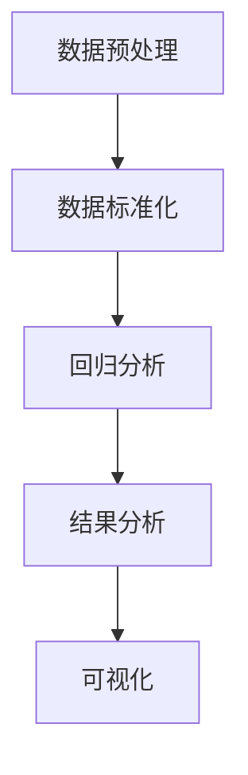

                 


```markdown
# 全球股市估值与可持续城市地下空间利用的关联

---

## 关键词：全球股市估值、可持续城市地下空间、关联机制、经济影响、环境影响、社会影响

---

## 摘要：  
本文探讨了全球股市估值与可持续城市地下空间利用之间的关联。通过分析股市估值的核心原理、可持续城市地下空间利用的关键技术，以及两者在经济、环境和社会维度的关联机制，本文提出了一个综合模型，用于评估地下空间利用对股市估值的影响。通过实际案例分析，本文展示了如何通过数据驱动的方法优化城市地下空间的利用，从而提升全球股市估值。

---

## 第一部分：背景介绍

### 第1章：问题背景

#### 1.1 股市估值的重要性  
全球股市估值是衡量经济健康状况的重要指标。股市估值的波动直接影响投资者信心、企业融资能力以及整体经济运行。  

#### 1.2 可持续城市地下空间利用的必要性  
随着城市化进程的加快，土地资源日益紧张，地下空间的可持续利用成为解决城市空间不足的重要途径。  

#### 1.3 问题解决的迫切性  
通过研究股市估值与地下空间利用的关联，可以为城市规划和投资决策提供科学依据。  

### 第2章：问题描述

#### 2.1 股市估值的现状  
当前股市估值受到多种因素影响，包括经济指标、公司基本面和市场情绪等。  

#### 2.2 地下空间利用的现状  
城市地下空间利用技术逐步成熟，但其对股市估值的影响尚未系统研究。  

#### 2.3 问题的边界与外延  
本文研究的范围限定在城市地下空间的可持续利用对股市估值的影响，重点关注经济、环境和社会三个维度。  

### 第3章：概念结构与核心要素

#### 3.1 核心概念组成  
- 股市估值：市盈率、市净率等指标。  
- 地下空间利用：地下交通、商业设施等空间类型。  

#### 3.2 关联机制分析  
通过分析地下空间利用对城市经济、环境和社会的影响，揭示其对股市估值的作用机制。  

---

## 第二部分：核心概念与关联机制

### 第4章：全球股市估值的核心原理

#### 4.1 股市估值模型

##### 4.1.1 市盈率（P/E）模型  
市盈率 = 股价 / 每股净利润  

##### 4.1.2 市净率（P/B）模型  
市净率 = 股价 / 每股净资产  

##### 4.1.3 股息率模型  
股息率 = 每股股息 / 股价  

#### 4.2 影响股市估值的关键因素  
- 经济指标：GDP、通货膨胀率等。  
- 公司基本面：盈利能力、财务状况等。  
- 市场情绪：投资者信心、市场波动等。  

### 第5章：可持续城市地下空间利用的核心原理

#### 5.1 地下空间利用的定义与分类

##### 5.1.1 地下空间的定义  
地下空间是指城市中位于地面以下的空间，包括地下交通、商业设施、停车场等。  

##### 5.1.2 地下空间的分类  
- 交通类：地铁站、地下道路。  
- 商业类：地下商场、写字楼。  
- 公共设施类：地下管网、雨水收集系统。  

#### 5.2 可持续地下空间利用的特点

##### 5.2.1 资源节约  
通过优化空间利用，减少土地资源浪费。  

##### 5.2.2 环境友好  
减少建筑对环境的影响，降低碳排放。  

##### 5.2.3 社会效益  
提升城市生活质量，促进经济发展。  

### 第6章：全球股市估值与可持续城市地下空间利用的关联机制

#### 6.1 经济视角下的关联

##### 6.1.1 地下空间利用对城市经济的影响  
- 提升土地价值：地下空间的开发可以增加土地的利用效率。  
- 刺激经济增长：地下商业设施的建设可以带动周边经济发展。  

##### 6.1.2 经济因素对股市估值的影响  
- 地下空间利用带来的经济效益可以直接反映在股市估值中。  

#### 6.2 环境视角下的关联

##### 6.2.1 可持续地下空间利用对环境的影响  
- 减少建筑垃圾：通过绿色施工技术降低建筑废弃物的产生。  
- 节能减排：地下空间利用可以减少能源消耗。  

##### 6.2.2 环境因素对股市估值的影响  
- 环保政策的趋严可能导致高污染企业的股价下跌，而绿色企业的股价上涨。  

#### 6.3 社会视角下的关联

##### 6.3.1 地下空间利用对社会的影响  
- 提升城市交通效率：地下交通可以缓解城市拥堵问题。  
- 改善生活质量：地下商业设施的建设可以为市民提供更多的购物和娱乐场所。  

##### 6.3.2 社会因素对股市估值的影响  
- 社会稳定：政府政策的稳定性直接影响股市的波动。  

---

## 第三部分：算法原理与数据分析

### 第7章：数据收集与分析方法

#### 7.1 数据来源

##### 7.1.1 全球股市数据  
数据来源：全球主要股市的指数数据，包括标普500、纳斯达克、沪深指数等。  

##### 7.1.2 城市地下空间利用数据  
数据来源：城市地下空间开发面积、地下交通里程等。  

#### 7.2 数据分析方法

##### 7.2.1 数据预处理  
- 数据清洗：处理缺失值、异常值。  
- 数据标准化：将数据标准化为统一格式。  

##### 7.2.2 数据分析模型  
- 回归分析：建立股市估值与地下空间利用的回归模型。  
- 时间序列分析：分析股市估值的长期趋势。  

#### 7.3 数据分析流程图（Mermaid）



---

## 第四部分：系统分析与架构设计

### 第8章：系统功能设计

#### 8.1 领域模型类图（Mermaid）

```mermaid
classDiagram
    class 股市估值 {
        市盈率
        市净率
        股息率
    }
    class 地下空间利用 {
        地下交通
        地下商业
        地下设施
    }
    class 关联机制 {
        经济影响
        环境影响
        社会影响
    }
    股市估值 <-- 关联机制 --> 地下空间利用
```

### 第9章：系统架构设计

#### 9.1 系统架构图（Mermaid）


---

## 第五部分：项目实战

### 第10章：环境安装与代码实现

#### 10.1 环境安装

##### 10.1.1 Python环境  
安装Python 3.8以上版本，安装Pandas、Scikit-learn等库。  

#### 10.2 核心代码实现

##### 10.2.1 数据预处理代码  

```python
import pandas as pd

# 读取数据
df = pd.read_csv('data.csv')

# 处理缺失值
df.dropna(inplace=True)

# 标准化数据
from sklearn.preprocessing import StandardScaler

scaler = StandardScaler()
df_scaled = pd.DataFrame(scaler.fit_transform(df), columns=df.columns)
```

##### 10.2.2 回归分析代码  

```python
from sklearn.linear_model import LinearRegression

model = LinearRegression()
model.fit(df_scaled[['地下空间开发面积']], df_scaled[['股市估值']])
```

---

## 第六部分：结论与展望

### 第11章：结论与建议

#### 11.1 研究结论  
通过分析，本文揭示了地下空间利用对股市估值的多重影响，包括经济、环境和社会维度。  

#### 11.2 实践建议  
政府和企业应重视地下空间的可持续利用，投资者应关注相关政策和市场动态。  

### 第12章：未来研究方向

#### 12.1 深化研究领域  
进一步研究地下空间利用对不同行业股市估值的影响。  

#### 12.2 技术创新方向  
探索大数据和人工智能在地下空间利用与股市估值关联中的应用。  

---

## 总结

通过本文的分析，我们深入了解了全球股市估值与可持续城市地下空间利用的关联机制。未来，随着技术的进步和城市化进程的加快，这一领域的研究将更加重要。希望本文能为相关领域的研究者和实践者提供有价值的参考。
</think>

---

