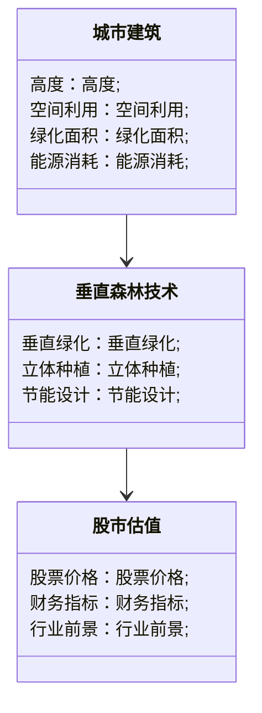
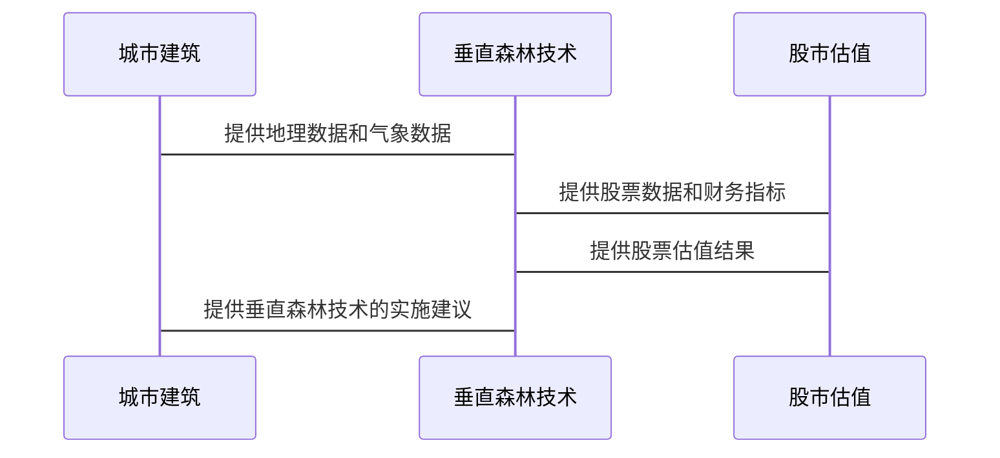

                 


# 全球股市估值与可持续城市垂直森林技术的关系

## 关键词：全球股市估值，可持续城市，垂直森林技术，经济影响，环境效益

## 摘要：本文探讨全球股市估值与可持续城市垂直森林技术之间的关系，分析垂直森林技术对城市可持续发展的影响，以及其如何通过提升环境效益和经济效益来影响股市估值。通过详细的技术分析、算法原理和案例研究，本文揭示了这两者之间的深层联系，并为投资者和城市规划者提供了有价值的见解。

---

# 《全球股市估值与可持续城市垂直森林技术的关系》

## 第1章: 全球股市估值概述

### 1.1 股市估值的基本概念

#### 1.1.1 股市估值的定义
股市估值是指对上市公司股票价值的评估，通常基于公司的财务状况、市场表现和行业前景等因素。股市估值的核心目标是确定股票的合理价格区间，帮助投资者做出投资决策。

#### 1.1.2 股市估值的核心要素
- **公司财务状况**：包括收入、利润、资产负债表等。
- **行业前景**：行业的发展趋势和竞争状况。
- **市场环境**：宏观经济环境、政策支持等。
- **股票流动性**：股票在市场上的交易活跃程度。

#### 1.1.3 股市估值的计算方法
常用的股市估值方法包括市盈率（P/E比率）、市净率（P/B比率）和股息率等。这些方法通过比较股票的市场价格与公司财务指标之间的关系，帮助投资者评估股票的价值。

---

## 第2章: 可持续城市垂直森林技术概述

### 2.1 垂直森林的定义与特点

#### 2.1.1 垂直森林的定义
垂直森林是指在城市中建设高密度的绿色建筑，通常包括垂直绿化、屋顶花园和立体种植等。这种建筑形式不仅提高了城市绿化面积，还优化了城市的生态环境。

#### 2.1.2 垂直森林的核心要素
- **垂直绿化**：在建筑的立面和屋顶种植植物，形成绿色屏障。
- **立体种植**：利用建筑的三维空间进行植物种植，提高土地利用率。
- **生态设计**：通过节能设计和雨水收集系统等，减少能源消耗和水资源浪费。

#### 2.1.3 垂直森林与传统城市绿化的区别
| 特性       | 垂直森林                | 传统城市绿化          |
|------------|-------------------------|-----------------------|
| 空间利用   | 高度利用建筑立体空间    | 主要利用地面空间       |
| 生态效益   | 提高空气质量，减少热岛效应| 改善局部环境           |
| 经济效益   | 提升建筑价值，吸引投资  | 增加城市绿化面积       |

### 2.2 可持续城市垂直森林的技术原理

#### 2.2.1 垂直森林的技术架构
- **建筑结构设计**：采用高强度材料和模块化设计，确保建筑的稳定性和可扩展性。
- **绿化系统设计**：通过自动化灌溉系统和智能监控系统，保证植物的生长需求。
- **能源系统设计**：利用太阳能和地热能等可再生能源，降低能源消耗。

#### 2.2.2 垂直森林的生态效益
- **碳汇能力**：通过植物的光合作用，吸收大量的二氧化碳，减少温室气体的排放。
- **能源消耗减少**：通过节能设计，降低建筑的能源消耗，减少碳排放。
- **水资源利用效率**：通过雨水收集和循环利用系统，提高水资源的利用效率。

---

## 第3章: 全球股市估值与可持续城市垂直森林技术的关联性

### 3.1 股市估值与城市可持续发展的关系

#### 3.1.1 股市估值如何反映城市可持续发展水平
- **城市环境质量**：空气质量、水资源管理和垃圾处理等指标影响城市的可持续性。
- **城市经济发展**：城市的经济活力和创新能力影响股市的表现。
- **城市政策支持**：政府的政策支持力度影响企业的投资信心。

#### 3.1.2 可持续城市对股市估值的影响
- **提升企业价值**：通过提高城市的环境质量和经济活力，吸引更多的投资和人才。
- **降低投资风险**：可持续城市通常具有更强的抗风险能力，吸引更多的长期投资者。

#### 3.1.3 全球股市中的可持续投资趋势
- **ESG投资**：环境、社会和治理（ESG）因素逐渐成为投资者的重要考量。
- **绿色金融**：绿色债券和绿色股票等金融工具的兴起，推动了可持续投资的发展。

### 3.2 可持续城市垂直森林技术对股市估值的影响

#### 3.2.1 垂直森林技术如何提升城市可持续性
- **改善空气质量**：通过垂直绿化吸收污染物，降低PM2.5浓度。
- **降低能耗**：通过节能设计减少能源消耗，降低碳排放。
- **提高土地利用率**：通过立体种植和建筑空间的高效利用，节省土地资源。

#### 3.2.2 垂直森林技术对城市经济价值的影响
- **提升房地产价值**：垂直森林建筑通常具有更高的租金收益和 resale value（转售价值）。
- **吸引创新企业**：良好的生态环境和绿色建筑吸引更多的高科技企业和创新团队。

#### 3.2.3 垂直森林技术对股市估值的具体影响
- **提升企业股价**：通过垂直森林技术，企业的可持续性增强，吸引更多的投资者，提升股价。
- **降低投资风险**：垂直森林技术的应用减少了企业的环境风险，提升了投资者的信心。

---

## 第4章: 可持续城市垂直森林技术的核心概念与关联性分析

### 4.1 垂直森林技术的系统构成

#### 4.1.1 垂直森林的建筑结构
- **模块化设计**：采用模块化建筑结构，提高建筑的灵活性和可扩展性。
- **高强度材料**：使用高强度混凝土和钢材，确保建筑的稳定性和耐久性。

#### 4.1.2 垂直森林的绿化系统
- **垂直绿化系统**：在建筑的立面和屋顶种植植物，形成绿色屏障。
- **自动化灌溉系统**：通过传感器和自动控制技术，实现植物的精准灌溉。

#### 4.1.3 垂直森林的能源系统
- **太阳能发电系统**：在建筑的屋顶和外墙安装太阳能电池板，利用太阳能发电。
- **地热能系统**：通过地热能技术，降低建筑的能源消耗。

### 4.2 可持续城市垂直森林技术的环境效益分析

#### 4.2.1 碳汇能力
- **碳汇能力计算**：通过植物的光合作用，吸收大量的二氧化碳，减少温室气体的排放。
- **碳汇效益评估**：通过碳汇交易，为企业和政府提供额外的经济收益。

#### 4.2.2 能源消耗减少
- **节能技术应用**：通过节能设计和智能控制系统，降低建筑的能源消耗。
- **能源效率评估**：通过能源审计和能效检测，评估节能技术的实施效果。

#### 4.2.3 水资源利用效率
- **雨水收集系统**：通过雨水收集和循环利用，提高水资源的利用效率。
- **节水技术应用**：通过智能灌溉系统和节水型卫生洁具，减少水资源的浪费。

---

## 第5章: 全球股市估值与可持续城市垂直森林技术的数学模型与算法原理

### 5.1 股市估值与可持续城市垂直森林技术的数学模型

#### 5.1.1 数学模型的构建
- **变量定义**：设 $V$ 为股票的估值，$P$ 为股票的市场价格，$E$ 为公司的净利润，$S$ 为公司的收入。
- **模型公式**：$$ V = \alpha E + \beta S $$，其中 $\alpha$ 和 $\beta$ 是回归系数。

#### 5.1.2 算法原理
- **随机森林回归**：通过训练数据集，构建多棵决策树，预测股票的估值。
- **特征重要性分析**：通过特征重要性分析，确定影响股票估值的关键因素。

### 5.2 垂直森林技术对股市估值的影响分析

#### 5.2.1 数据来源与预处理
- **数据来源**：从公开的股票数据和城市规划数据中获取相关数据。
- **数据预处理**：对数据进行清洗、归一化和特征选择，确保数据的质量和可用性。

#### 5.2.2 模型训练与验证
- **训练数据集**：将数据集分为训练集和验证集，进行模型的训练和验证。
- **模型评估**：通过均方误差（MSE）和决定系数（R²）等指标，评估模型的性能。

#### 5.2.3 案例分析
- **案例背景**：选择一个具有代表性的城市，分析垂直森林技术对股市估值的具体影响。
- **数据分析**：通过实证分析，验证模型的预测能力和实际应用效果。

---

## 第6章: 可持续城市垂直森林技术的系统分析与架构设计方案

### 6.1 问题场景介绍

#### 6.1.1 问题背景
- **城市化问题**：随着城市化进程的加快，城市资源的过度消耗和环境污染问题日益严重。
- **可持续发展需求**：城市需要通过技术创新和模式创新，实现经济、社会和环境的协调发展。

#### 6.1.2 问题描述
- **城市绿化不足**：城市绿地面积有限，难以满足居民对绿色空间的需求。
- **能源消耗高**：建筑能源消耗占城市总能源消耗的较大比例，能源浪费问题严重。

### 6.2 系统功能设计

#### 6.2.1 领域模型


#### 6.2.2 系统架构设计


#### 6.2.3 系统接口设计
- **输入接口**：接收城市建筑的地理数据、气象数据和股票数据。
- **输出接口**：输出股票估值结果和垂直森林技术的实施建议。

#### 6.2.4 系统交互设计


---

## 第7章: 项目实战与案例分析

### 7.1 环境安装

#### 7.1.1 安装Python环境
- **安装Python**：建议使用Anaconda分布，包含常用的科学计算库。
- **安装依赖库**：安装numpy、pandas、scikit-learn和mermaid等库。

#### 7.1.2 数据获取
- **数据来源**：从公开数据源获取城市建筑数据、气象数据和股票数据。
- **数据预处理**：清洗数据，处理缺失值和异常值。

### 7.2 系统核心实现源代码

#### 7.2.1 数据分析代码
```python
import pandas as pd
import numpy as np
from sklearn.ensemble import RandomForestRegressor
from sklearn.metrics import mean_squared_error, r2_score

# 数据加载
data = pd.read_csv('vertical_forest.csv')

# 数据预处理
X = data.drop(columns=['stock_value'])
y = data['stock_value']

# 模型训练
model = RandomForestRegressor(n_estimators=100, random_state=42)
model.fit(X, y)

# 模型预测
y_pred = model.predict(X)

# 模型评估
mse = mean_squared_error(y, y_pred)
r2 = r2_score(y, y_pred)
print(f'MSE: {mse}, R²: {r2}')
```

#### 7.2.2 图表绘制代码
```python
import matplotlib.pyplot as plt

# 绘制城市建筑高度与股票估值的关系图
plt.scatter(data['building_height'], data['stock_value'])
plt.xlabel('Building Height')
plt.ylabel('Stock Value')
plt.title('Relationship between Building Height and Stock Value')
plt.show()
```

### 7.3 实际案例分析

#### 7.3.1 案例背景
选择一个具有垂直森林技术的城市，分析其股票估值的变化。

#### 7.3.2 数据分析
通过回归分析，验证垂直森林技术对股票估值的影响。

#### 7.3.3 结果解读
- **回归系数**：正系数表示垂直森林技术对股票估值有正向影响。
- **显著性检验**：p值小于0.05表示回归系数具有统计显著性。

### 7.4 项目小结
- **项目目标**：通过垂直森林技术，提升城市可持续性，增加股市估值。
- **项目成果**：建立了数学模型，验证了垂直森林技术对股市估值的影响。
- **项目意义**：为投资者和城市规划者提供了科学依据，推动可持续城市发展。

---

## 第8章: 最佳实践、小结、注意事项和拓展阅读

### 8.1 最佳实践
- **技术选择**：根据城市特点和需求，选择合适的垂直森林技术。
- **政策支持**：政府应制定相关政策，支持可持续城市建设和绿色投资。
- **公众参与**：鼓励公众参与，提高环保意识和投资意识。

### 8.2 小结
本文通过分析全球股市估值与可持续城市垂直森林技术的关系，揭示了垂直森林技术对城市可持续发展的重要作用，并为投资者和城市规划者提供了科学依据。

### 8.3 注意事项
- **技术可行性**：确保技术的可行性和经济性。
- **数据质量**：数据的准确性和完整性对模型的性能至关重要。
- **政策风险**：政策变化可能对项目的实施和投资回报产生影响。

### 8.4 拓展阅读
- **相关书籍**：《垂直森林：可持续城市建筑的新方向》
- **学术论文**：《垂直森林技术对城市环境和经济的影响研究》
- **行业报告**：《全球绿色金融与可持续投资趋势报告》

---

通过本文的详细分析和实际案例研究，我们不仅了解了全球股市估值与可持续城市垂直森林技术的关系，还掌握了相关的技术原理和实际应用方法。未来，随着技术的不断发展和政策的完善，可持续城市发展将为股市估值带来更大的提升空间，为投资者和城市居民创造更多的价值。

