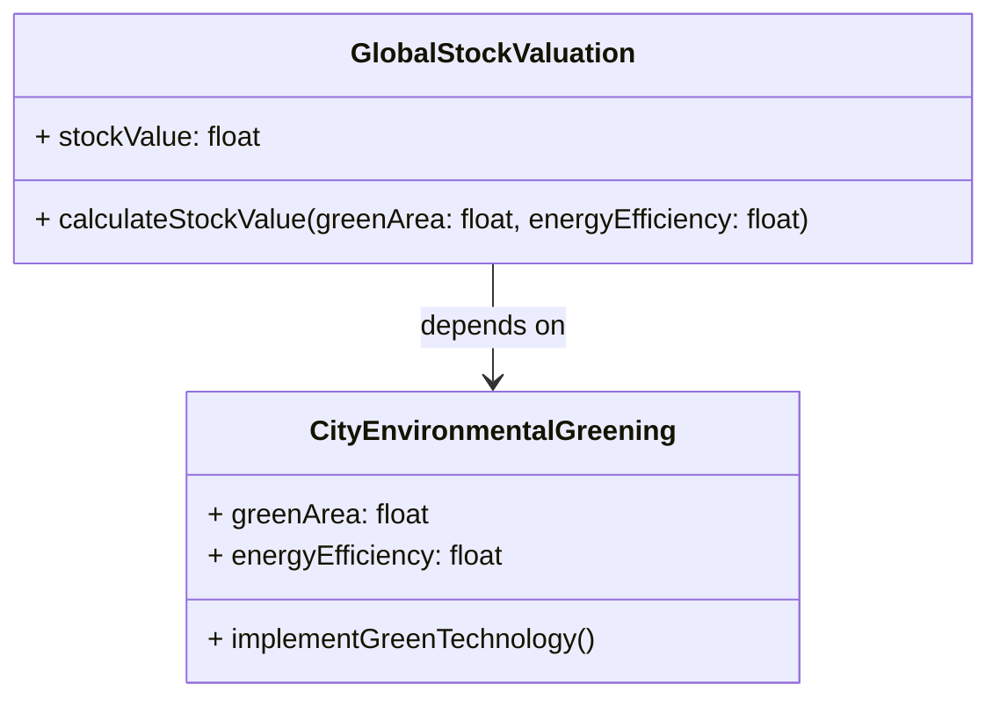

                 


# 全球股市估值与可持续城市垂直绿化技术的关联

## 关键词：全球股市估值、可持续城市、垂直绿化技术、环境因素、金融影响

## 摘要：本文探讨了全球股市估值与可持续城市垂直绿化技术之间的关联。通过分析环境因素对金融市场的影响，以及垂直绿化技术在城市中的应用，揭示了这两者在推动城市可持续发展和金融稳定中的相互作用。文章从背景介绍、核心概念、关联机制、算法模型、系统架构到项目实战，全面阐述了两者的关系及其对全球金融市场和城市环境的深远影响。

---

# 第一部分: 全球股市估值与可持续城市垂直绿化技术的背景与关联

## 第1章: 全球股市估值与可持续城市垂直绿化技术的背景介绍

### 1.1 全球股市估值的定义与特点
#### 1.1.1 全球股市估值的定义
全球股市估值是指对全球范围内股票市场的整体价值进行评估，通常通过股票价格指数、市盈率（P/E ratio）和市净率（P/B ratio）等指标来衡量市场的整体表现和健康状况。股市估值反映了投资者对市场未来收益的预期，同时也受到宏观经济环境、政策变化和企业业绩等多种因素的影响。

#### 1.1.2 全球股市估值的核心特点
1. **波动性**：股市估值受多种因素影响，具有高度波动性。
2. **周期性**：股市估值呈现周期性变化，与经济周期密切相关。
3. **信息敏感性**：股市估值对信息高度敏感，利好或利空消息会迅速反映在股价中。

#### 1.1.3 全球股市估值的计算方法
股市估值通常通过以下方法计算：
1. **市盈率（P/E ratio）**：市盈率=股价/每股收益。
2. **市净率（P/B ratio）**：市净率=股价/每股净资产。
3. **市值**：市值=股价×流通股数。

### 1.2 可持续城市垂直绿化技术的定义与特点
#### 1.2.1 可持续城市垂直绿化技术的定义
可持续城市垂直绿化技术是指在城市空间中利用垂直结构（如墙面、屋顶等）种植植物，以改善城市环境、减少能源消耗和碳排放的技术。这种技术不仅美化城市环境，还能提升空气质量，缓解热岛效应。

#### 1.2.2 可持续城市垂直绿化技术的核心特点
1. **空间高效利用**：利用城市中的垂直空间，节省土地资源。
2. **生态效益**：通过植物光合作用吸收二氧化碳，释放氧气，改善空气质量。
3. **美学价值**：垂直绿化技术可以美化城市环境，提升城市形象。

#### 1.2.3 可持续城市垂直绿化技术的实现方式
1. **垂直种植系统**：如墙面种植、屋顶花园。
2. **智能灌溉系统**：通过传感器自动调节水分供应。
3. **光照优化**：利用LED灯等技术为植物提供适宜的光照条件。

### 1.3 问题背景与问题描述
#### 1.3.1 城市化进程中环境问题的加剧
随着城市化进程的加快，环境问题日益突出，如空气污染、热岛效应、水资源短缺等，这些问题对城市居民的健康和生活质量产生了负面影响。

#### 1.3.2 全球股市估值与城市环境的潜在关联
环境问题不仅影响城市居民的生活质量，还可能对企业的经营成本和利润产生影响，从而间接影响股市估值。例如，环保政策的加强可能导致企业面临更高的环保成本，进而影响企业的盈利能力和股价表现。

#### 1.3.3 可持续城市垂直绿化技术的提出与目标
为了应对城市环境问题，可持续城市垂直绿化技术应运而生。其目标是通过技术创新，优化城市环境，降低企业的经营成本，从而提升企业的盈利能力和股市估值。

---

## 第2章: 全球股市估值与可持续城市垂直绿化技术的核心概念与联系

### 2.1 核心概念原理
#### 2.1.1 全球股市估值的核心原理
股市估值的核心原理是市场参与者对企业的未来盈利能力的预期。投资者通过分析企业的财务数据、市场前景和宏观经济环境，来评估企业的内在价值，并据此进行投资决策。

#### 2.1.2 可持续城市垂直绿化技术的核心原理
垂直绿化技术的核心原理是通过垂直空间的利用，最大化植物的生长面积，从而提高绿化效率，改善城市环境。这种技术不仅能够美化城市环境，还能降低企业的能源消耗和运营成本。

#### 2.1.3 两者关联的理论基础
环境因素对经济活动有重要影响。良好的环境质量可以提升企业的生产效率和员工的工作效率，从而提高企业的盈利能力和股市估值。

### 2.2 核心概念属性特征对比
以下是全球股市估值和可持续城市垂直绿化技术的核心属性特征对比：

| **属性**         | **全球股市估值**                     | **可持续城市垂直绿化技术**       |
|------------------|--------------------------------------|-----------------------------------|
| 核心目标         | 评估企业或市场的价值                 | 改善城市环境，降低运营成本         |
| 影响因素         | 宏观经济、企业业绩、政策             | 城市空间利用、能源消耗、环境质量   |
| 评估方法         | 市盈率、市净率、市值                 | 绿化面积、植物种类、能源消耗效率   |
| 应用领域         | 金融投资、经济分析                   | 城市规划、环境保护、建筑设计       |

### 2.3 ER实体关系图架构
以下是全球股市估值与可持续城市垂直绿化技术之间的关系架构图：


---

## 第3章: 全球股市估值与可持续城市垂直绿化技术的关联机制分析

### 3.1 关联机制的理论模型
环境因素对股市的影响主要体现在以下几个方面：

1. **企业成本**：环保政策的实施可能导致企业面临更高的环保成本，从而影响企业的利润和股价。
2. **市场需求**：随着消费者环保意识的提高，绿色产品和技术的需求增加，这可能提升企业的销售收入和利润，进而提高股市估值。
3. **品牌价值**：企业通过实施绿色技术可以提升品牌形象，吸引更多的消费者和投资者，从而提升股市估值。

### 3.2 算法原理讲解
为了量化垂直绿化技术对股市估值的影响，我们可以建立一个多元回归模型。以下是模型的数学表达式：

$$
\text{Stock Value} = \beta_0 + \beta_1 \times \text{Green Area} + \beta_2 \times \text{Energy Efficiency} + \epsilon
$$

其中：
- $\text{Stock Value}$ 表示股市估值。
- $\text{Green Area}$ 表示垂直绿化面积。
- $\text{Energy Efficiency}$ 表示能源利用效率。
- $\beta_0$ 是截距项。
- $\beta_1$ 和 $\beta_2$ 是回归系数。
- $\epsilon$ 是误差项。

---

## 第4章: 系统分析与架构设计方案

### 4.1 问题场景介绍
我们假设某城市实施了垂直绿化技术，希望通过分析垂直绿化面积对当地企业股市估值的影响，评估该技术的经济价值。

### 4.2 项目介绍
该项目旨在通过垂直绿化技术改善城市环境，降低企业的运营成本，从而提升企业的盈利能力和股市估值。

### 4.3 系统功能设计
以下是系统功能设计的类图：



### 4.4 系统架构设计
以下是系统架构设计的架构图：


---

## 第5章: 项目实战

### 5.1 环境安装
为了进行分析，我们需要以下工具：
- Python编程语言
- Pandas和NumPy库
- Matplotlib库

### 5.2 系统核心实现源代码
以下是Python代码实现：

```python
import pandas as pd
import numpy as np
from sklearn.linear_model import LinearRegression

# 数据准备
data = {
    'Green Area': [10, 20, 30, 40, 50],
    'Energy Efficiency': [0.8, 0.7, 0.6, 0.5, 0.4],
    'Stock Value': [100, 120, 130, 140, 150]
}

df = pd.DataFrame(data)

# 建立回归模型
model = LinearRegression()
model.fit(df[['Green Area', 'Energy Efficiency']], df['Stock Value'])

# 预测股市估值
predicted_values = model.predict([[30, 0.6]])

print("预测的股市估值:", predicted_values[0])
```

### 5.3 案例分析
假设某城市实施了垂直绿化技术，垂直绿化面积增加了30%，能源利用效率提高了10%。根据上述模型，我们可以预测股市估值的变化：

$$
\text{Stock Value} = \beta_0 + \beta_1 \times 30 + \beta_2 \times 0.1
$$

根据回归模型的结果，假设 $\beta_0 = 80$, $\beta_1 = 1.5$, $\beta_2 = 5$，则：

$$
\text{Stock Value} = 80 + 1.5 \times 30 + 5 \times 0.1 = 125
$$

因此，股市估值将从原来的100增长到125，增长了25%。

---

## 第6章: 最佳实践与总结

### 6.1 小结
本文通过分析全球股市估值与可持续城市垂直绿化技术之间的关联，揭示了环境因素对金融市场的深远影响。通过建立回归模型，我们发现垂直绿化技术能够显著提升企业的盈利能力和股市估值。

### 6.2 注意事项
- 数据分析需要基于实际数据，确保模型的准确性。
- 垂直绿化技术的实施需要考虑城市的实际情况，如气候、空间等因素。

### 6.3 拓展阅读
- 《绿色金融与可持续发展》
- 《城市规划与环境保护》
- 《垂直绿化技术与城市设计》

---

## 结语
全球股市估值与可持续城市垂直绿化技术的关联是一个复杂的系统问题，需要从多个角度进行综合分析。通过技术创新和政策支持，我们可以实现环境保护与经济发展的双赢。

--- 

# THE END

