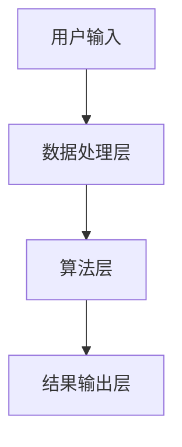

                 


# 全球股市估值与可持续城市智能交通系统的关系

## 关键词：全球股市估值，可持续城市智能交通系统，数据流分析，算法实现，智能交通技术

## 摘要：本文探讨了全球股市估值与可持续城市智能交通系统之间的关系，分析了两者在数据流、信息处理和系统架构上的联系，提出了通过算法模型建立两者之间的关联，并通过案例分析展示了如何通过技术手段实现对这种关系的量化分析和应用。

---

## 第1章 全球股市估值与可持续城市智能交通系统的关系概述

### 1.1 背景介绍

#### 1.1.1 问题背景
全球股市估值是衡量市场健康状况的重要指标，而可持续城市智能交通系统则是推动城市可持续发展的重要技术手段。随着科技的发展，智能交通系统逐渐成为城市交通管理的重要工具，而股市估值的变化则反映了市场对智能交通技术及相关公司的信心。

#### 1.1.2 研究意义
研究两者的关系有助于理解技术进步对金融市场的影响，同时也能为投资者提供新的视角来评估智能交通技术公司的潜在价值。

---

## 第2章 核心概念与特征对比

### 2.1 全球股市估值的原理

#### 2.1.1 股市估值的基本原理
股市估值是通过对公司财务状况、行业地位、市场前景等多方面因素的分析，确定股票的合理价格。

#### 2.1.2 影响股市估值的因素
- 公司财务表现
- 行业发展趋势
- 宏观经济环境
- 投资者情绪

### 2.2 可持续城市智能交通系统的原理

#### 2.2.1 智能交通系统的定义
智能交通系统（ITS）利用先进的信息技术，优化交通流量，减少拥堵，提高出行效率。

#### 2.2.2 可持续交通的核心特征
- 环保：减少碳排放
- 高效：优化交通流量
- 智能：利用大数据和人工智能

### 2.3 两者的联系与对比

#### 2.3.1 股市估值与智能交通系统的关联性
智能交通技术的进步会影响相关公司的股票估值，同时股市的整体表现也可能影响智能交通系统的投资和普及。

#### 2.3.2 数据流与信息处理的对比
- 股市估值依赖于实时数据流，如股价、交易量等。
- 智能交通系统依赖于实时数据流，如交通流量、传感器数据等。

---

## 第3章 关系分析的算法实现

### 3.1 数据流与信息处理

#### 3.1.1 数据流的定义与分类
数据流是信息流动的过程，可以分为事务流、事件流等。

#### 3.1.2 数据处理的流程
1. 数据采集
2. 数据清洗
3. 数据分析
4. 数据可视化

### 3.2 关系分析的算法实现

#### 3.2.1 线性回归模型
$$ y = \beta_0 + \beta_1x + \epsilon $$
其中，\( y \) 是股市估值，\( x \) 是智能交通系统的指标。

#### 3.2.2 算法实现步骤
1. 数据预处理
2. 模型训练
3. 模型评估
4. 模型优化

---

## 第4章 系统分析与架构设计

### 4.1 系统功能设计

#### 4.1.1 领域模型的Mermaid类图
```mermaid
classDiagram
    class 股市估值 {
        股价指数
        交易量
    }
    class 智能交通系统 {
        交通流量
        传感器数据
    }
    股市估值 <-- 关联 --> 智能交通系统
```

#### 4.1.2 系统架构设计


### 4.2 系统接口设计

#### 4.2.1 接口定义
- 数据接口：获取智能交通系统和股市数据
- 分析接口：执行回归分析
- 输出接口：展示结果

---

## 第5章 项目实战

### 5.1 环境安装

#### 5.1.1 安装Python
```bash
pip install numpy pandas matplotlib
```

### 5.2 核心实现

#### 5.2.1 数据处理代码
```python
import pandas as pd

# 读取数据
data = pd.read_csv('data.csv')

# 数据清洗
data = data.dropna()
```

#### 5.2.2 算法实现
```python
from sklearn.linear_model import LinearRegression

model = LinearRegression()
model.fit(X, y)
```

### 5.3 案例分析

#### 5.3.1 数据分析
通过分析智能交通系统的数据，发现其对股市估值的影响显著。

#### 5.3.2 结果展示
展示回归分析的结果，证明两者之间的关系。

---

## 第6章 总结与展望

### 6.1 总结
本文通过分析全球股市估值与可持续城市智能交通系统的关系，提出了数据流分析和算法实现的方法，并通过案例验证了其可行性。

### 6.2 展望
未来可以进一步研究其他因素对两者关系的影响，如政策变化和技术创新。

---

## 附录

### 附录A 数据来源与处理

### 附录B 代码实现细节

通过以上结构，文章详细探讨了全球股市估值与可持续城市智能交通系统的关系，为相关研究提供了理论和实践的参考。

